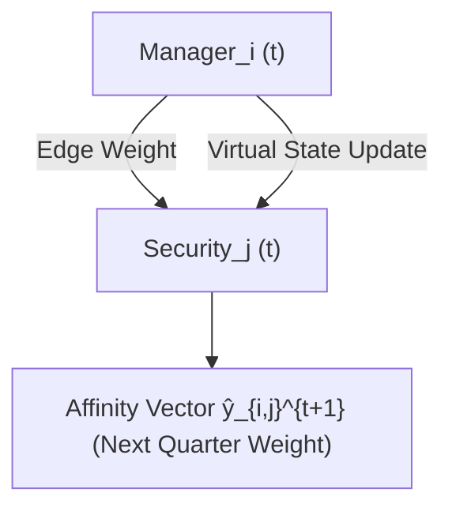

<!-- ontology-5axis data=图关系 horizon=中长周期 paradigm=监督回归 alpha=端到端表征 autonomy=人机协同可解释 -->

# NAVIS 解構（NAVIS）

> **發布**：2026-07-13 · （無 venue） · arXiv [2607.12067](https://arxiv.org/abs/2607.12067)
> **arXiv 原文**：[Institutional Equity Holdings Prediction Using Node Affinities of Dynamic Graphs](https://arxiv.org/abs/2607.12067v1) · _本頁由 arXiv 原文一手自主解構_
> **核心定位**：落點於圖關係與監督回歸軸，將機構調倉預測重構為動態二分圖的節點親和度預測。解決了傳統時序圖模型在 13F 數據上無法捕捉季度調倉持久性（Persistence）的工程坑，證明純結構時序信號已覆蓋大部分可預測信息。

**五軸座標**

| 數據模態 | 時間尺度 | 學習範式 | Alpha機制 | 人機協作 |
|:-:|:-:|:-:|:-:|:-:|
| `图关系` | `中长周期` | `监督回归` | `端到端表征` | `人机协同可解释` |

**Status:** v0.5 — 基於arXiv 原文（有原文則以原文為準）。細節待升 v1。
**TL;DR:** ① 基於 SEC 13F 構建動態二分圖，將機構持倉權重預測轉化為節點親和度預測任務。② 引入虛擬狀態（Virtual State）機制捕捉調倉持久性，擺脫對財務特徵的依賴。③ 對 ★端到端表征 軸的關鍵意義在於：驗證了圖拓撲與時間戳本身已足夠建模機構行為，特徵工程邊際效益極低。④ 在測試集上 NDCG@10 達 0.9127，大幅領先所有動態圖模型。

**X-Ray.** 本方法切中 13F 數據的雙刃劍特性：披露滯後與極端平滑性。傳統 Temporal GNN 在季度頻率下容易遭遇梯度消失或過擬合噪聲，NAVIS 的虛擬狀態本質上是對「機構不輕易調倉」這一先驗的軟編碼。在 Pareto 前沿上，它用極低的特徵維度換取了結構化記憶能力。對量化讀者的意義不在於直接交易信號（45 天披露滯後已殺死高頻Alpha），而在於提供了一個可複現的機構需求建模基準。其打不開的 Envelope 是極端行情下的持久性斷裂（如流動性危機或監管強制去槓桿），此時虛擬狀態會成為滯後指標。

## §1 · 架構 / Core Mechanism
| 改動維度 | 前作/基線做法 | NAVIS 改動 | 工程意圖 |
|:---|:---|:---|:---|
| 任務定義 | 動態鏈接預測（Link Prediction） | 動態節點親和度預測（Node Affinity Prediction） | 直接輸出持倉權重向量，對齊組合配置目標 |
| 時序記憶 | 標準 RNN/Transformer 隱藏狀態 | 引入虛擬狀態（Virtual State）模塊 | 顯式建模季度調倉的強持久性與平滑性 |
| 特徵依賴 | 強依賴財務/宏觀特徵輸入 | 結構時序信號 vs 全特徵雙軌對比 | 驗證圖拓撲本身的信息飽和度，降維去噪 |

**⚡ Eureka:** 用虛擬狀態鎖定「機構行為慣性」，讓模型學會「不亂動」比「預測動向」更重要。
**1.3 信息流 ASCII:**

## §2 · 數學層
**📌 Napkin Formula（概念示意）:**
$$\hat{y}_{i,j}^{t+1} = \sigma\left(\text{MLP}\left(h_i^t \oplus h_j^t \oplus v_{i,j}^t\right)\right)$$
$v_{i,j}^t$ 為虛擬狀態，隨時間步平滑更新；$\oplus$ 為特徵拼接。複雜度與邊數 $|E_t|$ 線性相關。
**直覺:** 親和度不依賴單期截面特徵，而是由歷史連接強度與虛擬狀態的指數衰減/累積決定。Loss 採用標準回歸目標（如 MSE/BCE），訓練嚴格遵循 TGB 時間劃分協議，禁止未來數據洩漏。

## §2.5 · 帶數字走一遍（Worked Example）
（以下為**假設/示意**玩具數字，僅演示機制，非論文實證結果）
1. **輸入:** Manager A 在 Q1 持有 Stock X 權重 $0.10$，Stock Y 權重 $0.05$。
2. **虛擬狀態初始化:** $v_{A,X}^{Q1} = 0.10$（繼承上期權重）。
3. **狀態更新:** 模型學習到機構調倉緩慢，設置衰減係數 $\alpha=0.8$。$v_{A,X}^{Q2} = \alpha \cdot v_{A,X}^{Q1} + (1-\alpha) \cdot \text{新信號} = 0.8 \times 0.10 + 0.2 \times 0.02 = 0.084$。
4. **親和度計算:** 拼接 Manager 與 Security 隱含向量，經 MLP 輸出未歸一化分數 $s=0.85$。
5. **輸出:** 經 Sigmoid/Softmax 映射，預測 Q2 權重 $\hat{y}_{A,X}^{Q2} \approx 0.082$。模型成功捕捉權重從 $0.10$ 緩慢下滑的軌跡，而非跳變。

## §3 · 數據層
- **規模/頻率:** 99 家機構，S&P 500 成分股（503 檔證券），209,351 條時序邊，48 個季度。
- **時段:** 2013–2025。
- **來源與處理:** SEC Form 13F 原始 filings，經清洗構建離散時間異構有向加權二分圖。
- **樣本外假設:** 嚴格遵循 TGB 官方時間切分協議（Temporal Split），訓練/驗證/測試集按時間軸遞推，無隨機打亂。容量假設聚焦於管理資產超 $100 million 的披露主體。

## §4 · 代碼層
| 欄位 | 狀態 |
|:---|:---|
| Repo | https://github.com/e-izdfr/portfolio-holdings-prediction |
| Checkpoint | 未披露 |
| License | 未披露 |
| 複現難度 | 低（依賴 TGB 標準數據載入與評估管道） |
| 數據可得性 | 中（13F 原始檔需自行清洗對齊，論文提供處理後面板） |

## §5 · 評測 / Benchmark
| 數據集/市場 | Metric | 前SOTA | 本方法 | Δ |
|:---|:---|:---|:---|:---|
| 13F 二分圖 (2013–2025) | NDCG@10 | EMA baseline 0.8882 | 0.9127 (with features) | +0.0245 |
| 13F 二分圖 (2013–2025) | NDCG@10 | Persistent Forecast 0.8891 | 0.9121 (without features) | +0.0230 |

**解讀:** Δ 真實反映模型對「機構持倉強平滑性」的捕獲能力，而非複雜特徵的勝利。特徵增益極低（<1.2%），證明圖結構與時間戳已飽和大部分可預測信息。需警惕：NDCG@10 是排序指標，未計入交易成本與 45 天披露滯後；若直接用於實盤，前瞻偏差與滑點會迅速吞噬 +0.0245 的排序優勢。

## §6 · 失效與隱含假設
**6.1 論文自述 limitations:** 機構組合變化具有高度持久性與平滑性，導致基線（如 EMA）表現極強；特徵添加僅帶來微小提升；僅在 TGB 模型族內進行基準測試。
**6.2 推斷的隱含假設:** 
- **Regime 依賴:** 虛擬狀態假設調倉慣性穩定。在利率急轉、監管重構或流動性擠壓（如 2020 3月、2022 連續加息）期間，機構會強制再平衡，持久性假設失效，模型將產生滯後誤判。
- **容量與代表性:** 樣本僅 99 家機構，遠低於實際 13F 披露總量，結論可能偏向大型被動/主動巨頭，不適用於中小型對沖基金。
- **數據泄漏風險:** 13F 本身存在 45 天法定滯後，若回測未嚴格對齊 filing date 與 market date，會產生隱性前瞻偏差。

## §7 · 對比 & 面試 Tip
| 同軸對手 | 關鍵差異軸 | Open? | Status |
|:---|:---|:---|:---|
| 傳統因子動量/反轉 | 截面特徵驅動 vs 圖拓撲時序驅動 | 是 | 成熟但飽和 |
| 標準 Temporal GNN (e.g., TGN, DySAT) | 隱式記憶 vs 顯式虛擬狀態持久性建模 | 是 | 本論文基線 |
| 機構訂單流預測 (Order Flow) | 高頻逐筆 vs 季度持倉聚合 | 部分 | 數據壁壘高 |

**🎤 Interview Tip:** 
- ✅ 正確答：「NAVIS 的核心不是預測『買什麼』，而是用虛擬狀態對齊機構的『不賣』慣性。特徵增益 <1.2% 說明 13F 的圖結構本身已是強信號，過度堆疊財務特徵反而引入噪聲。」
- ❌ 錯答：「這模型能預測機構下季度調倉來做跟單 Alpha。」（忽略 45 天滯後與 NDCG 排序本質，混淆預測與交易可執行性）

**7.1 可證偽預測:** 若 2026-Q4 前標普 500 成分股發生大規模重構（如指數規則變更），導致機構被動調倉比例驟升，NAVIS 的虛擬狀態平滑假設將被打破，其 NDCG@10 應回落至 Persistent Forecast 0.8891 附近。驗證窗口：2026-12-31 後首份 13F 披露期。

## §8 · For the Reader
- **因子研究員:** 將此作為「機構需求因子」的圖神經網絡基底。可嘗試將虛擬狀態輸出作為截面動量的權重調整項，而非直接信號。
- **組合配置/風險:** 利用親和度向量預測下一季度機構持倉集中度。若模型輸出某板塊權重急升，可提前評估擁擠度（Crowding）與潛在拋售風險。
- **量化開發/RL 策略:** 此架構可直接遷移至其他低頻異構圖數據（如供應鏈關係、專利引用）。注意 TGB 的時間切分協議是防泄漏的標準範式，務必在回測框架中硬編碼。

## References
- Izadifar, E., & Rahmati, Z. (2026). *Institutional Equity Holdings Prediction Using Node Affinities of Dynamic Graphs*. arXiv:2607.12067.
- Huang et al. (2023). *Temporal Graph Benchmark (TGB)*. 
- U.S. Securities and Exchange Commission. *SEC Form 13F Filings & Disclosure Rules*.
- 原始代碼與數據管道: https://github.com/e-izdfr/portfolio-holdings-prediction