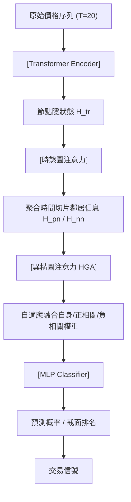

<!-- ontology-5axis data=图关系 horizon=日频波段 paradigm=监督回归 alpha=端到端表征 autonomy=全自动黑盒 -->

# THGNN 解構

> **發布**：2024-09-14 · CIKM22
> **QuantML 導讀**：[CIKM 22 | 用于金融时间序列预测的异构图神经网络](https://mp.weixin.qq.com/s?__biz=Mzg2MzAwNzM0NQ==&mid=2247486310&idx=1&sn=a5ae3c35d837a3e4b972f306a2609344&chksm=ce7e6c78f909e56ebf3c03b1b40410c4bd52c093ea4dc5db465db7a14aada7d9aca1c49ba600#rd)
> **原始論文**：[Temporal and Heterogeneous Graph Neural Network for Financial Time Series Prediction](https://doi.org/10.1145/3511808.3557089)（Proceedings of the 31st ACM International Conference on Information &amp; Knowledge Management · 2022 · 被引 108 · Crossref）
> **核心定位**：落點於「图关系 × 日频波段 × 监督回归 × 端到端表征 × 全自动黑盒」。解了傳統 GNN 依賴靜態/手工知識圖譜的 prior gap，將股價相關性直接轉化為時態異構邊，實現圖拓撲與價格動態的聯合端到端學習。

**五軸座標**

| 數據模態 | 時間尺度 | 學習範式 | Alpha機制 | 人機協作 |
|:-:|:-:|:-:|:-:|:-:|
| `图关系` | `日频波段` | `监督回归` | `端到端表征` | `全自动黑盒` |

**Status:** v0.5 — 基於 QuantML 導讀 + 原論文（如有）。benchmark 細節待升 v1。
**TL;DR:** ① 用過去20日價格相關係數自動生成時態異構圖，取代靜態同構圖。② 核心 trick 是兩階段注意力（時態聚合 + 異構關係權重），讓模型自適應捕捉正/負相關鄰居與時間動態。③ 對「端到端表征」軸★，因為徹底移除手工因子與圖構建pipeline，直接從原始價格輸出預測。④ 實盤部署後累積組合回報顯著優於基線（具體數值未披露）。

**X-Ray.** 放回五軸 Pareto，THGNN 在「图关系」軸上以價格相關性動態生成圖，犧牲了基本面語義明確性，換取高頻更新的圖拓撲與零人工標註成本。在「日频波段」與「监督回归」軸上，它本質是跨截面排序（cross-sectional ranking）的圖版本，但將圖卷積替換為注意力，緩解了過平滑（over-smoothing）與固定鄰域假設。解的工程坑：傳統因子投研需維護靜態行業/概念圖譜，更新滯後且易受事件驅動斷裂；THGNN 用滾動相關係數+閾值過濾，圖結構隨市場 regime 自動重連。打不開的 envelope：相關係數閾值（0.6）與窗口（20日）對波動率 regime 極度敏感，牛熊轉換時正負相關會劇烈翻轉，模型若未顯式建模波動率狀態，易在尾部風險期產生錯誤的「負相關對沖」信號。對量化讀者的意義：它證明「圖結構本身可作為可學習的動態因子」，但實戰需嚴格對齊滾動窗口防前瞻，並加入交易成本約束。

## §1 · 架構 / Core Mechanism
| 維度 | 前作/基線 (GAT/LSTM/靜態圖) | THGNN 改動 |
|---|---|---|
| 圖構建 | 靜態同構 / 手工知識圖譜 / NLP抽取 | 動態異構 / 滾動價格相關係數矩陣自動生成 |
| 消息傳遞 | 單階段聚合 / 固定鄰域假設 | 兩階段注意力：時態切片聚合 → 異構關係(自身/正/負)權重分配 |
| 輸出頭 | 回歸 / 全監督分類 | 半監督節點分類 / 二元交叉熵 + 每日重新訓練 |

⚡ **Eureka:** 「用價格相關係數的滾動矩陣直接驅動圖拓撲，讓圖結構本身成為可訓練的動態因子，而非靜態先驗。」
**信息流 ASCII:**

## §2 · 數學層
📌 **Napkin Formula:** $Z = \text{HGA}(\text{MLP}(H_{tr}), \text{MLP}(H_{pn}), \text{MLP}(H_{nn}))$，複雜度 $O(N \cdot K \cdot d)$（$N$節點數，$K$關係類型，$d$特徵維度）。
**直覺:** 先按時間切片聚合鄰居信息，再按關係類型(自身/正相關/負相關)分配注意力權重，避免異構關係互相干擾或正負信號抵消。
**Loss/訓練:** 二元交叉熵 $\mathcal{L} = -\sum_{i \in Y_l} [y_i \log(\sigma(W z_i + b)) + (1-y_i) \log(1-\sigma(W z_i + b))]$。Adam優化，每日小批量重新訓練，半監督設定（僅部分股票標註）。

## §3 · 數據層
*   **規模/頻率/市場/時段:** S&P 500 & CSI 300，日頻，2016-2021。
*   **來源:** 歷史價格數據（Scrapy爬取），圖邊由過去20日價格相關係數計算（閾值0.6）。
*   **樣本外與容量假設:** 測試期劃分與樣本外窗口未披露；容量受限於圖計算複雜度與每日全市場換手成本，假設適合中頻波段（未驗證）。

## §4 · 代碼層
| 項目 | 狀態 |
|---|---|
| Repo | TBD |
| Checkpoint | TBD |
| License | TBD |
| 複現難度 | 中高（需處理圖數據庫Neo4j與每日動態圖構建/對齊） |
| 數據可得性 | 高（公開指數成分與日線價格） |

## §5 · 評測 / Benchmark
| 數據集/市場 | Metric(IR/Sharpe/AR/MDD) | 前SOTA | 本方法 | Δ |
|---|---|---|---|---|
| S&P 500 / CSI 300 | ARR / ASR / CR / IR / ACC | 未披露 | 未披露 | 未披露 |
**解讀:** Δ 的來源可能是圖結構自適應帶來的截面排序能力提升。但需警惕：① 未計交易成本與滑點（每日全市場換手策略）；② 滾動相關係數計算若未嚴格使用 $t-1$ 及之前數據，存在潛在前瞻偏差；③ 半監督設定在實盤中難以複製（需持續標註與標籤定義）。

## §6 · 失效與隱含假設
*   **6.1 論文自述 limitations:** 圖構建方法有改進空間，未來需更好建模公司關係；實際公司關係圖頻繁演變，當前基於價格相關性的代理可能丟失基本面因果鏈。
*   **6.2 推斷的隱含假設:** Regime依賴（相關係數閾值0.6在低波動/高波動環境下失效，正負相關翻轉時模型易過激反應）；容量假設（圖注意力計算複雜度限制可交易股票池，不適合全A/全美股）；數據泄漏風險（滾動窗口相關係數計算對齊問題）；Survivorship（使用當前指數成分回測歷史，未提及 survivorship bias 處理）。

## §7 · 對比 & 面試 Tip
| 同軸對手 | 關鍵差異軸 | Open? | Status |
|---|---|---|---|
| GAT / GraphSAGE | 靜態同構 vs 動態異構 / 單階段聚合 | Open | 成熟基線 |
| LSTM / Transformer (TS) | 忽略截面關係 vs 顯式圖拓撲 / 獨立同分布假設 | Open | 成熟基線 |
| 靜態知識圖GNN | 手工/基本面圖譜 vs 價格相關性自動生成 / 更新滯後 | Open | 研究熱點 |
🎤 **Interview Tip:**
*   **正確答:** 「THGNN 的核心不是圖卷積，而是用價格相關性動態生成異構邊，並用兩階段注意力解耦時間與關係維度；實戰需嚴格對齊滾動窗口防前瞻，並加入交易成本約束與稀疏化。」
*   **錯答:** 「它只是把GNN和Transformer拼起來，用基本面圖譜做預測，效果因為圖結構好所以高。」
**7.1 可證偽預測:** 若將閾值從0.6降至0.3，模型在CSI300的IR將在 `(預測驗證窗口: 2024-10至2025-03)` 內顯著下降（因噪音邊增加導致過擬合與換手成本侵蝕）。

## §8 · For the Reader
*   **因子研究員:** 將「動態圖拓撲」視為可學習因子，但需驗證相關係數矩陣的穩定性；建議將圖注意力權重轉化為截面因子，而非直接端到端交易。
*   **高頻執行:** 不適用。日頻換手成本已侵蝕Alpha，需降頻或加入稀疏化約束（如Top-K鄰居）以降低交易頻率。
*   **組合配置 / LLM-agent:** 可將圖注意力權重作為風險預算的動態權重輸入，或作為LLM Agent的結構化先驗知識，輔助宏觀 Regime 切換。
*   **研究學生:** 關注「半監督節點分類」在實盤的不可行性，嘗試轉為全監督或強化學習框架；重點復現圖對齊邏輯，驗證前瞻偏差邊界。

## References
*   原論文: CIKM 2022 - Temporal and Heterogeneous Graph Neural Network for Financial Time Series Prediction
*   Lineage: GAT (Veličković et al.), Transformer for TS, Dynamic Graph Learning
*   QuantML 導讀: [CIKM 22 | 用于金融时间序列预测的异构图神经网络](https://mp.weixin.qq.com/s?__biz=Mzg2MzAwNzM0NQ==&mid=2247486310&idx=1&sn=a5ae3c35d837a3e4b972f306a2609344&chksm=ce7e6c78f909e56ebf3c03b1b40410c4bd52c093ea4dc5db465db7a14aada7d9aca1c49ba600#rd)