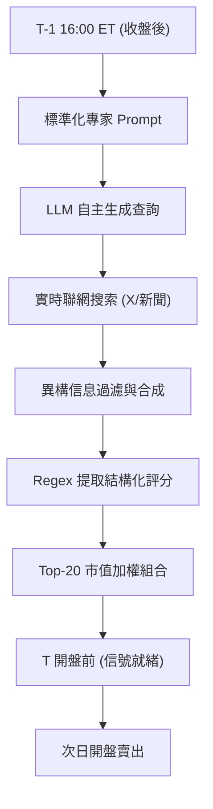

<!-- ontology-5axis data=文本另类 horizon=日频波段 paradigm=生成式大模型 alpha=因子挖掘 autonomy=Agent自主演进 -->

# 北大光华 | 年化夏普比率2.43！基于自主市场 解構

> **發布**：2026-01-21 · （無 venue）
> **QuantML 導讀**：[北大光华 | 年化夏普比率2.43！基于自主市场分析的实时AI投资代理](https://mp.weixin.qq.com/s?__biz=Mzg2MzAwNzM0NQ==&mid=2247493050&idx=1&sn=cc702cfc18745d618873b45ca17d7b41&chksm=ce7d82a4f90a0bb2bad1dada27c74e76ba2fac034bbd893f9c66492ab9989e3550121e7fcf79#rd)
> **核心定位**：將生成式大模型部署為完全自主的日频波段因子挖掘 Agent，解決了傳統文本因子依賴人工預篩信息集與前視偏差的工程坑，在 Russell 1000 全市場驗證了 LLM 實時聯網合成異構信息的 Alpha 生成能力。

**五軸座標**

| 數據模態 | 時間尺度 | 學習範式 | Alpha機制 | 人機協作 |
|:-:|:-:|:-:|:-:|:-:|
| `文本另类` | `日频波段` | `生成式大模型` | `因子挖掘` | `Agent自主演进` |

**Status:** v0.5 — 基於 QuantML 導讀 + 原論文（如有）。benchmark 細節待升 v1。
**TL;DR:** ① 部署自主聯網 LLM 每日對 Russell 1000 進行全量評估，生成 -5 至 +5 吸引力評分。② 核心 trick 是嚴格現時預測（Nowcasting）防穿越，結合自主搜索合成異構信息，信號高度集中於頭部贏家。③ 對「Agent自主演进」軸而言，它證明當前 LLM 已具備駕馭戰略性模糊信息的 Epistemic Agency，能從高噪聲環境中提取對低頻因子隱形、對傳統高頻過載的快訊。④ 導讀給出 Top-20 組合產生 0.184% 的日度 Alpha（年化夏普比率2.43）。

**X-Ray.** 本框架在五軸 Pareto 中將「數據模態」推向動態實時文本，以「日频波段」換取信息處理深度。它解了兩大工程坑：一是用 Nowcasting 徹底切斷前視偏差，二是用自主搜索替代人工 Prompt 信息集，消除歸因偏差。但它的 envelope 極度受限於「贏家識別」的單邊能力，Bottom 組合 Alpha 與零無異，意味著它無法構建多空因子，僅能作為純多頭選股引擎。對量化讀者而言，這不是一個可直投的因子，而是一個驗證 LLM 認知邊界的對抗性實驗室；其高換手（57.4%）與極低摩擦（1.6 bps）的組合，暗示 Alpha 來源於短視窗信息消化效率，而非傳統風險溢價。

## §1 · 架構 / Core Mechanism
| 改動維度 | 傳統文本因子/靜態 LLM | 本方法（自主 Agent） |
|---|---|---|
| 信息獲取 | 預篩新聞/財報/固定數據源 | 自主聯網搜索，實時抓取 X/Twitter 與財經新聞 |
| 偏差控制 | 易受前視偏差與歸因偏差影響 | 嚴格 Nowcasting（T-1 16:00 ET 輸入，T 開盤前完成），100% 歸因於 AI |
| 信號輸出 | 連續情感分或單一預測值 | -5 至 +5 吸引力評分（涵蓋 1 天至 1 年期限結構） |

**⚡ Eureka:** 用「時間不可復現性」換取「信息純度」——一旦當前的網絡搜索狀態隨時間流逝，該數據集即成絕版，但換來了無懈可擊的樣本外驗證。
**信息流:**

## §2 · 數學層
**📌 Napkin Formula:**
`Score_i,t = f(LLM_Agent(Search_t, Prompt), Regex_Extract)`
`Portfolio_t = VW(Top-20(Score_i,t))`
`α_daily = 0.184% (t=2.46) under FF5+Momentum`
直覺：模型不依賴顯式回歸或神經網絡權重更新，而是將 LLM 的推理能力直接映射為橫截面排序信號。複雜度不在於梯度下降，而在於實時信息檢索與合成的計算開銷。訓練細節為零（Zero-shot/In-context），依賴提示詞工程與基準控制（同時評級 Russell 1000 以標準化個股評分）。

## §3 · 數據層
- **規模/頻率**：近156,000 個日度股票觀測值，日度頻率。
- **市場/時段**：Russell 1000 指數成分股（占美股93%市值），2025年4月至2026年1月。
- **來源**：LLM 自主聯網搜索實時互聯網（含社交媒體與財經新聞），無預設數據庫。
- **樣本外與容量假設**：嚴格樣本外 Nowcasting；標的為高流動性大型股，容量假設未披露，但高換手（57.4%）與低價差（1.6 bps）暗示策略容量受限於日度執行效率與 LLM API 調用成本。

## §4 · 代碼層
| 維度 | 狀態 |
|---|---|
| Repo | TBD |
| Checkpoint | TBD |
| License | TBD |
| 複現難度 | 高（依賴特定 LLM 實時聯網能力與不可復現的搜索環境） |
| 數據可得性 | 低（導讀明確指出「這種時間設計是不可復現的」） |

## §5 · 評測 / Benchmark
| 數據集/市場 | Metric | 基線 | 本方法 | Δ |
|---|---|---|---|---|
| Russell 1000 | 累積收益 (9個月) | 26% | 约50% | 约24pp |
| Russell 1000 | 日度 Alpha (FF5+Momentum) | 未披露 | 0.184% | 未披露 |
| Russell 1000 | 年化夏普比率 | 未披露 | 2.43 | 未披露 |
| Russell 1000 | 平均買賣價差 | 未披露 | 1.6 bps | 未披露 |
| Russell 1000 | 日度信號組合換手率 | 未披露 | 57.4% | 未披露 |

**解讀：** Δ 中的累積收益差（约24pp）反映的是真實的選股能力，但需警惕這是純多頭策略在牛市環境（Russell 1000 漲26%）下的貝塔疊加。0.184% 的日度 Alpha 經多因子控制後依然顯著（t=2.46），說明並非風格暴露。然而，Bottom-20 組合 Alpha 與零無異，且 Alpha 分佈呈「曲棍球棒」形態（高度集中於前20-50名），這強烈暗示該信號存在極端的尾部依賴與非線性特徵。高換手（57.4%）配合極低摩擦（1.6 bps，佔毛 Alpha 18.4 bps 不到10%）證實了經濟價值，但若市場流動性收縮或 API 成本上升，該 Δ 將迅速失效。

## §6 · 失效與隱含假設
**6.1 論文自述 limitations**
- 預測能力高度不對稱：擅長識別贏家，無法可靠區分輸家與普通股票。
- 數據集不可復現：實時網絡狀態與搜索結果隨時間流逝無法完美重現。
- 中期觀點脆弱：周度信號換手率達72.3%，模型易受每日信息流影響而重置。

**6.2 推斷的隱含假設**
- **Regime 依賴**：假設市場信息環境保持當前透明度與社交媒體活躍度；若監管收緊或 X 平台 API 限流，自主搜索鏈路將斷裂。
- **容量與成本**：假設 Russell 1000 流動性維持現狀（價差1.6 bps）；若規模擴大至微盤股或市場波動加劇，摩擦成本將吞噬 Alpha。
- **數據泄漏/幸存者偏差**：僅覆蓋 Russell 1000，排除退市股與微盤股，存在隱性幸存者偏差；LLM 訓練數據可能已包含部分歷史財務信息，雖有 Nowcasting 防護，但長期記憶污染風險未排除。

## §7 · 對比 & 面試 Tip
| 同軸對手 | 關鍵差異軸 | Open? | Status |
|---|---|---|---|
| Lopez-Lira & Tang (2023) | 被動輸入新聞 vs 自主聯網搜索 | 是 | 經典文本因子 |
| 傳統高頻做市 | 毫秒級訂單流 vs 日度信息合成 | 否 | 不同頻率維度 |
| 靜態 LLM 情感分析 | 預設詞典/固定 Prompt vs 動態 Agent 工作流 | 是 | 演進中 |

**🎤 Interview Tip:**
- **正確答**：「該策略的本質是將 LLM 的實時信息檢索與合成能力轉化為橫截面排序信號，其核心護城河在於 Nowcasting 設計與尾部贏家識別能力，而非傳統風險因子暴露。實操中需嚴格監控換手率與 API 成本，且僅適用於純多頭選股場景。」
- **錯答**：「這是一個可以自動做空的 AI 因子，因為 LLM 能準確預測所有股票的漲跌，且換手率低適合長期持有。」（錯在忽略 Bottom 組合無 Alpha 的事實與 57.4% 的高換手）

**7.1 可證偽預測帶日期**
- 若未來半年內，Russell 1000 平均買賣價差突破 5 bps 或 LLM 實時搜索 API 成本上漲 3 倍，該策略的淨 Alpha 將轉為負值。

## §8 · For the Reader
- **因子研究員**：別試圖用線性回歸直接擬合該評分。Alpha 集中在 Top-20，需採用分位數回歸或尾部風險模型，並嚴格控制前視偏差。
- **高頻執行**：日度信號換手率達57.4%，需優化 VWAP/TWAP 執行算法以捕捉開盤競價前的信號優勢，避免滑點吞噬 18.4 bps 的毛 Alpha。
- **LLM-Agent 開發者**：重點不在於 Prompt 工程，而在於構建「不可復現但可審計」的實時信息工作流。嘗試將自主搜索模塊與內部知識庫解耦，以驗證信息純度。

## References
- 原論文：北大光华 | 年化夏普比率2.43！基于自主市场分析的实时AI投资代理
- Lineage：Kelly et al., 2019; Gu et al., 2020; Lopez-Lira and Tang, 2023; Chordia et al., 2014
- QuantML 導讀鏈接：[同上](https://mp.weixin.qq.com/s?__biz=Mzg2MzAwNzM0NQ==&mid=2247493050&idx=1&sn=cc702cfc18745d618873b45ca17d7b41&chksm=ce7d82a4f90a0bb2bad1dada27c74e76ba2fac034bbd893f9c66492ab9989e3550121e7fcf79#rd)