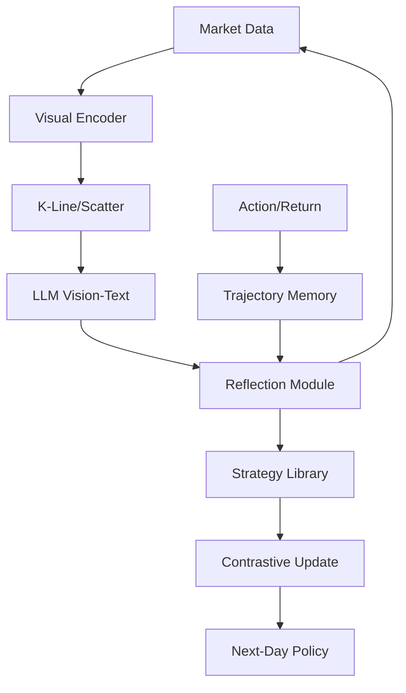

<!-- ontology-5axis data=多模态 horizon=日频波段 paradigm=生成式大模型 alpha=多智能体博弈 autonomy=Agent自主演进 -->

# Agent Trading Arena 解構

> **發布**：2025-03-18 · （無 venue）
> **QuantML 導讀**：[视觉胜于文本：LLM在交易中更好的应用方式？](https://mp.weixin.qq.com/s?__biz=Mzg2MzAwNzM0NQ==&mid=2247489712&idx=1&sn=2c37c80069f65fae35fd198105c8b7f8&chksm=ce7e7faef909f6b8915ec67acd899e75b43dd8b1058efbc737a1fce250b4f299937c2af0e623#rd)
> **核心定位**：將 LLM 決策輸入從「文本代數」強行切換至「視覺幾何」，在五軸中佔據生成式大模型與多智能體博弈交叉點。解了 prior gap：純文本表格輸入導致 LLM 過擬合局部數值、喪失趨勢感知與跨期關聯提取能力。

**五軸座標**

| 數據模態 | 時間尺度 | 學習範式 | Alpha機制 | 人機協作 |
|:-:|:-:|:-:|:-:|:-:|
| `多模态` | `日频波段` | `生成式大模型` | `多智能体博弈` | `Agent自主演进` |

**Status:** v0.5 — 基於 QuantML 導讀 + 原論文（如有）。benchmark 細節待升 v1。
**TL;DR:** ① 構建零和博弈模擬環境，強制 Agent 動態交易與策略迭代。② 核心 trick：將量價轉為 K 線/散點圖輸入 LLM，並掛載反思模組實現策略閉環。③ 對「生成式大模型」軸★：驗證視覺幾何推理顯著優於文本代數推理，打破 LLM 僅能處理 NLP 的範式。④ 導讀未給量化結果。

**X-Ray.** 本方法將 LLM 交易從「文本代數推理」強行切換至「視覺幾何推理」，在五軸 Pareto 中佔據生成式大模型與多智能體博弈的交叉點。它解決了舊工程坑：純文本輸入導致 LLM 過擬合局部數值、喪失趨勢感知。但該 Arena 的零和股息/成本機制是硬編碼規則，非真實訂單簿微觀結構，預測其打不開的 Envelope 在於無法處理流動性枯竭、滑點與市場衝擊。對量化讀者的意義不在於直接部署，而在於驗證了 VLM 提取宏觀/波段 Alpha 的可行性，同時警示：缺乏真實交易成本建模的零和模擬，回測曲線再平滑也無法跨域遷移至實盤。

## §1 · 架構 / Core Mechanism
**1.1 三大改動 vs 前作**
| 維度 | 前作（靜態回測/純文本 LLM） | 本方法（Agent Trading Arena） | 工程意圖 |
|---|---|---|---|
| 輸入模態 | 文本數值表格 | 視覺圖表（K 線/散點/折線） | 繞過 LLM 代數短板，啟用幾何趨勢提取 |
| 環境動力學 | 固定價格序列/單 Agent 觀察 | 零和博弈 + 股息錨點 + 每日資本成本 | 強制主動交易，消除靜態最優解與記憶依賴 |
| 學習閉環 | 一次性推理/無反饋 | 反思模組（Reflection Module） | 軌跡記憶對比 → 策略庫更新 → 動態對抗適應 |

**1.2 ⚡ Eureka**
> 「LLM 的幾何推理能力遠強於代數推理；把數值轉成圖，它就能看懂趨勢。」

**1.3 信息流 ASCII**

## §2 · 數學層
📌 **Napkin Formula**
- `TR = (V_final - V_initial) / V_initial`
- `WR = N_win / N_total`
- `SR = (Mean - R_f) / Std` （`R_f` 設為 `0`）
- 複雜度：`O(N_agents × T_days × LLM_inference)`，反思觸發頻率為每日閉盤後。

**直覺**：零和約束迫使策略空間從「靜態規則」坍縮為「動態博弈均衡」。反思模組本質是離線策略梯度更新：`Δπ = f(evaluate(trajectory_peak) - evaluate(trajectory_trough))`，利用極值對比生成雙向學習信號，將無效策略存入策略庫避免重複踩坑。訓練細節未披露，推測為 Prompt-based RLHF 或規則驅動的策略篩選，無端到端可微 Loss。

## §3 · 數據層
- **規模/頻率/市場**：日頻波段。使用 NASDAQ 股票數據集子集進行投資組合驗證。
- **來源與構造**：Arena 內部價格由買賣系統動態決定（無外部影響），股息按預定比例分配作為隱性錨點。
- **樣本外與容量假設**：實驗部署 `≥9` 個 Agent 與 `3` 隻股票。假設模擬環境的零和流動性可代表真實市場博弈，但未計入真實訂單簿深度與滑點，樣本外泛化依賴視覺特徵的跨市場穩定性。

## §4 · 代碼層
| Repo | Checkpoint | License | 複現難度 | 數據可得性 |
|---|---|---|---|---|
| TBD | TBD | TBD | 高（需自構零和環境+視覺編碼+反思閉環） | 導讀未給具體數據集下載鏈接，僅提及 NASDAQ 子集 |

## §5 · 評測 / Benchmark
| 數據集/市場 | Metric | 前SOTA（逐列） | 本方法 | Δ |
|---|---|---|---|---|
| Arena 模擬 / NASDAQ 子集 | TR | 未披露 | 未披露 | 未披露 |
| Arena 模擬 / NASDAQ 子集 | WR | 未披露 | 未披露 | 未披露 |
| Arena 模擬 / NASDAQ 子集 | SR | 未披露 | 未披露 | 未披露 |
| Arena 模擬 / NASDAQ 子集 | Mean | 未披露 | 未披露 | 未披露 |
| Arena 模擬 / NASDAQ 子集 | Std | 未披露 | 未披露 | 未披露 |

**解讀**：導讀明確指出「視覺組優於文本組」「文本+視覺組合取得最佳性能」，且引入反思模組後 GPT-4o 與 Qwen-2.5 表現突出。此 Δ 屬 **Capability 驗證**（模態切換帶來的幾何推理增益），但非實盤 Alpha。需警惕：Arena 的股息/成本機制是硬編碼規則，非真實交易成本；零和環境下的高 WR 可能來自對手 Agent 的規則性錯誤，而非真實市場定價偏差。缺乏交易成本與滑點建模，SR 與 TR 的 Δ 存在嚴重前瞻偏差與過擬合風險。

## §6 · 失效與隱含假設
**6.1 論文自述 limitations**
- LLM 處理純文本數值時難以進行代數推理，易關注局部細節而非全局趨勢。
- 代理行為結果逐漸展開，易受競爭對手錯誤信息誤導，需依賴經驗學習破譯隱藏規則。
- 未討論真實市場微觀結構（流動性、衝擊成本、漲跌停限制）。

**6.2 推斷的隱含假設**
- **Regime 依賴**：視覺幾何推理在趨勢/波動市有效，但在震盪/均值回歸市可能產生偽信號。
- **容量/成本**：LLM 推理延遲與 API 成本限制日頻以下部署；Arena 的「日常資本成本」不等於真實滑點/手續費。
- **數據泄漏**：股息錨點與零和規則是閉環設計，實盤中價格由外生宏觀與訂單流驅動，規則無法平移。
- **Survivorship**：NASDAQ 子集選擇未披露篩選邏輯，可能存在存活者偏差。

## §7 · 對比 & 面試 Tip
| 同軸對手 | 關鍵差異軸 | Open? | Status |
|---|---|---|---|
| TradingAgents | 多 Agent 文本辯論 vs 本方法視覺+零和 Arena | 開源 | 活躍 |
| FinRLlama | RL 驅動情感分析 vs 本方法視覺幾何推理 | 開源 | 活躍 |
| SocioDojo | 社會博弈基準 vs 本方法交易零和基準 | 開源 | 穩定 |

🎤 **Interview Tip**
- **正確答**：「本方法的核心貢獻是模態遷移（Text→Vision）驗證了 LLM 幾何推理優勢，並用零和 Arena 強制策略迭代。但 Arena 的股息/成本是硬編碼，不等於真實交易成本，實盤需疊加微觀結構模型與成本約束。」
- **錯答**：「這模型可以直接用來跑實盤，因為視覺輸入比文本準確，Sharpe 很高。」（忽略零和模擬與真實市場的結構性斷層）

**7.1 可證偽預測**
若 `2025-06-30` 前無開源實盤對接案例或成本約束消融實驗，則本方法僅停留在「LLM 認知科學驗證」層級，無法進入量化實戰 Pipeline。

## §8 · For the Reader
- **因子研究員**：將視覺特徵（K 線形態/趨勢斜率）轉為結構化因子輸入傳統 ML，避開 LLM 推理不確定性。
- **高頻執行**：Arena 的零和動態不適用於 HFT；需關注真實訂單簿微觀結構與滑點建模，而非視覺趨勢。
- **組合配置**：可將視覺 LLM 的趨勢判斷作為宏觀擇時信號，與傳統風險模型（BARRA/風險預算）組合，降低單模態依賴。
- **LLM-Agent / RL 策略**：反思模組的「極值對比更新」可遷移至離線 RL 的 DPO/RLHF 流程，但需加入真實交易成本 Penalty 項。

## References
- 原論文：Agent Trading Arena（無 venue, 2025）
- Lineage：SocioDojo (Cheng and Chin, 2024) · LLaMa-3 · GPT-4o · Qwen-2.5 · DeepSeek
- QuantML 導讀鏈接：[视觉胜于文本：LLM在交易中更好的应用方式？](https://mp.weixin.qq.com/s?__biz=Mzg2MzAwNzM0NQ==&mid=2247489712&idx=1&sn=2c37c80069f65fae35fd198105c8b7f8&chksm=ce7e7faef909f6b8915ec67acd899e75b43dd8b1058efbc737a1fce250b4f299937c2af0e623#rd)