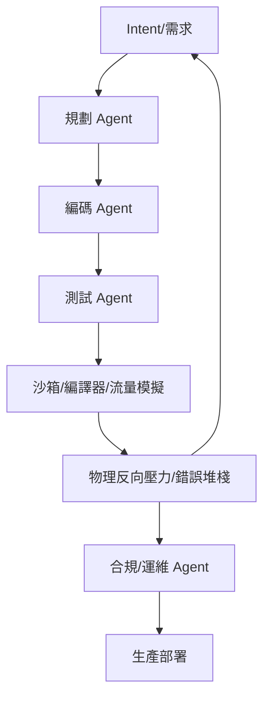

<!-- ontology-5axis data=文本另类 horizon=高频日内 paradigm=生成式大模型 alpha=多智能体博弈 autonomy=Agent自主演进 -->

# Agentic SDLC 解構（Agentic SDLC）

> **發布**：2026-06-28 · （無 venue）
> **QuantML 導讀**：[从 Optiver 到 Jane Street：顶级做市商的Agent技术探索](https://mp.weixin.qq.com/s?__biz=Mzg2MzAwNzM0NQ==&mid=2247494152&idx=1&sn=bfad100e7821527b21ab720a39d70195&chksm=ce7d8d16f90a0400a2a1dd922a9ce4a448856ee4803a3c0a478c8691407bd37086beaa5cf6c3#rd)
> **核心定位**：將生成式大模型從「輔助編程」推向「全鏈路自主演進」的工程框架。解決了量化研發中上下文碎片化、測試反饋滯後與沙箱隔離不足的 Prior Gap，本質是工程維度的 Pareto 優化而非 Alpha 生成器。

**五軸座標**

| 數據模態 | 時間尺度 | 學習範式 | Alpha機制 | 人機協作 |
|:-:|:-:|:-:|:-:|:-:|
| `文本另类` | `高频日内` | `生成式大模型` | `多智能体博弈` | `Agent自主演进` |

**Status:** v0.5 — 基於 QuantML 導讀 + 原論文（如有）。benchmark 細節待升 v1。
**TL;DR:** ① 構建閉環 Agentic Loop，讓 Agent 自主完成需求拆解、編碼、沙箱測試與部署。② 核心 trick 是「物理反向壓力」機制：剝奪 Agent 自評分權力，用真實流量滑點與編譯器報錯堆棧強制迭代。③ 對 `Agent自主演进` 軸★：將概率性 AI 輸出錨定在確定性流水線上，實現工程效率的階躍。④ 導讀未給量化交易結果，明確指出 AI 在實盤高頻博弈中失效。

**X-Ray.** 本文將生成式大模型從「代碼補全」推向「全鏈路自主演進」，本質是工程維度的 Pareto 優化。它解決了傳統量化研發中上下文碎片化、測試反饋滯後與沙箱隔離不足的工程坑，但明確宣告在實盤高頻博弈（EV 更新、多步推理、對手盤博弈）中失效。對量化讀者而言，其價值不在產出 Alpha，而在於提供一套可驗證的「物理反向壓力」測試平面，將策略迭代週期從周級壓縮至小時級，同時暴露了 Agent 在動態市場微結構中的認知邊界。

## §1 · 架構 / Core Mechanism
| 維度 | 傳統 AI-Assisted / 手動 | Agentic SDLC (Optiver) | 解構論斷 |
|---|---|---|---|
| 反饋閉環 | 開環（人類檢查 → 修正） | 閉環（Agent 自主檢測正確性/質量 → 自動重試） | 將控制理論的傳感器邏輯遷移至 SDLC，消除人類瓶頸 |
| 上下文注入 | Readme / 片段代碼 | 高密度上下文（系統架構、真實流量樣本、代碼規範） | 上下文決定輸出方差，48 分 → 98 分的 AI 就緒度躍遷 |
| 測試與部署 | 人工 Review / 隔離環境薄弱 | 嚴苛沙箱 + 物理反向壓力（編譯器/靜態分析/高仿真流量） | 用確定性流水線約束概率性模型，剝奪 Agent 自評分權力 |

**⚡ Eureka:** 不要讓 AI 自己給自己打分；用真實編譯器報錯與流量滑點作為「物理反向壓力」，強制 Agent 在沙箱內自洽收斂。

**1.3 信息流 ASCII 圖**

## §2 · 數學層
📌 **Napkin Formula:** 本框架無顯式 Alpha 數學公式，核心為控制論反饋方程：
$$Output_{agent} \xrightarrow{Harness} Error_{stack} \xrightarrow{Backpressure} Prompt_{refine}$$
**直覺:** 將 SDLC 建模為閉環控制系統，正確性與質量為傳感器，反向壓力為控制器增益。複雜度: `TBD`。
**Loss/訓練細節:** 無傳統梯度下降；依賴確定性流水線與靜態分析工具的規則約束，屬工程優化而非參數學習。

## §3 · 數據層
- **規模/頻率:** 處理 `PB级` 數據，覆蓋 `100+` 家交易所，`100萬+` 金融工具定價上下文。
- **來源:** 內部系統架構文檔、交易所真實流量樣本、團隊代碼規範、歷史錯誤堆棧。
- **樣本外假設:** 沙箱流量模擬器需覆蓋極端微結構場景；容量假設依賴高上下文窗口與 CLI 友好工具鏈。未披露具體樣本外劃分比例。

## §4 · 代碼層
| 欄位 | 內容 |
|---|---|
| Repo | `TBD` |
| Checkpoint | `TBD` |
| License | `TBD` |
| 複現難度 | 高（依賴內部交易所流量模擬器與私有上下文庫） |
| 數據可得性 | 未披露（僅限內部 Platform Engineering 團隊） |

## §5 · 評測 / Benchmark
| 數據集/市場 | Metric | 前SOTA | 本方法 | Δ |
|---|---|---|---|---|
| 交易所連接性組件開發 | 上市時間縮短 | 未披露 | 75% | 未披露 |
| 交易所連接性組件開發 | 開發人力消耗減少 | 未披露 | 85% | 未披露 |
| 交易所連接性組件開發 | 評審就緒率 | 未披露 | 90% | 未披露 |
| 系統代碼 AI 就緒度評分 | 評分提升 | 48 | 98 | +50 |

**解讀:** 所有 Δ 均為工程效率指標，非交易績效。75%/85%/90% 反映的是確定性流水線與高密度上下文對生成式模型方差的壓制能力，屬真實 Capability 提升。但導讀明確指出，此框架**不產出 Alpha**；若將此工程加速直接外推至實盤交易，將觸發 EV 最大化悖論與多步推理崩潰，屬典型的前瞻偏差/成本未計（忽略市場微結構動態博弈）。

## §6 · 失效與隱含假設
**6.1 論文自述 limitations:** 
- AI 在實盤高頻博弈中表現為「戰五渣」，無法進行快速連貫的貝葉斯更新。
- 多步推理在高速競價中崩潰，易淪為對手套利目標。
- 缺乏博弈對抗思維，假設對手靜止，面對流動性陷阱極易爆倉。

**6.2 推斷的隱含假設:** 
- **Regime 依賴:** 假設開發環境與測試沙箱的流量分佈與生產環境高度一致；若交易所協議突變或微結構 regime 切換，反向壓力可能失效。
- **容量/成本:** 高密度上下文注入與高仿真沙箱運行成本極高，僅適合頭部做市商；中小機構難以複製流量模擬器。
- **數據泄漏/安全:** 內部代碼規範與系統架構暴露給外部大模型 API 存在合規風險；需本地化部署或私有化 Substrate。

## §7 · 對比 & 面試 Tip
| 同軸對手 | 關鍵差異軸 | Open? | Status |
|---|---|---|---|
| Optiver 流派 | 經驗主義 + 動態沙箱對線（C++ 底層 + 物理反向壓力） | 未披露 | v0.5 |
| Jane Street 流派 | 理性主義 + 強類型數學套牢（OCaml 編譯器階段規約） | 未披露 | 內部實踐 |

🎤 **Interview Tip:** 
- **正確答:** 「Agentic SDLC 是工程維度的閉環控制系統，核心價值在於用物理反向壓力壓制生成式模型的方差，加速策略迭代週期；但它不解決高頻博弈中的 EV 更新與對手盤推理問題，實盤交易仍需人類量化員的貝葉斯直覺。」
- **錯答:** 「AI Agent 已經能自動寫策略並實盤盈利，未來量化研究員會被取代。」（違反導讀明確指出的三大致命缺陷）

**7.1 可證偽預測:** 若 2026-Q4 前頭部做市商公開披露基於 Agentic SDLC 生成的策略在實盤 Sharpe > 2.0 且最大回撤 < 5%，則推翻導讀中「AI 在實盤高頻博弈中失效」的論斷；否則該框架將持續定位為純工程提效工具。

## §8 · For the Reader
- **因子研究員:** 將此框架用於因子庫的自動化重構與回測流水線標準化，而非直接生成 Alpha。利用高密度上下文注入提升因子文檔的 AI 就緒度。
- **高頻執行:** 關注「物理反向壓力」機制在訂單路由組件測試中的應用。將交易所協議差異轉化為沙箱測試用例，壓縮連接性組件的上市時間。
- **LLM-Agent / RL 策略:** 借鑑閉環控制論思想，將 RL 的 Reward 替換為確定性編譯器/靜態分析工具的反饋，避免模型在概率性世界中發散。
- **研究學生:** 不要試圖用通用編程 Agent 直接跑交易策略。先從 CLI 友好工具鏈改造與測試用例自動化入手，理解 SDLC 閉環的工程邊界。

## References
- Optiver Platform Engineering 深度訪談 (2026-05)
- Moss Ebeling, "Close Your Agentic Loop", AI Engineer Melbourne (2026-06)
- Jane Street Yaron Minsky 強類型系統設計哲學 (內部實踐)
- QuantML 導讀: [从 Optiver 到 Jane Street：顶级做市商的Agent技术探索](https://mp.weixin.qq.com/s?__biz=Mzg2MzAwNzM0NQ==&mid=2247494152&idx=1&sn=bfad100e7821527b21ab720a39d70195&chksm=ce7d8d16f90a0400a2a1dd922a9ce4a448856ee4803a3c0a478c8691407bd37086beaa5cf6c3#rd)