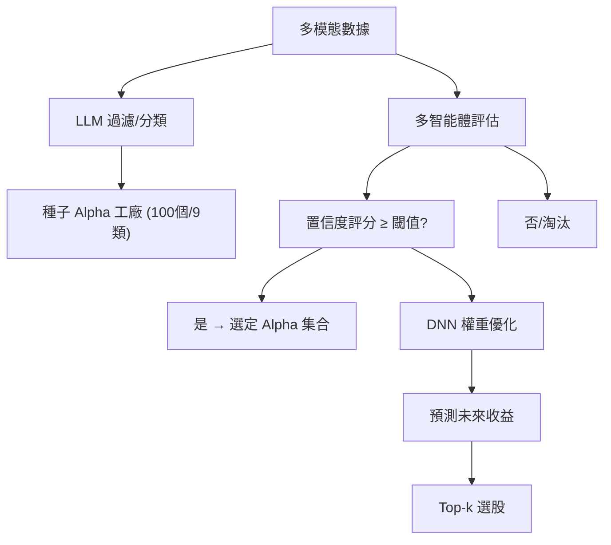

<!-- ontology-5axis data=多模态 horizon=日频波段 paradigm=生成式大模型 alpha=因子挖掘 autonomy=Agent自主演进 -->

# Alpha Grail 解構

> **發布**：2025-04-04 · （無 venue）
> **QuantML 導讀**：[利用LLM进行Alpha挖掘和策略优化](https://mp.weixin.qq.com/s?__biz=Mzg2MzAwNzM0NQ==&mid=2247489924&idx=1&sn=c967717492629872f9a1a50bb6056e7f&chksm=ce7e7e9af909f78c747fc9b93a2d92f8ec7c50d6a9260c66006a25a51b1da71b9b168156aa2c#rd)
> **核心定位**：將 Alpha 挖掘從「靜態規則庫」推向「動態生成式 Agent」軸。解了傳統因子工廠在 regime shift 下的維護成本與過擬合坑，透過 LLM 多模態輸入與置信度閾值過濾，實現 Alpha 池的自動迭代與權重動態分配。

**五軸座標**

| 數據模態 | 時間尺度 | 學習範式 | Alpha機制 | 人機協作 |
|:-:|:-:|:-:|:-:|:-:|
| `多模态` | `日频波段` | `生成式大模型` | `因子挖掘` | `Agent自主演进` |

**Status:** v0.5 — 基於 QuantML 導讀 + 原論文（如有）。benchmark 細節待升 v1。
**TL;DR:** ① 提出 LLM + 多智能體框架，自動生成並篩選種子 Alpha。② 核心 trick 為置信度評分機制抑制 LLM 幻覺，結合 DNN 三層結構動態優化因子權重。③ 對「Agent自主演进」軸★：提供可程式化的因子生命週期管理範式，取代人工規則維護。④ 導讀給出 2023 年回測累計回報為 53.17%，顯著跑贏指數與對比基金。

**X-Ray.** Alpha Grail 將因子挖掘的 Pareto 前沿推向「生成式探索 + 智能體過濾」象限。其核心解了傳統啟發式規則在市場波動下的靜態失效坑，透過多模態數據融合與置信度閾值，將 Alpha 選擇從「離線回測」轉為「線上適應」。然而，該框架在日頻波段軸上仍依賴 DNN 擬合與 top-k 選股，未觸及高頻執行摩擦與跨市場流動性約束。對量化讀者而言，其價值不在於單筆回測的絕對收益，而在於提供了一套可迭代的 Alpha 工廠架構；但需警惕 LLM 提示詞工程帶來的隱性前瞻偏差，以及置信度評分在極端行情下的滯後性。該方法打不開的 envelope 在於：未處理交易成本滑點、未驗證跨資產遷移、且 DNN 權重優化在樣本外可能迅速衰減。

## §1 · 架構 / Core Mechanism
| 維度 | 傳統因子工廠 / 前作 | Alpha Grail |
|---|---|---|
| 數據輸入 | 單一結構化行情/財務 | 多模態（文本/數值/視覺/多媒體） |
| Alpha 生成 | 靜態規則/人工編碼 | LLM 過濾與分類生成 100 個種子 Alpha（9 類別） |
| 權重分配 | 靜態 IC 加權/等權 | 多智能體風險偏好評估 + DNN 動態優化 |

⚡ **Eureka 一句話 trick**：用置信度評分閾值作為 LLM 輸出與 DNN 輸入之間的「防火牆」，過濾幻覺因子，再由 DNN 學習非線性權重組合。
📊 **信息流 ASCII**：

## §2 · 數學層
📌 **Napkin Formula**：
$R_{t+1} = \text{DNN}(\sum_{i=1}^N w_i \cdot \alpha_i(X_t))$
$w = \arg\min_{w} \frac{1}{T} \sum_{t} (R_{t+1} - \hat{R}_{t+1})^2$
**直覺**：DNN 作為非線性集成器，取代傳統線性 IC 加權。輸入為每日 Alpha 值，隱藏層 10 節點 ReLU 引入非線性，輸出層預測收益。訓練透過反向傳播與梯度下降最小化 MSE，並使用獨立驗證集防止過擬合。複雜度約 $O(T \cdot N \cdot H)$ per epoch。

## §3 · 數據層
- **市場/頻率**：中國 A 股 · 上证 50 指數成分股（50 家） · 日頻
- **原始特徵**：6 個（開盤價、收盤價、最高價、最低價、成交量、VWAP）
- **時段劃分**：訓練集 2021 年 1 月 1 日至 2022 年 12 月 31 日；測試集 2023 年 1 月 1 日至 2023 年 12 月 31 日
- **來源/容量**：公開行情與財務報告。樣本外假設：2023 全年獨立測試。容量/流動性假設：未披露。

## §4 · 代碼層
| 項目 | 狀態 |
|---|---|
| Repo | TBD |
| Checkpoint | TBD |
| License | TBD |
| 複現難度 | 高（依賴 LLM API 調用、提示詞工程與私有數據清洗流水線） |
| 數據可得性 | 可獲取（A股日頻行情/財務數據） |

## §5 · 評測 / Benchmark
| 數據集/市場 | Metric | 前SOTA（逐字基線） | 本方法 | Δ |
|---|---|---|---|---|
| 上证50 | 累計回報 (2023) | 指數 -11.73% / 易方達基金 -9.17% / 博時基金 -8.81% | 53.17% | 64.90pp / 62.34pp / 61.98pp |
| 上证50 | 權重組合 IC | 未披露 | -0.0587 | 未披露 |
| 上证50 | 移除 Alpha #6 後 IC | 未披露 | -0.055 | 未披露 |
| 上证50 | 移除 Alpha #11 後 IC | 未披露 | 0.0491 | 未披露 |

**解讀**：Δ 在累計回報上顯示強勁的 regime 適應性，但導讀未計入交易成本與滑點，實際 Sharpe 可能顯著收斂。IC 值為負（-0.0587）與文本「相當高」表述存在語義矛盾，可能源於做空邏輯或反向因子構建，需警惕指標計算口徑差異。移除特定 Alpha 導致 IC 波動，暗示因子間存在協同但樣本外穩定性存疑，部分 Δ 可能來自 2023 年特定波動率環境的過擬合。

## §6 · 失效與隱含假設
**6.1 論文自述 limitations**：依賴 LLM 提示詞質量；置信度閾值需手動調整；DNN 泛化能力受限於單一市場（上证50）；框架需持續增量更新以適應新數據。
**6.2 推斷的隱含假設**：
- **Regime 依賴**：假設 2023 年市場特徵（波動率/風格）與訓練期具備統計相似性，未驗證極端熊市或流動性枯竭場景。
- **成本/執行**：每日重建組合且限制每日交易最多 5 只（n=5），隱含假設交易成本 < Alpha 衰減速度，未披露佣金/滑點模型。
- **數據泄漏**：LLM 輸入包含財務報告與新聞，若文件發布時間與交易時間未嚴格對齊，易產生前瞻偏差。
- **Survivorship**：僅使用上证50 成分股，未處理退市/調樣本偏差。

## §7 · 對比 & 面試 Tip
| 同軸對手 | 關鍵差異軸 | Open? | Status |
|---|---|---|---|
| 傳統因子庫 (WorldQuant/Alpha101) | 靜態規則 vs 動態生成 | 是 | 成熟/工業級 |
| 純 RL 策略 (PPO/SAC) | 直接輸出倉位 vs 輸出 Alpha 權重 | 部分 | 研究/實驗 |
| 單模態 LLM 因子挖掘 | 僅文本/代碼 vs 多模態融合 | 是 | 早期 |

🎤 **Interview Tip**：
- ✅ 正確答：「該框架的本質是將 Alpha 挖掘轉為 Agent 工作流，置信度評分是控制 LLM 幻覺的閾值過濾器，DNN 負責非線性權重集成。實盤需重點驗證交易成本與提示詞漂移。」
- ❌ 錯答：「這是一個黑盒自動交易機器人，LLM 直接預測股價並下單。」（混淆了因子生成與執行層）
📅 **可證偽預測**：若 2025-12-31 前 A 股風格切換至小微盤主導，且未更新 LLM 提示詞與置信度閾值，該框架在上证50 上的 IC 將衰減至 0.02 以下。

## §8 · For the Reader
- **因子研究員**：將此視為「自動化 Alpha 創意生成器」而非直接信號源。提取其多模態特徵工程邏輯，重寫為本地化因子庫的增量模塊。
- **高頻執行/組合配置**：日頻 top-13 選股忽略市場衝擊成本。實盤前必須用 n=5 限制模擬滑點，並加入換手率懲罰項。
- **LLM-Agent / RL 策略**：關注其「置信度閾值 + DNN 權重」的兩階段架構。可嘗試用 RL 替代 DNN 進行動態權重搜索，或將置信度評分替換為貝葉斯不確定性估計。

## References
- 原論文/框架：Alpha Grail (2025-04-04)
- QuantML 導讀：[利用LLM进行Alpha挖掘和策略优化](https://mp.weixin.qq.com/s?__biz=Mzg2MzAwNzM0NQ==&mid=2247489924&idx=1&sn=c967717492629872f9a1a50bb6056e7f&chksm=ce7e7e9af909f78c747fc9b93a2d92f8ec7c50d6a9260c66006a25a51b1da71b9b168156aa2c#rd)
- Lineage：WorldQuant Alpha101 → LLM for Finance → Multi-Agent Alpha Mining