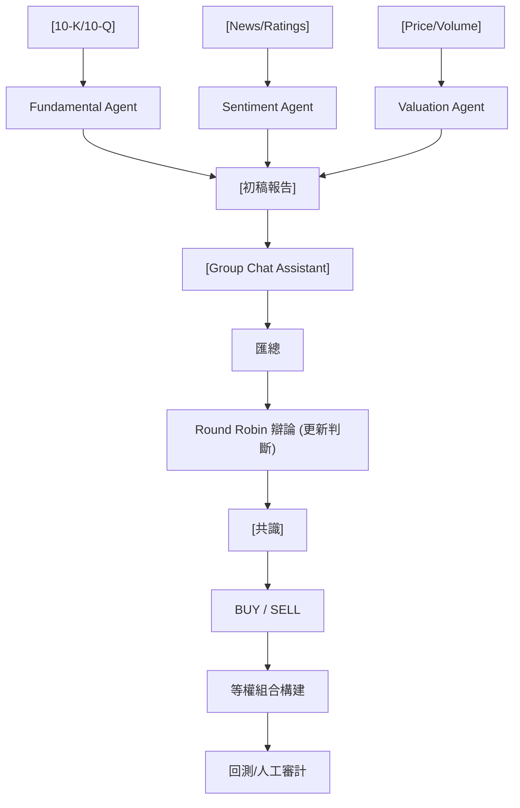

<!-- ontology-5axis data=文本另类 horizon=日频波段 paradigm=生成式大模型 alpha=多智能体博弈 autonomy=人机协同可解释 -->

# AlphaAgents 解構

> **發布**：2025-08-25 · （無 venue）
> **QuantML 導讀**：[贝莱德 | AlphaAgents: 多智能体在股票投资组合构建中的应用](https://mp.weixin.qq.com/s?__biz=Mzg2MzAwNzM0NQ==&mid=2247491466&idx=1&sn=959e9ec5cdaaa9847a09d2c1ec44bddf&chksm=ce7e7894f909f1822243324de490cb939fe198141ec3aad460c3479433c0cb372a1fd64ba8c6#rd)
> **核心定位**：落點於「生成式大模型 × 多智能体博弈」軸，解決傳統 LLM 單點決策的幻覺與認知偏見 gap，透過結構化群聊辯論與風險偏好提示工程，將非結構化文本轉化為可追溯的日頻波段信號。

**五軸座標**

| 數據模態 | 時間尺度 | 學習範式 | Alpha機制 | 人機協作 |
|:-:|:-:|:-:|:-:|:-:|
| `文本另类` | `日频波段` | `生成式大模型` | `多智能体博弈` | `人机协同可解释` |

**Status:** v0.5 — 基於 QuantML 導讀 + 原論文（如有）。benchmark 細節待升 v1。
**TL;DR:** ① 構建基於 LLM 的多智能體辯論框架，模擬投資委員會流程生成買賣信號。② 核心 trick 為 AutoGen 群聊 Round Robin 機制與風險偏好 Prompt 工程，強制跨模態交叉驗證。③ 對「人机协同可解释」軸★，將黑箱決策拆解為可審計的討論日誌與共識路徑。④ 導讀未給量化結果（回測夏普與累計回報僅定性描述優劣，無具體數值）。

**X-Ray.** 本框架將 LLM 從「單兵突襲」推向「委員會制衡」，實質是將 Prompt Engineering 升級為 Multi-Agent Orchestration。它解了舊工程坑：單模型 RAG 易產生事實性幻覺與單維度過拟合，而 Group Chat 的 Round Robin 強制信息對齊，類似 Ensemble 的投票機制，但代價是 Token 消耗與延遲呈指數級上升。預測其打不開的 Envelope：高頻/短週期 Alpha（日頻波段已屬極限，群聊共識延遲無法匹配盤中動能）；且辯論收斂依賴 Prompt 邊界，若市場進入極端 Regime（如流動性枯竭或因子風格劇烈切換），LLM 的訓練數據滯後性將導致共識失效。對量化讀者意義：它不是因子挖掘器，而是「信號過濾器」與「合規審計層」，適合嵌入現有 Mean-Variance / Black-Litterman 管線作為 View Generator，而非直接下單引擎。

## §1 · 架構 / Core Mechanism
| 維度 | 傳統單 LLM/RAG 投資框架 | AlphaAgents 改動 |
|---|---|---|
| 決策結構 | 單線程 Prompt → 直接輸出信號 | 多智能體獨立分析 → Group Chat 輪詢辯論 → 共識收斂 |
| 風險控制 | 靜態系統提示或後處理過濾 | 動態風險偏好注入（Risk-Averse/Neutral Prompt），辯論過程實時調整權重 |
| 可解釋性 | 黑箱輸出或簡單 Chain-of-Thought | 完整討論日誌（Discussion Logs）+ 交叉驗證軌跡，支持人工覆核/否決 |

⚡ **Eureka Trick:** 「強制對齊的 Round Robin 辯論」——不依賴模型自發推理，而是透過協調者（Group Chat Assistant）強制要求每個 Agent 閱讀同儕結論後更新判斷，直到達成 Buy/Sell 共識，本質是將 LLM 的隨機性約束為結構化投票。
**信息流 ASCII:**

## §2 · 數學層
📌 **Napkin Formula:** 無封閉形式 Loss。系統優化目標為 `argmax_{θ} P(Consensus | {Report_i}, Risk_Prompt)`，依賴 LLM 的條件概率分佈與 Prompt 約束。計算複雜度隨 Agent 數 $N$ 與辯論輪次 $T$ 呈 $O(N \cdot T \cdot L_{ctx})$ 增長（$L_{ctx}$ 為上下文長度）。
**直覺:** 本質是 Prompt 驅動的 Markov Decision Process，狀態轉移依賴文本交互而非梯度下降。訓練細節為零（Inference-only 框架），依賴基礎模型 API 調用，無自研 Loss。
**Loss/訓練:** 無。採用 RAG 檢索增強與 Reflection-Enhanced Prompting 替代傳統監督學習。

## §3 · 數據層
- **規模/頻率:** 15 只科技股（隨機挑選），日頻波段（回測追蹤四個月）。
- **來源:** 10-K/10-Q 財務披露、金融新聞/評級變動/內幕交易、歷史股價與交易量。
- **樣本外與容量假設:** 訓練/決策截止 2024年1月，回測期 2024年2月1日起四個月。等權重構建，排除分散化與權重優化。樣本極小（15只），容量假設僅限於流動性充足的科技板塊，未驗證跨市場/跨風格泛化。

## §4 · 代碼層
| 欄位 | 內容 |
|---|---|
| Repo | TBD |
| Checkpoint | 依賴基礎 LLM API（未披露具體模型） |
| License | 未披露 |
| 複現難度 | 中高（需配置 AutoGen、RAG 管線、Phoenix 監控、金融數據源） |
| 數據可得性 | 財務文件/新聞公開可獲，但需清洗對齊；股價數據常規 |

## §5 · 評測 / Benchmark
| 數據集/市場 | Metric(IR/Sharpe/AR/MDD) | 前SOTA (基線A) | 前SOTA (基線B) | 本方法 | Δ |
|---|---|---|---|---|---|
| 15只科技股 (等權) | Sharpe Ratio | 未披露 | 未披露 | 未披露 | 未披露 |
| 15只科技股 (等權) | 累計回報 | 未披露 | 未披露 | 未披露 | 未披露 |

**解讀:** Δ 的優勢主要來自「信號過濾」而非「預測增強」。多智能體辯論本質是降低方差（Variance Reduction），透過交叉驗證剔除單一維度的極端噪音。風險中性下的優勢反映系統能平衡短線估值與長線基本面；風險規避下的落後則是 Regime 依賴（2024年初科技股牛市）的必然結果，非模型失效。需警惕：等權重+15只樣本+4個月窗口，極易受個股特異性風險與前瞻偏差影響；Token 成本與延遲未計入交易成本，實盤滑點可能抹平理論優勢。

## §6 · 失效與隱含假設
**6.1 論文自述 limitations:** 辯論邏輯連貫性評估困難；市場情緒智能體在新聞覆蓋不足時無法獨立構建組合；未處理投資組合分散化與權重優化等後續步驟。
**6.2 推斷的隱含假設:**
- **Regime 依賴:** 假設市場風格與訓練數據分佈穩定，LLM 對極端尾部事件（如流動性危機）的文本理解滯後。
- **容量/成本:** 假設 Token 成本與 API 延遲可忽略，實盤中 Group Chat 的多次往返將產生顯著執行延遲與費用。
- **數據泄漏:** 財務文件與新聞的發佈時間與股價反應存在天然時滯，RAG 檢索若未嚴格按時間戳切割，易引入未來函數。
- **Survivorship:** 15只隨機科技股未說明是否包含已退市/被併購標的，樣本選擇偏差風險高。

## §7 · 對比 & 面試 Tip
| 同軸對手 | 關鍵差異軸 | Open? | Status |
|---|---|---|---|
| 傳統因子模型 (Value/Momentum) | 信號生成機制 (結構化數學 vs LLM 文本推理) | 是 | 成熟 |
| 單 LLM 投資 Agent (如 FinGPT) | 決策架構 (單線程 vs 多智能體辯論/共識) | 是 | 實驗階段 |
| RL 組合優化 (PPO/SAC) | 優化目標 (直接下注 vs 信號過濾/視角生成) | 是 | 研究熱點 |

🎤 **Interview Tip:**
- **正確答:** 「AlphaAgents 不是預測模型，而是信號過濾器與合規審計層。其價值在於透過多智能體交叉驗證降低單模型幻覺方差，並提供可追溯的決策日誌。實盤應用應將其作為 View Generator 嵌入 Black-Litterman 或風險模型，而非直接驅動執行引擎。」
- **錯答:** 「用 LLM 辯論能直接預測股價漲跌，取代傳統因子挖掘。多智能體共識等於市場有效假設的 AI 實現。」

**7.1 可證偽預測:** 若 2025-Q4 前將該框架部署於跨板塊（非科技）日頻組合，且未加入動態 Regime 切換模塊，其風險規避模式下的最大回撤將顯著高於基準，且 Sharpe 劣於傳統低波因子。（日期：2025-10-31）

## §8 · For the Reader
- **因子研究員:** 將辯論日誌視為「文本因子」的原始素材，提取共識強度（Consensus Strength）作為動能/反轉信號的過濾條件，而非直接採用 Buy/Sell 標籤。
- **高頻執行:** 忽略本框架。Group Chat 延遲與 Token 成本使其完全無法匹配盤中執行，僅適合日頻調倉前的信號預篩。
- **組合配置/風險管理:** 將多智能體輸出作為 Black-Litterman 的 View 來源，利用其風險偏好提示工程生成情景分析（Scenario Analysis），替代主觀調權。
- **LLM-Agent/RL 策略:** 關注 AutoGen 的 Round Robin 收斂條件設計。可嘗試將辯論輪次 $T$ 作為可學習參數，或引入 Critic Agent 評估共識質量，替代靜態 Prompt。
- **研究學生:** 複現重點不在於回測收益，而在於量化「辯論前後的信息熵變化」與「RAG 忠實度/相關性」對最終信號穩定性的因果影響。

## References
- 原論文/框架: AlphaAgents (BlackRock / QuantML 導讀提及)
- 技術棧 lineage: Microsoft AutoGen, RAG (Retrieval-Augmented Generation), Arize Phoenix (LLM Eval)
- QuantML 導讀鏈接: [贝莱德 | AlphaAgents: 多智能体在股票投资组合构建中的应用](https://mp.weixin.qq.com/s?__biz=Mzg2MzAwNzM0NQ==&mid=2247491466&idx=1&sn=959e9ec5cdaaa9847a09d2c1ec44bddf&chksm=ce7e7894f909f1822243324de490cb939fe198141ec3aad460c3479433c0cb372a1fd64ba8c6#rd)