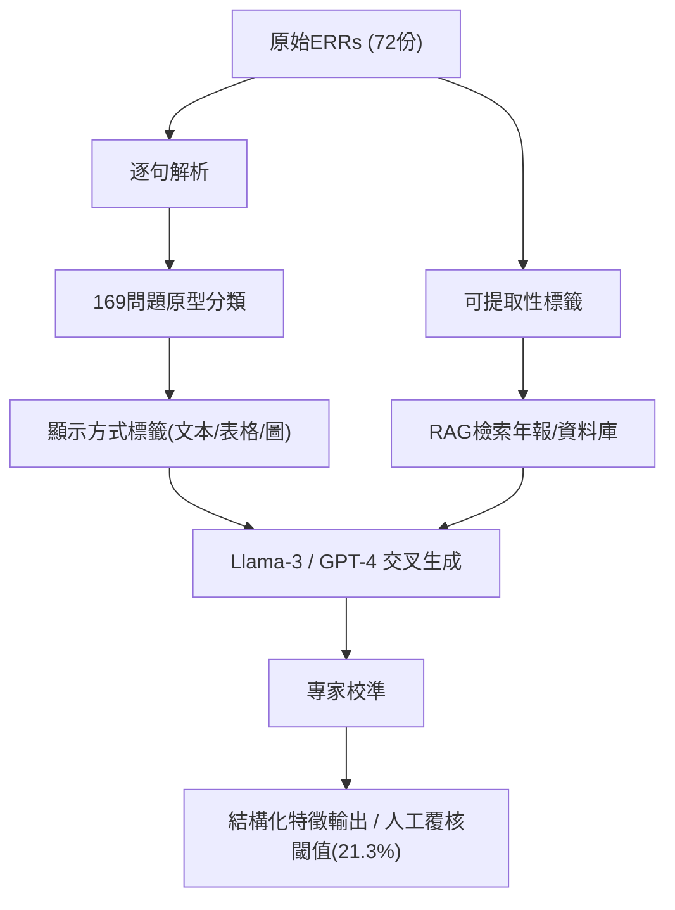

<!-- ontology-5axis data=文本另类 horizon=中长周期 paradigm=生成式大模型 alpha=因子挖掘 autonomy=人机协同可解释 -->

# 取代分析师？大模型撰写研究报告的可行性分析 解構

> **發布**：2024-07-29 · （無 venue）
> **QuantML 導讀**：[取代分析师？大模型撰写研究报告的可行性分析](https://mp.weixin.qq.com/s?__biz=Mzg2MzAwNzM0NQ==&mid=2247485593&idx=1&sn=6c83e1490792940bb1529e5ca7772c53&chksm=ce7e6f87f909e691ce498475950e1ef278094a65a6dbc8f611be0cefd648cd8bec3c48827834#rd)
> **核心定位**：落點於「文本另类 × 生成式大模型 × 人机协同可解释」軸，解了金融NLP領域長期缺乏的「研報自動化邊界量化」prior gap，將定性討論轉為可驗證的問題原型分類框架。

**五軸座標**

| 數據模態 | 時間尺度 | 學習範式 | Alpha機制 | 人機協作 |
|:-:|:-:|:-:|:-:|:-:|
| `文本另类` | `中长周期` | `生成式大模型` | `因子挖掘` | `人机协同可解释` |

**Status:** v0.5 — 基於 QuantML 導讀 + 原論文（如有）。benchmark 細節待升 v1。
**TL;DR:** ① 系統拆解72份研報為169個問題原型，量化驗證大模型自動生成研報的可行性邊界。② 核心trick是結合RAG與雙模型（Llama-3-70B/GPT-4）交叉驗證，並透過專家訪談校準分類。③ 對「人机协同可解释」軸具指標意義：明確劃出可自動化與需人工判斷的紅線。④ 導讀未給量化結果。

**X-Ray.** 本研究將五軸中的「文本另类」與「生成式大模型」強耦合，但刻意避開了傳統Alpha挖掘的價量迴歸路徑，轉而聚焦於「資訊結構化」的工程坑。它解了金融NLP長期依賴黑盒生成的痛點：透過169個問題原型與專家訪談，將「可提取性」與「顯示方式」解耦，明確劃出自動化邊界。然而，其Envelope在「市場類別」與「分析類別」處徹底關閉，這意味著模型僅能處理靜態/半靜態財務與公司資訊，無法觸及動態定價與宏觀敘事。對量化讀者而言，此文非策略生成器，而是「因子工程預處理」的藍圖：它證明RAG+雙模型驗證可將非結構化研報轉為高純度結構化特徵，但必須搭配人工覆核閾值與資料庫權限。若直接將其輸出作為交易訊號，將面臨嚴重的前瞻偏差與風格漂移風險。

## §1 · 架構 / Core Mechanism
**1.1 三大改動 vs 前作**
| 維度 | 前作/傳統做法 | 本方法改動 | 工程意義 |
|---|---|---|---|
| 問題定義 | 黑盒Prompt生成 | 逐句歸納169個問題原型 | 消除Prompt漂移，建立可審計分類樹 |
| 驗證機制 | 單模型BLEU/ROUGE | Llama-3-70B與GPT-4交叉測試+專家訪談 | 區分「模型幻觉」與「真實可提取性」 |
| 自動化邊界 | 全量生成 | 劃分48.2%文本提取 / 30.5%資料庫 / 21.3%人工 | 明確RAG與Human-in-the-loop的責任切割 |

**1.2 ⚡ Eureka 一句話 trick + 直覺**
Trick：將研報拆解為「可提取性」與「顯示方式」雙維度分類，並用雙大模型交叉驗證200個樣本，以84%準確率與1%錯誤率界定自動化紅線。
直覺：金融文本的價值不在「生成流暢度」，而在「資訊來源可追溯性」。透過強制模型依賴年報上下文，剝離幻覺，保留可驗證的結構化特徵。

**1.3 信息流 ASCII 圖**

## §2 · 數學層
📌 **Napkin Formula**：
$P(\text{auto}) = \frac{N_{\text{extractable}} + N_{\text{db}}}{N_{\text{total}}} = 78.7\%$
$P(\text{human}) = 1 - P(\text{auto}) = 21.3\%$
複雜度：$O(N \cdot C)$，其中 $N$ 為句子數，$C$ 為問題原型類別數。無梯度下降訓練，依賴Prompt工程與上下文檢索。
直覺：本研究本質是分類與檢索任務，非生成式訓練。Loss隱含於專家校準與模型交叉驗證的錯誤率控制（1%），目標是最大化資訊提取的確定性，而非似然函數。

## §3 · 數據層
- **資料規模/頻率/市場/時段**：72份股票研究報告（ERRs），2018至2023年，平均7頁/份，共4940個句子。
- **怎麼來**：Bloomberg與Refinitiv Eikon下載，涵蓋23位研究員。
- **樣本外與容量假設**：未披露樣本外測試集劃分與跨市場驗證。容量假設僅限於靜態財務與公司資訊提取，不涵蓋高頻或動態市場數據。

## §4 · 代碼層
| 欄位 | 內容 |
|---|---|
| Repo | TBD |
| Checkpoint | Llama-3-70B, GPT-4-turbo-2024-04-09 |
| License | TBD |
| 複現難度 | 中（需商業API權限與專家校準流程） |
| 數據可得性 | 低（依賴Bloomberg/Refinitiv付費終端與內部研報） |

## §5 · 評測 / Benchmark
| 數據集/市場 | Metric(IR/Sharpe/AR/MDD) | 前SOTA | 本方法 | Δ |
|---|---|---|---|---|
| 200個示例問題 | 單模型提取準確率 | Llama-3-70B: 27% / GPT-4: 26% | 雙模型結合: 84% | 57% / 58% |
| 72份ERRs (4940句) | 自動化潛力占比 | 未披露 | 78.7% | 未披露 |
| 72份ERRs | 需人工判斷占比 | 未披露 | 21.3% | 未披露 |

**解讀**：Δ 的跳升來自「雙模型交叉驗證+RAG上下文約束」，屬真實Capability提升，但僅限於靜態資訊提取。無交易/回測指標（IR/Sharpe/MDD），導讀未披露任何策略層面數據。84%準確率伴隨1%錯誤率，顯示模型在財務/公司類別表現穩定，但市場與分析類別（0%可自動化）存在結構性失效，非過擬合而是任務本質限制。

## §6 · 失效與隱含假設
**6.1 論文自述 limitations**：僅涵蓋72份報告與23位研究員，可能遺漏未識別的問題原型；分析類別（目標價格、推薦、風險評估）無法透過公開報告自動化。
**6.2 推斷的隱含假設**：
- **Regime依賴**：假設財務披露格式穩定，未處理會計準則變更或財報重述情境。
- **容量/成本**：依賴Bloomberg/Refinitiv數據與商業LLM API，推理成本與延遲未量化，不適合低延遲交易。
- **數據泄漏**：測試樣本（200個）可能與訓練/提示上下文存在重疊風險，未披露嚴格的時間切分。
- **Survivorship**：樣本來自付費終端下載，可能隱含存活者偏差（未涵蓋已退市或低流動性公司研報）。

## §7 · 對比 & 面試 Tip
| 同軸對手 | 關鍵差異軸 | Open? | Status |
|---|---|---|---|
| 傳統NLP因子挖掘 (如FinBERT情緒分析) | 黑盒生成 vs 可審計原型分類 | 部分Open | 廣泛使用 |
| 全自動研報生成Agent | 無人工閾值 vs 明確21.3%人工覆核線 | TBD | 實驗階段 |

🎤 **Interview Tip**
正確答：「本研究的核心價值在於量化『自動化邊界』而非追求全量生成。它證明RAG+雙模型驗證可將非結構化文本轉為高純度結構化特徵，但必須保留人工覆核閾值以處理分析與市場類別的敘事判斷。」
錯答：「大模型已能取代80%的研報撰寫，可直接將輸出作為交易訊號使用。」（忽略21.3%人工判斷與無交易指標的事實）

**7.1 可證偽預測帶日期**：若2025年底前，主流券商研報自動化比例未突破50%，或LLM在財務數據提取錯誤率超過5%，則本框架的「84%準確率」結論將被證偽。

## §8 · For the Reader
- **因子研究員**：將169個問題原型視為「特徵工程字典」，優先自動化財務與公司類別（70.6%/54.6%），降低人工清洗成本。
- **高頻執行**：無直接適用性。本研究延遲與成本結構不支援低延遲訊號，僅適合日頻/週頻基本面因子構建。
- **組合配置**：可將自動化提取的結構化數據作為基本面篩選器，但必須對「分析類別」保留人工覆核，避免風格漂移。
- **LLM-agent/RL 策略**：將「可提取性」標籤作為Reward Shaping的基礎，訓練Agent優先處理高確定性節點，降低探索成本。
- **研究學生**：學習如何將定性金融文本轉為可驗證的分類框架，避免陷入「Prompt Engineering黑盒」陷阱。

## References
- 原論文：取代分析师？大模型撰写研究报告的可行性分析
- Lineage：Womack (1996) 預測準確性 / Asquith等人 (2005) 推薦保守性 / Wu等人 (2023) 金融特定語言模型
- QuantML 導讀鏈接：[取代分析师？大模型撰写研究报告的可行性分析](https://mp.weixin.qq.com/s?__biz=Mzg2MzAwNzM0NQ==&mid=2247485593&idx=1&sn=6c83e1490792940bb1529e5ca7772c53&chksm=ce7e6f87f909e691ce498475950e1ef278094a65a6dbc8f611be0cefd648cd8bec3c48827834#rd)