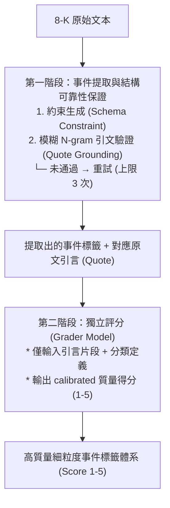

<!-- ontology-5axis data=文本另类 horizon=日频波段 paradigm=生成式大模型 alpha=因子挖掘 autonomy=人机协同可解释 -->

# 两阶段事件提取系统 解構（两阶段事件提取系统）

> **發布**：2026-07-13 · （無 venue）
> **QuantML 導讀**：[另类事件驱动文本因子](https://mp.weixin.qq.com/s?__biz=Mzg2MzAwNzM0NQ==&mid=2247494267&idx=1&sn=317a174edc20c8e2ba87075690a9b818&chksm=ce7d8d65f90a04736f6ee92230a80ef0849d9659c700ad9df5604463a0db814b8095f18c1ae7#rd)
> **核心定位**：將 LLM 事件抽取與置信度評分解耦，以「約束生成 + 引文驗證」解決量化管線中的越界與幻覺問題，並提供單調校準的精度-召回率調節閥。

**五軸座標**

| 數據模態 | 時間尺度 | 學習範式 | Alpha機制 | 人機協作 |
|:-:|:-:|:-:|:-:|:-:|
| `文本另类` | `日频波段` | `生成式大模型` | `因子挖掘` | `人机协同可解释` |

**Status:** v0.5 — 基於QuantML 導讀（有原文則以原文為準）。細節待升 v1。
**TL;DR:** ① 提出兩階段 LLM 事件提取系統，從 8-K 公告中抽取 119 類細粒度標籤。② 核心 trick 是將「事件提取」與「質量評分」完全解耦，評分模型僅閱讀引文片段獨立重評。③ 這直接擊中量化管線中 LLM 內省評分失效（Overconfidence）與無法審計的工程坑，使信噪比過濾從二值化閾值轉為連續调节阀。④ 事件研究顯示，細粒度標籤對 SAR 方差的解釋力達 15.9%，較官方 Item Codes 提升 +0.9pp。

**X-Ray.** 本方案的本質不是「更強的 LLM」，而是「更嚴格的工程約束」。在日頻波段因子挖掘軸上，它解決了兩個長期制約文本 Alpha 落地的先驗 Gap：一是通用模型輸出無法對齊量化詞表導致的清洗成本飆升；二是單階段生成自帶置信度時必然出現的分數膨脹（約 75% 標籤被評為最高分）。通過將評分步驟剝離並限制輸入僅為 Quote，系統強制模型進入「外部審計」模式，生成單調遞增的 1-5 分校準曲線。這意味著量化研究員可以將傳統的「開/關」事件開關，替換為可動態調節閾值的風險過濾層。然而，該架構的 Envelope 受限於 Quote 的上下文盲區與日度 SAR 的頻率錯配：它無法捕捉盤中微結構反應，且依賴 API 調用成本。對量化讀者的意義在於，它提供了一條可審計、可回滾的文本因子生產線，但必須配合交易頻段與成本模型進行窗口期微調。

## §1 · 架構 / Core Mechanism
### 1.1 三大改動 vs 前作
| 維度 | 傳統單階段 LLM 抽取 | 本系統（兩階段解耦） | 工程意義 |
|---|---|---|---|
| 輸出約束 | 開放生成，依賴後處理清洗 | Schema 限制 + 模糊 N-gram 引文驗證 | 消除越界標籤，強制對齊 119 個葉節點 |
| 置信度來源 | 模型自產（內省評分） | 獨立 Grader 模型重評（僅讀 Quote） | 打破分數膨脹，生成單調校準的 1-5 分閥 |
| 審計能力 | 黑盒，難以追溯幻覺 | 引文可交叉比對原文，未通過可重試（上限 3 次） | 滿足量化管線的可審計與尾部風險控制要求 |

### 1.2 ⚡ Eureka 一句話 trick
**「評分與提取解耦，且評分模型只看不讀全文」**：剝離上下文干擾後，模型無法靠語感猜測，只能基於引文片段與分類定義的匹配度給分，從而強制輸出真實的可靠性分佈。

### 1.3 信息流 ASCII 圖

## §2 · 數學層
📌 **Napkin Formula**：
`SAR = |R_i - R_m| / σ_i`
其中 `R_i` 為個股市場調整收益率，`σ_i` 為公告日 11 天前結束的 60 個交易日內個股日度異常回報率的標準差。最終反應測度取事件日 `T` 與 `T+1` 中較大的 `SAR`。
**複雜度**：`O(N * L)`，`N` 為文檔數，`L` 為平均長度。第一階段涉及 N-gram 切分與匹配（`O(L)`），第二階段為獨立前向傳播。
**Loss/訓練細節**：導讀未披露具體 Loss 函數與微調數據集構成，標記為 `未披露`。系統依賴零溫（Temperature = 0）推理與外部規則校驗，而非端到端梯度優化。

## §2.5 · 帶數字走一遍（Worked Example）
*(以下為示意用途的玩具數字，非論文實證結果)*
**假設輸入**：一段 8-K 引文 Quote = `"The CEO resigned effective immediately."` (共 7 詞)
**第一階段驗證**：
1. 系統將 Quote 切分為 4-word 重疊序列：`[The CEO resigned effective]`, `[CEO resigned effective immediately]`。共 2 個序列。
2. 驗證器在原文中檢索，假設 2 個序列全部精確匹配。匹配率 = 2/2 = 100%。
3. 100% ≥ 40% 閾值 → 引文通過，觸發第二階段。
**第二階段評分**：
1. Grader 僅接收 Quote 與分類定義 `"CEO Departure: 高管辭職已生效或已公告"`。
2. 模型判斷語義完全對齊，無歧義 → 輸出 `Score = 5`。
3. 若 Quote 為 `"The board discussed leadership succession."`，匹配率可能仍過關，但 Grader 判斷未明確證實辭職 → 輸出 `Score = 2`。
**輸出**：標籤 `CEO Departure`，置信度 `5`。量化管線可設定閾值 `≥4` 納入信號池。

## §3 · 數據層
- **資料規模**：292,984 份 8-K 文檔，提取 601,088 個帶定位引文與質量評分的細粒度事件標籤。
- **頻率/市場**：美股市場，日頻波段（基於 SAR 事件研究）。
- **時段**：2022年1月至2026年6月。
- **來源/容量假設**：SEC 公開披露源。事件研究樣本為 182,174 個無重疊（Collision-free）事件披露。未披露數據清洗與去重演算法細節。

## §4 · 代碼層
| 欄位 | 狀態 |
|---|---|
| Repo | TBD |
| Checkpoint | 未披露（提及「較小規模的商用指令微調模型」） |
| License | 未披露 |
| 複現難度 | 中高（需自建 119 類分類樹、實現 N-gram 驗證器與獨立 Grader 管線） |
| 數據可得性 | 高（SEC EDGAR 公開 API 可獲取 8-K） |

## §5 · 評測 / Benchmark
| 數據集/市場 | Metric | 前SOTA | 本方法 | Δ |
|---|---|---|---|---|
| US 8-K (2022-01至2026-06) | R² (SAR 方差解釋力) | SEC Item Codes 15.0% | LLM Tags 15.9% | +0.9pp |
| US 8-K (2022-01至2026-06) | R² (SAR 方差解釋力) | LLM Tags 15.9% | SEC + LLM 16.3% | +0.4pp |

**解讀**：
+0.9pp 的 Δ 反映細粒度標籤確實捕獲了官方代碼掩蓋的異質性定價信息（如 CEO 離職 vs 常規任命的 SAR 分化：1.32 vs 1.06）。這部分屬於真實的 `capability` 增益。然而，整體 R² 仍低於 17%，符合事件研究的典型量級，不構成單因子超額收益的充分條件。+0.4pp 的增量表明 LLM 標籤已覆蓋大部分官方代碼的信息，兩者結合邊際收益遞減。需警惕：SAR 計算使用 `T` 與 `T+1` 較大值，若未嚴格模擬盤後披露的執行延遲與滑點，實盤 Δ 可能因交易成本與流動性衝擊而收斂。導讀未給出交易成本假設與過擬合檢驗（如時間序列交叉驗證），實戰需自行補全。

## §6 · 失效與隱含假設
### 6.1 論文自述 limitations
- 單段引文打分存在上下文盲區，可能誤判複雜修辭或條件句。
- 日度回報無法完全捕捉盤中高頻價格反應，需結合交易頻段微調價格窗口。

### 6.2 推斷的隱含假設
- **Regime 依賴**：假設 8-K 披露行為與市場定價邏輯在 2022-2026 年間結構穩定。若監管披露規則變更或市場對特定事件（如訴訟）的反應函數漂移，SAR 基準線可能失效。
- **容量/成本**：292,984 份文檔的雙階段 LLM 調用成本未披露。若擴展至全市場實時監控，API 延遲與費用可能超過日頻波段策略的利潤邊際。
- **數據泄漏**：時段涵蓋至 2026年6月，若回測窗口未嚴格隔離未來數據，存在潛在的前瞻偏差風險。
- **Survivorship**：基於 SEC 全量 8-K，但未說明是否剔除已退市或流動性枯竭標的，實盤需疊加流動性濾鏡。

## §7 · 對比 & 面試 Tip
| 同軸對手 | 關鍵差異軸 | Open? | Status |
|---|---|---|---|
| 傳統 NLP/Regex 抽取 | 詞表覆蓋率 vs 上下文理解 | 部分開源 | 成熟但維護成本高 |
| 單階段 LLM 抽取+自評分 | 內省評分膨脹 vs 解耦校準 | 閉源/商業 | v0.5 (本方案) |
| 結構化事件數據供應商 | 即時性 vs 自定義細粒度 | 閉源 | 商業化 |

🎤 **Interview Tip**：
- **正確答**：「本方案的核心價值不在於提升單次抽取的絕對精度，而在於提供一個單調校準的置信度閥。量化管線應將其視為風險過濾層而非獨立 Alpha 源，需結合交易成本與執行頻段設定動態閾值。」
- **錯答**：「LLM 標籤的 R² 達到 15.9%，可以直接替代 SEC 代碼做截面回歸。」（忽略邊際增量僅 +0.9pp 且未計成本，過度外推）

7.1 **可證偽預測**：若 2026-Q3 市場進入高波動 regime，8-K 披露的語義模糊性上升，僅依賴 Quote 的第二階段評分將出現分數收縮（高分標籤比例下降），導致信號召回率顯著低於 34%。

## §8 · For the Reader
- **因子研究員**：將 Score ≥4 的標籤作為截面回歸的虛擬變量權重，替代傳統的 0/1 事件啞變量，可平滑異常值衝擊。
- **高頻執行**：日頻 SAR 無法指導訂單執行。需將 LLM 標籤與盤中訂單簿不平衡（Order Flow Imbalance）疊加，驗證標籤觸發後的微結構滑點分佈。
- **組合配置/LLM-Agent**：利用 1-5 分閥構建動態風險預算。當市場流動性收緊時，自動上調閾值至 5 分（保留 34% 標籤，精度 96.4%）；流動性充裕時下放至 4 分（保留 55%，精度 92.7%）。

## References
- QuantML 導讀：[另类事件驱动文本因子](https://mp.weixin.qq.com/s?__biz=Mzg2MzAwNzM0NQ==&mid=2247494267&idx=1&sn=317a174edc20c8e2ba87075690a9b818&chksm=ce7d8d65f90a04736f6ee92230a80ef0849d9659c700ad9df5604463a0db814b8095f18c1ae7#rd)
- 方法/框架名：两阶段事件提取系统
- 數據源：SEC EDGAR Form 8-K Filings (2022-01至2026-06)