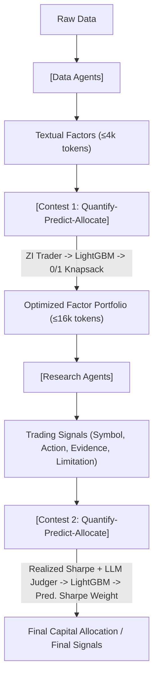

<!-- ontology-5axis data=文本另类 horizon=日频波段 paradigm=生成式大模型 alpha=多智能体博弈 autonomy=Agent自主演进 -->

# ContestTrade 解構

> **發布**：2025-08-15 · （無 venue）
> **QuantML 導讀**：[优胜劣汰：ContestTrade多智能体交易架构](https://mp.weixin.qq.com/s?__biz=Mzg2MzAwNzM0NQ==&mid=2247491371&idx=1&sn=b8c61a7ab6841bc05253c301c54f40df&chksm=ce7e7835f909f123b824f84973c88034db152fc8c09276a170a4f84833a67030766e4e49c3a8#rd)
> **核心定位**：落點於「多智能體博弈 × Agent自主演進」軸，針對單一LLM Agent在日頻波段交易中對市場噪聲敏感、決策不穩定且缺乏量化推理能力的Prior Gap，以企業內部競賽架構實現信號動態篩選與資金分配。

**五軸座標**

| 數據模態 | 時間尺度 | 學習範式 | Alpha機制 | 人機協作 |
|:-:|:-:|:-:|:-:|:-:|
| `文本另类` | `日频波段` | `生成式大模型` | `多智能体博弈` | `Agent自主演进` |

**Status:** v0.5 — 基於 QuantML 導讀 + 原論文（如有）。benchmark 細節待升 v1。
**TL;DR:** 提出ContestTrade框架，通过数据与研究双团队内部竞赛机制，实现LLM多智能体交易信号的动态筛选与资金分配。引入量化-预测-分配三阶段内部竞赛机制，用ZI Trader量化因子、LightGBM预测效用、0/1背包分配资源，实现多智能体优胜劣汰。這對「多智能體博弈」軸★，因它將靜態協作轉為動態淘汰，直接對沖LLM的上下文衰減與噪聲過敏。測試期實現52.80%累計回報率與3.12夏普比率。

**X-Ray.** 本架構將傳統多智能體協作翻轉為制度化的內部競賽，實質是將Alpha生成從「Prompt工程」降維至「因子/信號的實時P&L驗證」。它解決了舊工程坑：LLM上下文窗口限制導致的信息堆積失效（Sigmoid決策能力衰減），以及單一歷史回報滯後性。然而，其Envelope受限於日頻波段與A股流動性假設，ZI Trader的原子陳述模擬脫離了真實訂單簿微結構，LightGBM的短期動量預測在Regime Switch時極易過擬合。對量化讀者的意義不在於直接複製Agent架構，而在於借鑒其「預測性評估+約束優化分配」的資源調度邏輯，替代傳統等權或靜態風險預算。

## §1 · 架構 / Core Mechanism
**1.1 三大改動 vs 前作**
| 改動維度 | 傳統多智能體/單Agent | ContestTrade | 工程意義 |
|---|---|---|---|
| 決策邏輯 | 靜態協作或單一歷史回報驅動 | 量化-預測-分配三階段內部競賽 | 將信號質量轉化為可計算的預期效用，動態淘汰劣質輸出 |
| 信息處理 | 直接餵入LLM上下文或固定NLP流程 | ZI Trader原子陳述量化 + LightGBM動量預測 | 解耦「信息內在價值」與「LLM推理能力」，規避上下文衰減 |
| 資源分配 | 等權或固定權重 | 0/1背包（因子）/ 預測夏普加權（資金） | 在硬約束（16k tokens/資金池）下求解最優組合，非貪心堆疊 |

**1.2 ⚡ Eureka 一句話 trick + 直覺**
Trick: 用「零智能交易者（ZI Trader）」剝離LLM推理干擾，純靠原子陳述的模擬P&L量化因子內在價值，再交由LightGBM預測短期動量。
直覺: 市場噪聲會欺騙LLM的語義理解，但無法欺騙嚴格受限的模擬交易結果；競賽機制本質是將Alpha工廠的「評審會」自動化與實時化。

**1.3 信息流 ASCII 圖**

## §2 · 數學層
📌 **Napkin Formula**:
$DV = V \times DC$, 其中 $DC \approx \sigma(a \cdot L + b)$ (Sigmoid decay w.r.t context length $L$)
分配約束: $\max \sum_{i} \hat{u}_i x_i \quad \text{s.t.} \quad \sum_{i} c_i x_i \leq C, \ x_i \in \{0,1\}$ (0/1 Knapsack)
資金權重: $w_j = \frac{\hat{SR}_j}{\sum_{k \in \mathcal{P}} \hat{SR}_k}$ (Predicted Sharpe weighting)
複雜度: LightGBM訓練 $O(N \log N)$，背包求解 $O(N \cdot C)$，整體為多項式時間，遠低於RL的在線策略梯度。
直覺: 決策價值被明確拆解為「信息量」與「推理能力」的乘積，承認LLM的上下文瓶頸；分配問題被形式化為經典組合優化，避免黑盒權重學習。
Loss/訓練細節: LightGBM使用因子/智能體歷史得分序列作為特徵，預測未來風險調整後效用；訓練期2024年7月至12月，測試期2025年1月至6月。

## §3 · 數據層
資料規模/頻率/市場/時段: 中國A股市場，日頻波段。訓練期2024年7月至12月，測試期2025年1月至6月（嚴格時間切分防泄漏）。
怎麼來: 多源頭原始數據（新聞、財報、公司公告、市場數據），經Data Agents並行處理。
樣本外與容量假設: 測試期完全在LLM知識截止日期之後，確保純樣本外驗證；因子組合容量硬性限制為16k tokens，資金分配假設無滑點/無交易成本（導讀未提及）。

## §4 · 代碼層
| 項目 | 狀態/細節 |
|---|---|
| Repo | 導讀註明「代碼見知識星球」，非公開 |
| Checkpoint | TBD |
| License | TBD |
| 複現難度 | 高（依賴私有LLM API調度、金融工具套件封裝、內部競賽邏輯閉環） |
| 數據可得性 | 中（A股公開數據可獲取，但新聞/公告的實時清洗與結構化需自建） |

## §5 · 評測 / Benchmark
| 數據集/市場 | Metric | 前SOTA | 本方法 | Δ |
|---|---|---|---|---|
| 中國A股 (2025.01-06) | CR | 中证全指/傳統規則/ML/DRL/MASS (均為未披露) | 52.80% | 未披露 |
| 中國A股 (2025.01-06) | SR | 同上 | 3.12 | 未披露 |
| 中國A股 (2025.01-06) | MDD | 同上 | 12.41% | 未披露 |

**解讀**: 導讀僅披露ContestTrade絕對數值，未給出任何基線具體數字，故Δ欄無法計算。52.80% CR與3.12 SR在日頻波段屬高區間，但導讀未計入交易成本與滑點，實盤Sharpe likely會顯著收斂。競賽有效性指標（Rank IC 0.054/0.079）證實了篩選邏輯的預測力，但IC值絕對數值偏低，暗示因子/信號的Alpha衰減較快，需高頻調倉或嚴格風控支撐。

## §6 · 失效與隱含假設
**6.1 論文自述 limitations**: 導讀未明確列出limitations章節，但消融實驗指出移除任一核心環節（競賽、LLM Judger、深度工具）均導致性能顯著下降，暗示系統高度依賴組件完整性與LLM穩定性。
**6.2 推斷的隱含假設**:
- Regime依賴: LightGBM基於短期動量（n=5天）預測效用，在趨勢反轉或高波動Regime下動量失效會導致資金錯配。
- 容量/成本: 0/1背包與預測夏普加權未計入交易成本與流動性約束，A股T+1與漲跌停限制會直接阻斷信號執行。
- 數據泄漏: 雖嚴格時間切分，但ZI Trader的原子陳述模擬若使用未來財務數據或未經復權的價格，可能引入隱性前視偏差。
- Survivorship: 導讀未說明樣本是否包含已退市A股，若僅用存續股票，MDD與CR可能被低估。

## §7 · 對比 & 面試 Tip
| 同軸對手 | 關鍵差異軸 | Open? | Status |
|---|---|---|---|
| MASS (多智能體系統) | 靜態協作 vs 動態競賽淘汰 | 導讀提及但未開源 | 基線 |
| 傳統因子組合 (Risk Parity/Black-Litterman) | 靜態權重 vs LightGBM預測效用+背包優化 | 公開 | 成熟 |
| 單Agent交易 (e.g., FinAgent) | 單一上下文決策 vs 雙團隊分層競賽 | 部分開源 | 實驗性 |

🎤 **Interview Tip**
正確答: 「ContestTrade的本質是將Alpha生成從Prompt驅動轉為P&L驗證驅動，用ZI Trader剝離LLM推理噪聲，並通過LightGBM+組合優化實現資源動態分配。其核心價值在於解決LLM上下文衰減與信號衝突，而非單純提升預測精度。」
錯答: 「它只是用多個LLM互相投票，然後選出得分最高的信號，跟傳統Ensemble沒區別。」（忽略了ZI Trader的量化剝離、Sigmoid上下文衰減建模與0/1背包約束優化）

**7.1 可證偽預測帶日期**: 若2025年Q3 A股進入高波動震盪市，ContestTrade的預測夏普加權分配將因動量失效導致資金過度集中於偽信號，實盤MDD將突破12.41%。

## §8 · For the Reader
- **因子研究員**: 借鑒ZI Trader思路，將LLM生成的非結構化文本轉為可回測的原子陳述P&L，替代傳統IC/IR靜態篩選。
- **高頻執行/組合配置**: 關注0/1背包與預測權重分配邏輯，可將其嵌入現有組合優化器（如CVXPY）替代等權或風險預算。
- **LLM-agent/RL策略**: 避免將LLM直接作為策略輸出層；應將其降級為「信息提煉器」，決策權交由量化預測模型與約束優化器。
- **研究學生**: 消融實驗證明「競賽機制」與「深度工具」缺一不可，複現時需優先驗證LightGBM動量預測的樣本外穩定性，而非堆疊Agent數量。

## References
- 原論文: ContestTrade (arxiv=None, venue=無)
- Lineage: 多智能體交易系統 (MASS) / 零智能交易者 (ZI Trader) / LightGBM動量預測 / 0/1背包優化
- QuantML 導讀鏈接: [优胜劣汰：ContestTrade多智能体交易架构](https://mp.weixin.qq.com/s?__biz=Mzg2MzAwNzM0NQ==&mid=2247491371&idx=1&sn=b8c61a7ab6841bc05253c301c54f40df&chksm=ce7e7835f909f123b824f84973c88034db152fc8c09276a170a4f84833a67030766e4e49c3a8#rd)