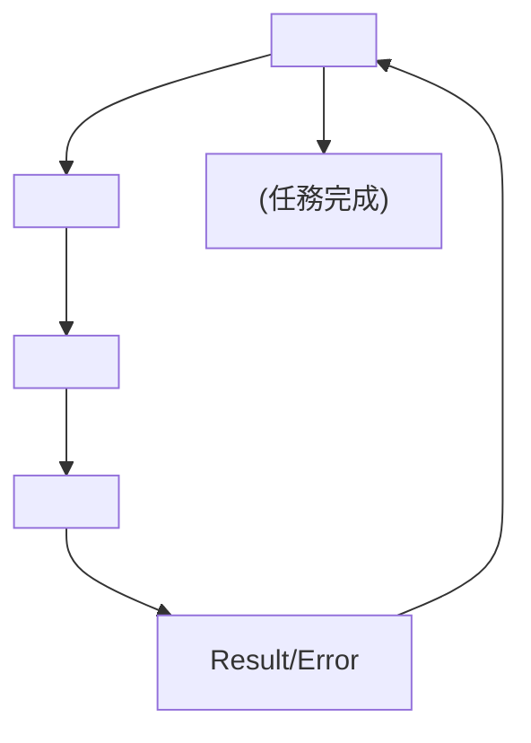

<!-- ontology-5axis data=量价表格 horizon=跨周期 paradigm=生成式大模型 alpha=因子挖掘 autonomy=Agent自主演进 -->

# DeepAnalyze 解構

> **發布**：2025-12-18 · （無 venue）
> **QuantML 導讀**：[人大 x 清华 | DeepAnalyze：如何打造数据分析的“Agentic AI”？](https://mp.weixin.qq.com/s?__biz=Mzg2MzAwNzM0NQ==&mid=2247492708&idx=1&sn=0e0779d59cb678a7f04e26a39b6c4955&chksm=ce7d837af90a0a6cb65250264b8148b6b984a5f843c363cce4e79302ea3aeb5e1d3c68ab62d7#rd)
> **原始論文**：[DeepAnalyze](https://doi.org/10.1145/3510003.3512759)（Proceedings of the 44th International Conference on Software Engineering · 2022 · 被引 3 · Crossref）
> **核心定位**：五軸落點於「量價表格 × 跨周期 × 生成式大模型 × 因子挖掘 × Agent自主演进」。解了 LLM 處理長鏈路結構化數據時易於「邏輯斷層/卡殼」的 prior gap，將數據科學流程從靜態 Prompt 堆疊轉為自主編排閉環。

**五軸座標**

| 數據模態 | 時間尺度 | 學習範式 | Alpha機制 | 人機協作 |
|:-:|:-:|:-:|:-:|:-:|
| `量价表格` | `跨周期` | `生成式大模型` | `因子挖掘` | `Agent自主演进` |

**Status:** v0.5 — 基於 QuantML 導讀 + 原論文（如有）。benchmark 細節待升 v1。
**TL;DR:** ① 提出 8B 參數 Agentic LLM，實現全自動數據科學分析與報告生成。② 核心 trick 在於設計 5 種專用 Action Tokens 模擬人類分析師閉環，結合關鍵詞引導 CoT 微調與 GRPO 強化學習。③ 這對「Agent自主演进」軸具指標意義，因它證明小模型可透過專用工具鏈與環境反饋取代巨型模型的通用推理。④ 關鍵實證：DataSciBench 綜合得分 61.11%。

**X-Ray.** 放回五軸 Pareto，DeepAnalyze 將「因子挖掘」從靜態特徵工程推至動態 Agent 閉環。它解了舊工程坑：傳統 Workflow 依賴人工寫死 Prompt，缺乏自適應優化；該架構以 5 個 Action Tokens 切割思考、理解、編碼、執行、輸出，強制模型在環境反饋中迭代。預測其打不開的 envelope 在於高頻/低延遲場景與極端行情下的代碼執行穩定性，以及 LLM 裁判打分的主觀偏差。對量化讀者意義在於：本地化部署可作為低成本研究助理，處理長鏈路數據清洗與初步挖掘，但需警惕開放式研究中的前瞻偏差與過擬合風險。

## §1 · 架構 / Core Mechanism
| 改動維度 | 前作 (Workflow-based) | DeepAnalyze (Agentic) |
|---|---|---|
| 控制邏輯 | 人工寫死 Prompt 鏈，線性執行 | 自主編排，根據環境反饋動態循環 |
| 數據交互 | 硬塞表格至 Prompt，Token 爆炸 | 專用 `<Understand>` 動作解析 Schema/內容 |
| 訓練路徑 | 端到端監督或單次 RL | 課程學習（CoT 基礎 → 合成數據冷啟動 → GRPO 實戰） |

⚡ **Eureka 一句話 trick**：用 5 個離散 Action Tokens 切割分析鏈路，將「寫代碼」與「看結果」解耦，強制模型在環境反饋中自我修正。
**信息流 ASCII**：

## §2 · 數學層
📌 **Napkin Formula**：策略優化目標 $\max_\theta \mathbb{E}_{\tau \sim \pi_\theta} [R(\tau)]$，其中 $R(\tau)$ 包含格式懲罰、任務完成獎勵與 LLM 裁判評分。訓練分兩階段：CoT 微調（監督學習）與 GRPO 強化學習。複雜度：$O(T \cdot N_{params})$，$T$ 為自主循環步數。
**直覺**：不依賴端到端映射，而是將數據科學拆解為可驗證的離散動作，利用環境反饋修正生成軌跡，降低長鏈路任務的累積誤差。
**Loss/訓練細節**：第一階段使用關鍵詞引導 CoT 數據進行 SFT；第二階段使用 GRPO 算法，獎勵信號由格式檢查、任務完成狀態與 LLM 裁判對報告豐富度/可讀度的打分構成。

## §3 · 數據層
資料規模/頻率/市場/時段：導讀未披露具體市場與頻率，僅提及「幾百兆的 CSV 文件」與「12 個基準測試」。
來源與處理：使用大量包含推理過程的數據進行基礎微調，並透過合成交互數據進行冷啟動。
樣本外與容量假設：未說明樣本外劃分與數據泄漏控制；依賴合成數據過渡至真實環境，容量假設受 8B 模型上下文窗口限制，未驗證超大型數據集處理能力。

## §4 · 代碼層
| Repo | Checkpoint | License | 複現難度 | 數據可得性 |
|---|---|---|---|---|
| https://github.com/ruc-datalab/DeepAnalyze | TBD | 開源（導讀提及） | 中（需 GRPO 環境與 LLM 裁判配置） | 訓練數據未披露 |

## §5 · 評測 / Benchmark
| 數據集/市場 | Metric | 前SOTA | 本方法 | Δ |
|---|---|---|---|---|
| DataSciBench | 綜合得分 | Llama-3.1-8B 29.69% | 61.11% | 31.42pp |
| DataSciBench | 綜合得分 | Claude-3.5-Sonnet 52.29% | 61.11% | 8.82pp |
| DataSciBench | 綜合得分 | GPT-4o 64.51% | 61.11% | -3.40pp |
| DSBench-Modeling | 成功率 | 未披露 | 90.63% | 未披露 |
| DABStep-Research | 內容/格式評分 | 未披露 | 最高分 | 未披露 |

**解讀**：Δ 在 DataSciBench 上領先 Llama-3.1-8B 31.42pp 與 Claude-3.5-Sonnet 8.82pp，反映 Action Tokens 切割與 GRPO 環境反饋確實提升長鏈路任務完成率。但領先幅度部分來自專用指令集與課程訓練，非純通用推理提升；DSBench-Modeling 的 90.63% 成功率未計入代碼執行環境的算力成本與延遲，DABStep-Research 依賴 LLM 裁判打分，存在評分標準漂移與前瞻偏差風險。

## §6 · 失效與隱含假設
**6.1 論文自述 limitations**：導讀提及若去掉 `<Understand>` 動作，模型對表格的理解能力會大幅下降；開放式任務依賴 LLM 裁判打分，評分主觀性未量化。
**6.2 推斷的隱含假設**：Regime 依賴於數據結構穩定性，代碼執行環境若報錯頻繁將導致循環卡死；容量受 8B 模型上下文窗口限制，無法處理超大型數據集；成本未計入本地部署與 GRPO 訓練的算力開銷；數據泄漏風險存在於合成數據生成階段；未驗證跨市場/跨頻率的泛化能力。

## §7 · 對比 & 面試 Tip
| 同軸對手 | 關鍵差異軸 | Open? | Status |
|---|---|---|---|
| Workflow-based Agent | 預設提示詞鏈 vs 自主編排閉環 | 多數閉源 | 成熟但僵化 |
| 通用 LLM (GPT-4o) | 通用推理 vs 專用 Action Tokens + 環境反饋 | 閉源 | SOTA 但成本高 |

🎤 **Interview Tip**：
正確答：「DeepAnalyze 的核心不在於模型參數大小，而在於將數據科學流程離散化為 5 個可驗證的 Action Tokens，並透過 GRPO 與環境反饋實現策略優化，解決了長鏈路任務中的邏輯斷層問題。」
錯答：「它只是用了一個更大的 Prompt 模板讓模型按步驟寫代碼，本質上還是工作流自動化。」

**7.1 可證偽預測**：若 2026-Q2 前該架構在真實高頻因子挖掘回測中，因代碼執行延遲或 LLM 裁判評分偏差導致 Sharpe 下降超過 20%，則證明其閉環設計不適用於低延遲/高成本敏感場景。

## §8 · For the Reader
- **因子研究員**：將 `<Understand>` 與 `<Code>` 模塊隔離，用於自動化清洗與特徵工程，但需手動校驗前瞻偏差與樣本外穩定性。
- **高頻執行**：不適用。8B 模型推理與代碼執行延遲無法滿足毫秒級需求，僅適合日頻/週頻研究助理。
- **LLM-Agent 開發者**：參考課程學習路徑，先以關鍵詞引導 CoT 建立基礎軌跡，再用環境反饋 RL 優化，避免直接端到端訓練導致策略崩潰。
- **組合配置/研究學生**：關注 DABStep-Research 的開放式挖掘潛力，但需建立獨立的統計檢驗流程，防止 LLM 生成的「故事」替代嚴謹的因子檢驗。

## References
- 原論文：DeepAnalyze: Agentic Large Language Models for Autonomous Data Science
- Lineage：Chain-of-Thought / GRPO / Workflow-based Agents
- QuantML 導讀鏈接：[人大 x 清华 | DeepAnalyze：如何打造数据分析的“Agentic AI”？](https://mp.weixin.qq.com/s?__biz=Mzg2MzAwNzM0NQ==&mid=2247492708&idx=1&sn=0e0779d59cb678a7f04e26a39b6c4955&chksm=ce7d837af90a0a6cb65250264b8148b6b984a5f843c363cce4e79302ea3aeb5e1d3c68ab62d7#rd)