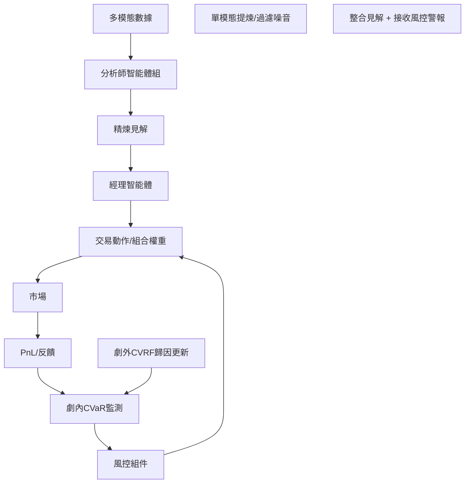

<!-- ontology-5axis data=多模态 horizon=日频波段 paradigm=生成式大模型 alpha=多智能体博弈 autonomy=Agent自主演进 -->

# FINCON 解構

> **發布**：2024-12-13 · NeurIPS 2024
> **QuantML 導讀**：[NIPS 24 | FinCon: 基于LLM的多智能体交易及组合管理框架](https://mp.weixin.qq.com/s?__biz=Mzg2MzAwNzM0NQ==&mid=2247488353&idx=1&sn=f6684d1c9788e0f9dcd09b781cbd619a&chksm=ce7e747ff909fd69d6538f30bb681b3e0dba85700479802978c2c883bc93346cfe58bdf6f912#rd)
> **核心定位**：落點於「多智能体博弈 × Agent自主演进」軸，解了單智能體 LLM 在金融決策中的認知過載與長期風險失控 gap，透過經理-分析師分層與雙層風控（劇內 CVaR / 劇外 CVRF）實現自動化組合管理。

**五軸座標**

| 數據模態 | 時間尺度 | 學習範式 | Alpha機制 | 人機協作 |
|:-:|:-:|:-:|:-:|:-:|
| `多模态` | `日频波段` | `生成式大模型` | `多智能体博弈` | `Agent自主演进` |

**Status:** v0.5 — 基於 QuantML 導讀 + 原論文（如有）。benchmark 細節待升 v1。
**TL;DR:** ① 提出基於 LLM 的多智能體框架，以經理-分析師層級架構處理單股與組合決策。② 核心 trick 為劇內 CVaR 觸發避險與劇外 CVRF 信念更新，解耦資訊提煉與風險控制。③ 對「多智能体博弈」軸★，將人類交易員組織結構映射為 AI Agent 協作，降低單體上下文壓力。④ 導讀未給量化結果，僅披露消融實驗中 CVaR 開關在 GOOG 牛市 CR 從 -1.461% 提升至 25.077%。

**X-Ray.** 放回五軸 Pareto，FINCON 捨棄了純 RL 的端到端策略優化，轉向「提示工程 × 組織架構模擬」的生成式路徑。它解了舊工程坑：單 Agent 上下文窗口飽和導致的資訊丟失，以及靜態風險偏好無法適應 regime 切換的問題。預測其打不開的 envelope 在於：LLM 的推理延遲與 API 成本將限制其在日頻波段以上的應用；且 CVRF 的信念更新依賴文本歸因，在極端流動性枯竭或黑天鵝事件中，語言模型的因果歸謬可能產生危險的「過度自信」或「恐慌性止損」。對量化讀者而言，此架構適合做 Alpha 生成階段的資訊過濾與邏輯校驗，而非直接下單執行。

## §1 · 架構 / Core Mechanism
**1.1 三大改動 vs 前作**
| 維度 | 前作 (FINGPT/FINMEM/FINAGENT) | FINCON 改動 |
|---|---|---|
| 決策結構 | 單智能體直接輸出動作 | 經理-分析師分層通信，專職提煉 vs 整合決策 |
| 風險控制 | 依賴短期波動偏好或靜態設置 | 雙層風控：劇內 CVaR 觸發 + 劇外 CVRF 信念更新 |
| 任務範圍 | 限單一資產交易 | 擴展至多資產組合管理（均值-方差優化器介入） |

**1.2 ⚡ Eureka 一句話 trick + 直覺**
Trick：將風險控制從「策略輸出層」剝離至「獨立組件層」，用 CVaR 做即時閾值觸發，用 CVRF 做跨劇本信念權重調整。直覺：像交易室裡的風控官與研究總監，前者管當日停損，後者管週期性策略偏誤校正。

**1.3 信息流 ASCII 圖**

## §2 · 數學層
📌 **Napkin Formula**：
POMDP 狀態空間 $S = X \times Y$，目標 $\max \mathbb{E}[\sum R_t]$
劇內風控：$CVaR_\alpha = \mathbb{E}[PnL \mid PnL \leq VaR_\alpha]$，若 $CVaR$ 下降則觸發避險策略。
劇外更新：$B_{t+1} = \text{CVRF}(B_t, \text{Profit/Loss Pattern})$，調整分析師資訊權重。
**直覺**：將連續決策拆解為「資訊壓縮 → 風險閾值判斷 → 信念權重迭代」，避開純 RL 的 reward hacking。Loss 未披露，訓練依賴 GPT-4-Turbo 提示優化與 5 次 epoch 中位數軌跡篩選。

## §3 · 數據層
資料規模/頻率/市場/時段：日頻波段，美股市場。訓練 2022-01-03 至 2022-10-04；測試 2022-10-05 至 2023-06-10。DRL 基線訓練延長至近五年 (2018-01-01 至 2022-10-04)。
怎麼來：Yahoo Finance (價量)、Refinitiv (新聞)、SEC EDGAR (10-K/10-Q)、ECC 音頻。按時效性分配給不同分析師。
樣本外與容量假設：測試期約 8 個月，屬典型短週期 OOS。容量假設未披露，但組合管理僅測試 3 檔股票的小型組合 (Portfolio 1/2)，暗示當前 LLM 推理成本與上下文限制難以直接擴展至百檔以上池子。

## §4 · 代碼層
| Repo | Checkpoint | License | 複現難度 | 數據可得性 |
|---|---|---|---|---|
| TBD | GPT-4-Turbo (溫度 0.3) | TBD | 高 (依賴付費 LLM API + 多模態數據清洗 + 提示工程調優) | 中 (Yahoo/SEC 公開，Refinitiv/ECC 需機構授權) |

## §5 · 評測 / Benchmark
| 數據集/市場 | Metric | 前SOTA | 本方法 | Δ |
|---|---|---|---|---|
| 單股/美股 | CR% | 未披露 | 未披露 | 未披露 |
| 組合/美股 | SR | 未披露 | 未披露 | 未披露 |
| 單股/美股 | MDD% | 未披露 | 未披露 | 未披露 |
*(註：導讀未給出主 benchmark 表格數值，僅提供消融實驗對照)*

**消融實驗對照 (導讀逐字數字)**：
| 場景 | 機制 | 基線 (關) | 本法 (開) | Δ |
|---|---|---|---|---|
| GOOG 牛市 | CVaR | -1.461% | 25.077% | +26.538pp |
| NIO 熊市 | CVaR | -52.887% | 17.461% | +70.348pp |
| Portfolio 1 | CVaR | 14.699% | 113.836% | +99.137pp |
| GOOG 牛市 | CVRF | -11.944% | 25.077% | +37.021pp |
| NIO 熊市 | CVRF | 8.197% | 17.461% | +9.264pp |
| Portfolio 1 | CVRF | 28.432% | 113.836% | +85.404pp |

**解讀**：Δ 主要來自風控組件的開關對比，證明雙層機制在極端行情（熊市/高波動）與多資產情境下能顯著修復虧損曲線。但需注意：① 測試期僅 8 個月，且 DRL 基線訓練期長於 LLM 基線，存在數據週期不對稱的潛在偏差；② CR 提升可能部分來自「避險空倉」而非 Alpha 生成，未披露換手率與交易成本，實盤有效性待驗證；③ 無完整 SOTA 對比表，無法斷言其絕對領先幅度。

## §6 · 失效與隱含假設
**6.1 論文自述 limitations**：多資產決策輸入長度與複雜度增加，LLM 易產生幻覺（如記憶體事件不存在索引）；語言模型處理擴展上下文面臨挑戰；組合管理研究相對未被探索。
**6.2 推斷的隱含假設**：Regime 依賴強（CVRF 依賴歷史劇本歸因，若遇全新結構性斷裂可能失效）；容量受限（僅測 3 檔組合，API 成本與推理延遲不支援高頻或大池子）；數據泄漏風險低但前瞻偏差需警惕（新聞/財報時間戳對齊）；假設 LLM 的文本歸因能力等同於金融邏輯推理。

## §7 · 對比 & 面試 Tip
| 同軸對手 | 關鍵差異軸 | Open? | Status |
|---|---|---|---|
| FINMEM / FINAGENT | 單體認知負載 vs 分層協作 | 導讀未提開源 | v0.5 |
| FinRL-A2C/PPO | 端到端 RL 策略 vs 提示工程+優化器 | 開源 (FinRL) | 成熟 |
| Markowitz MV | 靜態數學規劃 vs 動態 LLM 信念更新 | 開源 | 經典 |

🎤 **Interview Tip**：
正確答：「FINCON 的本質是將風控與決策解耦，用 CVaR 做硬約束、CVRF 做軟權重調整，適合做 Alpha 篩選階段的邏輯校驗，而非直接執行。」
錯答：「它用 RL 訓練出了超額收益模型，可以直接替代量化交易員下單。」（混淆了生成式提示優化與策略梯度優化，且忽略執行成本與幻覺風險）

**7.1 可證偽預測帶日期**：若 2025-Q3 前無開源實作將 CVRF 信念更新機制整合至開源 LLM (如 Qwen/Llama-3) 並跑通日頻組合回測，則該框架將停留在學術演示階段，無法進入機構生產環境。

## §8 · For the Reader
- **因子研究員**：可提取分析師智能體的「單模態提煉邏輯」作為文本因子構建模板，但需警惕 LLM 的歸因偏差，建議用規則引擎做二次校驗。
- **組合配置**：CVRF 的跨劇本信念更新機制可啟發動態權重調整模型，但需結合交易成本模型，避免頻繁調倉侵蝕收益。
- **LLM-Agent 開發者**：重點複現「經理-分析師」通信協議與記憶模組（工作/程序/情景記憶），這是降低上下文壓力的關鍵工程模式。
- **高頻執行**：本框架日頻波段定位明確，API 延遲與推理成本不適合低延遲場景，勿嘗試降頻適配。

## References
- 原論文：NeurIPS 2024 (FINCON)
- Lineage：FINGPT / FINMEM / FINAGENT / FinRL
- QuantML 導讀鏈接：[NIPS 24 | FinCon: 基于LLM的多智能体交易及组合管理框架](https://mp.weixin.qq.com/s?__biz=Mzg2MzAwNzM0NQ==&mid=2247488353&idx=1&sn=f6684d1c9788e0f9dcd09b781cbd619a&chksm=ce7e747ff909fd69d6538f30bb681b3e0dba85700479802978c2c883bc93346cfe58bdf6f912#rd)