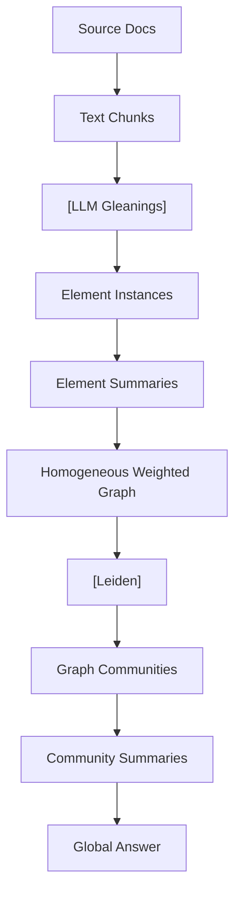

<!-- ontology-5axis data=文本另类 horizon=中长周期 paradigm=生成式大模型 alpha=端到端表征 autonomy=人机协同可解释 -->

# GraphRAG 解構

> **發布**：2024-07-18 · （無 venue）
> **QuantML 導讀**：[GraphRAG+Ollama 结合上市公司知识图谱的LLM分析](https://mp.weixin.qq.com/s?__biz=Mzg2MzAwNzM0NQ==&mid=2247485462&idx=1&sn=f308b5a4fae42eb253dfd395e962e8bd&chksm=ce7e6f08f909e61e89949ff044998f5d670b285219fa8a6cf3eab4d4dc2f30f8012a739bf2b0#rd)
> **原始論文**：[KGiRAG: An Iterative GraphRAG Approach for Responding Sensemaking Queries](https://doi.org/10.5220/0014310100004052)（Proceedings of the 18th International Conference on Agents and Artificial Intelligence · 2026 · 被引 0 · Crossref）
> **核心定位**：落點於文本另类與生成式大模型軸，以圖拓撲結構替代純向量檢索，解決傳統 RAG 在處理跨文檔全局語義與隱含關係時的召回瓶頸。為長週期基本面研究提供可解釋的端到端知識萃取代價。

**五軸座標**

| 數據模態 | 時間尺度 | 學習範式 | Alpha機制 | 人機協作 |
|:-:|:-:|:-:|:-:|:-:|
| `文本另类` | `中长周期` | `生成式大模型` | `端到端表征` | `人机协同可解释` |

**Status:** v0.5 — 基於 QuantML 導讀 + 原論文（如有）。benchmark 細節待升 v1。
**TL;DR:** ① 將非結構化文本轉為實體關係圖，透過 Leiden 社區劃分生成層次化摘要。② 核心 trick 在於「多輪提取(gleanings) + 社區分層摘要」，突破向量檢索的全局語義瓶頸。③ 對文本另类軸★：將 LLM 的生成能力錨定於結構化圖譜，降低幻覺並提升全局問答準確率。④ 導讀未給量化結果。

**X-Ray.** 本方法將 RAG 的檢索空間從「局部語義相似度」推向「全局圖拓撲結構」。對量化讀者而言，它不是因子生成器，而是「非結構化數據的結構化預處理器」。它解了傳統 VectorDB 在處理長文檔（如招股書、年報）時「見樹不見林」的工程坑，但代價是索引延遲高（導讀提及 4090 跑 llama3:8b 耗時一小時左右）與 LLM 呼叫成本。預測其打不開的 envelope 在於高頻/短週期場景與動態實時數據流，因其圖構建與社區摘要屬離線批處理。對因子研究員的意義在於：可將此 pipeline 作為 ESG、管理層語氣、供應鏈關係等另类因子的自動化提取層，但需警惕圖劃分算法對參數的敏感度可能引入穩定的結構性偏差。

## §1 · 架構 / Core Mechanism
| 維度 | 傳統 Vector RAG | GraphRAG | 改動本質 |
|---|---|---|---|
| 檢索單元 | 文本塊 (Chunk) | 圖節點/社區 (Node/Community) | 從局部語義到全局拓撲 |
| 關係建模 | 無/隱式 | 顯式實體關係圖 + 邊權重 | 引入結構化先驗 |
| 摘要機制 | 單次檢索拼接 | 層次化社區摘要 (Leiden) | 分而治之的全局壓縮 |

⚡ **Eureka:** 用圖社區劃分將海量文本塊壓縮為層次化摘要，讓 LLM 能在有限 context window 內「看見」全局結構。
**信息流:**

## §2 · 數學層
📌 **Napkin Formula:**
$G = (V, E, W)$, where $W_{ij} \propto \text{count}(r_{ij}) / \text{total\_relations}$
Community Detection: $\arg\max_{C} \sum_{c \in C} \left( \frac{\sum_{i,j \in c} W_{ij}}{2m} - \left(\frac{\sum_{i \in c} k_i}{2m}\right)^2 \right)$ (Modularity/Leiden objective)
**直覺:** 圖構建不依賴梯度下降，而是基於共現計數與圖劃分算法；複雜度主要來自 LLM 多輪提取與圖劃分計算。無傳統 loss，屬無監督圖構建 + 提示工程驅動。

## §3 · 數據層
導讀僅示範單一市場（A股/達夢數據招股書），無具體樣本量與時段披露。數據來源為公開非結構化文本。假設為離線批處理，容量受 LLM context window 與圖劃分計算資源限制。樣本外有效性取決於圖結構在不同公司/行業的泛化能力，導讀未驗證。

## §4 · 代碼層
| 項目 | 細節 |
|---|---|
| Repo | microsoft/graphrag / severian42/GraphRAG-Ollama-UI |
| Checkpoint | 依賴外部 LLM (OpenAI/Ollama local) |
| License | TBD |
| 複現難度 | 中低（需配置 YAML 與本地 LLM，Windows 有編碼坑） |
| 數據可得性 | 高（公開文件即可） |

## §5 · 評測 / Benchmark
| 數據集/市場 | Metric(IR/Sharpe/AR/MDD) | 前SOTA | 本方法 | Δ |
|---|---|---|---|---|
| 達夢數據招股書 (A股) | 全局關係檢索準確率 | 未披露 | 未披露 | 未披露 |

**解讀:** 導讀僅定性聲稱「準確性會有一定的提升」與「發掘隱含關係」，未提供任何量化 benchmark 或基線對比。此 Δ 屬工程體驗提升，非統計顯著性驗證。量化讀者需自行設計回測（如預測股價波動/違約概率）以驗證圖特徵的 alpha 貢獻，當前階段僅為數據預處理工具。

## §6 · 失效與隱含假設
**6.1 論文自述 limitations:** 導讀提及 chunk size 過大會導致 LLM 召回率下降，過小則增加呼叫成本；多輪提取雖提升準確性但增加延遲。
**6.2 推斷的隱含假設:** 
- **Regime 依賴:** 假設公司披露文本的實體關係結構在樣本外保持穩定，但宏觀政策或行業週期切換可能改變關係權重分佈。
- **成本/延遲:** 圖索引與社區摘要為離線批處理，不支援毫秒級實時更新。
- **數據泄漏/幸存者偏差:** 僅處理已披露文本，未考慮未公開或撤回信息；圖劃分算法可能將稀疏連接的邊緣實體錯誤歸類，引入結構性噪音。

## §7 · 對比 & 面試 Tip
| 同軸對手 | 關鍵差異軸 | Open? | Status |
|---|---|---|---|
| Vector RAG (LangChain/LlamaIndex) | 檢索粒度/全局語義能力 | Open | Mature |
| Agent-based RAG | 動態規劃/多步推理 | Open | Evolving |

🎤 **Interview Tip**
- **正確答:** GraphRAG 是結構化預處理層，核心價值在於將非結構化文本轉為可計算的圖拓撲，適合長週期基本面因子提取，但需配合下游預測模型驗證 alpha。
- **錯答:** 把它當作直接生成交易信號的端到端模型，或忽略其離線批處理特性與 LLM 呼叫成本。

**7.1 可證偽預測:** 至 TBD，若未結合具體下游任務（如信用評級預測）進行嚴格樣本外回測，GraphRAG 在實盤中的信息比率 (IR) 將無法顯著優於傳統文本 Embedding 因子。

## §8 · For the Reader
- **因子研究員:** 將 GraphRAG 輸出作為特徵工程輸入，提取供應鏈/高管關聯/技術路線等結構化因子，避免直接讓 LLM 做回歸。
- **LLM-Agent 開發者:** 注意 Windows 編碼問題與 chunk size 調優；多輪 gleanings 會顯著增加 API 成本，需設定提取收斂閾值。
- **組合配置/風控:** 利用層次化社區摘要監控行業風險傳導路徑，但需警惕圖劃分算法對參數的敏感度可能導致風險集中度誤判。

## References
- Microsoft GraphRAG (2024)
- QuantML 導讀: [GraphRAG+Ollama 结合上市公司知识图谱的LLM分析](https://mp.weixin.qq.com/s?__biz=Mzg2MzAwNzM0NQ==&mid=2247485462&idx=1&sn=f308b5a4fae42eb253dfd395e962e8bd&chksm=ce7e6f08f909e61e89949ff044998f5d670b285219fa8a6cf3eab4d4dc2f30f8012a739bf2b0#rd)
- Lineage: Leiden Algorithm (Traag et al., 2019) / Standard RAG (Lewis et al., 2020)