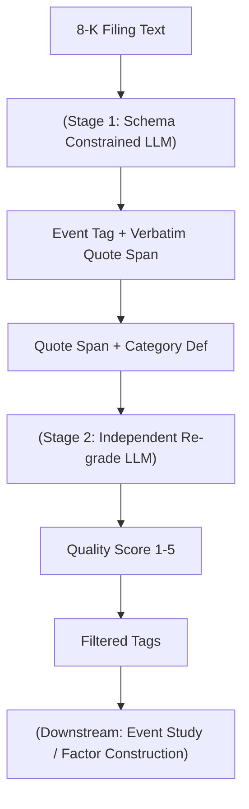

<!-- ontology-5axis data=文本另类 horizon=日频波段 paradigm=生成式大模型 alpha=因子挖掘 autonomy=人机协同可解释 -->

# Grounded Event Extraction System 解構（Grounded Event Extraction System）

> **發布**：2026-07-09 · （無 venue） · arXiv [2607.08346](https://arxiv.org/abs/2607.08346)
> **arXiv 原文**：[Grounded Event Extraction from SEC 8-K Filings with a Fine-Grained Taxonomy](https://arxiv.org/abs/2607.08346v1)  ·  *本頁由 arXiv 原文一手自主解構*
> **核心定位**：落點於文本另类與生成式大模型軸，解決 SEC 8-K 原始 item code 經濟意義粗糙且缺乏可審計性的 prior gap。透過兩階段架構將 LLM 輸出錨定至原文引用，並提供獨立質量評分，使因子挖掘從「黑盒標籤」轉向「可過濾、可追溯的結構化信號」。

**五軸座標**

| 數據模態 | 時間尺度 | 學習範式 | Alpha機制 | 人機協作 |
|:-:|:-:|:-:|:-:|:-:|
| `文本另类` | `日频波段` | `生成式大模型` | `因子挖掘` | `人机协同可解释` |

**Status:** v0.5 — 基於arXiv 原文（有原文則以原文為準）。細節待升 v1。
**TL;DR:** ① 提出兩階段 LLM 系統，將 SEC 8-K 文件映射至 119 類細粒度事件標籤。② 核心 trick 為 schema 約束輸出 + 模糊 n-gram 引用錨定，並透過獨立第二階段重評生成質量分，避免內聯自評的過度自信。③ 對生成式大模型軸而言，它將 LLM 從「一次性預測器」轉為「可審計信號管道」，提供精確度/覆蓋率的連續過濾閾值。④ 關鍵實證：質量分 5 時精確度達 96%，且為 item code 添加標籤可將反應變異解釋力提升 1.3 個百分點。

**X-Ray.** 本系統在五軸 Pareto 中放棄了端到端預測的極致壓榨，換取信號鏈路的結構化可審計性。它解了量化實戰中兩大工程坑：一是 LLM 輸出格式漂移導致下游 pipeline 崩潰，二是內聯自評分數飽和失效（75% 標籤被塞滿最高分）。透過強制 verbatim quote 與獨立重評，系統將「標籤信任度」轉為連續變量，允許研究員在回測中動態調整信號閾值。然而，它打不開的 envelope 在於：未處理跨文件事件關聯（如 merger 談判與 completion 的時序依賴），且依賴 SEC 原始披露時效，無法捕捉未達 8-K 門檻的暗池或新聞預熱。對量化讀者而言，此框架不是直接給出 alpha，而是提供高信噪比的事件分類器；實戰中應將其視為因子構建的「前置過濾層」，而非收益預測模型本身。

## §1 · 架構 / Core Mechanism
| 維度 | 前作 (Generic Prompt / Inline) | 本方法 (Grounded System) | 工程意義 |
|---|---|---|---|
| 輸出約束 | 開放式文本生成 | Schema 驗證 + 拒絕非分類標籤 | 消除格式漂移，確保下游可解析 |
| 證據錨定 | 無或弱關聯 | 模糊 n-gram 引用驗證 (Verbatim Quote) | 每筆標籤可追溯至原文 span，支援人工/自動化審計 |
| 質量評分 | 內聯自評 (Over-confident) | 獨立第二階段重評 (Dedicated Second Pass) | 避免分數飽和，提供精確度/覆蓋率連續閾值 |

⚡ **Eureka 一句話 trick**: 將「質量評分」從生成階段剝離，改為獨立重讀引用片段的二次判斷，使分數從二元標誌恢復為連續校準 dial。

**信息流 ASCII 圖:**

## §2 · 數學層
📌 **Napkin Formula**:
$$ \text{Tag} = \arg\max_{c \in \mathcal{C}} P(c \mid \text{doc}) \quad \text{s.t.} \quad \text{Quote}(c) \in \text{doc} \ \& \ \text{FuzzyMatch}(\text{Quote}(c), \text{doc}) > \tau $$
$$ \text{Score}(c) = \text{LLM}_{\text{judge}}(\text{Quote}(c), \text{Def}(c)) \in \{1,2,3,4,5\} $$
**直覺**: 第一階段是約束優化（強制輸出落在 119 類 taxonomy 內且必須附帶原文片段）；第二階段是條件概率校準，獨立評估該片段是否真正符合類別定義。複雜度為線性掃描 $O(N)$ 次 LLM 調用（$N$ 為文件數），第二階段增加約 1x 推理成本。無傳統梯度 loss，依賴 instruction-tuning 與 prompt engineering 驅動。

## §2.5 · 帶數字走一遍（Worked Example）
（**假設/示意**：以下為機制演示，非論文實證結果）
輸入一份 8-K 文件，內文提及 `"CEO John Doe resigns effective immediately."`
1. **Stage 1 提取**: LLM 輸出標籤 `Executive_Departure`，並錨定引用片段 `"CEO John Doe resigns effective immediately."`。Schema 驗證通過，模糊 n-gram 匹配原文成功。
2. **Stage 2 重評**: 獨立 LLM 讀取該片段與 `Executive_Departure` 定義。判定匹配度極高，給分 `Score=5`。
3. **下游過濾**: 若研究員設定閾值 `Score ≥ 4`，該標籤保留；若設定 `Score ≥ 5`，亦保留。
4. **對比失效案例**: 若文件僅寫 `"Management changes occurred."`，Stage 1 可能錨定該句，但 Stage 2 判定不符合 `Executive_Departure` 精確定義，給分 `Score=2`。研究員依閾值過濾，避免將模糊行政變動誤判為 CEO 離職。

## §3 · 數據層
- **資料規模**: 292,984 份 SEC 8-K filings → 產出 601,088 筆 grounded event tags。
- **頻率/時段**: 日频波段（依賴 SEC 披露時效，文件需於 4 個交易日內提交）。時段：January 2022 through June 2026。
- **來源/市場**: 美國公開上市公司（U.S. public companies），SEC EDGAR 系統。
- **樣本外與容量假設**: 未披露明確樣本外切割策略；容量假設受限於 8-K 披露頻率與 LLM 推理吞吐量，適合中頻因子構建，不適用高頻交易。

## §4 · 代碼層
| 欄位 | 狀態/數值 |
|---|---|
| Repo | TBD |
| Checkpoint | TBD |
| License | CC BY 4.0 |
| 複現難度 | 中（需 instruction-tuned LLM 與 prompt 工程，無開源權重） |
| 數據可得性 | 高（SEC 8-K 公開可下載，標籤數據集已發布） |

## §5 · 評測 / Benchmark
| 數據集/市場 | Metric | 前SOTA | 本方法 | Δ |
|---|---|---|---|---|
| 5,125 分層標籤集 | Precision (Score 1) | 未披露 | 12% | 未披露 |
| 5,125 分層標籤集 | Precision (Score 5) | 未披露 | 96% | 未披露 |
| 5,125 分層標籤集 | Unsupported Tags Rate (Score 1) | 未披露 | 8% | 未披露 |
| 5,125 分層標籤集 | Unsupported Tags Rate (Score 5) | 未披露 | near zero | 未披露 |
| 5,125 分層標籤集 | Retention Rate (Score ≥ 5) | 未披露 | 34% | 未披露 |
| 5,125 分層標籤集 | Retention Rate (Score ≥ 4) | 未披露 | 55% | 未披露 |
| 182,174 歸屬事件 | Explained Variance Increment (Reaction Magnitude) | 0.4-point (item codes only) | 1.3 percentage points (tags added to item codes) | +0.9pp |
| Item 5.02 子集 | Price Move > 2 std devs (CEO Departure) | 未披露 | 17% | 未披露 |
| Item 5.02 子集 | Price Move > 2 std devs (Routine Appointment) | 未披露 | 10% | 未披露 |

**解讀**: Δ 中僅 `Explained Variance Increment` 具備明確基線對比（+0.9pp），證實細粒度標籤能捕捉 item code 遺漏的經濟異質性。精確度從 12% 至 96% 的單調上升是系統核心價值：它提供了一個可操作的過濾閾值，而非靜態分類器。需注意，精確度提升部分依賴於 LLM judge 的評估標準一致性，且 event study 未計入交易成本與滑點，屬純信號強度驗證。內聯自評的失效（75% 標籤集中於最高分）反證了獨立第二階段的必要性。

## §6 · 失效與隱含假設
**6.1 論文自述 limitations**: 未明確列出傳統 limitations 段落，但指出 item code 本身為法律分類而非經濟分類；系統依賴 LLM 的指令遵循能力，未處理跨文件時序依賴。
**6.2 推斷的隱含假設**:
- **Regime 依賴**: 假設 SEC 披露規範與市場對 8-K 的反應機制在 January 2022 through June 2026 期間結構穩定。
- **成本/容量**: 假設 LLM 推理成本可被因子收益覆蓋；未計入 API 延遲對日频波段執行的影響。
- **數據泄漏**: 標籤生成與 event study 使用同一語料庫，雖無前瞻性偏差（標籤基於已披露文本），但未驗證跨市場/跨語言泛化。
- **信號衰減**: 當市場參與者普遍採用相同細粒度標籤時，1.3 percentage points 的解釋力增量可能因套利而收斂。

## §7 · 對比 & 面試 Tip
| 同軸對手 | 關鍵差異軸 | Open? | Status |
|---|---|---|---|
| Generic Prompting (LLM-as-Extractor) | 輸出約束與可審計性 | 開源/通用 | 基線，易漂移 |
| Inline Self-Rating Pipeline | 質量評分校準機制 | 開源/通用 | 失效（分數飽和） |
| Dictionary/Encoder Methods (Loughran-McDonald) | 細粒度分類能力 (119 類 vs 有限詞庫) | 開源 | 傳統，缺乏語義理解 |

🎤 **Interview Tip**: 
- **正確答**: 「本方法的核心不在於提升單一標籤的準確率，而在於將質量評分解耦為獨立階段，使精確度與覆蓋率成為可連續調節的 trade-off。量化實戰中應依策略容量動態設定 Score 閾值，而非追求絕對最高分。」
- **錯答**: 「只要把 LLM 的 temperature 調低，就能直接取代第二階段評分，因為模型自己就能給出可靠分數。」（違反原文內聯自評飽和失效的實證）

**7.1 可證偽預測帶日期**: 若至 2026-12-31 前，SEC 修改 8-K 披露格式或引入強制結構化數據（如 XBRL 擴展），本系統的模糊 n-gram 錨定機制將面臨重構成本，且 event study 的反應異質性可能因監管套利而縮小。

## §8 · For the Reader
- **因子研究員**: 將此系統視為「信號清洗層」。回測時務必掃描 Score 閾值（1-5）對 IR/MDD 的影響，勿直接全量採用。
- **高頻執行**: 不適用。8-K 披露具法定 4 日滯後，且 LLM 推理延遲無法匹配 HFT 窗口。適合日频波段或事件驅動中頻策略。
- **組合配置**: 可利用標籤的經濟異質性（如 CEO 離職 vs 常規任命）構建多空組合，對沖 item code 層面的同質化風險。
- **LLM-agent/RL 策略**: 可將 Quality Score 作為 RL 的 reward shaping 或 agent 的 confidence prior，但需注意第二階段獨立評分的計算開銷。
- **研究學生**: 重點學習「約束優化 + 獨立校準」的架構設計，此模式可平移至財報電話會議、新聞頭條等其他金融文本提取任務。

## References
- Dolphin, R., Dursun, J., Blankenship, J., Adams, K., & Pike, Q. (2026). *Grounded Event Extraction from SEC 8-K Filings with a Fine-Grained Taxonomy*. arXiv:2607.08346.
- Lerman, Z., & Livnat, J. (2010). The new 8-K disclosures. *Review of Accounting Studies*.
- He, S., & Plumlee, M. (2020). The information content of 8-K filings. *Journal of Accounting Research*.
- Willard, B., & Louf, R. (2023). Schema-constrained LLM generation.
- Geng, S., et al. (2023). Structured output for LLMs.
- 來源鏈接：[arXiv 原文](https://arxiv.org/abs/2607.08346)