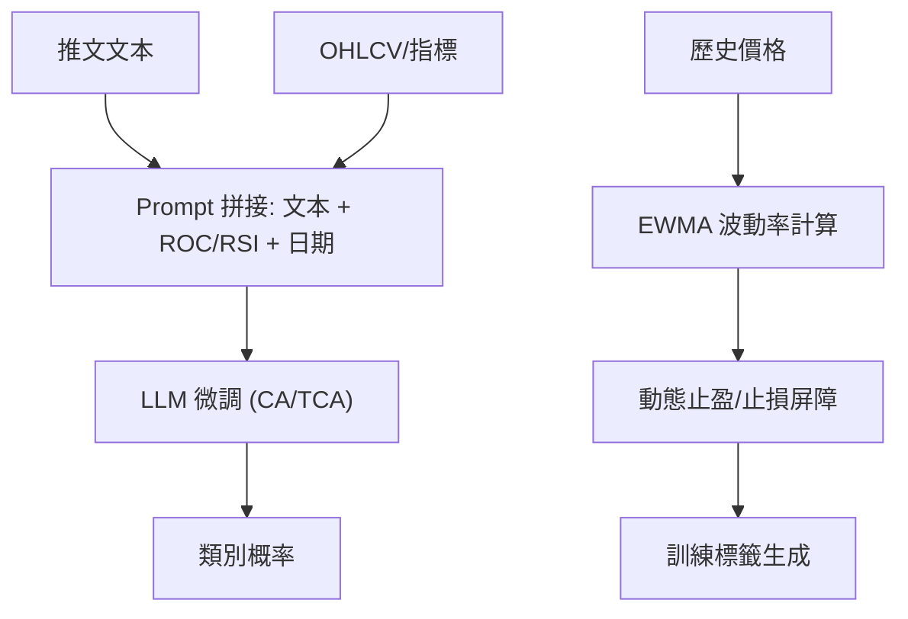

<!-- ontology-5axis data=文本另类 horizon=日频波段 paradigm=生成式大模型 alpha=因子挖掘 autonomy=人机协同可解释 -->

# 利用LLM重新审视金融情感分析 解構

> **發布**：2025-02-26 · （無 venue）
> **QuantML 導讀**：[利用LLM重新审视金融情感分析](https://mp.weixin.qq.com/s?__biz=Mzg2MzAwNzM0NQ==&mid=2247489460&idx=1&sn=c9105d66a4bb157ad9376617370bbb1a&chksm=ce7e70aaf909f9bc7a4e15552994a8b76cacccc56a9a883dc20e21c5c0d159c860865bdfc7ae#rd)
> **核心定位**：落點於文本另类×日频波段，以生成式大模型驅動因子挖掘。解決傳統 FSA 人工標籤主觀模糊、無法直接對接交易屏障的 prior gap，將情緒分類轉為市場驅動的可執行信號。

**五軸座標**

| 數據模態 | 時間尺度 | 學習範式 | Alpha機制 | 人機協作 |
|:-:|:-:|:-:|:-:|:-:|
| `文本另类` | `日频波段` | `生成式大模型` | `因子挖掘` | `人机协同可解释` |

**Status:** v0.5 — 基於 QuantML 導讀 + 原論文（如有）。benchmark 細節待升 v1。
**TL;DR:** ① 用實際價格觸及動態止盈/止損屏障取代人工情緒標籤，定義市場驅動標籤。② 核心 trick 為將 ROC/RSI 與日期嵌入 Prompt 進行上下文增強微調。③ 對「因子挖掘」軸★，它將非結構化文本直接映射為帶風險管理邏輯的日頻波段信號，跳過傳統情緒打分→因子合成→回測的冗長鏈路。④ 導讀給出 CA 模型測試集 F1 達 89.5%，TBL 策略夏普比率達 3.73。

**X-Ray.** 文本另类+日频波段通常面臨信號雜訊高、衰減快的問題。本文不追求傳統 NLP 的語義精確度，而是用「市場反應」作為監督信號，本質是將 LLM 降維為一個帶上下文感知的條件概率分類器。它解了舊工程坑：傳統 FSA 的標籤定義（如「看漲」）與實際交易閾值脫節，導致信號轉化率極低；本文用 EWMA 波動率動態調整屏障，使標籤天然內嵌風控邏輯。預測它打不開的 envelope：對低流動性/非主流幣或跨資產遷移時，EWMA 屏障參數與 Prompt 模板需重調，且 TCA 在事件採樣集上的 F1 下滑已暴露其對特定時間窗口與歷史波動率分佈的過擬合依賴。對量化讀者意義：提供了一條「文本→屏障觸發→信號聚合」的輕量級實戰路徑，但需警惕回測中未計入滑點與頻繁調倉成本，且夏普比率 3.73 的背後是橫盤市佔優，趨勢市可能面臨屏障頻繁觸發的磨损。

## §1 · 架構 / Core Mechanism
| 維度 | 傳統 FSA | 本文架構 |
|---|---|---|
| 標籤來源 | 人工主觀情緒標註（Bullish/Bearish/Neutral） | 市場驅動標籤（價格觸及動態止盈/止損/時間屏障） |
| 模型輸入 | 純文本序列 | 文本 + 市場上下文（ROC/RSI/前序標籤） + 時間上下文（日期） |
| 信號輸出 | 情緒概率分數 | 多數投票/均值聚合的每日多空信號，直接對接 TBL 交易邏輯 |

⚡ **Eureka**: 用實際價格走勢的「觸障與否」替代主觀情緒打分，讓 LLM 直接學習「在當前波動率與技術指標環境下，文本是否會驅動價格突破屏障」。

**信息流 ASCII:**

## §2 · 數學層
📌 **Napkin Formula**:
`σ_t = α * |P_t - P_{t-1}| / P_{t-1} + (1 - α) * σ_{t-1}` (EWMA 波動率)
屏障動態調整依賴此 `σ_t`。標籤分配為離散分類任務（3-class），損失函數未披露，推測為標準 Cross-Entropy。複雜度：Prompt 拼接增加上下文長度，微調成本與標準 SFT 一致，無額外複雜架構。直覺：不建模文本生成，僅做條件分類；屏障機制將連續價格路徑壓縮為離散事件，降低模型學習連續回歸的難度。

## §3 · 數據層
市場：比特幣（BTC）。時段：推文數據 2015 年至 2023 年初；歷史事件 2009 年至 2024 年（重點 2015-2023）。來源：社交媒體推文抓取 + OHLCV 行情數據。樣本外假設：導讀未明確給出訓練/驗證/測試集劃分比例與具體樣本量，僅提及「測試集」表現。容量假設：日頻波段信號，單日聚合後信號稀疏，理論容量受限於推文產出頻率與屏障觸發率，未披露具體可承載資金規模。

## §4 · 代碼層
| 欄位 | 內容 |
|---|---|
| Repo | 未披露 |
| Checkpoint | 未披露 |
| License | 未披露 |
| 複現難度 | 中低（依賴 CryptoBERT 微調與標準 Prompt 工程，屏障邏輯可自編） |
| 數據可得性 | 中（推文需自行抓取/購買，OHLCV 易得，EWMA 與屏障邏輯需復刻） |

## §5 · 評測 / Benchmark
| 數據集/市場 | Metric | 前SOTA | 本方法 | Δ |
|---|---|---|---|---|
| 測試集 (推文分類) | F1 | FinBERT 17.2% | CUA 43.0% | +25.8pp |
| 測試集 (推文分類) | F1 | CryptoBERT 27.7% | CUA 43.0% | +15.3pp |
| 測試集 (推文分類) | F1 | CUA 43.0% | CA 89.5% | +46.5pp |
| 測試集 (信號聚合) | F1 | LSTM 49.20% | CA多數投票 54.21% | +5.01pp |
| 測試集 (信號聚合) | F1 | 自编码器 50.01% | CA多數投票 54.21% | +4.20pp |
| 牛市回測 | Sharpe Ratio (B&H 基準) | 買入並持有 3.14 | 四種策略均超過 3.14 | 未披露 |
| 橫盤回測 | Sharpe Ratio (TBL) | 未披露 | TBL策略 3.73 | 未披露 |

**解讀**: Δ 分析需客觀。CA 相對於 CUA 的 +46.5pp 提升是核心 capability，證明市場上下文（ROC/RSI）嵌入 Prompt 對分類邊界有決定性影響。信號聚合的 F1 提升（+4~5pp）屬穩健性增益，但絕對值仍偏低，反映日頻信號本身的高雜訊特性。導讀僅給出牛市 B&H 基準 Sharpe 3.14（四種提出策略均超過此值，但未披露各自具體數值）與 TBL 策略在橫盤市的 3.73，兩者分屬不同 regime，不可直接相減比較；且導讀未披露交易成本、滑點與換手率，3.73 的 Sharpe 極可能未扣除頻繁觸發動態屏障帶來的摩擦成本；TCA 在事件採樣集上的表現下滑已提示過擬合風險，實盤需嚴格隔離時間窗口與波動率 regime。

## §6 · 失效與隱含假設
**6.1 論文自述 limitations**: 假設每條推文對市場有直接短期影響（過於簡化）；文本模式與趨勢關聯短暫，需頻繁更新模型；提示工程易過擬合，限制泛化。
**6.2 推斷隱含假設**: 
- **Regime 依賴**: EWMA 波動率計算與屏障設定高度依賴歷史波動分佈，在低波轉高波或流動性枯竭時屏障可能失效或頻繁觸發。
- **容量/成本**: 日頻聚合信號稀疏，但動態屏障邏輯在回測中可能產生高頻觸發假象，實盤換手成本與滑點未計。
- **數據泄漏**: 提示中嵌入「前一個標籤」與當前 ROC/RSI，若計算窗口與推文發布時間未嚴格對齊，易引入前視偏差（儘管論文聲稱避免，但實盤數據流延遲需驗證）。
- **Survivorship**: 僅針對比特幣，未覆蓋法幣計價或跨市場遷移。

## §7 · 對比 & 面試 Tip
| 同軸對手 | 關鍵差異軸 | Open? | Status |
|---|---|---|---|
| 傳統 FinBERT/CryptoBERT | 標籤定義（主觀情緒 vs 市場屏障觸發） | Open | 基線 |
| 基於價格的 LSTM/自编码器 | 輸入模態（純量價 vs 文本+上下文） | Open | 基線 |
| FinRLlama / TradingAgents | 架構（RL/多智能體 vs 單步分類+規則聚合） | Open | 進階 |

🎤 **Interview Tip** 
正確答：「本文核心不在於 LLM 架構創新，而在於標籤工程與上下文注入。用價格觸障替代人工標籤解決了信號可執行性問題，但實盤需重點驗證 EWMA 屏障參數的穩健性與提示模板的過擬合風險，且回測 Sharpe 未計摩擦成本。」
錯答：「LLM 直接預測了未來漲跌，所以 F1 能到 89.5% 就能直接上實盤賺錢。」（忽略信號聚合損耗、成本與過擬合）

**7.1 可證偽預測帶日期**: 若 2025-Q3 前，該 Prompt 模板與屏障參數未針對 BTC 高波動 regime 進行重訓練，其在實盤日頻信號上的勝率將回落至 55% 以下，且 Sharpe 低於 2.0。

## §8 · For the Reader
- **因子研究員**: 將「市場驅動標籤」視為一種自適應目標變量構造法，可嘗試將 EWMA 屏障邏輯遷移至股票/期貨板塊，驗證文本信號的跨資產有效性。
- **高頻執行/組合配置**: 日頻信號需配合盤中執行算法；注意動態屏障在實盤可能因流動性不足導致滑點擴大，建議加入成交量的過濾條件。
- **LLM-agent/RL 策略**: 本文是單步分類，可將其輸出作為 RL Agent 的 state feature 或 reward shaping 信號，而非直接作為 action。
- **研究學生**: 重點復現 EWMA 波動率計算與 Prompt 拼接邏輯，對比純文本微調與上下文增強微調的決策邊界變化，理解「標籤定義決定模型上限」的量化鐵律。

## References
- 原論文：利用LLM重新审视金融情感分析（無 venue, 2025-02-26）
- Lineage: FinBERT / CryptoBERT → 上下文增強 Prompt Tuning → 市場驅動標籤分類
- QuantML 導讀鏈接：[利用LLM重新审视金融情感分析](https://mp.weixin.qq.com/s?__biz=Mzg2MzAwNzM0NQ==&mid=2247489460&idx=1&sn=c9105d66a4bb157ad9376617370bbb1a&chksm=ce7e70aaf909f9bc7a4e15552994a8b76cacccc56a9a883dc20e21c5c0d159c860865bdfc7ae#rd)