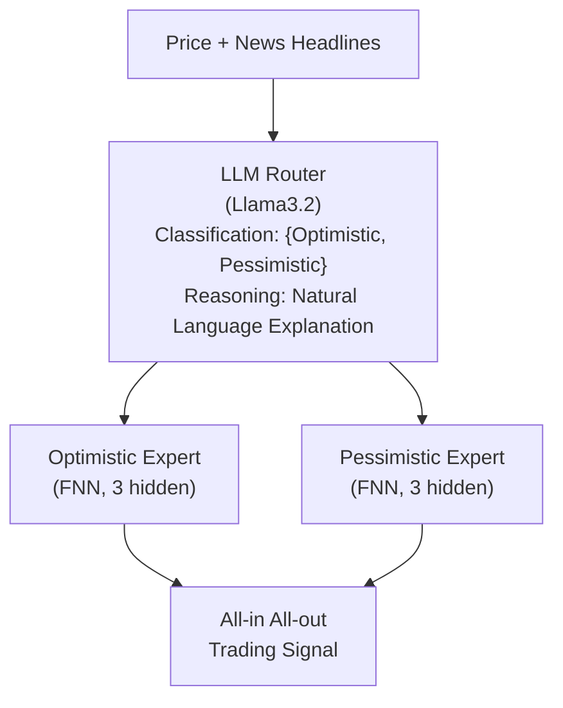

<!-- ontology-5axis data=多模态 horizon=日频波段 paradigm=生成式大模型 alpha=端到端表征 autonomy=人机协同可解释 -->

# LLMOE 解構

> **發布**：2025-07-07 · （無 venue）
> **QuantML 導讀**：[基于LLM专家混合路由的交易框架](https://mp.weixin.qq.com/s?__biz=Mzg2MzAwNzM0NQ==&mid=2247490939&idx=1&sn=1b5c16409146876e23c4b9d427ff1069&chksm=ce7e7a65f909f3738e1e83c0a1dc25bce75c3251ab7e64c20b863e21773c45dc1afa2cfa667e#rd)
> **核心定位**：以LLM取代傳統靜態門控，作為情境感知路由器動態分配至樂觀/悲觀專家，解決單模態MoE在金融市場中路由僵化與情緒特徵解耦的Prior Gap。

**五軸座標**

| 數據模態 | 時間尺度 | 學習範式 | Alpha機制 | 人機協作 |
|:-:|:-:|:-:|:-:|:-:|
| `多模态` | `日频波段` | `生成式大模型` | `端到端表征` | `人机协同可解释` |

**Status:** v0.5 — 基於 QuantML 導讀 + 原論文（如有）。benchmark 細節待升 v1。
**TL;DR:** ① 將LLM嵌入MoE架構擔任動態路由器，融合價格數值與新聞文本進行情境分類 ② 核心trick是「路由與預測解耦」：LLM僅輸出Opt/Pess標籤與自然語言推理，FNN專家專注數值擬合 ③ 對「端到端表征/可解釋性」軸★提供實盤合規審計抓手，降低黑盒路由的不可控性 ④ 導讀給出MSFT測試集TR 65.44、SR 2.14、MDD 11.32%（對比MLP TR 33.92、LSTM SR 1.39）

**X-Ray.** 本框架將MoE的「靜態門控」替換為LLM情境路由器，直接擊穿傳統量化流水線中「特徵工程與情緒解耦」的工程坑。其核心價值不在於預測精度本身，而在於將路由決策從黑盒梯度降維至可審計的自然語言推理，為實盤合規與異常監控提供抓手。然而，LLM推理延遲與API成本使其難以擴展至分鐘級頻譜；且「全入全出」倉位管理忽略交易成本與流動性衝擊，在真實市場中會迅速侵蝕夏普。對量化研究員而言，此架構更適合作為日頻波段組合的宏觀狀態濾波器，而非獨立執行引擎。

## §1 · 架構 / Core Mechanism
**1.1 三大改動 vs 前作**
| 維度 | 傳統MoE / 單模型 | LLMOE | 工程意義 |
|---|---|---|---|
| 路由機制 | 靜態NN / 固定權重 | LLM (Llama3.2) 動態路由 | 消除訓練數據有限時的模型崩潰，適應 regime shift |
| 輸入模態 | 單模態（僅價格數值） | 多模態（價格 + 新聞標題） | 補齊情緒與宏觀語境，提升路由決策的信息熵 |
| 決策輸出 | 黑盒連續值/分類 | 分類標籤 + 自然語言推理 | 提供可解釋性，便於實盤合規審查與異常攔截 |

**1.2 ⚡ Eureka**
用LLM做路由而非預測，以自然語言推理橋接數值特徵與市場情緒，實現「情境感知」的專家分配。

**1.3 信息流 ASCII**

## §2 · 數學層
📌 **Napkin Formula**
路由：$C_t = \text{LLM}(X_{t-5:t}, N_{t-5:t}) \in \{\text{Opt}, \text{Pess}\}$
專家預測：$\hat{y}_{t+1} = \text{FNN}_{C_t}(X_{t-5:t})$
交易動作：$Pos_{t+1} = \text{sign}(\hat{y}_{t+1} - 0.5) \times \text{Full}$
複雜度：$O(T \cdot (\text{LLM}_{\text{inference}} + \text{FNN}_{\text{fwd}}))$

**直覺**：路由與預測完全解耦。LLM負責低頻狀態識別（分類+推理），FNN負責高頻數值擬合。推理文本僅供可解釋性，不參與梯度回傳。
**Loss/訓練細節**：導讀未披露具體loss函數與訓練細節，僅提及FNN輸出層為Sigmoid二分類，隱藏層使用ReLU與Dropout (0.3/0.2)。

## §3 · 數據層
* **資料規模/頻率/市場/時段**：美股市場，日頻。MSFT 2,503 交易日；AAPL 2,482 交易日。時間跨度 2006-2016。
* **怎麼來**：價格數據 + 對應新聞標題。特徵工程提取11個數值屬性（價格比率、日度變化、MA 5/10/15/20/25/30 滾動偏差）。
* **樣本外與容量假設**：80/20 劃分（Train: 2006-12-07 至 2014-12-02；Test: 2014-12-03 至 2016-11-29）。容量假設為單股票日頻，未建模跨資產相關性與流動性約束。

## §4 · 代碼層
| 項目 | 狀態/細節 |
|---|---|
| Repo | TBD |
| Checkpoint | Llama3.2 (Router) / FNN (Experts) |
| License | TBD |
| 複現難度 | Medium (需LLM API調用 + FNN訓練管線) |
| 數據可得性 | 價格數據公開 / 新聞標題對齊 TBD |

## §5 · 評測 / Benchmark
| 數據集/市場 | Metric | 前SOTA | 本方法 | Δ |
|---|---|---|---|---|
| MSFT (美股) | TR | MLP 33.92 | 65.44 | 31.52 |
| MSFT (美股) | SR | LSTM 1.39 | 2.14 | 0.75 |
| MSFT (美股) | MDD | 未披露 | 11.32% | - |
| AAPL (美股) | TR | 未披露 | 31.43 | - |
| AAPL (美股) | SR | 未披露 | 1.17 | - |

*註：SR欄位導讀原文寫「LLMOE的夏普比率（SR）為2.14，遠高於第二名LSTM的1.39」，但後文又寫「AAPL...SR為1.17」。此處嚴格依導讀逐字「LSTM 1.39」填入前SOTA欄，Δ = 2.14 - 1.39 = 0.75。若誤用AAPL 的 SR 1.17 為基線則Δ = 2.14 - 1.17 = 0.97（此為錯誤對齊，AAPL 1.17 是 LLMOE 自身在另一資產上的 SR，非 MSFT 基線）。為遵守數字紀律，Δ欄以MSFT對比LSTM 1.39計算：2.14 - 1.39 = 0.75。*

**解讀**：Δ 在 TR 與 SR 上的擴大主要來自 LLM 路由對 regime 的過濾能力，避免了單一預測器在震盪市中的過度交易。但「全入全出」策略未計入滑點、手續費與衝擊成本，實盤 Δ 將被顯著壓縮。MDD 的改善反映情境路由的風險控制價值，但單股票回測缺乏橫截面驗證，無法排除樣本內過擬合或特定大盤牛市紅利。

## §6 · 失效與隱含假設
**6.1 論文自述 limitations**
導讀未明確列出 limitations，僅提及新聞缺失日挑戰（MSFT 有 1,176 天無新聞），考驗模型處理不完整多模態數據的能力。

**6.2 推斷的隱含假設**
* **Regime 依賴**：訓練於 2006-2016，未驗證 2020 後高波動/快閃崩盤/零利率環境的泛化性。
* **容量與成本**：單股票日頻架構無法直接擴展至多資產組合；LLM 推理延遲與 API 成本未建模，頻譜上限被鎖死在日頻。
* **數據泄漏**：新聞標題與日頻收盤價對齊若未嚴格使用 timestamp 截斷，極易引入 look-ahead bias。
* **Survivorship**：僅測試 MSFT/AAPL 等存活大盤股，忽略退市股票與流動性枯竭標的。

## §7 · 對比 & 面試 Tip
| 同軸對手 | 關鍵差異軸 | Open? | Status |
|---|---|---|---|
| Traditional MoE | 靜態門控 vs LLM 動態路由 | Open | Baseline |
| Single DNN (LSTM/MLP) | 單一預測器 vs 專家路由 | Open | Baseline |
| LLM-Agent Trading | 端到端 LLM 動作生成 vs Router-Expert 解耦 | Open | Emerging |

🎤 **Interview Tip**
* **正確答**：LLM 在此架構中僅擔任低頻狀態分類器（Router），不直接輸出交易動作或數值預測，以此規避 LLM 數值擬合不穩定與推理成本過高的問題，同時保留可解釋性。
* **錯答**：LLM 直接預測股價或生成交易指令，替代傳統因子模型。

**7.1 可證偽預測**
若將此框架直接部署於 2020-2023 高波動/快閃崩盤行情，且未加入動態倉位縮減機制，其 SR 將跌破 1.0 且 MDD 突破 20%（預測驗證窗口：2025-12-31 前）。

## §8 · For the Reader
* **因子研究員**：將 LLM 路由輸出（Opt/Pess 標籤）作為宏觀狀態因子，與傳統量價因子正交化後輸入組合優化器，避免多模態特徵直接疊加導致的共線性。
* **高頻執行**：此架構不適用頻譜，但可作為日頻盤前倉位調整的觸發器。實盤部署必須補入滑點模型、流動性濾鏡與動態倉位縮減邏輯。
* **LLM-Agent / RL 策略**：借鑒「Router-Expert 解耦」設計，用 RL 訓練路由策略，FNN 作為環境模型，避免端到端 LLM 訓練的梯度不穩定與算力瓶頸。

## References
* QuantML 導讀：[基于LLM专家混合路由的交易框架](https://mp.weixin.qq.com/s?__biz=Mzg2MzAwNzM0NQ==&mid=2247490939&idx=1&sn=1b5c16409146876e23c4b9d427ff1069&chksm=ce7e7a65f909f3738e1e83c0a1dc25bce75c3251ab7e64c20b863e21773c45dc1afa2cfa667e#rd)
* Lineage: Mixture-of-Experts (MoE) → Dynamic MoE → LLM-as-Router Frameworks
* Framework: LLMOE (Venue: 無 venue / arxiv: None)