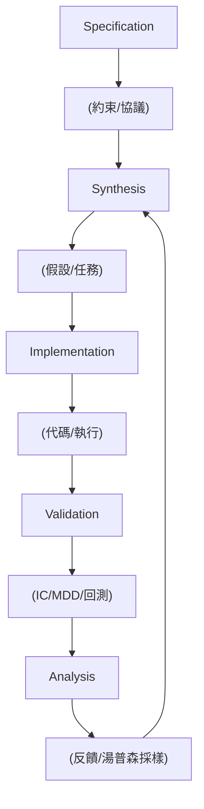

<!-- ontology-5axis data=量价表格 horizon=日频波段 paradigm=生成式大模型 alpha=因子挖掘 autonomy=Agent自主演进 -->

# RD-Agent(Q) 解構

> **發布**：2025-05-22 · （無 venue）
> **QuantML 導讀**：[R&D-Agent-Quant](https://mp.weixin.qq.com/s?__biz=Mzg2MzAwNzM0NQ==&mid=2247490469&idx=1&sn=e4748ff2c1902ab9573e7e9a1addef57&chksm=ce7e7cbbf909f5ad3328d28c271cfed2f1c37fc58a8e4549f2b50085f364a566876bfcbca35f#rd)
> **核心定位**：五軸落點於「生成式大模型 × Agent自主演进 × 因子挖掘」，解了量化研發中「因子與模型優化碎片化」及「LLM 生成信號缺乏因子邏輯基礎」的 prior gap。

**五軸座標**

| 數據模態 | 時間尺度 | 學習範式 | Alpha機制 | 人機協作 |
|:-:|:-:|:-:|:-:|:-:|
| `量价表格` | `日频波段` | `生成式大模型` | `因子挖掘` | `Agent自主演进` |

**Status:** v0.5 — 基於 QuantML 導讀 + 原論文（如有）。benchmark 細節待升 v1。
**TL;DR:** ① 提出基於 LLM 的多智能體框架，將量化研發拆解為五模塊閉環，實現因子與模型的協同自動化迭代。② 核心 trick 為 Co-STEER 代碼生成智能體（DAG 依賴調度 + 知識庫檢索）與上下文湯普森採樣調度器（動態分配因子/模型優化權重）。③ 對「Agent自主演进」軸★，它將離散的代碼生成升級為帶反饋閉環的結構化搜索，避免 LLM 直接輸出交易信號的幻覺。④ 導讀給出聯合優化配置下 IC 0.0532、ARR 14.21%、IR 1.74，但未提供基線精確數值對照。

**X-Ray.** RD-Agent(Q) 的本質不是「用 LLM 寫因子」，而是把量化 pipeline 重構為可插拔的 Agent 工作流。它用 Specification 鎖定約束、Synthesis 做假設空間修剪、Implementation 用 Co-STEER 處理 DAG 依賴與代碼容錯、Validation 用 IC(max) ≥ 0.99 做信號去重、Analysis 用上下文湯普森採樣做資源分配。這套設計直接擊中傳統自動化因子挖掘的兩個工程坑：一是代碼生成缺乏依賴圖管理導致執行崩潰，二是因子與模型優化割裂導致局部最優。然而，其 envelope 明顯受限於 CSI 300 的日頻回測環境與靜態知識庫檢索；上下文湯普森採樣僅依賴 8 維狀態向量，缺乏對交易成本滑點與流動性衝擊的顯式建模。對量化讀者而言，該框架的價值不在於直接產出可實盤的 alpha，而在於提供一套可協議化的「假設-驗證-反饋」自動化骨架，可作為因子庫維護或模型架構搜索的輔助引擎，但實戰部署前必須補齊成本約束與 regime 切換的硬閾值。

## §1 · 架構 / Core Mechanism
**1.1 三大改動 vs 前作**
| 維度 | 傳統 RD-Agent | RD-Agent(Q) | 改動意圖 |
|---|---|---|---|
| 任務分解 | 通用代碼生成 | 五模塊閉環（Spec/Syn/Impl/Val/Ana） | 適配量化因子-模型協同鏈 |
| 代碼執行 | 單次生成 | Co-STEER + DAG 拓撲排序 + 知識庫檢索 | 解決結構依賴與重複失敗 |
| 資源調度 | 靜態/手動 | 上下文湯普森採樣（8維狀態向量） | 動態平衡因子細化 vs 模型優化 |

**1.2 ⚡ Eureka 一句話 trick + 直覺**
Trick：用 IC(max) ≥ 0.99 做信號去重，並用上下文湯普森採樣將「下一步優化因子還是模型」轉化為兩臂強盜問題。
直覺：不讓 LLM 盲目試錯，而是用統計閾值過濾冗餘信號，再用貝葉斯線性模型根據當前策略狀態動態分配算力，類似量化中的「風險預算分配」。

**1.3 信息流 ASCII 圖**

## §2 · 數學層
📌 **Napkin Formula:**
冗余過濾: `IC(max)(n) = max_m mean_t(IC(m,n,t))`; 若 `IC(max)(n) ≥ 0.99` 則剔除。
調度器: `w^T x_t` (線性獎勵函數), 貝葉斯後驗採樣選臂 `a_t = argmax_a E[r|a, context]`。
複雜度: 代碼生成與 DAG 排序為 `O(V+E)`；湯普森採樣每輪更新高斯後驗為 `O(d^2)`（d=8）。
直覺: 去重閾值確保新因子與現有 SOTA 庫正交；湯普森採樣用線性加權將多維回測指標壓縮為單臂決策，犧牲非線性交互換取穩定收斂。
Loss/訓練: 無端到端梯度下降；依賴回測指標反饋與代碼執行成功率的強化學習式迭代。

## §3 · 數據層
資料規模/頻率/市場/時段: CSI 300（300 只大盤 A 股）；日頻；訓練期 2008-01-01 至 2014-12-31，驗證期 2015-01-01 至 2016-12-31，測試期 2017-01-01 至 2020-08-01。
怎麼來: 標準量價表格接口。
樣本外與容量假設: 嚴格時間劃分樣本外；容量假設未披露，隱含依賴大盤股流動性。

## §4 · 代碼層
| 維度 | 詳情 |
|---|---|
| Repo | TBD |
| Checkpoint | TBD |
| License | 研究用途（含免責聲明） |
| 複現難度 | 高（依賴 LLM API 調度與自定義回測接口） |
| 數據可得性 | CSI 300 日頻量價（標準） |

## §5 · 評測 / Benchmark
| 數據集/市場 | Metric | 前SOTA | 本方法 | Δ |
|---|---|---|---|---|
| CSI 300 (2017-2020) | IC | 未披露 | 0.0532 | 未披露 |
| CSI 300 (2017-2020) | ARR | 未披露 | 14.21% | 未披露 |
| CSI 300 (2017-2020) | IR | 未披露 | 1.74 | 未披露 |
| CSI 300 (2017-2020) | Rank IC | 未披露 | 0.0546 | 未披露 |
| CSI 300 (2017-2020) | MDD | 未披露 | -6.94% | 未披露 |

解讀: 導讀僅給出 RD-Agent(Q) 各配置的絕對指標，未提供基線精確數值，故 Δ 欄留白。IC 0.0532 與 IR 1.74 顯示信號質量與風險調整收益達標，但 MDD -6.94% 未扣除實盤滑點與衝擊成本；ARR 14.21% 在日頻多空策略中屬合理區間，但缺乏交易頻率與持倉週期細節，部分 Δ 可能來自回測環境的假設優勢（如未計入流動性摩擦）。

## §6 · 失效與隱含假設
**6.1 論文自述 limitations:** 僅依賴 LLM 內部金融知識；缺乏數據多樣性與領域先驗；未實現對不斷變化市場環境的線上適應。
**6.2 推斷的隱含假設:** Regime 依賴強（測試期止於 2020-08，未覆蓋後疫情波動與風格切換）；容量假設隱含於 CSI 300 大盤股流動性，未驗證中小盤擴展性；成本假設僅提及「現實交易成本」但未給出 breakeven 閾值；數據泄漏風險低（嚴格時間劃分），但知識庫檢索可能引入前瞻偏差（若檢索窗口未嚴格截斷）。

## §7 · 對比 & 面試 Tip
| 同軸對手 | 關鍵差異軸 | Open? | Status |
|---|---|---|---|
| GPT-Quant / FinGPT | 直接生成交易信號 vs 因子-模型協同閉環 | 開源/閉源 TBD | 實驗階段 |
| 傳統因子挖掘 (Alpha 158/360) | 靜態手工/遺傳 vs 動態假設森林 + 湯普森調度 | 開源 | 工業界標準 |
🎤 **Interview Tip** 
正確答: 「該框架的核心價值在於將量化研發協議化，用 IC 去重閾值與上下文強盜調度器替代人工經驗分配，適合因子庫自動化維護與模型架構搜索，但實盤需補齊成本約束與 regime 切換機制。」
錯答: 「它用 LLM 直接預測股價，比 Transformer 更準。」（混淆信號生成與因子協同優化，且忽略回測環境限制）
**7.1 可證偽預測帶日期:** 若 2025-12-31 前未公開支持多市場滾動窗口與實盤成本建模的 v1.0 版本，則其「自動化研發」定位將僅限於學術基準測試。

## §8 · For the Reader
- **因子研究員:** 將 Co-STEER 的 DAG 依賴管理與 IC(max) 去重邏輯移植至內部因子平台，可自動化過濾冗餘信號並生成可追溯代碼。
- **高頻執行:** 該框架為日頻波段設計，未處理訂單簿微結構與滑點；若需擴展至高頻，需替換 Validation 單元的回測引擎與成本模型。
- **組合配置/LLM-agent:** 上下文湯普森採樣器可作為多策略資源分配的參考原型，但需將 8 維狀態向量替換為實時風險預算與流動性指標。
- **研究學生:** 重點複現 Synthesis 到 Implementation 的假設實例化流程，理解如何將自然語言假設轉化為可執行代碼並通過反饋閉環迭代。

## References
- 原論文: RD-Agent for Quantitative Finance (RD-Agent(Q))
- Lineage: RD-Agent (Microsoft) → 自動化研發框架 → 量化適配版
- QuantML 導讀鏈接: [R&D-Agent-Quant](https://mp.weixin.qq.com/s?__biz=Mzg2MzAwNzM0NQ==&mid=2247490469&idx=1&sn=e4748ff2c1902ab9573e7e9a1addef57&chksm=ce7e7cbbf909f5ad3328d28c271cfed2f1c37fc58a8e4549f2b50085f364a566876bfcbca35f#rd)