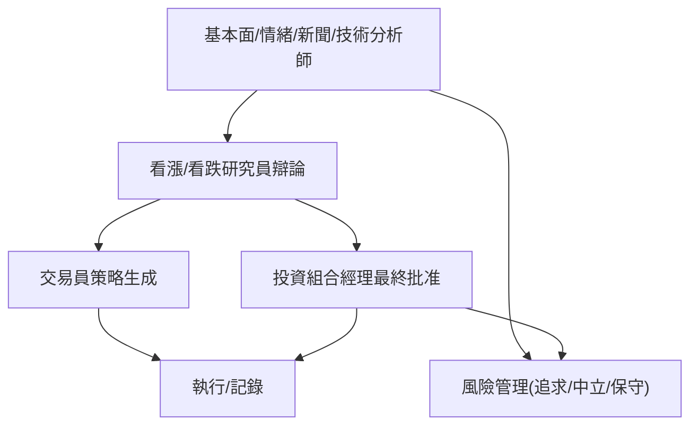

<!-- ontology-5axis data=文本另类 horizon=日频波段 paradigm=生成式大模型 alpha=多智能体博弈 autonomy=人机协同可解释 -->

# TradingAgents 解構

> **發布**：2025-06-08 · （無 venue） · arXiv [2412.20138](https://arxiv.org/abs/2412.20138)
> **QuantML 導讀**：[QuantML社群最新重磅开源 | TradingAgents：多智能体交易框架](https://mp.weixin.qq.com/s?__biz=Mzg2MzAwNzM0NQ==&mid=2247490650&idx=1&sn=4d2dfa1b6c9139a38c84122c715fd015&chksm=ce7e7b44f909f25207a85309bbb0066d6d6590a6cdfce20284bb352cba463e638a4985be7274#rd)
> **原始論文**：[Reproducibility in the TradingAgents Framework](https://arxiv.org/abs/2412.20138)（Proceedings of the 2026 International Conference on Artificial Intelligence and Fintech · 2026 · 被引 0 · Crossref）
> **核心定位**：落點於「多智能體博弈 × 生成式大模型」軸，解決傳統 LLM 單點決策缺乏制衡與可解釋性的工程坑，將投行前中後台職能映射為 LangGraph 狀態機。

**五軸座標**

| 數據模態 | 時間尺度 | 學習範式 | Alpha機制 | 人機協作 |
|:-:|:-:|:-:|:-:|:-:|
| `文本另类` | `日频波段` | `生成式大模型` | `多智能体博弈` | `人机协同可解释` |

**Status:** v0.5 — 基於 QuantML 導讀 + 原論文（如有）。benchmark 細節待升 v1。
**TL;DR:** ① 將交易決策拆解為分析-研究-執行-風控的專業化 LLM 智能體團隊。② 核心 trick 是引入看漲/看跌結構化辯論機制與三層風險管理哲學，透過 LangGraph 編排五階段順序流水線。③ 這對「多智能體博弈」軸★的關鍵在於用對抗性對話替代單向 prompt，強制模型輸出權衡過程。④ 導讀給出 AAPL 實證年化回報 30.5%（買入持有基準 -5.09%），最大回撤低於 3%。

**X-Ray.** 本框架將 Alpha 生成從「單模型預測」推向「多智能體協同決策」，本質是將傳統量化中的因子合成與組合優化步驟，替換為 LLM 的 prompt chain 與 debate loop。對量化研究員而言，其價值不在於直接產出高頻訊號，而在於提供一套可插拔的「邏輯鏈路可視化」模板。它解了 LLM 金融應用常見的幻覺與黑箱坑，但代價是延遲與 token 成本呈線性膨脹。預測其打不開的 envelope 在於：辯論機制依賴預設的看漲/看跌角色，缺乏對 regime shift 的動態權重調整；且五階段順序流水線無法處理並行事件驅動（如新聞閃崩）。對實盤而言，此架構更適合作為中低頻波段策略的「決策輔助與合規審計層」，而非直接下單引擎。

## §1 · 架構 / Core Mechanism
**1.1 三大改動 vs 前作**
| 維度 | 傳統單智能體 LLM 交易 | TradingAgents |
|---|---|---|
| 決策結構 | 單向 Prompt → 單一輸出 | 分析師→研究員→交易員→風控→PM 五階段順序流水線 |
| 風險控制 | 內嵌於系統提示詞 | 獨立的三層風險管理哲學智能體（風險追求/中立/保守） |
| 可解釋性 | 黑箱或簡短理由 | 結構化辯論記錄 + 每筆決策的支援理由鏈 |

**1.2 ⚡ Eureka** 用「看漲 vs 看跌」的對抗性 debate loop 強制 LLM 輸出權衡過程，將單點預測轉化為可審計的邏輯鏈。

**1.3 信息流 ASCII**

## §2 · 數學層
📌 **Napkin Formula:** 無顯式數學公式。核心為狀態機轉移與 prompt chain 優化。複雜度：`O(N_turns × LLM_inference_cost)`。
**直覺:** 決策非基於梯度下降，而是基於 LangGraph 的狀態節點路由與多智能體對話的條件概率分佈。
**Loss/訓練細節:** 導讀未披露微調損失函數或訓練細節，框架側重於推理階段的 prompt 編排與工具調用（Toolkit）。

## §3 · 數據層
- **資料規模/頻率/市場/時段:** 導讀未披露具體樣本量、回測區間與數據頻率，僅提及整合基本面、技術指標、新聞與社媒情緒。
- **怎麼來:** 透過統一 Toolkit 數據訪問層整合多源數據。
- **樣本外與容量假設:** 未披露。框架標註為研究目的設計，未說明實盤容量限制。

## §4 · 代碼層
| 項目 | 狀態 |
|---|---|
| Repo | https://github.com/TauricResearch/TradingAgents |
| Checkpoint | 未披露 |
| License | 未披露 |
| 複現難度 | 中低（依賴 LangGraph 與現成 LLM API，需自行配置數據源） |
| 數據可得性 | 依賴外部 Toolkit 接入，框架本身不內建數據 |

## §5 · 評測 / Benchmark
| 數據集/市場 | Metric | 前SOTA | 本方法 | Δ |
|---|---|---|---|---|
| AAPL | 年化回報率 | 買入持有基準 -5.09% | 30.5% | 35.59 |
| AAPL | 最大回撤 | 未披露 | 低於 3% | 未披露 |

**解讀:** Δ 35.59 來自單一標的（AAPL）的特定區間，非跨市場統計顯著性檢驗。最大回撤「低於 3%」缺乏基準對照與計算頻率說明。此 Δ 反映的是 LLM 在該標的特定時段的情緒/新聞捕捉能力，極可能包含前瞻偏差（新聞/社媒數據在回測中的時間戳對齊問題）與未計入的 token/數據成本。辯論機制可能放大了過擬合風險，因對抗性 prompt 易在歷史數據上找到事後合理的敘事。

## §6 · 失效與隱含假設
**6.1 論文自述 limitations:** 導讀僅註明「專為研究目的設計，不構成投資建議」，未列具體技術限制。
**6.2 推斷的隱含假設:** 
① Regime 依賴：辯論機制假設市場存在可被文本捕捉的趨勢或分歧，在無趨勢震盪市可能產生無效交易訊號。
② 成本/延遲：五階段順序流水線與多輪 LLM 推理導致高延遲與高成本，不適用低延遲場景。
③ 數據泄漏：新聞/社媒情緒數據的爬取時間與市場開盤時間對齊若未嚴格控制，易產生前瞻偏差。
④ 容量：LLM 上下文窗口與 API 限流限制策略並行處理的資產數量。

## §7 · 對比 & 面試 Tip
| 同軸對手 | 關鍵差異軸 | Open? | Status |
|---|---|---|---|
| 傳統單智能體 LLM 交易框架 | 決策結構（單向 vs 多角色辯論流水線） | 視具體項目 | v0.5 |
| 規則型多因子組合優化 | 邏輯生成（統計合成 vs 生成式敘事權衡） | 常見 | 成熟 |

🎤 **Interview Tip** 
- **正確答:** 強調該框架將「因子合成」替換為「多智能體對話狀態機」，核心價值在於決策鏈路可審計與風險哲學可配置，而非直接提供高頻 Alpha。實盤需嚴格處理數據時間戳對齊與 token 成本預算。
- **錯答:** 認為這是能自動下單的「AI 量化基金」，忽略其順序流水線延遲、未披露回測細節與高昂的推理成本，誤將研究原型當成熟交易系統。

**7.1 可證偽預測帶日期:** 若該框架在未來 12 個月內未公開跨市場（如 SPY/QQQ）的 Sharpe/IR 統計與嚴格的時間序列交叉驗證結果，則其「多智能體博弈」優勢僅限於單一標的的敘事過擬合。

## §8 · For the Reader
- **因子研究員:** 將辯論機制視為「非線性因子合成器」，提取 LLM 輸出的情緒/新聞權重作為輔助因子，而非直接跟單。
- **高頻執行:** 此架構延遲過高，不適用。可借鑑其「風控哲學模塊」思想，將其邏輯轉譯為低延遲規則引擎的並行檢查節點。
- **組合配置:** 利用三層風險管理智能體（追求/中立/保守）作為組合權重調整的觸發條件，實現動態風險預算分配。
- **LLM-agent/RL 策略:** LangGraph 的狀態節點設計是學習多智能體協同的優秀範本，可嘗試用 RLHF 微調辯論智能體的輸出分佈。
- **研究學生:** 重點觀察 prompt chain 如何映射傳統量化流程（分析→研究→執行→風控），理解可解釋性與自動化之間的權衡。

## References
- TradingAgents: https://arxiv.org/abs/2412.20138
- Framework: https://github.com/TauricResearch/TradingAgents
- QuantML 導讀：https://mp.weixin.qq.com/s?__biz=Mzg2MzAwNzM0NQ==&mid=2247490650&idx=1&sn=4d2dfa1b6c9139a38c84122c715fd015&chksm=ce7e7b44f909f25207a85309bbb0066d6d6590a6cdfce20284bb352cba463e638a4985be7274#rd