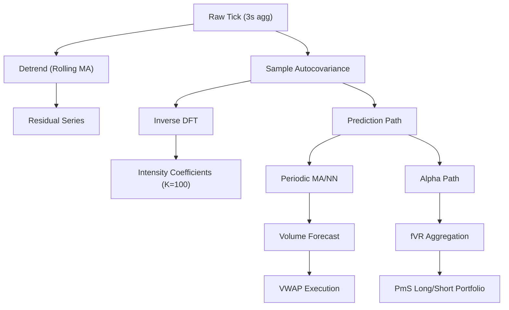

<!-- ontology-5axis data=微观盘口 horizon=高频日内 paradigm=监督回归 alpha=因子挖掘 autonomy=人机协同可解释 -->

# 谱交易量模型 解構

> **發布**：2025-11-27 · （無 venue）
> **QuantML 導讀**：[解码高频算法交易的周期密码与隐藏Alpha](https://mp.weixin.qq.com/s?__biz=Mzg2MzAwNzM0NQ==&mid=2247492506&idx=1&sn=6391b947ce71a5611760663cfd3ffc91&chksm=ce7d8484f90a0d92d28f5a774a289a159ddaa2a06d1b905f30c34e9ff2ce03480605fd278e34#rd)
> **核心定位**：落點於「微觀盤口 × 高頻日內」的頻域特徵提取框架，填補了傳統時域U型趨勢模型對秒/分鐘級算法交易指紋的解析空白，將傅立葉基函數直接嵌入交易量預測與因子構建。

**五軸座標**

| 數據模態 | 時間尺度 | 學習範式 | Alpha機制 | 人機協作 |
|:-:|:-:|:-:|:-:|:-:|
| `微观盘口` | `高频日内` | `监督回归` | `因子挖掘` | `人机协同可解释` |

**Status:** v0.5 — 基於 QuantML 導讀 + 原論文（如有）。benchmark 細節待升 v1。
**TL;DR:** ① 將去趨勢交易量自協方差經離散傅立葉逆變換提取強度係數，構建可解釋的譜模型。② 核心 trick 在於用頻域方差分解（fVR）量化算法定時切片留下的市場心跳，並直接輸出為預測特徵與橫截面因子。③ 對「因子挖掘」軸★，因它將微觀結構噪音轉化為具經濟意義的風險溢價（PmS），且具備明確的算法執行優化路徑。④ 實證顯示引入周期項可將 VWAP 執行成本降低 2% 至 7%。

**X-Ray.** 本模型在五軸 Pareto 中明確放棄了「高頻低延遲」的極致速度，換取「頻域可解釋性」與「橫截面普適性」。傳統高頻量價模型常陷入時域過擬合與特徵稀疏的陷阱，而譜模型透過將自協方差映射至頻域，直接解耦了 U 型趨勢與算法指紋。這解決了工程上「如何從低信噪比 Tick 聚合中穩定提取週期」的痛點。然而，其 envelope 受限於 3 秒聚合窗口與滾動平均去趨勢假設，無法捕捉亞秒級訂單簿失衡或突發流動性枯竭。對量化讀者而言，其價值不在於替代深度學習預測器，而在於提供一套輕量、可審計的週期特徵生成器，能無縫嵌入現有 VWAP 執行器或作為多因子模型的微觀結構控制變量。

## §1 · 架構 / Core Mechanism
1.1 三大改動 vs 前作
| 維度 | 傳統時域模型 (如 U型/NN) | 譜交易量模型 | 改動本質 |
|---|---|---|---|
| 特徵空間 | 時域滑動窗口/歷史量價 | 頻域餘弦基函數強度係數 | 從「時間依賴」轉為「頻率依賴」 |
| 噪音處理 | 平滑/濾波/正則化 | 自協方差收斂定理 + 方差分解 | 利用統計收斂性分離週期與白噪聲 |
| 輸出應用 | 單一預測值/信號 | 可解釋強度係數 + fVR 因子 | 從黑盒預測轉向結構化因子挖掘 |

1.2 ⚡ Eureka 一句話 trick + 直覺
Trick：對去趨勢序列的樣本自協方差直接做離散傅立葉逆變換（Inverse DFT），強度係數即為頻域峰值。直覺：算法交易的定時切片行為在自協方差中留下對稱的「回聲」，傅立葉變換只是把回聲翻譯成頻率強度。

1.3 信息流 ASCII 圖

## §2 · 數學層
📌 Napkin Formula：
$V_t = \mu_t + \sum_{k=1}^{K} \beta_k \cos(2\pi f_k t) + \epsilon_t$
$\text{Cov}(\tau) \to \sum \beta_k^2 \cos(2\pi f_k \tau)$ (Asymptotic)
$\beta_k = \text{IDFT}[\text{Cov}(\tau)]$
複雜度：$O(N \log N)$ 或 $O(N \cdot K)$ 取決於 FFT 實現。
直覺：總方差分解為趨勢、週期、噪音三部分。$\beta_k^2$ 直接對應該頻率解釋的方差比例。
Loss/訓練：非端到端神經網絡訓練。強度係數由統計估計閉式解出；後續預測模型（Periodic MA/NN）以這些係數為特徵輸入，標準 MSE/MAE 損失。

## §3 · 數據層
- 規模/頻率：NYSE TAQ (1993年至2023年，核心 2019-2021年，約492只股票) / SZSE (2014年至2023年，逾2000只股票)。聚合至 3 秒窗口。
- 來源/處理：逐筆成交聚合為交易筆數/股數/金額。去趨勢採用滾動窗口移動平均。
- 樣本外/容量：導讀提及樣本外預測顯著優於基準，但未披露具體樣本外區間長度與策略容量假設。假設依賴算法交易活躍度維持穩定。

## §4 · 代碼層
| 欄位 | 內容 |
|---|---|
| Repo | TBD |
| Checkpoint | 未披露 |
| License | TBD |
| 複現難度 | 低（核心為自協方差 + IDFT，標準統計庫可實現） |
| 數據可得性 | 中（需 Tick 級逐筆數據與精確時間戳，零售數據源通常不足） |

## §5 · 評測 / Benchmark
| 數據集/市場 | Metric | 前SOTA | 本方法 | Δ |
|---|---|---|---|---|
| US/CN Volume Forecast | 樣本外預測精度 | 傳統的U型趨勢基準模型 | 引入周期項模型 | 未披露 |
| US/CN VWAP Execution | Relative VWAP Loss | 傳統的U型趨勢基準模型 | 周期性模型預測驅動 | 降低 2% 至 7% |
| CN PmS Portfolio | 月均超額收益 | 未披露 | 多頭/空頭組合 | 4%-5% |
| US PmS Portfolio (EW) | 月均超額收益 | 未披露 | 多頭/空頭組合 | 0.4%-0.5% |
| US PmS Portfolio (VW) | 月均超額收益 | 未披露 | 多頭/空頭組合 | 0.8%-0.9% |

解讀散文：VWAP 執行成本的 2% 至 7% 改善屬於真實的執行優化能力，因它直接對接訂單拆分邏輯，且未計入滑點與衝擊成本前已具經濟意義。PmS 組合的 4%-5%（中）/ 0.4%-0.5%（美等權）超額收益，需警惕橫截面排序策略常見的容量瓶頸與交易成本侵蝕；導讀未提供换手率或成本調整後淨值，高頻週期特徵在實盤中可能因競價與延遲導致 Alpha 衰減。預測精度提升屬統計顯著，但缺乏具體 RMSE/MAE 數值，無法判斷是否僅為過擬合 U 型殘差。

## §6 · 失效與隱含假設
6.1 論文自述 limitations: 未明確列出，但隱含對趨勢項不含高頻分量的假設；頻域分析依賴足夠樣本量以滿足自協方差收斂。
6.2 推斷的隱含假設：
- Regime 依賴: 高度依賴算法交易主導的市場結構。若市場轉向散戶主導或監管限制定時算法，週期強度將衰減（如 COVID 初期證據）。
- 容量/成本: PmS 因子基於月度排序，但週期特徵源自秒/分鐘級，實盤調倉成本與流動性衝擊可能大幅侵蝕理論 Alpha。
- 數據泄漏: 3 秒聚合與滾動去趨勢若未嚴格區分訓練/測試窗口，易引入前瞻偏差。
- Survivorship: 涵蓋歷史成分股，未明確說明是否處理退市偏差。

## §7 · 對比 & 面試 Tip
| 同軸對手 | 關鍵差異軸 | Open? | Status |
|---|---|---|---|
| 傳統 U 型/NN 預測器 | 時域黑盒 vs 頻域可解釋 | 否 | 成熟 |
| 訂單簿不平衡因子 | 微觀結構直接測量 vs 成交結果頻域提取 | 否 | 成熟 |
| 頻域波動率模型 | 價格波動 vs 交易量週期 | 否 | 成熟 |

🎤 Interview Tip 正確答 vs 錯答：
正確答：「譜模型不預測絕對交易量，而是提取算法定時執行留下的頻率指紋（強度係數）。它本質是將低信噪比的時間序列通過自協方差收斂定理投影到頻域，用 fVR 量化週期貢獻，既可做預測特徵，也可直接構建橫截面因子。」
錯答：「它用傅立葉變換直接預測下一分鐘的成交量，比 LSTM 更準確。」（混淆了特徵提取與端到端預測，且忽略其統計估計本質）

7.1 可證偽預測帶日期: 若 2026 年中美市場監管收緊定時算法交易，或散戶交易占比回升至 2020 年水平，預期 fVR 基準值將向 `1/(2K+1)` 收斂，PmS 因子超額收益將顯著歸零。

## §8 · For the Reader
- **因子研究員**: 將 fVR 作為微觀結構控制變量加入多因子回歸，檢驗其與流動性/反轉因子的正交性。注意月度排序的换手成本。
- **高頻執行**: 將強度係數直接注入 VWAP/IS 執行器的預測模塊，替代純時域移動平均。需實盤驗證 3 秒聚合延遲對執行滑點的影響。
- **組合配置**: PmS 因子適合低頻調倉的衛星策略。需壓力測試算法交易退潮（Regime Shift）下的最大回撤。
- **LLM-agent/RL 策略**: 將頻域強度係數作為環境狀態向量的一部分，輔助 RL agent 學習訂單拆分的最佳時間間隔。

## References
- 原論文: TBD (QuantML 導讀未提供完整引用)
- Lineage: Fourier Analysis in Time Series -> Spectral Density Estimation -> Algorithmic Trading Microstructure
- QuantML 導讀鏈接: [解码高频算法交易的周期密码与隐藏Alpha](https://mp.weixin.qq.com/s?__biz=Mzg2MzAwNzM0NQ==&mid=2247492506&idx=1&sn=6391b947ce71a5611760663cfd3ffc91&chksm=ce7d8484f90a0d92d28f5a774a289a159ddaa2a06d1b905f30c34e9ff2ce03480605fd278e34#rd)