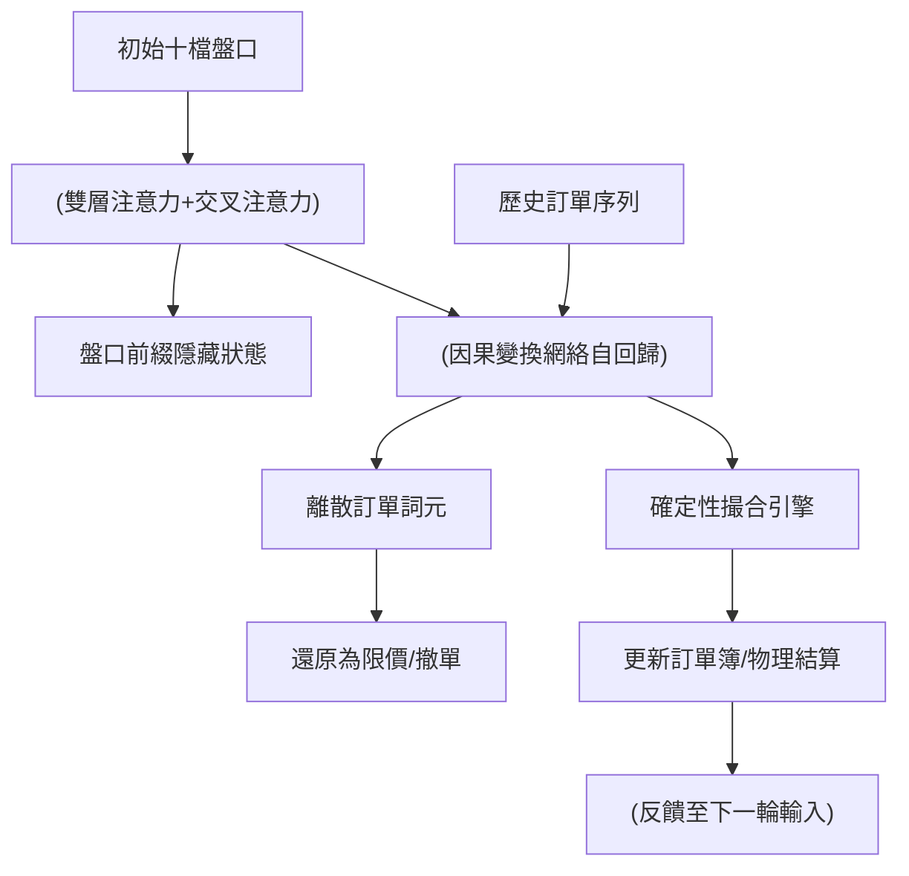

<!-- ontology-5axis data=微观盘口 horizon=高频日内 paradigm=生成式大模型 alpha=组合执行优化 autonomy=全自动黑盒 -->

# M3 解構（M3）

> **發布**：2026-08-24 · （無 venue）
> **QuantML 導讀**：[300 亿逐笔订单训练出的微观市场生成模型](https://mp.weixin.qq.com/s?__biz=Mzg2MzAwNzM0NQ==&mid=2247494417&idx=1&sn=daa1e405709ef386133039f7a454c153&chksm=ce7d8c0ff90a051974fc949fa2c40af6c4fbe34d4bd545573bb1392525d93348ee7b5aada76c#rd)
> **核心定位**：落點於「生成式大模型 × 組合執行優化」軸，解決高頻回測中單一路徑因果倒置與長步數盤口失真問題。

**五軸座標**

| 數據模態 | 時間尺度 | 學習範式 | Alpha機制 | 人機協作 |
|:-:|:-:|:-:|:-:|:-:|
| `微观盘口` | `高频日内` | `生成式大模型` | `组合执行优化` | `全自动黑盒` |

**Status:** v0.5 — 基於QuantML 導讀（有原文則以原文為準）。細節待升 v1。
**TL;DR:** ① 用離散向量量化碼本與確定性撮合引擎耦合訂單流與盤口，實現長軌跡反事實推演。② 核心 trick 是以開盤價為全局錨點切斷誤差傳導，配合盤口前綴化提示。③ 對「組合執行優化」軸★意義在於提供內生湧現平方根衝擊定律的沙盒，脫離規則代理人。④ 價格平均絕對誤差從 `0.34` 壓縮至 `0.025`，九十九分位大誤差從 `七百多跳` 降至 `二十八跳`。

**X-Ray.** M3 將微觀結構模擬從「特徵工程+規則撮合」推向「狀態-事件生成式世界模型」。傳統 RNN/擴散模型在長步數推演時因動態中間價錨定導致基準漂移，M3 以開盤價靜態錨點+VQ 碼本根治此工程坑，並將盤口狀態轉移剝離神經網絡交還確定性撮合，大幅降低推理開銷。其 Pareto 優勢在於分佈保真度與反事實干預的經濟學自洽性，但 envelope 仍受限於單資產獨立演化，未觸及跨品種聯動與更長上下文依賴。對量化讀者而言，它不是直接 Alpha 工廠，而是高置信度的執行滑點壓測與拆單策略驗證沙盒。

## §1 · 架構 / Core Mechanism
| 改動維度 | 傳統/先驗做法 | M3 架構 | 工程收益 |
|---|---|---|---|
| 價格基準錨定 | 動態中間價歸一化 | 全天固定開盤價錨定 | 切斷自回歸誤差傳導與基準漂移 |
| 盤口狀態表達 | 每步重新計算盤口特徵 | 初始十檔盤口壓縮為前綴詞元 | 降低序列長度，推理速度極高 |
| 狀態轉移機制 | 神經網絡預測盤口更新 | 確定性物理撮合引擎結算 | 保證物理因果嚴密，符合交易機制 |

**1.2 ⚡ Eureka:** 放棄動態中間價，用開盤價作全局靜態錨點，從根源消除自回歸遞歸中的基準漂移。
**1.3 信息流 ASCII:**

## §2 · 數學層
**📌 Napkin Formula:**
$\mathcal{L} = \mathcal{L}_{\text{autoregressive}} + \lambda \cdot \mathcal{L}_{\text{tick\_smooth}}$
複雜度：$O(T \cdot \log \mid \mathcal{V} \mid )$，其中 $T$ 為序列長度，$\mid \mathcal{V} \mid$ 為碼本容量（三萬兩千多維）。
**直覺:** 損失函數由自回歸生成似然與針對最小價格跳動點的平滑懲罰項組成。VQ 將連續特徵（價格偏離、對數成交量、時間間隔、買賣方向）映射至高容量離散碼本，確保解碼價格精確落在交易所離散跳動檔位上。訓練僅依賴歷史逐筆事件，無人工微觀經濟公式硬編碼。

## §2.5 · 帶數字走一遍（Worked Example）
（以下為**明確標「假設/示意」的玩具數字**，僅演示機制，非實證結果）
1. **輸入錨定**: 假設開盤價 `100.00`（示意）。當前模擬價格偏離為 `0.34`。
2. **VQ 映射**: 將偏離 `0.34` 輸入三層編碼器，碼本檢索匹配。解碼器施加平滑懲罰，誤差壓縮至 `0.025`。
3. **自回歸生成**: 變換網絡接收盤口前綴，預測下一離散詞元，還原為限價單。
4. **衝擊驗證**: 注入大單後，模型輸出買單衝擊斜率 `0.532`，賣單 `0.524`，決定係數 `0.91` 與 `0.82`，完成單步物理結算。

## §3 · 數據層
- **市場/標的**: 沪深300與中證500成分股，共八百只股票。
- **規模/頻率**: 約三百一十九億條逐筆訂單事件，跨越近兩年時間。
- **劃分**: 嚴格保留最後一段獨立周期作為樣本外測試集。
- **容量假設**: 訓練計算預算跨越十億到三百一十九億個詞元級別。

## §4 · 代碼層
| 欄位 | 狀態/詳情 |
|---|---|
| Repo | TBD |
| Checkpoint | TBD |
| License | TBD |
| 複現難度 | 高（需超規模逐筆數據與確定性撮合底層） |
| 數據可得性 | 未披露（需交易所級逐筆行情） |

## §5 · 評測 / Benchmark
| 數據集/市場 | Metric | 前SOTA | 本方法 | Δ |
|---|---|---|---|---|
| 沪深300/中證500 | 價格平均絕對誤差 | 0.34 | 0.025 | -0.315 |
| 同上 | 九十九分位大誤差 | 七百多跳 | 二十八跳 | -672 |
| 同上 | 跨尺度外推預測誤差 | 未披露 | 0.53% | 未披露 |
| 同上 | 買單衝擊斜率 | 未披露 | 0.532 | 未披露 |
| 同上 | 賣單衝擊斜率 | 未披露 | 0.524 | 未披露 |
| 同上 | 買單決定係數 | 未披露 | 0.91 | 未披露 |
| 同上 | 賣單決定係數 | 未披露 | 0.82 | 未披露 |
| 同上 | KS/Wasserstein 分佈保真度 | 未披露 | 未披露 | 未披露 |

**解讀:** $\Delta$ 中價格誤差壓縮與分位數驟降屬真實建模能力提升，證明 VQ+開盤價錨點有效解決長軌跡失真。衝擊斜率 `0.532`/`0.524` 與決定係數 `0.91`/`0.82` 表明模型內生湧現經典平方根定律，非過擬合。KS/Wasserstein 優勢為定性描述，無具體數值支撐。前SOTA（RNN/擴散/Hawkes）僅列舉架構，未給量化對照，故填未披露。

## §6 · 失效與隱含假設
**6.1 論文自述 limitations:** 架構目前主要集中在單資產微觀演化，未處理跨品種、跨市場相關性聯動，長上下文依賴建模留有工程空間。
**6.2 推斷隱含假設:**
- **Regime 依賴:** 開盤價錨點假設日內價格分佈相對穩定，若遇極端跳空或停牌復牌首日，靜態錨點可能失效。
- **成本/容量:** 確定性撮合引擎假設市場深度與流動性規則不變，未計入真實交易滑點、手續費與交易所排隊優先級微觀摩擦。
- **數據泄漏:** 三百一十九億條數據訓練，若樣本外測試集劃分未嚴格隔離事件驅動型結構斷點，可能隱含前瞻偏差。

## §7 · 對比 & 面試 Tip
| 同軸對手 | 關鍵差異軸 | Open? | Status |
|---|---|---|---|
| Hawkes 點過程 | 事件驅動 vs 生成式世界模型 | 開源為主 | 成熟但缺乏盤口耦合 |
| 規則代理人模擬 | 硬編碼行為 vs 數據驅動分佈 | 閉源/自研 | 難以刻画千人千面 |
| 擴散模型微觀 | 連續空間生成 vs 離散VQ碼本 | 部分開源 | 長步數易失真 |

**🎤 Interview Tip:**
- ✅ 正確答: 「M3 的核心貢獻是將盤口狀態前綴化並交還確定性撮合，用開盤價錨點解決自回歸基準漂移，使生成模型具備反事實干預的經濟學自洽性。」
- ❌ 錯答: 「M3 用擴散模型直接預測下一筆訂單價格，並內置了平方根衝擊公式來保證滑點計算準確。」

**7.1 可證偽預測:** 若於 `2026-Q4` 前將該架構擴展至跨品種聯動，其單資產分佈保真度指標預期下降，需引入跨市場注意力機制補償。

## §8 · For the Reader
- **因子研究員:** 勿直接將生成價格軌跡當 Alpha 信號。應提取模型生成的「背景訂單流響應分佈」，用於驗證因子在流動性枯竭下的穩健性。
- **高頻執行:** 將 M3 作為拆單算法壓測沙盒。注入不同日均成交量占比的進攻性子單，觀察模型內生湧現的衝擊斜率，優化 TWAP/VWAP 參數。
- **組合配置/風控:** 利用其反事實推演能力，進行單邊掛單壓力定向倍增測試，評估極端流動性枯竭下的組合回撤路徑，替代傳統歷史回放。
- **LLM-Agent/RL:** 參考其「前綴提示+確定性環境交互」架構，將金融環境建模為可微/確定性 Gym，避免 RL 在連續狀態空間中的探索崩潰。

## References
- 論文題目：M3: A State-Event Generative Foundation Model for Market Microstructure Dynamics
- 作者：Yanzhi Zhang, Yu Ma, Yilin Cheng, Jian Li, Yitong Duan
- 機構：中科院數學院、中關村學院、國科大、中關村人工智能研究院、清華大學交叉信息研究院
- QuantML 導讀鏈接：[300 亿逐笔订单训练出的微观市场生成模型](https://mp.weixin.qq.com/s?__biz=Mzg2MzAwNzM0NQ==&mid=2247494417&idx=1&sn=daa1e405709ef386133039f7a454c153&chksm=ce7d8c0ff90a051974fc949fa2c40af6c4fbe34d4bd545573bb1392525d93348ee7b5aada76c#rd)