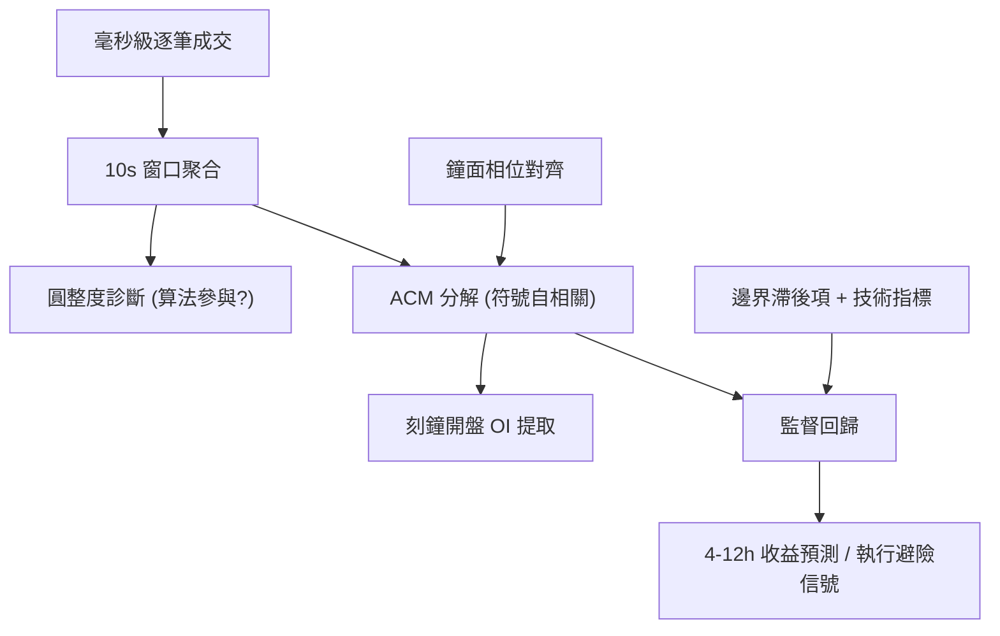

<!-- ontology-5axis data=微观盘口 horizon=高频日内 paradigm=监督回归 alpha=风险择时 autonomy=人机协同可解释 -->

# Autocorrelation Map 解構（Autocorrelation Map）

> **發布**：2026-07-10 · （無 venue） · arXiv [2607.09426](https://arxiv.org/abs/2607.09426)
> **arXiv 原文**：[The Quarter-Hour Effect: Periodic Algorithmic Trading and Return Predictability in Cryptocurrency Futures](https://arxiv.org/abs/2607.09426v1)  · _本頁由 arXiv 原文一手自主解構_
> **核心定位**：落點於高頻微觀結構與監督式風險擇時，解決了傳統自相關函數無法剝離「鐘面相位依賴（clock-phase dependence）」的工程盲區。透過將訂單流脈衝分解至刻鐘邊界，揭示算法同步執行所產生的可預測路徑。

**五軸座標**

| 數據模態 | 時間尺度 | 學習範式 | Alpha機制 | 人機協作 |
|:-:|:-:|:-:|:-:|:-:|
| `微观盘口` | `高频日内` | `监督回归` | `风险择时` | `人机协同可解释` |

**Status:** v0.5 — 基於arXiv 原文（有原文則以原文為準）。細節待升 v1。
**TL;DR:** ① 將高頻訂單流與收益的自相關性按鐘面相位（minute/5-min/15-min）進行正交分解，提出 Autocorrelation Map（ACM）。② 核心 trick 是用 10 秒窗口內的訂單大小圓整度（roundness）作為算法參與的代理變數，並提取刻鐘開盤的訂單失衡（OI）作為中短期預測因子。③ 對高頻執行軸★：直接量化了「邊界同步交易」帶來的可預測滑點路徑，提供避險或反向收割的時序錨點。④ 關鍵實證：刻盤開盤訂單失衡可預測 4-12 小時收益，且技術指標提供增量信息（具體 Sharpe/IR 數值於提供段落未披露）。

**X-Ray.** 傳統高頻因子常將邊界脈衝視為雜訊或單純的流動性枯竭，ACM 的突破在於將「時間對齊」從工程慣例轉為可建模的結構性特徵。它解了兩個舊坑：一是用符號自相關取代傳統絕對值掩蓋了多空力量在邊界的非對稱釋放；二是用 10 秒圓整度診斷替代了日頻代理，使算法參與度可實時觀測。該方法打不開的 envelope 在於極端流動性枯竭（如鏈上擁塞或交易所掛單簿斷層）時，邊界同步效應會退化為隨機跳躍。對量化讀者的意義：它不直接給出暴利 alpha，而是提供了一套「邊界執行成本與預測路徑」的對沖框架，適合嵌入 TWAP/VWAP 的動態避險層或作為中頻組合的開盤風險濾鏡。

## §1 · 架構 / Core Mechanism
| 維度 | 前作/慣例做法 | ACM 改動 | 工程意義 |
|:---|:---|:---|:---|
| 時序解析 | 固定頻率低頻聚合（如 1min/5min bars） | 鐘面相位分解（clock-phase-resolved） | 剝離邊界效應與區間內隨機游走的混疊 |
| 算法識別 | 日頻大單比例或盤後統計 | 10 秒窗口訂單大小圓整度（trade-size roundness） | 實時捕捉算法下單的「整數偏好」行為特徵 |
| 預測源 | 技術指標或價量動量 | 刻鐘開盤訂單失衡（OI）+ 邊界滯後項 | 將微觀流動性壓力轉化為中短期收益預測變數 |

⚡ **Eureka:** 邊界脈衝不是雜訊，而是算法共享時間框架導致的「相位鎖定」；用圓整度過濾後，開盤 OI 的符號自相關即為可交易的預測路徑。

**信息流 ASCII:**

## §2 · 數學層
📌 **Napkin Formula:**
$$
\begin{aligned}
r_t &= \log(P_t) - \log(P_{t-1}) \\
\operatorname{OF}_t &= \sum_{k \in t} V_k D_k \quad (D_k \in \{+1, -1\}) \\
\operatorname{OI}_t &= \frac{\operatorname{OF}_t}{\sum_{k \in t} V_k} \in [-1, 1]
\end{aligned}
$$
**直覺:** 訂單流 $\operatorname{OF}_t$ 按方向加權成交量，$\operatorname{OI}_t$ 將其體積歸一化至 \$[-1,1]\$，消除不同時段流動性規模差異。ACM 將傳統自相關函數精確分解為相位特定組分，使邊界依賴可視化。
**複雜度:** $O(N)$ 線性掃描聚合，ACM 分解依賴相位分桶，計算開銷與窗口數呈線性關係。
**Loss/訓練細節:** 來源未披露具體回歸損失函數與正則化超參（寫「未披露」）。

## §2.5 · 帶數字走一遍（Worked Example）
*(以下為示意假設，非論文實證結果)*
1. **輸入:** 假設刻鐘開盤 10 秒內，買方 taker 成交 3 筆：100 USDT, 200 USDT, 150 USDT；賣方 maker 成交 2 筆：50 USDT, 50 USDT。
2. **圓整度診斷:** 訂單大小均為 50 的倍數，圓整度極高 → 標記為「算法參與窗口」。
3. **計算 OF:** $\operatorname{OF} = (100+200+150) - (50+50) = 350$。
4. **計算 OI:** 總成交量 \$= 100+200+150+50+50 = 550\$。$\operatorname{OI} = 350 / 550 \approx 0.636$。
5. **輸出:** $\operatorname{OI} = 0.636$ 輸入監督回歸模型，結合前一刻鐘邊界滯後項，預測未來 4-12 小時收益方向為正。若 OI 持續為正且圓整度維持高位，系統觸發「延遲執行」或「反向對沖」指令。

## §3 · 數據層
- **市場/合約:** Binance USDT-margined perpetual futures（6 大流動性合約：BTC, ETH, XRP, SOL, DOGE, ADA）。
- **頻率/粒度:** 毫秒級逐筆成交（含 timestamp, price, quantity, isBuyerMaker）。
- **時段:** January 1, 2021 to October 31, 2024。
- **樣本外/容量:** 來源提及 out-of-sample predictability 與獨立數據驗證（independent data validation），但未披露具體訓練/驗證劃分比例與樣本量（寫「未披露」）。

## §4 · 代碼層
| 欄位 | 狀態 |
|:---|:---|
| Repo | TBD |
| Checkpoint | TBD |
| License | CC BY 4.0 |
| 複現難度 | 中（需毫秒級逐筆數據與精確鐘面時間對齊邏輯） |
| 數據可得性 | 高（Binance 官方公開下載，原文提及曾有小範圍缺失已修正） |

## §5 · 評測 / Benchmark
| 數據集/市場 | Metric | 前SOTA | 本方法 | Δ |
|:---|:---|:---|:---|:---|
| Binance Perps (6 assets) | IR / Sharpe / AR / MDD | 未披露 | 未披露 | 未披露 |
| Binance Perps (6 assets) | 預測能力 (4-12h returns) | 未披露 | 可預測 (out-of-sample) | 未披露 |

**解讀:** 提供段落未給出任何量化績效指標（IR/Sharpe 等），故全數標記未披露。從機制推斷，Δ 的真實 capability 來自「邊界相位剝離」與「算法參與過濾」，而非單純的動量外推。潛在過擬合風險在於：刻鐘邊界效應可能隨交易所 API 變更或算法策略同質化而衰減；成本未計方面，10 秒窗口內的搶跑或延遲執行需扣除滑點與手續費，若邊界流動性瞬間枯竭，預測信號可能無法實際成交。

## §6 · 失效與隱含假設
**6.1 論文自述 limitations:** 未明確列出 limitations 段落（提供文本截斷）。僅提及若交易者無法在邊界脈衝最早階段執行，延遲執行可能暴露於可預測價格路徑。
**6.2 推斷隱含假設:**
- **Regime 依賴:** 依賴跨市場算法共享標準化時間框架（API/圖表預設）。若主流交易所取消刻鐘/小時對齊或算法轉向事件驅動，相位鎖定效應將失效。
- **容量/成本:** 10 秒窗口內訂單失衡的預測力高度依賴即時流動性。大資金進場會瞬間消耗邊界深度，導致信號容量極低。
- **數據泄漏:** 使用 `isBuyerMaker` 判斷方向在極端行情下可能與實際主動/被動邏輯偏離（如冰山單或隱藏流動性）。
- **Survivorship:** 樣本僅含 6 大流動性合約，排除低流動性/新上線資產，邊界效應在薄盤中可能表現為流動性真空而非可預測脈衝。

## §7 · 對比 & 面試 Tip
| 同軸對手 | 關鍵差異軸 | Open? | Status |
|:---|:---|:---|:---|
| 傳統 VWAP/TWAP | 靜態時間切片 vs 相位依賴動態避險 | 閉源/商業 | 成熟但缺乏邊界預測 |
| 高頻訂單流預測 (如 Hasbrouck VAR) | 連續時間分解 vs 鐘面邊界正交分解 | 開源/學術 | 學術常用，實盤計算開銷高 |
| 加密貨幣動量因子 | 日頻/小時頻趨勢 vs 刻鐘開盤微觀失衡 | 混合 | 常見但易受邊界滑點侵蝕 |

🎤 **Interview Tip:** 
- ✅ 正確答：「ACM 的核心不是預測絕對價格，而是量化『時間對齊』帶來的流動性重定價路徑。實盤中應將其作為執行算法的避險濾鏡，而非直接開倉信號，需嚴格扣除 10 秒窗口內的滑點成本。」
- ❌ 錯答：「只要刻盤 OI 為正就做多，因為論文說能預測 4-12 小時收益。」（忽略執行成本、相位衰減與樣本外驗證細節）

**7.1 可證偽預測帶日期:** 若 Binance 或主流交易所於 2027-01-01 前全面切換至事件驅動撮合或取消標準化時間 API，刻鐘邊界訂單失衡的 out-of-sample 預測力應統計顯著下降（p-value > 0.05）。

## §8 · For the Reader
- **因子研究員:** 將 ACM 的相位分解邏輯嵌入現有的訂單流因子庫，替換傳統固定頻率的自相關計算，觀察因子 IC 在邊界時段的穩定性提升。
- **高頻執行:** 將 10 秒圓整度診斷接入 VWAP 控制器，當檢測到邊界算法脈衝時，動態調整執行節奏（延遲或拆單），規避可預測滑點。
- **組合配置/風控:** 將刻盤 OI 作為中頻組合的開盤風險濾鏡，在 OI 極端偏離時降低槓桿或啟用對沖，避免被邊界同步交易引發的短期波動誤傷。

## References
- Chan Kim, Peter Reinhard Hansen. *The Quarter-Hour Effect: Periodic Algorithmic Trading and Return Predictability in Cryptocurrency Futures*. arXiv:2607.09426v1 [q-fin.TR], 10 Jul 2026.
- Hansen et al. (2024). *Nested periodicities in cryptocurrency markets*. (Referenced in text for baseline periodicity documentation)
- Muravyev and Picard (2022); Chen et al. (2022); Wu et al. (2025). *Related periodic patterns in traditional/crypto markets*. (Referenced in text)
- Source Link: https://arxiv.org/abs/2607.09426