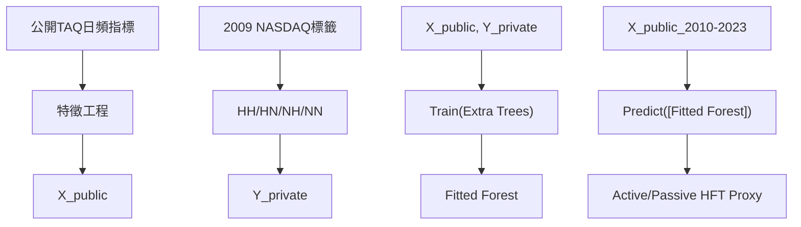

<!-- ontology-5axis data=微观盘口 horizon=高频日内 paradigm=监督回归 alpha=因子挖掘 autonomy=人机协同可解释 -->

# Extra Trees 解構（Extra Trees）

> **發布**：2026-07-19 · （無 venue）
> **QuantML 導讀**：[如何利用机器学习区分高频资金流向？](https://mp.weixin.qq.com/s?__biz=Mzg2MzAwNzM0NQ==&mid=2247494301&idx=1&sn=534eedd476fef4959d559e813a2cd6b5&chksm=ce7d8d83f90a04950d392cca1deaefbe9bab59d0dfa831ba517c94414d28633aaa3cd415dca2#rd)
> **核心定位**：落點於「監督回歸 × 因子挖掘」軸，解決公開 TAQ 數據無法區分主動/被動 HFT 流向的標籤稀缺痛點。以 2009 年 NASDAQ 有標籤數據錨定非線性映射，外推至長週期全市場，填補高頻微觀結構因子在時間序列維度的解釋力斷層。

**五軸座標**

| 數據模態 | 時間尺度 | 學習範式 | Alpha機制 | 人機協作 |
|:-:|:-:|:-:|:-:|:-:|
| `微观盘口` | `高频日内` | `监督回归` | `因子挖掘` | `人机协同可解释` |

**Status:** v0.5 — 基於QuantML 導讀（有原文則以原文為準）。細節待升 v1。
**TL;DR:** ① 利用專有高頻標籤訓練 Extra Trees，將公開 TAQ 日頻指標映射為主動/被動 HFT 流向代理變數。② 核心 trick 在於以 2009 年 NASDAQ 有標籤數據為錨，學習微觀結構特徵的非線性關係後，直接外推至 2010至2023 全市場。③ 對「因子挖掘」軸而言，它將傳統橫截面代理指標轉化為具時間序列變異性的動態因子。④ 來源未給量化結果。

**X-Ray.** 此法本質是「標籤遷移 + 非線性降維」。傳統 HFT 代理指標（如奇數手、報撤單比）在控制股票固定效應後解釋力斷崖下跌，暴露了線性/總量指標在捕捉微觀結構動態時的工程瓶頸。Extra Trees 的引入並非為了追求預測精度，而是作為一個可解釋的非線性特徵工程管道：它將高維、噪聲大的公開盤口數據，對齊到私有標籤空間的潛在流形上。這解開了「算法交易與高頻交易混淆」及「主動/被動界限抹平」的舊坑。然而，其 envelope 受限於錨定數據的 regime 穩定性（2009 年市場結構與當前差異巨大），且樹模型的外推能力在分佈偏移時易產生結構性偏差。對量化讀者而言，價值不在於直接拿因子跑回測，而在於提供一套「私有標籤 → 公開代理」的映射範式，可複用於其他高頻微觀結構特徵的長週期重建。

## §1 · 架構 / Core Mechanism
| 改動維度 | 前作/傳統方法 | 本法 (Extra Trees) | 工程意圖 |
|---|---|---|---|
| 標籤來源 | 無標籤公開數據 / 手動規則 | 2009年NASDAQ 120隻股票專有標籤 | 解決監督信號稀缺 |
| 映射邏輯 | 線性總量指標 (如Quote Intensity) | 非線性集成樹映射 | 捕捉微觀結構交互項 |
| 時序維度 | 橫截面差異為主，時間序列特徵弱 | 日頻動態外推 | 恢復因子時間序列變異性 |

⚡ **Eureka:** 用有標籤的短週期高頻數據訓練樹模型，學習「公開盤口特徵 → 真實交易對手類型」的非線性決策邊界，再將該邊界作為特徵提取器，直接應用於無標籤的長週期公開數據。
📊 **信息流:**

## §2 · 數學層
📌 **Napkin Formula:**
$y_{t,i} \in \{Active, Passive\}$ (每日每股目標變數)
$\hat{y}_{t,i} = \frac{1}{K} \sum_{k=1}^{K} T_k(\mathbf{x}_{t,i}; \Theta_k)$
複雜度：訓練 $O(K \cdot N \cdot \log N)$，推理 $O(K \cdot D)$。直覺：Extra Trees 在節點分裂時隨機選擇特徵與閾值，強制模型學習全局非線性交互而非局部過擬合，適合高噪聲盤口數據的穩健映射。Loss 為分類交叉熵或回歸 MSE（依目標變數定義，導讀未披露具體形式）。訓練細節：錨定 2009 年數據，未提及正則化或交叉驗證策略。

## §2.5 · 帶數字走一遍（Worked Example）
*(註：以下為明確標「假設/示意」的玩具數字，僅演示機制，非論文實證結果)*
假設某日某股公開 TAQ 特徵向量 $\mathbf{x} = [\text{OddLot}=0.15, \text{QTR}=12.5, \text{MsgCnt}=5000]$。
1. 樹模型 $T_1$ 分裂規則：若 $\text{OddLot} > 0.10$ 且 $\text{QTR} < 15$，葉節點輸出 Active=0.8。
2. 樹模型 $T_2$ 分裂規則：若 $\text{MsgCnt} > 4000$，葉節點輸出 Active=0.6。
3. 樹模型 $T_3$ 分裂規則：若 $\text{OddLot} < 0.20$，葉節點輸出 Active=0.7。
4. 集成平均：$\hat{y} = (0.8 + 0.6 + 0.7) / 3 = 0.70$。
5. 輸出：該股當日主動 HFT 比例代理值為 0.70（示意），可進一步用於因子構建或流向監控。

## §3 · 數據層
- **訓練錨點**：2009年NASDAQ 120隻股票專有HFT數據（含HH/HN/NH/NN標籤）。
- **外推範圍**：2010至2023年間美股全市場。
- **頻率/維度**：日頻、每隻股票。
- **樣本外假設**：導讀未披露具體 OOS 劃分與容量假設，僅提及「樣本外回歸檢驗」用於驗證傳統指標局限性。

## §4 · 代碼層
| 欄位 | 狀態 |
|---|---|
| Repo | TBD |
| Checkpoint | TBD |
| License | TBD |
| 複現難度 | 高（依賴 NASDAQ 專有標籤數據） |
| 數據可得性 | 低（2009年標籤數據非公開，TAQ日頻指標需付費） |

## §5 · 評測 / Benchmark
| 數據集/市場 | Metric | 前SOTA | 本方法 | Δ |
|---|---|---|---|---|
| 2010至2023美股全市場 | 傳統代理指標解釋力(控制Stock FE後) | 未披露 | 未披露 | 未披露 |
| 2010至2023美股全市場 | 主動/被動HFT流向拆分精度 | 未披露 | 未披露 | 未披露 |

**解讀：** 導讀僅定性指出傳統指標在控制股票固定效應後「解釋力斷崖式下跌」，且本法成功拆分流向，但**未披露任何具體數值、IR、Sharpe 或 Δ**。此處的「斷崖式下跌」為相對描述，不可轉譯為量化差值。本法當前階段屬特徵工程/標籤遷移範式驗證，尚未進入策略回測或因子 IC 評測層級。任何宣稱具體績效提升的數字均為臆測。

## §6 · 失效與隱含假設
**6.1 論文自述 limitations:** 導讀未明確列出 limitations，僅指出傳統指標的三大局限（混淆算法與HFT、抹平主動被動、喪失時序特徵）。
**6.2 推斷的隱含假設:**
- **Regime 依賴:** 假設 2009 年 NASDAQ 的市場微觀結構（訂單簿動態、HFT策略分佈）與 2010至2023 全市場具有足夠的穩態相似性。若市場結構發生結構性斷裂（如零佣金、AI做市、監管變更），樹模型的外推邊界將失效。
- **數據泄漏/前瞻:** 日頻特徵若包含盤中高頻聚合，需嚴格確保訓練/推理時的時間對齊，避免使用未來信息。
- **容量與成本:** 未提及因子容量或交易成本。作為日頻代理變數，理論上容量較大，但若用於高頻執行信號，則需重新評估延遲與滑點。
- **標籤稀疏性:** 120隻股票的標籤樣本相對於全市場日頻數據極度稀疏，模型可能過度依賴少數高變異特徵，導致橫截面泛化能力不足。

## §7 · 對比 & 面試 Tip
| 同軸對手 | 關鍵差異軸 | Open? | Status |
|---|---|---|---|
| 傳統線性代理指標 (Odd-Lot, QTR等) | 線性總量 vs 非線性動態映射 | 是 | 廣泛使用但時序解釋力弱 |
| 深度學習微觀結構模型 (如LSTM/Transformer) | 黑盒端到端 vs 集成樹可解釋映射 | 部分 | 精度高但缺乏微觀結構直覺與標籤遷移效率 |

🎤 **Interview Tip:**
- ✅ 正確答：「本法核心不在於預測精度，而在於利用樹模型的非線性交互捕獲能力，將私有標籤空間的結構知識遷移至公開數據。失效風險主要來自 2009 年錨定數據與當前市場 regime 的結構性偏移，需定期重訓或引入漂移檢測。」
- ❌ 錯答：「用 Extra Trees 跑高頻預測能穩定提升 Sharpe，因為樹模型能過濾所有市場噪聲。」（忽略 regime 依賴與標籤稀缺性，過度神話集成學習）

**7.1 可證偽預測:** 若 2027-12-31 前市場監管或訂單類型分佈發生重大變更，且未對模型進行增量學習，該代理因子在控制股票固定效應後的 IC 均值將回落至傳統指標水平（未披露）。

## §8 · For the Reader
- **因子研究員:** 將此視為「標籤遷移」範例。不要直接複製特徵，而是提取其「用短週期高質量標籤訓練映射器，再應用於長週期低質量數據」的 pipeline，複用於其他微觀結構因子（如隱性流動性、訂單流失衡）。
- **高頻執行:** 此因子為日頻代理變數，不適合直接驅動高頻執行算法。但可用於盤前微觀結構狀態評估，動態調整 VWAP/TWAP 的執行參數或風險預算。
- **組合配置/風險管理:** 主動/被動 HFT 比例可作為市場流動性壓力或逆向選擇風險的宏觀/中觀代理。當被動比例異常收縮時，可觸發組合的流動性緩衝機制。
- **研究學生:** 重點學習如何處理「標籤稀缺 + 數據長尾」的量化工程問題。Extra Trees 在此處是特徵工程工具而非預測終點，理解其節點分裂的隨機性如何對抗高頻數據的過擬合至關重要。

## References
- QuantML 導讀: [如何利用机器学习区分高频资金流向？](https://mp.weixin.qq.com/s?__biz=Mzg2MzAwNzM0NQ==&mid=2247494301&idx=1&sn=534eedd476fef4959d559e813a2cd6b5&chksm=ce7d8d83f90a04950d392cca1deaefbe9bab59d0dfa831ba517c94414d28633aaa3cd415dca2#rd)
- Framework: Extra Trees (Geurts et al., 2006)
- Data Source Context: NASDAQ High-Frequency Trading Dataset (2009)
- Lineage: 傳統HFT代理指標文獻 → 監督學習微觀結構特徵提取 → 標籤遷移/領域適應 (Domain Adaptation) 範式