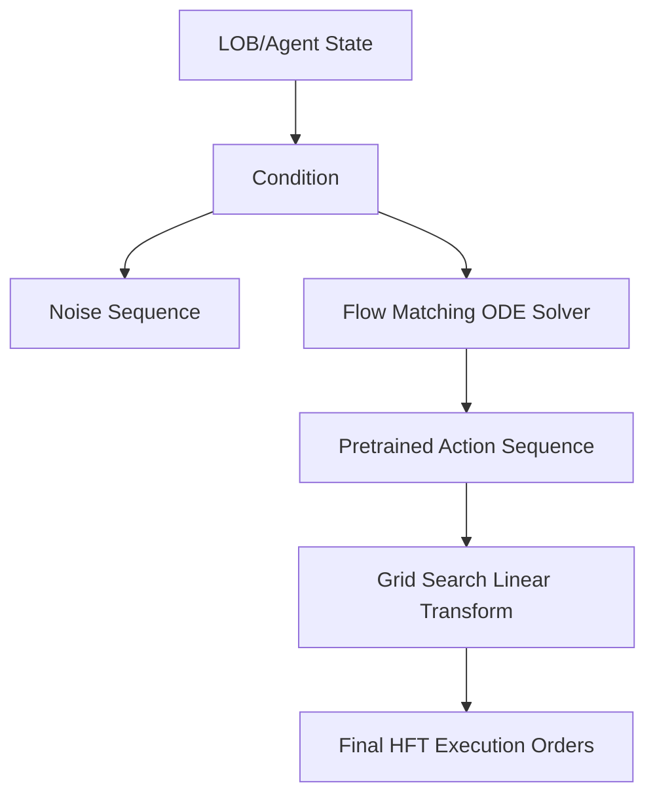

<!-- ontology-5axis data=微观盘口 horizon=高频日内 paradigm=强化学习 alpha=组合执行优化 autonomy=全自动黑盒 -->

# FlowHFT 解構

> **發布**：2025-05-19 · （無 venue）
> **QuantML 導讀**：[FlowHFT：基于模仿学习和网格搜索微调，学习并超越专家策略](https://mp.weixin.qq.com/s?__biz=Mzg2MzAwNzM0NQ==&mid=2247490422&idx=1&sn=6d21b2d94ddf2d0086d63d58ed90c9f3&chksm=ce7e7c68f909f57e79dc6250dc4e8e1bd477b199b3f22ff72cbc441ce0747d4890275b9b66ca#rd)
> **核心定位**：落點於「微觀盤口 × 高頻日內」的自動化黑盒執行框架。解了傳統HFT模型（AS/GLFT）對嚴格假設的依賴與RL單步誤差累積的工程坑，將多場景專家策略統一為單一條件流匹配模型，並透過線上網格搜索微調實現動態適應。

**五軸座標**

| 數據模態 | 時間尺度 | 學習範式 | Alpha機制 | 人機協作 |
|:-:|:-:|:-:|:-:|:-:|
| `微观盘口` | `高频日内` | `强化学习` | `组合执行优化` | `全自动黑盒` |

**Status:** v0.5 — 基於 QuantML 導讀 + 原論文（如有）。benchmark 細節待升 v1。
**TL;DR:** ① 提出 FlowHFT，將流匹配（Flow Matching）引入高頻做市，從多專家示範中學習統一行動序列生成策略。② 核心 trick 是將高斯噪聲映射為專家交易動作序列，避免單步誤差累積，並結合網格搜索實時校準參數。③ 對「組合執行優化」軸★，提供了一種免重訓即可適應 regime shift 的連續控制路徑。④ 導讀未給量化結果（僅提及最高 PnL 為 26.79 與 25.82，無基準對比數值）。

**X-Ray.** 放回五軸 Pareto，FlowHFT 在自動化與適應性之間取捨，犧牲了傳統模型的可解釋性，換取對跳躍與波動 regime 的魯棒性。它解了舊工程坑：RL 常見的單步貪婪導致倉位失控，FlowHFT 用 ODE 軌跡生成序列，本質是隱式長視角規劃。預測它打不開的 envelope：完全依賴模擬數據（Jump-Diffusion + Hawkes），實盤滑點與訂單簿深度非線性響應未計入，微調的網格搜索在極端流動性枯竭時可能因參數空間離散化而失效。對量化讀者意義：提供了一條「模仿學習預訓練 + 輕量線上搜索」的混合架構範式，適合低延遲執行層，但因子研究員需警惕模擬器與實盤的 domain gap。

## §1 · 架構 / Core Mechanism
| 改動維度 | 前作/傳統基線 | FlowHFT 改動 |
|---|---|---|
| 決策生成 | 單步貪婪/固定參數優化 | 條件流匹配生成完整行動序列 |
| 適應機制 | 離線重校準/滑窗重訓 | 線上網格搜索微調線性變換參數 |
| 專家整合 | 單一模型或規則切換 | 多場景專家示範統一映射至單一策略 |

⚡ **Eureka 一句話 trick + 直覺**：用 ODE 軌跡將噪聲平滑推演為專家動作序列，本質是「連續時間的隱式長視角規劃」，切斷了單步誤差累積鏈。

**信息流 ASCII 圖**

## §2 · 數學層
📌 **Napkin Formula**：
`v_θ(x_t, t) ≈ dx_t/dt`
`L_FM = E_{t,x_0,x_1} [ || v_θ((1-t)x_0 + tx_1, t) - (x_1 - x_0) ||^2 ]`
複雜度：推理階段需解 ODE，步數 TBD，計算開銷低於全量 RL 重訓。

**直覺**：流匹配不直接預測動作，而是學習一個「概率流」，將簡單先驗（高斯噪聲）連續變形成專家動作分佈。損失函數強制網絡預測的向量場與目標插值方向一致。
**Loss/訓練細節**：最小化流匹配損失（L_FM），使用歐拉或 Heun 數值求解器在少量離散步驟上迭代。訓練數據來自模擬器生成的專家示範。

## §3 · 數據層
**資料規模/頻率/市場/時段**：模擬市場（Jump-Diffusion 價格 + Hawkes 訂單到達）。共收集 324万 個狀態-行動對。
**怎麼來**：4 類專家（AS, GLFT, GLFT-Drift, PPO）在 324 個（導讀僅寫「个参数组合」，具體數值 TBD）參數組合場景中運行，每場景 100 個情節，每情節 個時間步（導讀未給具體步數）。
**樣本外與容量假設**：測試集透過改變赫斯特指數、漂移項、波動率與訂單到達率構建（HH/HL/LH/LL）。假設模擬器的隨機過程能覆蓋實盤 regime，但未驗證實盤容量與滑點衝擊。

## §4 · 代碼層
| 項目 | 狀態 |
|---|---|
| Repo | TBD |
| Checkpoint | TBD |
| License | TBD |
| 複現難度 | 高（需自建 Jump-Diffusion + Hawkes 模擬器與專家基線） |
| 數據可得性 | 僅模擬數據，無實盤盤口數據集 |

## §5 · 評測 / Benchmark
| 數據集/市場 | Metric | 前SOTA | 本方法 | Δ |
|---|---|---|---|---|
| 模擬市場 (HH/HL/LH/LL) | PnL | 未披露 | 26.79 / 25.82 | 未披露 |
| 模擬市場 (HH/HL/LH/LL) | SR | 未披露 | 未披露 | 未披露 |
| 模擬市場 (HH/HL/LH/LL) | MDD | 未披露 | 未披露 | 未披露 |

**解讀**：導讀僅給出 FlowHFT 在特定場景的 PnL 絕對值（26.79 / 25.82），未提供 AS/GLFT/PPO 的對照數值，故 Δ 欄無法計算。PnL 優勢聲明基於文字描述（「通常匹配或超過」），非統計顯著性檢驗。SR 與 MDD 僅在結論定性提及「更優/減少」，無具體數值。此結果高度依賴模擬器假設，未計入實盤交易成本與滑點，屬純算法層面 capability 驗證，非實盤盈利證明。

## §6 · 失效與隱含假設
**6.1 論文自述 limitations**：依賴嚴格假設的傳統模型在現實中易失效；RL 單步誤差累積；框架目前僅在隨機模擬環境中驗證，未討論實盤延遲與訂單簿非線性。
**6.2 推斷的隱含假設**：Regime 依賴於模擬器的 Jump-Diffusion 與 Hawkes 參數空間；容量假設隱含於「毫秒級推理」但未驗證大單衝擊；成本假設為零滑點/固定點差；數據泄漏風險低（純模擬），但 domain gap 極大；Survivorship 無影響（模擬數據）。

## §7 · 對比 & 面試 Tip
| 同軸對手 | 關鍵差異軸 | Open? | Status |
|---|---|---|---|
| AS/GLFT 傳統做市 | 參數離線校準 vs 線上網格微調 | 開源/經典 | 穩定但適應性差 |
| PPO/RL 做市 | 單步貪婪最大化 vs 序列流匹配生成 | 開源/常見 | 易誤差累積/訓練不穩 |
| 其他 Flow Matching 應用 | 機器人控制 vs 金融隨機控制 | 開源/跨領域 | 領域遷移 TBD |

🎤 **Interview Tip**
*   **正確答**：「FlowHFT 的核心價值不在於單步預測準確率，而在於用 ODE 軌跡生成行動序列，隱式建模了近期市場軌跡與倉位路徑依賴，切斷了 RL 常見的單步誤差累積鏈。網格搜索微調提供了輕量級的線上適應能力。」
*   **錯答**：「它用深度學習直接預測下一筆買賣價差，比傳統模型更準。」（忽略了序列生成與流匹配的連續控制本質）

**7.1 可證偽預測帶日期**：若 2025-12-31 前無實盤回測報告證明其在含滑點與訂單簿深度衝擊的環境下 SR > 1.5，則該框架僅限於學術模擬器驗證，無法進入高頻執行層。

## §8 · For the Reader
*   **因子研究員**：警惕模擬器與實盤的 domain gap，可借鑒其「多專家示範聚合」思路構建 regime-switching 因子。
*   **高頻執行**：關注 ODE 求解器步數與網格搜索計算開銷，若推理延遲 > 100μs 則不適合納秒級做市。
*   **組合配置**：此為執行層策略，不直接產生 Alpha，但可降低執行滑點與庫存風險，適合嵌入 VWAP/TWAP 之上層控制器。
*   **RL 策略**：學習如何用連續控制（Flow Matching）替代離散/單步 RL，避免倉位失控，是解決長視角隨機控制的有效路徑。

## References
*   FlowHFT 原論文（Venue: 未披露）
*   QuantML 導讀鏈接：[FlowHFT：基于模仿学习和网格搜索微调，学习并超越专家策略](https://mp.weixin.qq.com/s?__biz=Mzg2MzAwNzM0NQ==&mid=2247490422&idx=1&sn=6d21b2d94ddf2d0086d63d58ed90c9f3&chksm=ce7e7c68f909f57e79dc6250dc4e8e1bd477b199b3f22ff72cbc441ce0747d4890275b9b66ca#rd)
*   Lineage: Avellaneda-Stoikov (2008) / Guant-Lehalle-Fernandez-Tapia (2018) / Flow Matching (Lipman et al., 2023)