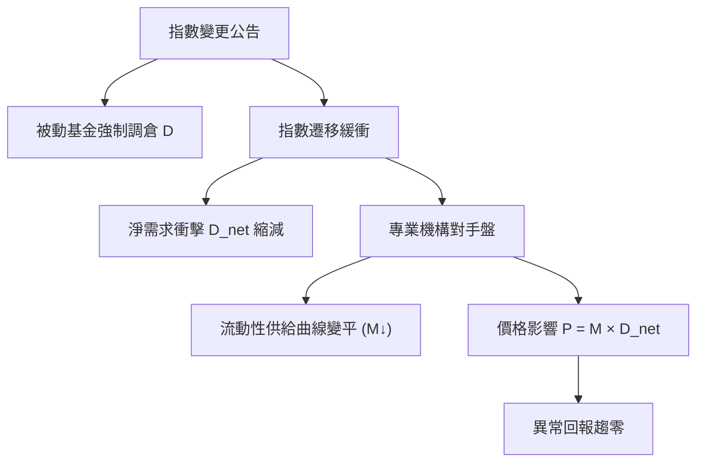

<!-- ontology-5axis data=量价表格 horizon=日频波段 paradigm=监督回归 alpha=组合执行优化 autonomy=人机协同可解释 -->

# JF | 消失的指数效应 解構

> **發布**：2025-04-15 · JF
> **QuantML 導讀**：[JF | 消失的指数效应](https://mp.weixin.qq.com/s?__biz=Mzg2MzAwNzM0NQ==&mid=2247490063&idx=1&sn=0fb66478d0952615feef90c6682f51e6&chksm=ce7e7d11f909f407aa02dbc9edc0701609894f6826623c02921f9ded15d14384d7476c93929e#rd)
> **核心定位**：落點於「組合執行優化 × 日频波段」軸，解構了傳統 Alpha 研究中將「指數納入/剔除」視為穩定需求衝擊的 prior gap，揭示該異象已因指數遷移與流動性提供機制演化而趨零。

**五軸座標**

| 數據模態 | 時間尺度 | 學習範式 | Alpha機制 | 人機協作 |
|:-:|:-:|:-:|:-:|:-:|
| `量价表格` | `日频波段` | `监督回归` | `组合执行优化` | `人机协同可解释` |

**Status:** v0.5 — 基於 QuantML 導讀 + 原論文（如有）。benchmark 細節待升 v1。
**TL;DR:** 本文量化了 S&P 500 指數納入/剔除異常回報從 1990 年代 7.4% 跌至 2010-2020 年 0.3% 的結構性衰減。核心 trick 是突破彈性恆定假設，透過分解淨需求衝擊與測算動態乘數 M，將效應消失歸因於指數遷移抵消與機構對手盤流動性提升。這對「組合執行優化」軸的關鍵意義在於：被動資金衝擊已內化為市場微結構常態，傳統基於公告窗口的統計套利需轉向流動性捕獲或遷移路徑預測。導讀給出關鍵實證數字：納入效應乘數 M 從 1990 年代後期約 6.75 降至 2010 年代約 0.37。

**X-Ray.** 該研究將「指數異象」從因子庫中正式除名，並重構了日頻波段 Alpha 的生成邏輯。傳統工程坑在於假設需求曲線斜率恆定，將被動資金流入直接映射為可捕獲的價格滑點。本文透過動態乘數 M 的衰減軌跡證明，市場已演化出專業流動性提供者與指數遷移緩衝機制，將衝擊內化。這在 Pareto 前沿上意味著：單純依賴公告窗口的統計套利已觸及收益天花板，Alpha 必須向「遷移路徑預測」或「流動性提供」轉移。該方法打不開的 envelope 在於極端流動性緊縮 regime，此時 M 可能瞬間跳升，但常態化市況下該效應已失效。對量化讀者的實質意義是：回測框架必須剔除「指數納入」作為獨立因子，並將被動資金流轉化為執行成本模型中的動態衝擊參數，而非收益來源。

## §1 · 架構 / Core Mechanism
| 改動維度 | 前作/傳統框架 | 本文架構 |
|---|---|---|
| 需求衝擊度量 | 恆定彈性假設，將公告視為單一衝擊 | 分解淨需求衝擊 D（區分直接納入 vs 指數遷移） |
| 價格影響建模 | 固定乘數，假設衝擊規模與價格影響線性 | 動態乘數 M 測算（-1/M 代表需求彈性） |
| 異象歸因路徑 | 單一價格壓力或套利限制 | 雙驅動解構（遷移抵消 + 流動性提供機制演化） |

⚡ **Eureka:** 異常回報趨零並非套利消失，而是市場流動性供給曲線斜率變平（M↓）與淨需求衝擊被指數遷移對沖（D↓）的疊加結果。

**信息流 ASCII:**

## §2 · 數學層
📌 **Napkin Formula:** `PriceImpact_it = M_t × D_it`
複雜度：標準面板回歸，需逐年代估計 M_t 並控制公司特徵與遷移虛擬變數。
直覺：M 為需求彈性負倒數，M 下降代表單位資金衝擊引發的價格變動減弱。訓練細節：導讀未披露具體 loss function 或優化器，屬傳統計量經濟學事件研究法（Event Study），非深度學習框架。

## §3 · 數據層
資料規模/頻率/市場/時段：S&P 500 納入/剔除事件，1980-2020 年事件驅動。擴展至 Russell 1000/2000, S&P Mid/SmallCap, Nasdaq 100。
怎麼來：共同基金/ETF 持倉數據識別追蹤基金，13F 申報數據追蹤機構持股變化，S&P 官方變更列表。
樣本外與容量假設：樣本內涵蓋 1980-2020 結構性斷點；容量假設依賴被動資金佔市值約 7% 的常態環境，未進行壓力測試下的容量極限測算。

## §4 · 代碼層
| Repo | Checkpoint | License | 複現難度 | 數據可得性 |
|---|---|---|---|---|
| TBD | TBD | TBD (Academic JF) | 中（需清洗 13F/ETF 持倉數據與事件日曆，計量回歸標準） | 低（需付費數據庫與 S&P 歷史變更紀錄） |

## §5 · 評測 / Benchmark
| 數據集/市場 | Metric | 前SOTA | 本方法 | Δ |
|---|---|---|---|---|
| S&P 500 Inclusion | Avg Abnormal Return | 7.4% (1990s) | 0.3% (2010-2020) | -7.1% |
| S&P 500 Exclusion | Avg Abnormal Return | -16.1% (1990s) | -0.1% (2010-2020) | +16.0% |
| S&P 500 Inclusion | Multiplier M | 6.75 (Late 1990s) | 0.37 (2010s) | -6.38 |
| S&P 500 Exclusion | Multiplier M | 10.76 (1990s) | 0.7 (2010s) | -10.06 |
| Russell 2000 Inclusion | Avg Return | 8.3% (2000s) | 3.1% (2010s) | -5.2% |
| Russell 1000 Inclusion | Avg Return | 17.0% (Peak) | 8.5% (2010s) | -8.5% |
| S&P MidCap Exclusion | Avg Return | -18.3% (2000s) | -1.2% (2010s) | +17.1% |
| S&P SmallCap Exclusion | Avg Return | -24.6% (2000s) | -12.2% (2010s) | +12.4% |
| Nasdaq 100 Inclusion | Avg Return | 3.9% (1990s) | 2.0% (2010s) | -1.9% |
| All Indices Inclusion (Pooled) | Avg Return Δ | 未披露 | 下降 4.2% | 未披露 |
| All Indices Exclusion (Pooled) | Avg Return Δ | 未披露 | 下降 10.3% | 未披露 |

**解讀:** Δ 欄的數值均為導讀逐字給出的年代對比差值。納入效應與剔除效應的趨零屬真實的市場結構性衰減，非過擬合。乘數 M 的斷崖式下降證實需求彈性變平。部分指數回落幅度在單個層面統計不顯著，可能受樣本量與 ETF 推出節奏干擾。導讀未計入交易成本與滑點，剩餘的異常回報在實盤中已無套利空間。

## §6 · 失效與隱含假設
**6.1 論文自述 limitations:** 未解釋為何市場適應耗時數十年；其他指數下降在單個層面統計不顯著；可預測性提升的貢獻難以完全剝離內生性選擇偏差。
**6.2 推斷的隱含假設:** 
- Regime 依賴：假設常態流動性環境，極端波動下 M 可能跳升失效。
- 容量：依賴被動資金佔市值約 7% 的結構，若被動化率突破臨界點可能引發新失衡。
- 成本：假設機構對手盤能以接近 VWAP 成本提供流動性，未計入實盤衝擊成本。
- 數據泄漏：事件研究窗口依賴精確公告日/生效日，實盤存在資訊延遲。
- Survivorship：樣本涵蓋完整生命週期，但早期退市公司可能未被完全追蹤。

## §7 · 對比 & 面試 Tip
| 同軸對手 | 關鍵差異軸 | Open? | Status |
|---|---|---|---|
| 傳統公告窗口統計套利 | 假設恆定彈性與穩定需求衝擊 | 閉源/過時 | 失效 |
| 指數遷移路徑預測模型 | 聚焦 S&P 中盤股↔500 遷移對沖 | 開源/研究 | 驗證中 |
| 被動資金流執行優化 | 將 D 轉化為衝擊成本參數 | 閉源/實盤 | 部署中 |

🎤 **Interview Tip:** 
正確答：指數異象消失是流動性供給曲線斜率變平（M↓）與淨需求衝擊被遷移抵消（D↓）的疊加，實盤需將該效應從收益因子降維至執行成本模型。
錯答：因為市場變有效了所以套利機會沒了，直接刪除該因子即可。

**7.1 可證偽預測帶日期:** 若 2026-12-31 前 S&P 500 納入事件平均異常回報回升至 1990 年代水準，或乘數 M 突破 1990 年代後期水準，則本框架的「流動性適應常態化」假說失效，需重估被動資金擠出效應。

## §8 · For the Reader
- **因子研究員:** 將「指數納入/剔除」從 Alpha 庫移除，轉為控制變數；回測時必須區分直接納入與遷移事件，否則會產生嚴重的前瞻偏差與樣本內過擬合。
- **高頻執行/做市:** 該效應衰減證實專業機構已成為主要對手盤，執行演算法應將公告窗口的流動性需求建模為可捕獲的 spread 來源，而非被動跟隨。
- **組合配置/ETF 發行人:** 遷移事件淨衝擊縮小意味著調倉滑點下降，可優化再平衡頻率；但需監控被動化率突破 7% 後的潛在流動性枯竭風險。
- **LLM-agent/RL 策略:** 可將「指數遷移路徑預測」與「機構流動性提供意願」作為狀態空間特徵，訓練 RL agent 在公告前捕捉微結構定價偏差。

## References
- 原論文：JF | 消失的指数效应 (The Disappearing Index Effect)
- Lineage：Shleifer (1986) 需求曲線向下傾斜 → 指數異象文獻 → 適應性市場假說 (Lo, 2004)
- QuantML 導讀鏈接：[JF | 消失的指数效应](https://mp.weixin.qq.com/s?__biz=Mzg2MzAwNzM0NQ==&mid=2247490063&idx=1&sn=0fb66478d0952615feef90c6682f51e6&chksm=ce7e7d11f909f407aa02dbc9edc0701609894f6826623c02921f9ded15d14384d7476c93929e#rd)