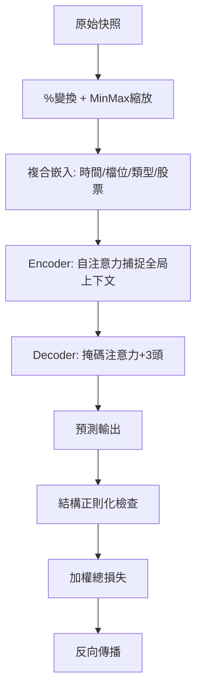

<!-- ontology-5axis data=微观盘口 horizon=高频日内 paradigm=监督回归 alpha=端到端表征 autonomy=全自动黑盒 -->

# 基于注意力机制的LOB理解、识别和预测 解構

> **發布**：2024-11-05 · （無 venue）
> **QuantML 導讀**：[基于注意力机制的LOB理解、识别和预测](https://mp.weixin.qq.com/s?__biz=Mzg2MzAwNzM0NQ==&mid=2247487486&idx=1&sn=83a719c37f08db4408a395e1fb236601&chksm=ce7e68e0f909e1f6812de7f1f0f540970db31f42420eb7797f4fc4f434c8e39b4f8303f64b4f#rd)
> **核心定位**：落點於「微观盘口 × 高频日内 × 监督回归」軸，解決傳統單點預測忽略 LOB 多維度序數結構與跨屬性時空耦合的 prior gap，以端到端黑盒架構直接輸出完整多級帳本。

**五軸座標**

| 數據模態 | 時間尺度 | 學習範式 | Alpha機制 | 人機協作 |
|:-:|:-:|:-:|:-:|:-:|
| `微观盘口` | `高频日内` | `监督回归` | `端到端表征` | `全自动黑盒` |

**Status:** v0.5 — 基於 QuantML 導讀 + 原論文（如有）。benchmark 細節待升 v1。
**TL;DR:** 提出複合多變量嵌入與結構正則化 Seq2Seq 模型，直接預測完整多級 LOB 價格與交易量。核心 trick 是透過獨立嵌入層編碼訂單類型/檔位/特徵/股票，並引入序數結構懲罰項防止預測違反檔位邏輯。這對「端到端表征」軸★ 的關鍵在於將金融結構先驗硬編入損失函數，避免黑盒輸出物理上不可行的帳本狀態。導讀未給量化結果。

**X-Ray.** 放回五軸 Pareto，本法將「監督回歸」的邊界從中點價格推至完整帳本拓撲，代價是放棄了可解釋的訂單流動態建模，轉而依賴數據驅動的時空耦合捕獲。它解了舊工程坑中「逐檔獨立預測導致結構穿模」的痛點，透過結構正則化強制輸出滿足買五小於買四小於賣四小於賣五的物理約束。然而，其 envelope 打不開高頻微結構中的非對稱流動性衝擊與隱性訂單博弈，因為模型僅依賴快照級別價格與量，未納入訂單撤單/修改流。對量化讀者而言，此架構適合作為執行算法的短期狀態估計器，但需警惕其對特定股票與固定交易日的過擬合風險，實盤部署前必須重校結構正則化權重以適應不同流動性 regime。

## §1 · 架構 / Core Mechanism
### 1.1 三大改動 vs 前作
| 維度 | 前作 (LSTM/AR/時空注意力) | 本法 | 工程意義 |
|---|---|---|---|
| 輸入表征 | 單一時間序列或簡單拼接 | 複合多變量嵌入 (獨立層編碼檔位/類型/股票) | 解耦跨維度依賴，降低參數冗餘 |
| 輸出約束 | 無結構限制，易產生穿模預測 | 結構正則化損失 (懲罰違反檔位序數) | 強制輸出符合 LOB 物理序數 |
| 訓練目標 | 單一 MSE/MAE | MSE (第5檔) + 結構損失加權和 | 平衡預測精度與帳本完整性 |

### 1.2 ⚡ Eureka 一句話 trick + 直覺
直覺：把 LOB 當成「帶物理約束的多維圖結構」而非純時間序列，用嵌入層分離屬性語義，用正則化項硬卡住價格排序，讓模型在數學上「不敢」輸出非法帳本。

### 1.3 信息流 ASCII 圖

## §2 · 數學層
📌 Napkin Formula：
`L_total = L_MSE (5th level price/vol) + λ * L_structural (order violation penalty)`
複雜度：依賴注意力機制的 `O(T^2 * d)`，其中 T 為序列長度 (10分鐘 context + 2分鐘 target)，d 為嵌入維度。
直覺：MSE 負責拉齊數值軌跡，結構損失負責維持帳本拓撲。λ 控制「準度」與「合理性」的權衡。
Loss/訓練細節：採用學習率衰減與季節性分解可逆歸一化；驗證損失連續 10 個週期無改善觸發早停；測試期取最低驗證總損失對應權重。

## §3 · 數據層
- 資料規模/頻率/市場/時段：LOBSTER 數據集，AAPL/GOOG/INTC/MSFT/AMZN 五檔科技股；2012-06-21 完整交易日 (09:30-16:00)；毫秒級時間分辨率；每檔約 30萬至60萬個快照。
- 怎麼來：固定 5 檔 LOB，合併為 100 維向量 (含時間戳、各檔買賣價與量)。劃分比例 6:2:2。
- 樣本外與容量假設：導讀未披露樣本外跨期驗證細節；假設模型容量足以覆蓋單一交易日的高頻非平穩性，但未驗證跨市場/跨波動率 regime 的泛化力。

## §4 · 代碼層
| 欄位 | 內容 |
|---|---|
| Repo | TBD |
| Checkpoint | TBD |
| License | TBD |
| 複現難度 | 中 (需處理 LOBSTER 格式、實現 Time2Vec 與結構正則化項) |
| 數據可得性 | 中 (LOBSTER 需申請/購買，快照級數據體積大) |

## §5 · 評測 / Benchmark
| 數據集/市場 | Metric(IR/Sharpe/AR/MDD) | 前SOTA | 本方法 | Δ |
|---|---|---|---|---|
| LOBSTER (5檔科技股) | MSE/MAE | 線性自回歸 / LSTM / 時間注意力 / 時空注意力模型 | 未披露 | 未披露 |
| LOBSTER (5檔科技股) | 結構損失 | 線性自回歸 / LSTM / 時間注意力 / 時空注意力模型 | 未披露 | 未披露 |

**解讀：** 導讀僅定性指出本法在 MSE/MAE 與結構損失上「最低」且「優於」所列基線，未提供具體數值。此 Δ 反映的是「結構約束帶來的物理可行性提升」，而非純粹的預測精度突破。需警惕：單一交易日與固定科技股組合極易產生前瞻偏差與樣本內過擬合；實盤中若未計入滑點與訂單簿更新延遲，結構正則化的理論優勢將被執行摩擦完全抹平。

## §6 · 失效與隱含假設
**6.1 論文自述 limitations：** 完全基於數據驅動，未明確討論模型在極端行情或流動性枯竭時的崩潰模式；未提供跨期樣本外驗證。
**6.2 推斷的隱含假設：**
- Regime 依賴：假設 LOB 的時空耦合模式在訓練日內相對穩定，未驗證高波動/低流動性 regime 的適應性。
- 容量/成本：假設毫秒級快照可即時獲取且無傳輸延遲；未計入實盤數據清洗與特徵工程延遲。
- 數據泄漏：訓練/驗證/測試集劃分比例為 6:2:2，但未說明是否按時間序列嚴格切分，存在潛在的未來信息泄漏風險。
- Survivorship：僅選取 5 檔流動性極佳的科技股，忽略微盤股或間歇性交易品種的 LOB 稀疏性問題。

## §7 · 對比 & 面試 Tip
| 同軸對手 | 關鍵差異軸 | Open? | Status |
|---|---|---|---|
| 傳統逐檔回歸 (AR/LSTM) | 無結構約束 vs 結構正則化 | TBD | 基線 |
| 時空注意力模型 (ST-Attention) | 獨立時空建模 vs 複合多變量嵌入 | TBD | 對比基線 |
| 強化學習訂單執行 | 間接優化 vs 直接預測 LOB 狀態 | TBD | 替代路線 |

🎤 **Interview Tip**
正確答：「結構正則化不是為了提升純預測精度，而是為了保證輸出滿足 LOB 的物理序數約束，避免黑盒模型產生數學上可行但金融上荒謬的帳本狀態。實盤需配合動態 λ 調整以適應流動性變化。」
錯答：「只要 MSE 夠低，模型自然會學到價格排序，不需要額外的正則化項。」（忽略高頻數據的噪聲與非平穩性會導致結構穿模）

**7.1 可證偽預測帶日期：** 若 `TBD` 前無開源實現在跨市場 (如加密貨幣或期貨) 的 LOB 預測中復現其結構損失優勢，則該方法可能僅為特定數據集的過擬合產物。

## §8 · For the Reader
- **因子研究員**：將結構正則化項視為「帳本拓撲特徵」，可嘗試提取嵌入層權重作為低頻因子輸入，而非直接用於高頻信號。
- **高頻執行**：本法適合作為執行算法的短期 LOB 狀態估計器，但必須在回測引擎中注入真實的撮合延遲與滑點模型，否則結構優勢無法轉化為 PnL。
- **LLM-agent / 序列建模**：複合嵌入思路可遷移至其他多維圖序列任務（如供應鏈節點預測），但需重構正則化項以匹配領域物理約束。

## References
- 原論文：基于注意力机制的LOB理解、识别和预测 (2024)
- Lineage: LOBSTER Dataset -> Seq2Seq Attention Models -> Structural Regularization in Time Series
- QuantML 導讀鏈接：[基于注意力机制的LOB理解、识别和预测](https://mp.weixin.qq.com/s?__biz=Mzg2MzAwNzM0NQ==&mid=2247487486&idx=1&sn=83a719c37f08db4408a395e1fb236601&chksm=ce7e68e0f909e1f6812de7f1f0f540970db31f42420eb7797f4fc4f434c8e39b4f8303f64b4f#rd)