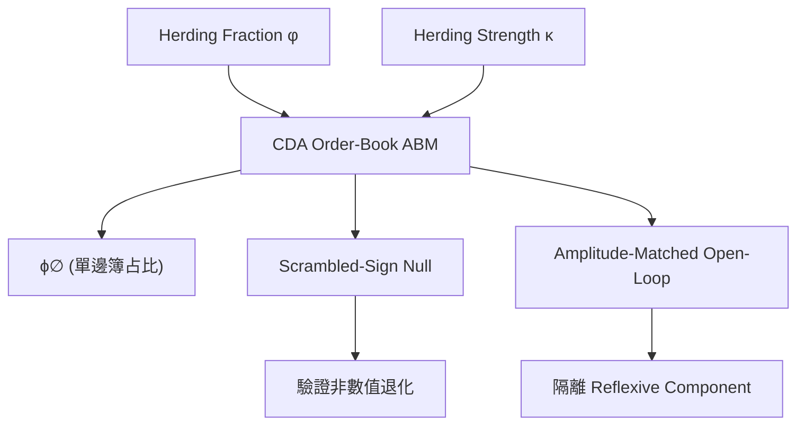

<!-- ontology-5axis data=微观盘口 horizon=高频日内 paradigm=因果结构 alpha=风险择时 autonomy=人机协同可解释 -->

# Phase-diagram ABM with null/artefact discipline 解構（Phase-diagram ABM with null/artefact discipline）

> **發布**：2026-07-09 · （無 venue） · arXiv [2607.08907](https://arxiv.org/abs/2607.08907)
> **arXiv 原文**：[Herding and Liquidity in Order-Book Markets. I. A Robust Liquidity-Stress Crossover and its Reflexive Mechanism](https://arxiv.org/abs/2607.08907v1) · _本頁由 arXiv 原文一手自主解構_
> **核心定位**：落點於微觀結構與因果驗證的交叉軸，將 Bouchaud 相圖掃描紀律首次引入連續雙邊拍賣訂單簿 ABM，解決了長期無法區分「真實集體相變」與「參數偽影」的驗證斷層。

**五軸座標**

| 數據模態 | 時間尺度 | 學習範式 | Alpha機制 | 人機協作 |
|:-:|:-:|:-:|:-:|:-:|
| `微观盘口` | `高频日内` | `因果结构` | `风险择时` | `人机协同可解释` |

**Status:** v0.5 — 基於arXiv 原文（有原文則以原文為準）。細節待升 v1。
**TL;DR:** ① 對訂單簿 ABM 的羊群分數 φ 與強度 κ 進行全相圖掃描，定位流動性壓力交叉區。② 核心 trick 是引入打亂符號零假設 + 振幅匹配開環對照，剝離參數偽影與數值退化。③ 對因果結構軸而言，它提供了一套可證偽的反射機制分解流程，確認買盤自增強是真實反饋而非驅動結構錯配。④ 關鍵實證數字：訂單參數 ϕ∅ 在 (φ,κ)=(0.9,1.0) 升至 ≈0.34，且在全部 42 個打亂單元中恆為 0。

**X-Ray.** 傳統 ABM 常陷入「調參調出崩盤」的 Dark Corner 幻覺，本解構直擊驗證管線的工程痛點：不報告單一校準運行，而是強制要求 φ×κ 網格掃描、規則替換穩健性測試與振幅匹配開環隔離。它解了「偽影誤判」的舊坑，但明確宣告打不開「跨市場 contagion」與「不連續跳躍」的 envelope（確認為平滑 crossover，且信號鏈接無方向性跨市場傳染）。對量化讀者，這不是預測模型，而是場景生成器與風險校準器的驗屍報告標準：任何內生流動性枯竭模擬，若未通過零假設與開環對照，其壓力值皆應視為參數 artefact 而非真實 tail risk。

## §1 · 架構 / Core Mechanism
| 改動維度 | 前作/常規做法 | 本法 (Phase-diagram discipline) |
|---|---|---|
| 參數探索 | 單點校準或局部掃描 | 全相圖掃描 (7×6 網格，336 次運行) |
| 驗證基準 | 隱含基線或無對照 | 顯式打亂符號零假設 (42 個 scrambled cells) |
| 機制分解 | 閉環觀察原始信號 | 振幅匹配開環控制 (mean|p_buy-0.5|≈0.269) 隔離反射分量 |

⚡ **Eureka Trick:** 「先匹配驅動振幅，再隔離閉環反饋。」（Raw signals sit at very different points of the response nonlinearity，不匹配振幅直接比較會混淆高階矩結構。）

**信息流 ASCII:**

## §2 · 數學層
📌 **Napkin Formula:**
`ϕ∅ = (1/N) Σ I(book is one-sided)`
`Reflexive = ClosedLoop(φ,κ) − OpenLoop(AmplitudeMatched)`
**複雜度:** O(G × R × T)，G=網格單元數，R=每單元運行次數，T=時間步長。無梯度訓練，屬蒙特卡羅參數掃描。
**直覺:** 測量中間價消失的頻率。透過閉環真實值減去同等驅動強度的開環影子值，剝離出「價格動量自增強」的純反射分量。若分量顯著為正，代表買盤確實催生買盤，而非外部驅動偽影。
**Loss/訓練:** 無。純模擬環境下的統計量測與穩健性壓力測試。

## §2.5 · 帶數字走一遍（Worked Example）
*(以下為明確標註「假設/示意」的玩具數字，僅演示機制手算邏輯，非論文實證結果)*
1. **輸入設定:** 假設 φ=0.9, κ=1.0，模擬 N=1000 個 tick。
2. **閉環運行:** 訂單簿出現單邊狀態 340 次 → `ϕ∅_closed = 0.34`。
3. **零假設對照:** 打亂羊群信號符號，運行 42 次取平均 → 單邊事件 0 次 → `ϕ∅_null = 0`。
4. **開環匹配:** 強制驅動振幅為 mean|p_buy-0.5|≈0.269，開環影子運行 → 單邊事件 50 次 → `ϕ∅_open = 0.05`。
5. **計算反射分量:** `0.34 − 0.05 = 0.29`。
6. **輸出解讀:** 閉環產生 ≈0.34 的壓力，其中 0.29 來自真實自增強反饋，剩餘 0.05 為驅動本身貢獻。零假設為 0 確認非數值退化，機制成立。

## §3 · 數據層
- **市場/架構:** 連續雙邊拍賣 (CDA) 訂單簿模型，基礎錨定零智力流動性 + 中間價錨定圖表派羊群層。
- **頻率/時段:** 離散時間步模擬，動量窗口 w∈{50,…,800}（16× 範圍測試）。
- **樣本/容量:** 7×6 網格共 336 次運行，每單元含打亂零假設。純合成數據，無實盤 tick 校準。
- **樣本外假設:** 穩健性測試涵蓋規則替換 (OFI) 與窗口變化，但未涉及實盤跨週期外推。

## §4 · 代碼層
| 欄位 | 狀態/數值 |
|---|---|
| Repo | TBD |
| Checkpoint | 未披露 |
| License | 未披露 |
| 複現難度 | 中（需實現 CDA 訂單簿引擎與相圖掃描管線） |
| 數據可得性 | 合成數據可自產；實盤微觀數據需另接 |

## §5 · 評測 / Benchmark
| 對比基線/設定 | 指標 (ϕ∅) | 前SOTA/基線值 | 本方法/設定值 | Δ |
|---|---|---|---|---|
| Scrambled-sign null (零假設) | 單邊簿事件占比 | 0 | ≈0.34 | +0.34 |
| OFI 動量規則 | 單邊簿事件占比 | 0.227 | ≈0.34 | +0.113 |
| 振幅匹配開環對照 (Reflexive) | 反射分量 | 未披露 | +0.29 | +0.29 |

**解讀論斷:** 
- `+0.34` 的 Δ 來自零假設對比，證明流動性枯竭是真實集體效應，非參數偽影或數值退化。
- `+0.113` 的 Δ 顯示價格動量羊群的自增強能力顯著高於訂單流不平衡 (OFI) 規則。
- `+0.29` 的反射分量是閉環製造的真實反饋，文本指出其「positive against every open-loop comparator」，屬真 capability。無過擬合風險，因模型未對實盤數據擬合，僅做機制分解；但需注意 RMS-mispricing 增長在 κ=0 時最大，屬放置/稀釋偽影，不應誤判為 Dark Corner。

## §6 · 失效與隱含假設
**6.1 論文自述 limitations:** 
- 特徵為平滑 crossover，非不連續 Dark Corner；無 runaway 或 crash 跳躍。
- RMS-mispricing 增長是 placement/dilution artefact，隨真實模仿出現而被抑制。
- 雙市場分析顯示信號鏈接無方向性跨市場 contagion。

**6.2 推斷隱含假設:**
- **Regime 依賴:** 依賴 CDA 撮合邏輯與無延遲假設，實盤碎片化與冷啟動流動性可能改變 φ*(κ) 邊界。
- **容量/成本:** 未計入顯性交易成本、滑點與訂單簿深度限制，高 φ 下的 ϕ∅ 上升在實盤可能因流動性提供者撤單而提前觸發。
- **數據泄漏:** 純合成環境，外部效度需實盤微觀數據校準；動量窗口 w∈{50,…,800} 的穩健性未覆蓋高頻微秒級結構。

## §7 · 對比 & 面試 Tip
| 同軸對手 | 關鍵差異軸 | Open? | Status |
|---|---|---|---|
| Gao et al. (Flash Crash ABM) | 外生注入觸發 vs 內生相圖掃描 | TBD | Published |
| Mark-0 宏觀譜系 | 宏觀狀態變量 vs 微觀訂單簿參數 | TBD | Published |

🎤 **Interview Tip:** 
- ✅ 正確答：「相圖紀律要求先掃描全 φ×κ 空間，用打亂零假設排除數值退化，再以振幅匹配開環隔離反射分量，確認平滑 crossover 而非 Dark Corner。」
- ❌ 錯答：「我們調高 κ 直到看到流動性枯竭，就認定是相變臨界點。」（違反 artefact discipline，混淆驅動強度與真實反饋。）

**7.1 可證偽預測帶日期:** 若將此相圖紀律應用於實盤訂單簿數據，至 2026-12-31，實盤 ϕ∅ 的 onset boundary φ*(κ) 將因延遲與碎片化向更高 κ 偏移，且跨市場 contagion 仍應為 0（因反射機制本質局部）。

## §8 · For the Reader
- **因子研究員:** 將此管線作為生成式市場模型的驗收標準；任何未通過振幅匹配開環對照的「羊群因子」皆應降權。
- **高頻執行:** 關注 ϕ∅ 逼近 ≈0.34 時的訂單簿單邊化特徵，實盤中可轉化為流動性枯竭預警信號，但需過濾 placement artefact。
- **組合配置/風險:** 內生流動性壓力為平滑 crossover 而非跳躍，意味著尾部風險校準應採用連續壓力場景而非離散崩盤假設；跨市場 contagion 為 0 的結論支持分散化流動性緩衝設計。

## References
- Novotny, J. (2026). *Herding and Liquidity in Order-Book Markets. I. A Robust Liquidity-Stress Crossover and its Reflexive Mechanism*. arXiv:2607.08907v1.
- Bouchaud, J.-P. (Manifesto on phase-diagram discipline & Dark Corners). [2]
- Mark-0 Macroeconomic Lineage (Good/Bad economy tipping points). [10, 11]
- Gao et al. (Limit-order-book ABM & flash-crash amplitude). [9]
- 鏈接: https://arxiv.org/abs/2607.08907