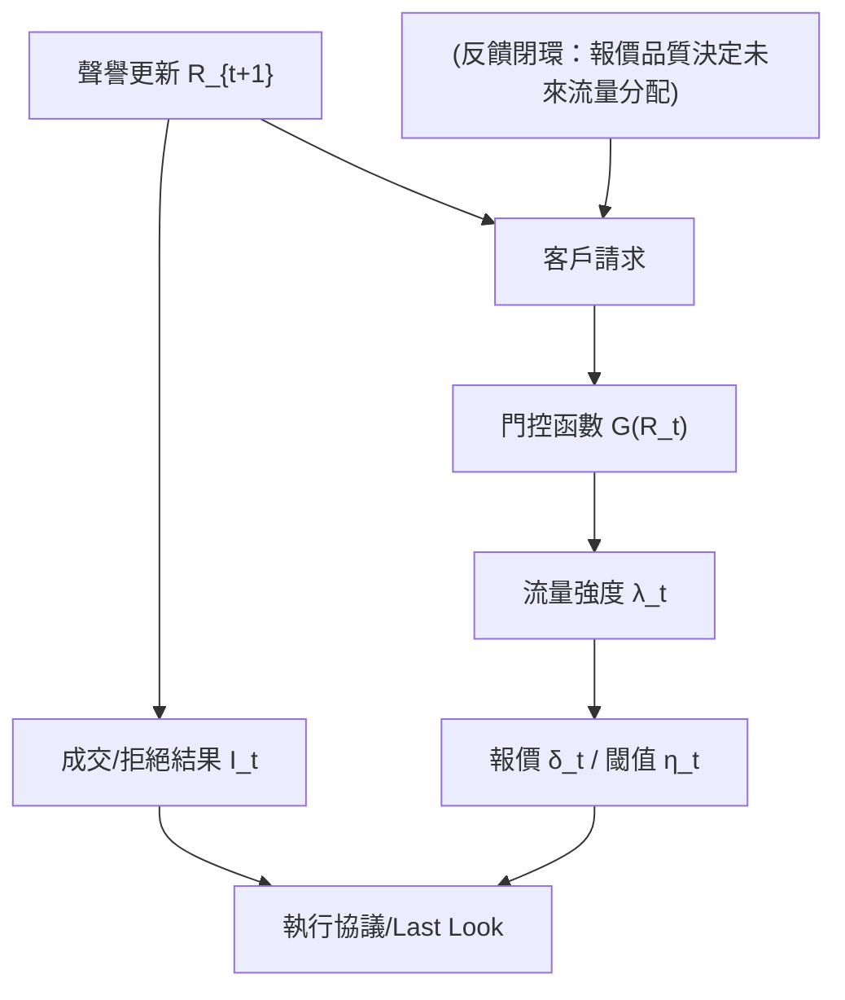

<!-- ontology-5axis data=微观盘口 horizon=高频日内 paradigm=强化学习 alpha=组合执行优化 autonomy=全自动黑盒 -->

# Stochastic Optimal Control with Reputation Gates 解構（Stochastic Optimal Control with Reputation Gates）

> **發布**：2026-07-13 · （無 venue） · arXiv [2607.11328](https://arxiv.org/abs/2607.11328)
> **arXiv 原文**：[Strategic OTC market making with reputation feedback](https://arxiv.org/abs/2607.11328v2) · _本頁由 arXiv 原文一手自主解構_
> **核心定位**：將 OTC 做市從「單筆報價最優」升級為「聲譽狀態驅動的法務/流量動態規劃」，填補了經典隨機控制模型中流量強度外生假設的 prior gap。

**五軸座標**

| 數據模態 | 時間尺度 | 學習範式 | Alpha機制 | 人機協作 |
|:-:|:-:|:-:|:-:|:-:|
| `微观盘口` | `高频日内` | `强化学习` | `组合执行优化` | `全自动黑盒` |

**Status:** v0.5 — 基於arXiv 原文（有原文則以原文為準）。細節待升 v1。
**TL;DR:** 構建含聲譽反饋的 OTC 做市隨機控制模型，將 RFQ 勝率與流媒體成交率建模為指數衰減狀態，並透過門控函數反饋至未來流量。核心 trick 在於利用慢快近似（slow-fast approximation）解耦 HJB 方程，揭示報價策略在聲譽積累與變現間的動態權衡及雙穩態現象。這對 `alpha=组合执行优化` 軸的意義在於：將執行質量內生化為流量分配的前置條件，打破傳統 Avellaneda-Stoikov 框架的外生流度假設。來源未給量化結果。

**X-Ray.** 放回五軸 Pareto，本法落在 `autonomy=全自动黑盒` 與 `alpha=组合执行优化` 的交界，用解析控制取代純 RL 試錯，解決了高頻執行中「流量分配黑盒」的工程坑。舊模型假設訂單流強度 $\lambda$ 為常數或外生過程，本法將其內生為聲譽狀態 $R_t$ 的函數 $G(R_t)$。預測它打不開的 envelope 在於：慢快近似依賴聲譽變化遠慢於庫存波動，若市場進入高頻 regime 切換（如 flash crash 或流動性真空），adiabatic 假設失效，門控反饋將產生滯後誤判。對量化讀者的意義是提供了一套可微的流量分配先驗，可作為 RL 策略的 reward shaping 或 constraint 層，而非直接替換底層執行器。

## §1 · 架構 / Core Mechanism
### 1.1 三大改動 vs 前作
| 維度 | 經典隨機做市 (Avellaneda-Stoikov 系) | 本法 (Reputation Gates) | 工程影響 |
|---|---|---|---|
| 流量強度 $\lambda$ | 外生常數/泊松過程 | 內生於門控函數 $G_A(R^A), G_B(R^B)$ | 報價需同時優化短期利差與長期流量份額 |
| 狀態空間 | 僅庫存 $Q_t$ 與現金 $X_t$ | 擴充二維聲譽狀態 $R=(R^A, R^B)$ | HJB 維度上升，需慢快近似降維 |
| 執行協議 | 單層報價 | RFQ (Tier AA) + Streaming (Tier BB) + Last Look 閾值 $\eta$ | 引入期權式截斷機制，控制毒性滑點 |

### 1.2 ⚡ Eureka 一句話 trick
將 RFQ 勝率與 Streaming 成交率建模為指數衰減聲譽狀態，透過門控函數 $G(R)$ 反饋至未來流量強度，並利用慢快近似（聲譽慢、庫存快）將二維 HJB 解耦為確定性漂移方程。

### 1.3 信息流 ASCII 圖

## §2 · 數學層
### 📌 Napkin Formula
HJB 方程（慢快近似後）：
$$\rho V(R) = \max_{\delta, \eta} \left\{ \mathcal{H}_{fast}(Q; \delta, \eta) + \nabla_R V(R) \cdot \mu_R(R) \right\}$$
複雜度：從 3D (Q, X, R) 降為 2D (R) 確定性漂移 + 1D 庫存瞬時最優。
直覺：聲譽狀態變化極慢，可視作「凍結」參數求解庫存最優報價 $\delta^*$，再將 $\delta^*$ 對庫存分佈取期望，得到聲譽的確定性漂移 $\mu_R$。Loss/訓練細節：本法為解析隨機控制，無神經網絡訓練 loss；數值求解依賴有限差分或特徵線法迭代 HJB。

## §2.5 · 帶數字走一遍（Worked Example）
（以下為**假設/示意**玩具數字，僅演示機制，非實證結果）
1. 初始狀態：$R^A = 0.50$, $R^B = 0.60$。門控函數 $G(R) = R$（線性示意）。
2. 流量分配：基線 RFQ 強度 $\lambda^{A} = 10$ req/s，Streaming $\lambda^{B} = 20$ req/s。實際到單：$\lambda^{A}_{eff} = 10 \times 0.50 = 5$，$\lambda^{B}_{eff} = 20 \times 0.60 = 12$。
3. 報價與執行：Dealer 報價偏離 mid 2bp。RFQ 勝率 $f^A=0.4$，Streaming 接受率 $f^B=0.8$。
4. 聲譽更新（$\alpha=0.01$）：
   - RFQ 未贏（$I^A=0$）：$R^A_{new} = (1-0.01)\times 0.50 + 0.01\times 0 = 0.495$
   - Streaming 成交（$I^B=1$）：$R^B_{new} = (1-0.01)\times 0.60 + 0.01\times 1 = 0.61$
5. 下一輪反饋：$R^A$ 下降導致 $\lambda^{A}_{eff}$ 降至 4.95（流量萎縮）；$R^B$ 上升導致 $\lambda^{B}_{eff}$ 升至 12.2（流量傾斜）。Dealer 被迫在下一輪調整 $\delta$ 以平衡聲譽衰減與庫存風險。

## §3 · 數據層
| 維度 | 內容 |
|---|---|
| 市場/協議 | 電子 OTC 市場，分 Tier AA (RFQ) 與 Tier BB (Streaming) |
| 價格過程 | 參考 mid price $S_t$ 為布朗運動，波動率 $\sigma>0$ |
| 時段/頻率 | 有限操作區間 \$[0,T]\$，連續時間模型 |
| 樣本外/容量 | 未披露 |
| 數據來源 | 未披露（理論框架推導） |

## §4 · 代碼層
| 維度 | 內容 |
|---|---|
| Repo | TBD |
| Checkpoint | 未披露 |
| License | CC BY 4.0 |
| 複現難度 | 中高（需手動實現 HJB 有限差分與慢快近似迭代） |
| 數據可得性 | 未披露（需自構 OTC 執行日誌或模擬器） |

## §5 · 評測 / Benchmark
| 數據集/市場 | Metric(IR/Sharpe/AR/MDD) | 前SOTA | 本方法 | Δ |
|---|---|---|---|---|
| 未披露 | IR / Sharpe | 未披露 | 未披露 | 未披露 |
| 未披露 | MDD / 滑點 | 未披露 | 未披露 | 未披露 |
| 未披露 | 流量份額/勝率 | 未披露 | 未披露 | 未披露 |
解讀：本文為純理論隨機控制框架，未提供回測或實盤數字。文中介紹的「雙穩態（bistability）」與「聲譽積累/變現週期」為定性動力學特徵，非統計顯著性指標。若未來實證，需警惕慢快近似在低流動性時段（$\lambda$ 極小）的離散化誤差，以及門控函數 $G(R)$ 參數化帶來的過擬合風險。

## §6 · 失效與隱含假設
### 6.1 論文自述 limitations
- 單做市商（single dealer）框架，未建模多邊競爭博弈。
- 忽略 RFQ 拒絕行為（為簡化僅建模 Streaming 的 Last Look 拒絕）。
- 忽略盤後毒性（post-trade adverse selection）與跨期庫存成本精確定價。
- 聲譽更新為指數平滑，未考慮客戶記憶的非線性斷層或懲罰非對稱性。

### 6.2 推斷的隱含假設
- **Regime 依賴**：慢快近似假設聲譽時間尺度 $\gg$ 庫存翻轉時間尺度。若市場進入高頻震盪或流動性枯竭，adiabatic 分離失效，控制策略將產生滯後。
- **容量假設**：「法務價值（franchise value）」隱含容量上限。當 $R$ 過高導致流量爆發時，庫存風險 $\ell(Q)$ 可能突破資本約束，模型未內生化 capital charge。
- **數據泄漏/前瞻**：門控函數 $G(R)$ 依賴歷史執行品質。實盤中需嚴格區分 $R_t$ 的計算截止點與報價決策點，否則易引入 look-ahead bias。

## §7 · 對比 & 面試 Tip
| 同軸對手 | 關鍵差異軸 | Open? | Status |
|---|---|---|---|
| Classical MM (Avellaneda-Stoikov) | 流量外生 vs 內生聲譽反饋 | N/A | 理論基線 |
| RL Execution (PPO/SAC) | 黑盒試錯 vs 解析 HJB 慢快近似 | N/A | 工程主流 |
| Adversarial Selection Models | 單次毒性對沖 vs 跨期流量分配權衡 | N/A | 風險管理 |

🎤 **Interview Tip**
- **正確答**：本法核心不在於預測價格，而在於將「執行品質」內生化為「流量分配」的狀態變量。慢快近似是為了解耦 HJB 維度災難，實盤需驗證聲譽衰減率 $\alpha$ 與市場微結構時間尺度的匹配度。
- **錯答**：這就是一個加了獎勵函數的 RL 模型，可以直接用 PPO 訓練。/ 聲譽越高報價越寬，因為要變現。

### 7.1 可證偽預測帶日期
若於 2026-12-31 前發布實證版本，預測其回測 Sharpe 提升將主要來自 Streaming 層面的毒性過濾（$\eta$ 閾值優化），而非 RFQ 勝率提升；若門控函數 $G(R)$ 未加入非對稱懲罰項，高波動 regime 下將出現聲譽斷崖式衰減（reputation crash）。

## §8 · For the Reader
- **高頻執行/做市**：將 $G(R)$ 作為執行路由器的動態權重，替代靜態 VIP 分級。注意 $\alpha$ 需按資產流動性分層設定。
- **RL 策略研究員**：本法提供了一條解析 reward shaping 路徑。可將 $\nabla_R V(R) \cdot \mu_R$ 作為 RL 的 intrinsic reward，約束 agent 在探索期不破壞長期流量份額。
- **組合配置/風險**：關注「雙穩態」隱含的閾值效應。當 $R$ 跌破臨界值，流量可能非線性歸零。需將聲譽狀態納入 VaR 的流動性壓力測試矩陣。

## References
- Barzykin, A. (2026). *Strategic OTC market making with reputation feedback*. arXiv:2607.11328v2.
- Lineage: Avellaneda & Stoikov (2008) → Guéant et al. (2013) → Last Look / Adverse Selection (Cartea & Jaimungal) → 本法內生流量門控。
- 來源鏈接：[arXiv 原文](https://arxiv.org/abs/2607.11328)