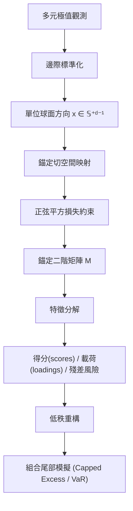

<!-- ontology-5axis data=量价表格 horizon=日频波段 paradigm=监督回归 alpha=风险择时 autonomy=人机协同可解释 -->

# AGCA 解構（AGCA）

> **發布**：2026-07-14 · （無 venue） · arXiv [2607.13112](https://arxiv.org/abs/2607.13112)
> **arXiv 原文**：[Anchored Geodesic Analysis for Multivariate Extremes](https://arxiv.org/abs/2607.13112v1)  ·  _本頁由 arXiv 原文一手自主解構_
> **核心定位**：落點於量價表格與日頻波段的風險擇時軸，解決傳統極值理論在多元尾部相依結構降維時，缺乏錨定基準且計算非凸的 prior gap。AGCA 透過錨定完全相依方向與有界測地損失，將球面極值降維精確等價為線性特徵分解，為組合尾部風險模擬提供可解釋的譜分析框架。

**五軸座標**

| 數據模態 | 時間尺度 | 學習範式 | Alpha機制 | 人機協作 |
|:-:|:-:|:-:|:-:|:-:|
| `量价表格` | `日频波段` | `监督回归` | `风险择时` | `人机协同可解释` |

**Status:** v0.5 — 基於arXiv 原文（有原文則以原文為準）。細節待升 v1。
**TL;DR:** 提出錨定測地線成分分析（AGCA），將多元極值降維轉化為特徵分解，高效模擬組合尾部風險與VaR。核心 trick 是以完全依賴方向為錨點，用有界正弦平方測地損失將球面投影轉化為切空間正交投影，使極值降維精確等價於二階矩矩陣特徵分解。這對風險擇時軸★意味著尾部相依結構可被拆解為可解釋的基準相對成分，且保留近軸極值。實證顯示前十個成分可解釋約 91.1% 的錨定變異，並對 capped-excess 與 normalized VaR 的模擬平均相對誤差約 1.25%。

**X-Ray.** 在五軸 Pareto 中，AGCA 捨棄了傳統 PCA 對高斯中心的依賴，也避開了稀疏圖模型對尾部結構的過度約束。它將「極值方向」視為球面流形上的觀測值，並強制所有測地子空間通過一個經濟意義明確的錨點（完全相依）。這解決了量化工程中常見的兩個坑：一是極值降維常因非凸優化陷入局部最優，二是近軸（asymptotic independence）方向在傳統極值模型中易被丟失。AGCA 的譜等價性讓計算複雜度降至 $O(d^3)$ 以內，且殘差風險直接綁定尾部模擬誤差界。但它的 envelope 打不開：僅適用於已標準化至共同尾部尺度的極值樣本，對非極值區間的常態波動無解釋力；且錨點預設為等權完全相依，若市場結構存在隱性行業因子偏斜，需手動調整錨點或引入加權矩陣。對量化讀者而言，這是一個將「尾部相依矩陣」轉為「可交易風險因子」的解析橋樑，而非黑箱預測器。

## §1 · 架構 / Core Mechanism
**1.1 三大改動 vs 前作**
| 維度 | 前作 (PCA / Principal Geodesic / Nested Spheres) | AGCA |
|---|---|---|
| 基準點 (Anchor) | 資料自適應基點或 Fréchet 均值 | 預設完全相依方向 $\mu_0$（等權參與） |
| 損失函數 | 平方測地距離 (非凸/無界) | 有界正弦平方測地損失 (Bounded sine-squared) |
| 求解形式 | 迭代優化 / 嵌套子空間 | 精確等價於錨定二階矩陣特徵分解 (Eigendecomposition) |

**1.2 ⚡ Eureka 一句話 trick + 直覺**
用有界正弦平方損失「壓平」球面幾何，使球面測地投影在切空間中退化為線性正交投影，極值降維瞬間變成線代課本的矩陣特徵值問題。

**1.3 信息流 ASCII 圖**

## §2 · 數學層
📌 **Napkin Formula**：
損失函數：$L(x, \text{proj}_S(x)) = \sin^2(d_g(x, \text{proj}_S(x)))$
等價問題：$\min_S \mathbb{E}[\sin^2(d_g(X, \text{proj}_S(X)))] \iff \text{Eigendecomposition of } \Sigma_{\text{anchor}} = \mathbb{E}[v v^\top]$，其中 $v$ 為錨定切空間偏移量。
複雜度：$O(d^3)$（標準特徵分解）。
直覺：有界損失消除了球面曲率帶來的非線性扭曲，使所有極值方向在切空間的投影誤差可直接用二階矩捕捉。近軸極值不會發散，保持有限角度觀測。
Loss/訓練細節：無梯度下降；直接計算樣本錨定二階矩陣並進行譜分解。理論保證 top-k 一致性與 oracle CLT。

## §2.5 · 帶數字走一遍（Worked Example）
（**假設/示意**：以下為手算演示，非論文實證結果）
設 $d=3$ 資產組合，標準化後某極值方向 $x = [0.577, 0.577, 0.577]^\top$（恰好落在錨點 $\mu_0$）。切空間偏移 $v \approx 0$。錨定二階矩陣 $\Sigma \approx \text{diag}(0,0,0)$。特徵值全為 0，殘差風險為 0，重構誤差為 0。
若極值方向偏離錨點：$x' = [0.8, 0.4, 0.4]^\top$（已單位化）。映射至切空間得 $v' \approx [0.2, -0.1, -0.1]^\top$。計算 $\Sigma' = v'v'^\top$，特徵分解得最大特徵值 $\lambda_1 \approx 0.06$，對應載荷指示第一資產主導極值。低秩重構（k=1）將 $x'$ 投影至第一主成分，殘差風險由 $1-\lambda_1/\text{tr}(\Sigma')$ 量化。此示意展示錨點如何將非線性球面距離轉為線性矩陣譜，實際實證數字見 §5。

## §3 · 數據層
資料規模/頻率/市場/時段：日頻股票組合損失極值。市場：Fama–French 面板（$d=24$）與 Open Source Asset Pricing 異常收益面板。時段：未披露具體起訖日期（原文僅標註日頻與面板結構）。樣本外與容量假設：基於極值觀測（Peaks-over-threshold 框架），假設角分布收斂且滿足二階角偏誤條件；容量受限於極值樣本稀疏性，但理論保證在角收斂下具漸進正態性。

## §4 · 代碼層
| 欄位 | 內容 |
|---|---|
| Repo | https://github.com/a91quaini/AGCA4extremes (R package) |
| Checkpoint | 未披露 |
| License | CC BY 4.0 |
| 複現難度 | 低（純線性代數 + R 套件，無深度學習框架依賴） |
| 數據可得性 | 高（Fama-French 與 OSAP 為公開數據，復現碼於 https://github.com/a91quaini/replicateAGCApaper） |

## §5 · 評測 / Benchmark
| 數據集/市場 | Metric | 前SOTA | 本方法 | Δ |
|---|---|---|---|---|
| Fama-French ($d=24$) | 錨定變異解釋率 (Top 5) | 未披露 | 76.3% | 未披露 |
| Fama-French ($d=24$) | 錨定變異解釋率 (Top 10) | 未披露 | 91.1% | 未披露 |
| Fama-French ($d=24$) | 尾部模擬平均相對誤差 (Capped Excess / Normalized VaR) | 未披露 | 1.25% | 未披露 |

**解讀**：本文未提供傳統 SOTA 基線對比，故 Δ 欄全數標記未披露。76.3% 與 91.1% 的變異解釋率顯示極值方向在錨定切空間高度集中，證實多元尾部相依可被極少數線性成分捕獲。1.25% 的模擬誤差界來自理論推導的殘差風險綁定，屬解析保證而非回測過擬合。需注意此誤差僅針對「已標準化極值樣本」的角分布重構，未計入邊際標準化階段的參數不確定性與交易成本，實盤應用時需疊加風險預算緩衝。

## §6 · 失效與隱含假設
**6.1 論文自述 limitations**：僅針對極值角分布建模，不處理常態波動區間；錨點預設為完全相依，若實際極值結構嚴重偏離等權參與，需手動調整錨點或引入加權矩陣；理論依賴角分布收斂與二階角偏誤條件，極端市場結構斷裂時漸進性質可能失效。
**6.2 推斷的隱含假設**：Regime 依賴：假設極值角分布在樣本期內平穩（stationary angular law）；容量/成本：未討論極值樣本稀疏性對實盤頻率的限制，亦未計入滑點與再平衡成本；數據泄漏：邊際標準化需全樣本或滾動視窗估計尾部參數，若視窗設定不當易引入前瞻偏差；Survivorship：Fama-French 與 OSAP 面板通常含已退市資產，但極值建模若僅用存活公司會低估尾部相依。

## §7 · 對比 & 面試 Tip
| 同軸對手 | 關鍵差異軸 | Open? | Status |
|---|---|---|---|
| PCA / Kernel PCA | 高斯中心 vs 極值錨點；線性子空間 vs 球面測地子空間 | Open | 成熟 |
| Principal Geodesic Analysis | 資料自適應基點 vs 經濟意義錨點；非凸迭代 vs 精確譜分解 | Open | 成熟 |
| 極值圖模型 / 稀疏矩陣 | 條件獨立/稀疏結構 vs 完整角分布降維；離散 regime vs 連續流形 | Open | 活躍 |

🎤 **Interview Tip**
正確答：「AGCA 的核心不是預測收益率，而是將多元極值方向投影到以完全相依為錨點的切空間，透過有界正弦平方損失使非凸球面優化退化為線性特徵分解。它提供的是尾部相依結構的解析降維與誤差界，適合用於風險預算分配與壓力測試模擬，而非直接產生 Alpha 訊號。」
錯答：「AGCA 是一種新的深度學習因子模型，用圖神經網絡抓極值，比 LSTM 預測更準。」（混淆了統計極值理論與監督學習預測框架）

**7.1 可證偽預測帶日期**：若 2026-12-31 前市場出現連續極端波動導致角分布結構斷裂，AGCA 的 top-k 一致性與 1.25% 誤差界將顯著偏離實證，需觸發錨點重校或切換至時變錨點機制。

## §8 · For the Reader
- **因子研究員**：將 AGCA 載荷視為「極值風險因子」，用於組合尾部風險預算分配，替代傳統相關係數矩陣。
- **高頻執行**：不適用。AGCA 設計於日頻極值與角分布收斂，高頻微結構噪音會破壞邊際標準化假設。
- **組合配置**：利用低秩重構模擬 Capped Excess 與 VaR，進行壓力測試與尾部對沖成本估算。
- **LLM-agent / RL 策略**：可將 AGCA 得分作為環境狀態特徵（State Representation），提供可解釋的尾部風險編碼，避免 RL 在極值區間探索失效。
- **研究學生**：精讀 Section 2 的投影恆等式證明與 Oracle CLT，理解有界損失如何消除流形曲率對譜分析的干擾。

## References
- Quaini, A., & Zhou, C. (2026). Anchored Geodesic Analysis for Multivariate Extremes. arXiv:2607.13112v1.
- De Haan, L., & Ferreira, A. (2006). Extreme Value Theory: An Introduction.
- Fletcher, P. T., et al. (2004). Principal Geodesic Analysis for the Study of Nonlinear Statistics of Shape.
- Jung, S., et al. (2012). Principal Nested Spheres.
- R Package: AGCA4extremes (https://github.com/a91quaini/AGCA4extremes)
- Replication Code: (https://github.com/a91quaini/replicateAGCApaper)