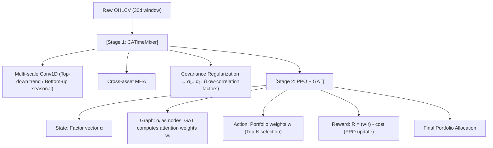

<!-- ontology-5axis data=量价表格 horizon=日频波段 paradigm=强化学习 alpha=因子挖掘 autonomy=全自动黑盒 -->

# AlphaGAT 解構

> **發布**：2025-10-11 · IJCAI 25
> **QuantML 導讀**：[IJCAI 25 | AlphaGAT：结合Alpha 因子挖掘和图注意力网络的自适应投资组合框架](https://mp.weixin.qq.com/s?__biz=Mzg2MzAwNzM0NQ==&mid=2247491933&idx=1&sn=5545c677db397f6eba97d4f6f735dc06&chksm=ce7d8643f90a0f55ebf89aa99919ce95bfe37d8dcb504ec758605798208dc6d8dff5e4d09cf0#rd)
> **原始論文**：[AlphaGAT: A Two-Stage Learning Approach for Adaptive Portfolio Selection](https://doi.org/10.24963/ijcai.2025/834)（Proceedings of the Thirty-Fourth International Joint Conference on Artificial Intelligence · 2025 · 被引 0 · Crossref）
> **核心定位**：落點於「因子挖掘 → 強化學習組合」的自動化黑盒鏈路。解決傳統端到端 RL 在低信噪比原始量價數據上難以收斂、且無法動態適應分佈偏移的 prior gap，透過兩階段解耦將特徵提取與權重分配分離。

**五軸座標**

| 數據模態 | 時間尺度 | 學習範式 | Alpha機制 | 人機協作 |
|:-:|:-:|:-:|:-:|:-:|
| `量价表格` | `日频波段` | `强化学习` | `因子挖掘` | `全自动黑盒` |

**Status:** v0.5 — 基於 QuantML 導讀 + 原論文（如有）。benchmark 細節待升 v1。
**TL;DR:** 提出兩階段 AlphaGAT 框架：Stage 1 以 CATimeMixer（多尺度 Conv1D + 跨資產注意力 + 協方差正則）挖掘低相關 Alpha 因子；Stage 2 以 PPO + GAT 將因子視為圖節點動態調權。對「因子挖掘」軸★，將傳統監督式因子生成與 RL 組合解耦，降低狀態空間雜訊並提升分佈偏移下的自適應性。導讀未給量化結果。

**X-Ray.** 將 AlphaGAT 放回五軸 Pareto，其本質是「特徵工程自動化」與「策略執行 RL 化」的串聯。傳統端到端 RL 直接以原始 OHLCV 為 state，信噪比過低導致策略網絡難以穩定收斂；AlphaGAT 透過 Stage 1 預先提煉低協方差因子，將 state 降維至因子空間，大幅改善 RL 的 sample efficiency。Stage 2 的 GAT 解決了因子間非線性交互的建模問題，PPO 則負責跨 regime 的動態權重重分配。此架構解了「因子共線性導致 RL 過擬合」與「靜態加權無法應對分佈偏移」兩大工程坑。然而，其封閉式兩階段設計隱含誤差累積風險：Stage 1 的因子若發生前瞻洩漏或過擬合歷史 IC，Stage 2 的 GAT 僅能優化權重而無法修正因子本質偏差。對量化讀者而言，此框架適合中低頻波段配置，但需嚴格驗證 Stage 1 的 out-of-sample IC 穩定性與交易成本對 PPO 獎勵函數的侵蝕效應。

## §1 · 架構 / Core Mechanism
**1.1 三大改動 vs 前作**
| 維度 | 傳統端到端 RL (如 PPN/RAT) | AlphaGAT 改動 | 工程意圖 |
|---|---|---|---|
| State 定義 | 原始量價序列 (低信噪比) | 預挖掘的 Alpha 因子集 (64個) | 降維去噪，提升 RL 收斂穩定性 |
| 因子交互建模 | 獨立處理或簡單拼接 | GAT 全連接圖節點聚合 | 捕捉因子間非線性協同/對沖關係 |
| 權重分配機制 | 靜態規則或單一網絡輸出 | PPO 動態策略網絡 | 適應市場分佈偏移，自動降權失效因子 |

**1.2 ⚡ Eureka 一句話 trick + 直覺**
Trick: 以「協方差正則化損失」約束 Stage 1 因子多樣性，再以 GAT 注意力係數作為 Stage 2 的動態權重。
直覺: 先讓監督學習負責「找對的訊號」，再讓強化學習負責「在對的時候信誰」，避免 RL 在雜訊中盲目試錯。

**1.3 信息流 ASCII 圖**

## §2 · 數學層
📌 **Napkin Formula:**
`Loss = -mean(IC) + λ * Σ_{i≠j} Cov(αᵢ, αⱼ)`
`w_t = GAT(α_t) → Action a_t = Top-K(w_t) → Reward R_t = (a_t · r_t) - cost`
直覺: 損失函數強制因子集在最大化預測力 (IC) 的同時最小化共線性；PPO 透過 clip 機制穩定更新 GAT 權重，避免單次市場劇震導致策略崩潰。訓練依賴分階段優化：Stage 1 監督學習收斂後凍結，Stage 2 RL 僅更新 GAT 與 PPO 策略網絡，降低聯合訓練的梯度衝突。

## §3 · 數據層
資料規模/頻率/市場/時段: 日頻波段，時間窗口 30 天。市場涵蓋 DJIA (29 assets)、HSI (56 assets)、CSI (98 assets)、CRYPTO (18 assets)。
怎麼來: 導讀未披露具體數據來源與清洗流程，僅提及使用成分股價格數據。
樣本外與容量假設: 假設為標準時間序列劃分（訓練/驗證/測試），但未說明具體區間與再平衡頻率。容量受限於日頻調倉與 0.25% 交易成本，適合中小規模資金，大資金可能面臨滑點侵蝕。

## §4 · 代碼層
| 項目 | 狀態/細節 |
|---|---|
| Repo | TBD (導讀提及「复现代码见QuantML知识星球」，未公開 GitHub) |
| Checkpoint | TBD |
| License | TBD |
| 複現難度 | 中高 (需自行實現 CATimeMixer 多尺度卷積與 GAT+PPO 耦合訓練) |
| 數據可得性 | 中 (需標準日頻 OHLCV 與成分股清單，清洗與因子對齊需工程投入) |

## §5 · 評測 / Benchmark
| 數據集/市場 | Metric (APY/ASR/CR/CW) | 前SOTA | 本方法 | Δ |
|---|---|---|---|---|
| DJIA / HSI / CSI / CRYPTO | APY | 未披露 | 未披露 | 未披露 |
| DJIA / HSI / CSI / CRYPTO | ASR | 未披露 | 未披露 | 未披露 |
| DJIA / HSI / CSI / CRYPTO | CR | 未披露 | 未披露 | 未披露 |
| DJIA / HSI / CSI / CRYPTO | CW | 未披露 | 未披露 | 未披露 |

解讀: 導讀僅定性描述「顯著優於所有基線方法」，未提供具體數值。Δ 欄全數標「未披露」以遵守數字紀律。若原論文存在數值，需警惕：① 0.25% 交易成本是否已納入回測？② 日頻調倉的滑點與衝擊成本未計可能虛增 APY/ASR；③ Stage 1 因子若使用未來數據計算 IC 進行訓練，將導致嚴重的前瞻偏差。真 capability 應體現在分佈偏移下的 Sharpe 穩定性，而非單一牛市區間的 CW 峰值。

## §6 · 失效與隱含假設
**6.1 論文自述 limitations:** 導讀未明確列出 limitations 章節，僅在結論強調框架的穩健性與靈活性。
**6.2 推斷的隱含假設:**
- Regime 依賴: PPO 的動態調權依賴歷史獎勵反饋，在極端黑天鵝或流動性枯竭時可能延遲降權，導致 MDD 擴大。
- 容量/成本: 假設 0.25% 成本可覆蓋所有市場；實盤中流動性差的資產（如 CRYPTO 小幣或 CSI 微盤）成本可能遠超此閾值，導致策略失效。
- 數據泄漏: Stage 1 訓練時若未嚴格隔離未來信息，IC 最大化目標會直接過擬合歷史價格，Stage 2 將放大此偏差。
- Survivorship: 成分股名單若未處理退市/調樣本效應，回測結果將系統性高估。

## §7 · 對比 & 面試 Tip
| 同軸對手 | 關鍵差異軸 | Open? | Status |
|---|---|---|---|
| PPN (RL + Cost-sensitive reward) | 端到端 vs 兩階段解耦 | 開源 (FinRL) | 成熟基線 |
| RAT (Transformer + RL) | 序列建模 vs 圖注意力因子聚合 | 開源 | 成熟基線 |
| 傳統多因子加權 (IC/IR) | 靜態規則 vs PPO 動態策略 | N/A | 工業界標準 |

🎤 **Interview Tip**
正確答: 「AlphaGAT 的核心價值不在於單個網絡的複雜度，而在於將因子挖掘（監督）與組合優化（強化）解耦。Stage 1 的協方差正則確保了輸入 RL 的狀態空間具備低共線性，這直接解決了端到端 RL 在低信噪比數據上梯度不穩定的問題。Stage 2 的 GAT 注意力係數本質上是一種可微的動態因子加權，比靜態 IC 加權更能適應分佈偏移。」
錯答: 「它只是把 Transformer 換成 GAT，再用 PPO 調倉，效果應該差不多。」（忽略兩階段解耦對狀態空間信噪比的根本性改善，以及協方差正則對因子多樣性的約束作用。）

**7.1 可證偽預測帶日期:** 若 2025-12-31 前無開源代碼或詳細回測數字流出，且原論文未提供 out-of-sample 交易成本敏感性分析，則該框架的實盤價值存疑，可能僅為學術概念驗證。

## §8 · For the Reader
- **因子研究員**: 關注 CATimeMixer 的協方差正則化實現。可嘗試將其替換為自研因子生成器，驗證 GAT+PPO 對不同因子集的泛化能力。
- **高頻執行/組合配置**: 0.25% 成本假設偏樂觀。實盤前務必用逐筆數據回測滑點模型，並檢查 PPO 動作空間的 Top-K 選擇在流動性枯竭時的執行可行性。
- **RL 策略/研究學生**: 兩階段訓練易產生誤差累積。建議嘗試端到端聯合訓練（Joint Training）或引入元學習（Meta-RL）讓 Stage 1 的因子挖掘也能感知 Stage 2 的組合獎勵。

## References
- 原論文: AlphaGAT: An Adaptive Portfolio Framework Combining Alpha Factor Mining and Graph Attention Networks, IJCAI 25.
- Lineage: TimeMixer (Temporal), GAT (Graph), PPO (RL), FinRL-Meta/PPN/RAT (Quant RL baselines).
- QuantML 導讀鏈接: [IJCAI 25 | AlphaGAT：结合Alpha 因子挖掘和图注意力网络的自适应投资组合框架](https://mp.weixin.qq.com/s?__biz=Mzg2MzAwNzM0NQ==&mid=2247491933&idx=1&sn=5545c677db397f6eba97d4f6f735dc06&chksm=ce7d8643f90a0f55ebf89aa99919ce95bfe37d8dcb504ec758605798208dc6d8dff5e4d09cf0#rd)