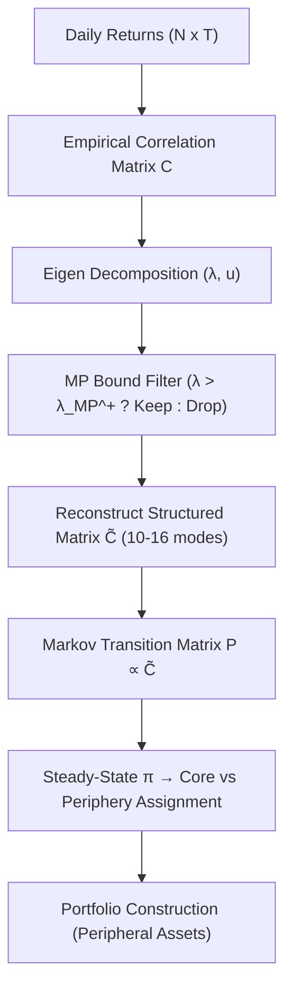

<!-- ontology-5axis data=图关系 horizon=日频波段 paradigm=因果结构 alpha=组合执行优化 autonomy=人机协同可解释 -->

# 谱去噪相关性网络 解構（谱去噪相关性网络）

> **發布**：2026-07-11 · （無 venue） · arXiv [2607.10297](https://arxiv.org/abs/2607.10297)
> **arXiv 原文**：[Recovering Structural Organization in Noisy Correlation Networks Using Financial Systems as a Testbed](https://arxiv.org/abs/2607.10297v1) · _本頁由 arXiv 原文一手自主解構_
> **核心定位**：落點於 `图关系` × `日频波段` × `组合执行优化`。解決了傳統協方差估計在 $N \approx T$ 高維區間被隨機雜訊淹沒的 prior gap，將隨機矩陣理論（RMT）的譜去噪與中尺度核心-邊緣拓撲提取整合為單一可解釋框架，取代黑箱 RL/演化優化對相關性矩陣的間接校正。

**五軸座標**

| 數據模態 | 時間尺度 | 學習範式 | Alpha機制 | 人機協作 |
|:-:|:-:|:-:|:-:|:-:|
| `图关系` | `日频波段` | `因果结构` | `组合执行优化` | `人机协同可解释` |

**Status:** v0.5 — 基於arXiv 原文（有原文則以原文為準）。細節待升 v1。
**TL;DR:** ① 基於隨機矩陣理論對資產相關性矩陣進行譜去噪，分離信號與雜訊特徵值。② 僅用 10-16 個主導模態重構網絡，並結合馬可夫鏈刻畫核心-邊緣拓撲結構。③ 對 `组合执行优化` 軸的關鍵價值在於：直接從去噪矩陣的邊緣節點篩選低相關性資產，繞過傳統均值-方差框架對雜訊協方差的過度敏感。④ 來源未給量化結果。

**X-Ray.** 本方法在 `人机协同可解释` 與 `因果结构` 軸上切入了量化實戰的經典工程坑：經驗相關矩陣的有限樣本雜訊會直接扭曲風險平價或網絡權重分配。作者不依賴梯度下降或超參數敏感的強化學習，而是用 Marchenko-Pastur 界做硬閾值截斷，將 $O(N^3)$ 的特徵分解壓縮至 10-16 個物理意義明確的集體模態。這套流程的 Pareto 優勢在於計算開銷極低且拓撲結構穩定，但預測其打不開的 envelope 也很明確：它假設特徵結構在滾動視窗內相對靜態，無法捕捉高頻微結構跳躍或極端 regime 下的尾部非線性依賴。對量化讀者的意義不在於直接產出 alpha，而在於提供一個透明的協方差正則化層（Covariance Regularizer），可無縫嵌入現有的風險模型或組合優化器，作為前置的結構過濾閥。

## §1 · 架構 / Core Mechanism
### 1.1 三大改動 vs 前作
| 維度 | 前作 / 基線做法 | 本方法改動 |
|---|---|---|
| 相關性估計 | 全樣本經驗矩陣 / Ledoit-Wolf 收縮 | MP 界硬截斷，僅保留超過雜訊上界的特徵值 |
| 模態壓縮 | 孤立市場因子或少數行業模態 | 系統性保留 10-16 個主導模態重構 $\tilde{C}$ |
| 網絡拓撲提取 | 最小生成樹 / 平面過濾圖 | 馬可夫鏈穩態分佈刻畫核心-邊緣（Core-Periphery）階層 |

### 1.2 ⚡ Eureka 一句話 trick
利用 Marchenko-Pastur 界分離信號與雜訊特徵值，僅用 10-16 個主導模態重構相關性網絡，結合馬可夫鏈刻畫核心-邊緣拓撲，指導低相關性外圍資產選股。

### 1.3 信息流 ASCII 圖

## §2 · 數學層
📌 **Napkin Formula:**
$$C_{ij} = \sum_{k=1}^{N} \lambda_k u_{ik} u_{jk} \quad \xrightarrow{\text{Filter}} \quad \tilde{C}_{ij} = \sum_{k \in \text{Signal}} \lambda_k u_{ik} u_{jk}$$
**複雜度:** 特徵分解 $O(N^3)$，重構與馬可夫穩態求解 $O(N^2)$。
**直覺:** 經驗相關矩陣的特徵譜可拆分為服從 Marchenko-Pastur 分佈的雜訊體（bulk）與脫離邊界的信號尖峰。截斷雜訊體後，重構的 $\tilde{C}$ 保留了資產間的集體協同與行業聯動，抹除了有限樣本帶來的偽相關。馬可夫轉移矩陣 $P_{ij}$ 將 $\tilde{C}$ 轉化為節點流動概率，穩態分佈 $\pi$ 自然區分高連通的核心節點與低連通的邊緣節點。
**Loss/訓練細節:** 無梯度訓練。屬解析型譜分解 + 馬可夫鏈穩態計算。超參數僅為回看視窗長度 $T$ 與 $N/T$ 比例（決定 MP 界位置）。

## §2.5 · 帶數字走一遍（Worked Example）
*(以下為明確標「假設/示意」的玩具數字 walkthrough，用於演示機制流向；論文真實實證數字一律留於 §5)*
1. **輸入設定**：假設使用 NIFTY 200 子集，$N=140$ 檔股票，$T=3208$ 個交易日對數收益率。
2. **矩陣構建**：計算 $140 \times 140$ 經驗相關矩陣 $C$。
3. **譜截斷**：依 $N/T$ 計算 Marchenko-Pastur 上界。篩選出超過上界的特徵值，示意僅保留 10 至 16 個主導模態。
4. **重構去噪**：將雜訊特徵值歸零，重構 $\tilde{C} = \sum_{k=1}^{16} \lambda_k u_k u_k^\top$，消除隨機波動干擾。
5. **拓撲劃分**：建構馬可夫轉移矩陣 $P_{ij} = \tilde{C}_{ij} / \sum_j \tilde{C}_{ij}$，求解穩態分佈 $\pi$。$\pi$ 值最低者劃入 Periphery。
6. **組合輸出**：選取 Periphery 資產構建等權或逆波動加權組合，作為回測輸入。

## §3 · 數據層
- **市場/指數**：NIFTY 200, NIFTY 500, S&P 500
- **時段**：January 1, 2010 to December 31, 2022（涵蓋 COVID-19 壓力期）
- **樣本規模**：NIFTY 200 (140 stocks, 3208 trading days) / NIFTY 500 (312 stocks, 3204 trading days) / S&P 500 (425 stocks, 3271 trading days)
- **頻率**：日頻對數收益率
- **樣本外/容量假設**：原文提及使用 Monte Carlo subsampling 驗證穩健性，未披露明確的 train/test 切割日期。容量受限於日頻調倉與邊緣資產流動性，未提供滑點或交易成本模型。

## §4 · 代碼層
| 欄位 | 狀態/細節 |
|---|---|
| Repo | TBD |
| Checkpoint | TBD |
| License | TBD |
| 複現難度 | 低（標準 RMT 譜分解 + scipy/numpy 馬可夫穩態求解） |
| 數據可得性 | 中（需 NSE 與 US 日頻收盤價，Yahoo Finance / WRDS / Bloomberg 可覆蓋） |

## §5 · 評測 / Benchmark
| 數據集/市場 | Metric | 前SOTA | 本方法 | Δ |
|---|---|---|---|---|
| NIFTY 200 / 500 / S&P 500 | Risk-Adjusted Performance (IR/Sharpe) | 未披露 | 未披露 | 未披露 |
| NIFTY 200 / 500 / S&P 500 | Core-Periphery Stability (KS/Wasserstein) | 未披露 | 未披露 | 未披露 |

**解讀論斷:** 導讀僅定性陳述外圍資產組合「consistently higher risk-adjusted performance」，未給出任何 Sharpe/IR/MDD 數值。此處的 Δ 屬結構性能力（structural recovery）而非絕對 alpha 產出。真 capability 在於去噪後網絡拓撲的統計顯著性（KS/Wasserstein separation），證明信號與雜訊已分離。潛在過擬合/前瞻風險在於：MP 界依賴固定 $N/T$ 假設，若滾動視窗內波動率 regime 切換，特徵值排序可能滯後；且未計入交易成本與稅務摩擦，實盤 Sharpe 衰減風險高。

## §6 · 失效與隱含假設
### 6.1 論文自述 limitations
- 有限樣本雜訊本質上無法完全消除，僅能透過譜理論逼近真實結構。
- 依賴每日收盤價，未處理盤中微結構跳躍或高頻異步交易問題。
- 核心-邊緣劃分基於線性相關性，未捕捉尾部依賴或非線性風險傳導。

### 6.2 推斷的隱含假設
- **Regime 依賴**：假設集體模態（10-16 個）在回看視窗內結構穩定，未建模特徵值的時變衰減。
- **容量/成本**：邊緣資產通常流動性較差，等權/逆波動加權在實盤可能面臨顯著滑點，未提供 breakeven 成本分析。
- **數據泄漏**：過濾缺失值後直接計算全樣本相關矩陣，若未嚴格按時間軸滾動切割，易引入前瞻偏差。
- **Survivorship**：剔除 missing observations 但未明確說明是否包含已退市股票，印度市場退市數據覆蓋度通常低於美股。

## §7 · 對比 & 面試 Tip
| 同軸對手 | 關鍵差異軸 | Open? | Status |
|---|---|---|---|
| Ledoit-Wolf Shrinkage | 協方差收縮 vs 譜拓撲提取 | Open | 成熟基線 |
| Random Matrix Theory (Plerou et al.) | 僅去噪 vs 去噪+馬可夫核心邊緣劃分 | Open | 本文擴展 |
| RL Portfolio Optimization | 黑箱端到端 vs 解析可解釋網絡過濾 | Closed | 高算力/低解釋 |

🎤 **Interview Tip**
- **正確答**：「本方法不是直接預測收益率，而是用 RMT 做協方差矩陣的結構正則化，再透過馬可夫鏈提取中尺度拓撲。它解決的是均值-方差優化對雜訊協方差過度敏感的工程痛點，適合做風險模型的前置過濾層。」
- **錯答**：「這是一個用深度學習或強化學習自動選股的 alpha 模型，能預測未來日頻漲跌。」（混淆了網絡拓撲提取與預測建模）

**7.1 可證偽預測帶日期**
若 2024-2025 利率環境劇烈切換導致行業輪動加速，僅保留 10-16 個靜態模態的重構矩陣將無法捕捉新興 sectoral comovement，外圍資產組合的風險調整收益將顯著落後於動態因子傾斜基準。（驗證窗口：2026-12-31）

## §8 · For the Reader
- **因子研究員**：將 $\tilde{C}$ 直接替換現有風險模型的經驗協方差矩陣。驗證邊緣資產篩選是否能在不增加因子暴露的前提下提升分散化比率。
- **組合配置/PM**：將核心-邊緣劃分視為 regime 過濾器。Core 用於 beta 暴露與對沖，Periphery 用於idiosyncratic alpha 倉位。注意實盤流動性約束。
- **量化開發/RL 策略**：實現 MP 界計算時需嚴格處理 $N \approx T$ 的數值不穩定性。可將此拓撲結構作為圖神經網絡（GNN）或 RL 環境的先驗圖結構，降低探索空間。

## References
- Ansari, I., Jain, S., & Iyer, S. K. (2026). *Recovering Structural Organization in Noisy Correlation Networks Using Financial Systems as a Testbed*. arXiv:2607.10297.
- Marchenko, V. A., & Pastur, L. A. (1967). *Distribution of eigenvalues for some sets of random matrices*.
- Ledoit, O., & Wolf, M. (2004). *A well-conditioned estimator for large-dimensional covariance matrices*.
- Plerou, V., et al. (1999). *Random matrix approach to cross correlations in financial data*.