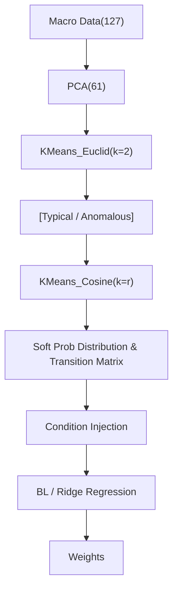

<!-- ontology-5axis data=量价表格 horizon=中长周期 paradigm=监督回归 alpha=风险择时 autonomy=人机协同可解释 -->

# 基于机器学习及宏观经济状态检测的战术资产配置 解構

> **發布**：2025-05-05 · （無 venue）
> **QuantML 導讀**：[基于机器学习及宏观经济状态检测的战术资产配置](https://mp.weixin.qq.com/s?__biz=Mzg2MzAwNzM0NQ==&mid=2247490285&idx=1&sn=4e9aa069e5a8cf33d47ee9e3cbdba161&chksm=ce7e7df3f909f4e52ca70e69bbd7623c21ebbfdc717d631bc74663667dcd280dc81bf189b2f7#rd)
> **核心定位**：落點於「風險擇時 × 監督回歸」軸，解決傳統 TAA 過度依賴資產價格序列（高噪聲）與狀態劃分硬閾值的工程坑，將宏觀狀態轉化為軟概率條件注入配置模型。

**五軸座標**

| 數據模態 | 時間尺度 | 學習範式 | Alpha機制 | 人機協作 |
|:-:|:-:|:-:|:-:|:-:|
| `量价表格` | `中长周期` | `监督回归` | `风险择时` | `人机协同可解释` |

**Status:** v0.5 — 基於 QuantML 導讀 + 原論文（如有）。benchmark 細節待升 v1。
**TL;DR:** ① 用雙距離 K-means 分層聚類宏觀指標劃分經濟狀態，輸出軟概率分佈與轉移矩陣。② 核心 trick 是將狀態距離轉化為歸一化概率，作為條件先驗注入 Black-Litterman 與嶺回歸。③ 這對「風險擇時」軸★ 的關鍵在於將離散狀態標籤替換為連續概率流，降低狀態跳變帶來的權重劇烈摩擦。④ 導讀未給量化結果。

**X-Ray.** 本框架將 TAA 的訊號源從價格序列硬切換至宏觀基本面，透過雙距離 K-means 解決了傳統隱馬爾可夫模型在狀態數目選擇上的過擬合陷阱，並用軟概率分佈替代硬分類，直接規避了狀態邊界處的權重劇烈摩擦。在「風險擇時」軸上，它提供了一條低頻、高可解釋性的特徵工程路徑，但 envelope 受限於宏觀數據的發布滯後與月度頻率，無法捕捉日內或週頻的流動性衝擊。對量化讀者而言，其價值不在於直接部署，而在於提供了一套將非交易數據轉化為模型條件先驗的標準化管道，適合與量價因子做正交疊加。

## §1 · 架構 / Core Mechanism
| 維度 | 傳統 TAA / 狀態模型 | 本方法改動 |
|---|---|---|
| 訊號源 | 資產收益/價格時間序列（高噪聲） | 127 項宏觀變量（產出、勞動力、價格等）經 PCA 降維 |
| 狀態識別 | 硬閾值劃分或生成式 HMM（參數敏感） | 雙距離 K-means 分層聚類（Euclidean 過濾異常 → Cosine 細分常規） |
| 模型輸入 | 離散狀態標籤（One-hot） | 軟概率分佈 + 狀態轉移矩陣（連續條件先驗） |

⚡ **Eureka 一句話 trick**：用樣本到質心的距離倒數構建軟概率，將離散聚類轉化為連續條件先驗，避免狀態跳變導致的權重劇烈摩擦。
**信息流 ASCII**：

## §2 · 數學層
📌 **Napkin Formula**：
$P(C_i|x) \propto \frac{1}{d(x, c_i)}$ （距離反比概率）
$\hat{P}_{final} = \text{Normalize}(P_{Euclid} \otimes P_{Cosine})$
複雜度：$O(T \cdot r \cdot d)$ 每輪迭代（$T$=樣本數，$r$=狀態數，$d$=特徵維度）。
**直覺**：距離越近概率越高；分層設計先過濾極端異常值，再對常規市場細分，避免單一聚類被離群點拉扯。
**Loss/訓練**：無顯式可微 loss，依賴距離度量與經驗轉移矩陣；嶺回歸部分使用 L2 正則化 MSE，參數隨時間步更新。

## §3 · 數據層
資料規模：127 項宏觀變量，PCA 降維至 61 個主成分。頻率：月度。市場：美國經濟。時段：未披露具體起止。來源：FRED-MD 數據庫。樣本外與容量假設：狀態轉移矩陣具短期平穩性；月度調倉容量極大，但實盤需嚴格處理宏觀數據修訂與發布滯後，否則易產生前瞻偏差。

## §4 · 代碼層
| Repo | Checkpoint | License | 複現難度 | 數據可得性 |
|---|---|---|---|---|
| TBD | TBD | TBD | 中（需處理 FRED-MD 清洗、PCA 與分層聚類邏輯） | 高（FRED 公開數據） |

## §5 · 評測 / Benchmark
| 數據集/市場 | Metric(IR/Sharpe/AR/MDD) | 前SOTA | 本方法 | Δ |
|---|---|---|---|---|
| FRED-MD / 美國宏觀 | Sharpe / Sortino / % Positive | 未披露 | 未披露 | 未披露 |
| FRED-MD / 美國宏觀 | 低維度(l=2/3) vs 高維度(l=4) | 未披露 | 未披露 | 未披露 |

**解讀**：導讀僅定性斷言「非隨機狀態優於隨機狀態」、「嶺回歸多頭策略風險調整收益最突出」、「低維度始終優於高維度」。Δ 欄全為未披露，無法驗證是否為過擬合或前瞻偏差。多頭優於多空暗示策略本質為 β 暴露而非純 α，成本未計（月度調倉雖低但宏觀數據處理開銷未量化）。低維度優勢符合 Occam's razor，但缺乏統計顯著性檢驗。

## §6 · 失效與隱含假設
**6.1 論文自述 limitations**：聚類技術較基礎、宏觀特徵選擇未自動化、未結合動態風險管理與組合優化，僅作為狀態檢測工具展示。
**6.2 推斷的隱含假設**：宏觀狀態轉換具馬爾可夫性且月度頻率足夠捕捉風險；狀態概率分佈在樣本外穩定；忽略交易成本與滑點；FRED-MD 數據修訂未做實時模擬（實盤易受數據修訂洩漏影響）；低維度優勢假設市場動態本質簡單，未驗證結構性斷點。

## §7 · 對比 & 面試 Tip
| 同軸對手 | 關鍵差異軸 | Open? | Status |
|---|---|---|---|
| 傳統 HMM / Markov Switching | 狀態識別方式（生成式似然 vs 聚類距離） | TBD | 學術對比 |
| 純量價 TAA / 動量輪動 | 訊號源（宏觀基本面 vs 價格動量） | TBD | 互補 |

🎤 **Interview Tip**：
正確答：「該方法核心是將聚類距離轉化為軟概率條件，解決硬分類導致的權重跳變，適合低頻宏觀擇時；實盤需嚴格處理宏觀數據修訂滯後與發布時間窗，並與量價因子正交。」
錯答：「直接用 K-means 標籤做預測模型輸入，效果比 HMM 好是因為聚類不需要假設數據分佈。」（忽略軟概率與距離轉化機制，混淆離散/連續輸入）
**7.1 可證偽預測**：若未來宏觀轉折期出現高通脹低增長組合，該框架因依賴月度數據與低頻轉移矩陣，將無法及時捕捉流動性收縮導致的資產相關性斷裂，導致嶺回歸權重滯後失效。

## §8 · For the Reader
- **因子研究員**：將軟概率分佈作為條件變量，與量價因子做正交化，避免宏觀狀態與價格動量共線；驗證狀態概率對因子暴露的調控效果。
- **組合配置**：利用狀態轉移矩陣構建動態風險預算，替代靜態 MVO 的協方差矩陣估計；測試多頭/多空狀態調整策略的實盤滑點敏感性。
- **研究學生**：複現雙距離 K-means 流程，重點驗證 PCA 降維維度對狀態穩定性的影響；勿盲目追求高維，優先確保轉移矩陣的實時可計算性。

## References
- 原論文：基于机器学习及宏观经济状态检测的战术资产配置（無 venue）
- Lineage：Markowitz MVO → Regime-Switching Models → K-means TAA
- QuantML 導讀：[基于机器学习及宏观经济状态检测的战术资产配置](https://mp.weixin.qq.com/s?__biz=Mzg2MzAwNzM0NQ==&mid=2247490285&idx=1&sn=4e9aa069e5a8cf33d47ee9e3cbdba161&chksm=ce7e7df3f909f4e52ca70e69bbd7623c21ebbfdc717d631bc74663667dcd280dc81bf189b2f7#rd)