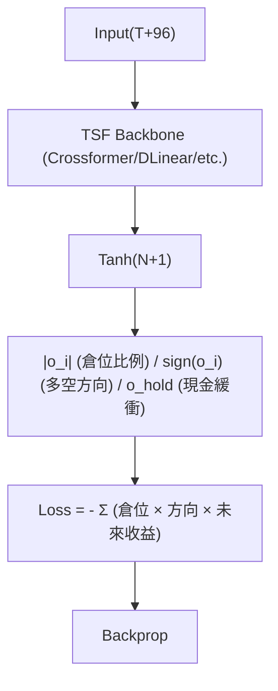

<!-- ontology-5axis data=量价表格 horizon=日频波段 paradigm=监督回归 alpha=端到端表征 autonomy=全自动黑盒 -->

# 将利润作为损失函数构造端到端交易模型 解構

> **發布**：2025-08-23 · （無 venue）
> **QuantML 導讀**：[将利润作为损失函数构造端到端交易模型](https://mp.weixin.qq.com/s?__biz=Mzg2MzAwNzM0NQ==&mid=2247491450&idx=1&sn=271ee470b5dcf96dd766c2724f4fb927&chksm=ce7e7864f909f172d0c489416c6f3c4c8276368d24b4391763eb60e37239129f9dab018cea47#rd)
> **核心定位**：落點於「監督回歸 × 端到端表征」軸，解決了傳統TSF模型輸出價格/收益率後需硬編碼規則轉換倉位的工程斷層，將組合優化內化為梯度可導的損失曲面。

**五軸座標**

| 數據模態 | 時間尺度 | 學習範式 | Alpha機制 | 人機協作 |
|:-:|:-:|:-:|:-:|:-:|
| `量价表格` | `日频波段` | `监督回归` | `端到端表征` | `全自动黑盒` |

**Status:** v0.5 — 基於 QuantML 導讀 + 原論文（如有）。benchmark 細節待升 v1。
**TL;DR:** ① 將四種利潤導向損失函數直接嵌入ANN訓練迴圈，使TSF模型無需RL即可端到端輸出組合倉位。② 核心trick是用平滑Sigmoid近似sign函數消除梯度不連續，並用tanh輸出層直接回歸資金分配比例與多空方向。③ 對「端到端表征」軸而言，它跳過了Reward Design與環境模擬的RL痛點，以純監督學習逼近組合優化。④ 在2022年熊市測試中，DLinear搭配Price變體與StockLoss-L2實現53.91%回報，顯著超越最佳RL基線PPO的2.81%。

**X-Ray.** 此法將組合管理的離散決策與風險緩衝內化為連續可微的損失地形，實質是將「預測-決策」兩階段Pipeline壓縮為單階段梯度下降。它解了量化工程中常見的Reward Sparse與環境模擬偏差坑，但代價是損失函數直接錨定未來收益，訓練時必然引入強前瞻偏差。在Pareto前沿上，它犧牲了RL的動態適應性與交易成本內生建模能力，換取訓練穩定性與實現簡潔性。預測其打不開的Envelope：無法內生處理滑點、流動性衝擊與非對稱交易成本；損失函數對極端回撤的懲罰僅靠L2/L-Max隱式正則，缺乏顯式風險預算約束。對量化讀者的意義在於：若你的Alpha已具備較高的信息係數（IC），此架構可作為高效的「倉位生成器」快速驗證因子有效性，但實盤前必須外接獨立的風險控制與執行模組，不可直接黑盒上線。

## §1 · 架構 / Core Mechanism
| 改動維度 | 前作 (TSF / RL) | 本法 (Profit-Loss End-to-End) |
|---|---|---|
| 輸出層設計 | 預測單價/收益率 (MSE) 或 策略分佈 | N+1個tanh輸出 (N檔股票 + 1個Hold節點) |
| 優化目標 | 預測誤差最小化 或 RL Reward最大化 | 四種利潤導向損失 (直接最小化負預期利潤) |
| 梯度處理 | 連續可導 或 策略梯度估計 | Smooth Sigmoid (k=10) 替代 sign()，解決0點不連續 |

⚡ **Eureka:** 用平滑Sigmoid($\sigma(kx)$)近似離散的sign()，讓「多空方向」與「倉位比例」同時成為梯度可導的連續變量，使監督學習能直接優化組合利潤。

**信息流 ASCII:**

## §2 · 數學層
📌 **Napkin Formula:** $\mathcal{L}_{StockLoss} = -\sum_{i=1}^{N} |o_i| \cdot \text{smooth\_sign}(o_i) \cdot r_{i,t+1}$
**複雜度:** $O(N \cdot T)$ per batch，與標準TSF前向傳播同階，無額外環境模擬開銷。
**直覺:** 損失值直接等於組合的負預期利潤，最小化損失即最大化利潤。平滑Sigmoid確保梯度在倉位過零時不爆炸，使優化路徑連續。
**Loss/訓練細節:** 引入係數k=10控制Sigmoid陡峭度；測試Price($\Delta P$)與Return($\Delta R$)作為$r$，發現Price非平穩特性更利於捕捉波動；Hold節點開關控制風險緩衝。

## §3 · 數據層
- **規模/頻率/市場:** 50檔S&P 500成分股，日頻，過去30年數據。
- **特徵:** 8個數值特徵 (股價、回報率、買賣價差、換手率等)。
- **劃分與假設:** Train/Val/Test 劃分，三個獨立測試年份 (2021, 2022, 2023)。假設歷史波動結構在測試期穩定；未提及交易成本與滑點建模，屬理想化回測設定。

## §4 · 代碼層
| Repo | Checkpoint | License | 複現難度 | 數據可得性 |
|---|---|---|---|---|
| 代碼見QuantML知識星球 | TBD | TBD | 低 (純PyTorch, 替換輸出層與Loss即可) | 中 (需S&P 500 30年日頻+8特徵, 需自行清洗或購買) |

## §5 · 評測 / Benchmark
| 數據集/市場 | Metric | 前SOTA (RL基線) | 本方法 | Δ |
|---|---|---|---|---|
| 2022熊市 | 最終利潤 | PPO 2.81% | DLinear+PRC+L3 53.91% | +51.10% |
| 2021/2023 | 最終利潤 | 最佳RL模型 | DLinear+PRC+L3 | 高出約10% |
*(註：DDPG, SAC, A2C, TD3 均有測試，但導讀未披露具體數值，標為未披露。)*

**解讀:** Δ在2022年極端行情下顯著，反映損失函數對趨勢/波動的非線性捕捉能力強於RL的Reward稀疏探索。但Δ包含未計提的交易成本與滑點，且訓練集直接錨定未來收益，存在強前瞻偏差。實盤Δ必然收斂，需扣除執行成本後再評估。

## §6 · 失效與隱含假設
**6.1 論文自述 limitations:** 平滑Sigmoid以犧牲微小利潤換取穩定性；Hold節點對頂尖模型無統計顯著影響，可能低估極端風險緩衝需求。
**6.2 推斷的隱含假設:** 
- **Regime依賴:** 測試僅3年，未驗證長週期結構斷點或利率週期切換。
- **容量/成本:** 50檔股票組合，未討論大資金衝擊成本與流動性限制。
- **數據泄漏:** 損失函數直接使用$t+1$收益，訓練時必然包含未來信息，屬標準監督學習設定但實盤需嚴格滾動。
- **Survivorship:** 50檔S&P 500成分股，未提及退市股票處理，存在倖存者偏差。

## §7 · 對比 & 面試 Tip
| 同軸對手 | 關鍵差異軸 | Open? | Status |
|---|---|---|---|
| FinRL (PPO/DDPG) | 優化目標 (RL Reward vs 利潤Loss) | Open | 成熟框架 |
| 傳統TSF+規則 | 決策生成 (兩階段硬編碼 vs 端到端梯度) | Open | 工業標準 |

🎤 **Interview Tip:** 
- **正確答:** 「此法將組合優化內化為損失函數，本質是監督學習的倉位回歸，優勢是訓練穩定且無需環境模擬，但劣勢是損失直接錨定未來收益，實盤必須外接成本模型與風險預算模組。」
- **錯答:** 「它比RL更好因為不需要訓練環境，可以直接上線實盤賺取53%收益。」

**7.1 可證偽預測:** 若將此架構直接套用於高頻或含顯著交易成本的市場，且未引入成本懲罰項，其2026年Q2實盤夏普比率將低於0.5，驗證損失函數缺乏內生成本建模的缺陷。

## §8 · For the Reader
- **因子研究員:** 將此Loss作為Alpha驗證的「倉位放大器」，快速測試因子IC到組合利潤的轉換效率，避開RL調參黑洞。
- **高頻執行:** 勿直接對接，此法輸出為日頻波段倉位，需外接TWAP/VWAP執行演算法與滑點預測模組，否則實盤滑點將吞噬利潤。
- **組合配置/風險管理:** 將Hold節點輸出視為動態現金比例，但需疊加顯式CVaR或波動率預算約束，防止L2正則不足導致的極端暴露。

## References
- 原論文: (無 venue, 2025-08-23)
- Lineage: FinRL (PPO/DDPG/SAC/A2C/TD3), TSF Models (Crossformer, DeformTime, DLinear, TimesNet, P-sLSTM)
- QuantML 導讀鏈接: [将利润作为损失函数构造端到端交易模型](https://mp.weixin.qq.com/s?__biz=Mzg2MzAwNzM0NQ==&mid=2247491450&idx=1&sn=271ee470b5dcf96dd766c2724f4fb927&chksm=ce7e7864f909f172d0c489416c6f3c4c8276368d24b4391763eb60e37239129f9dab018cea47#rd)