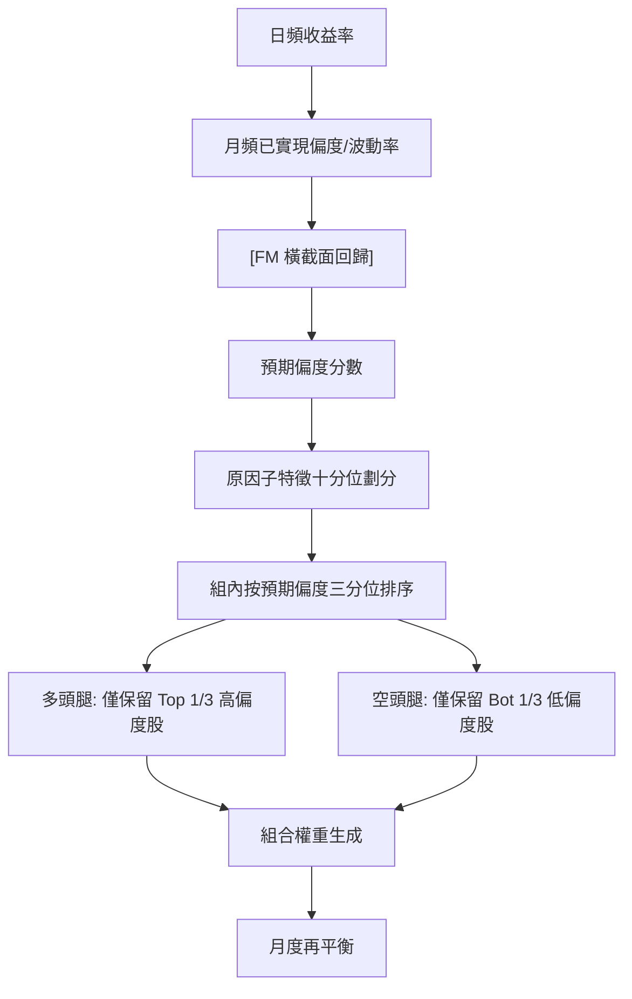

<!-- ontology-5axis data=量价表格 horizon=日频波段 paradigm=监督回归 alpha=组合执行优化 autonomy=人机协同可解释 -->

# 偏度组合管理：如何系统性提升经典因子的收益？ 解構（偏度组合管理：如何系统性提升经典因子的收益？）

> **發布**：2026-07-02 · （無 venue）
> **QuantML 導讀**：[偏度组合管理：如何系统性提升经典因子的收益？](https://mp.weixin.qq.com/s?__biz=Mzg2MzAwNzM0NQ==&mid=2247494196&idx=1&sn=b70b78af6bc7bcd77d851f83f9f3998e&chksm=ce7d8d2af90a043cd3e049024470bc6b66b4bec326bedccfadd109f84ce373e205a09ec99478#rd)
> **核心定位**：落點於「組合執行優化」與「監督回歸」軸，解決傳統多因子框架中 Winsorization 粗暴截斷導致尾部收益引擎失效的 Prior Gap。

**五軸座標**

| 數據模態 | 時間尺度 | 學習範式 | Alpha機制 | 人機協作 |
|:-:|:-:|:-:|:-:|:-:|
| `量价表格` | `日频波段` | `监督回归` | `组合执行优化` | `人机协同可解释` |

**Status:** v0.5 — 基於 QuantML 導讀 + 原論文（如有）。benchmark 細節待升 v1。
**TL;DR:** 提出基於預期偏度預測與順序雙重排序的偏度管理框架，替代傳統去極值。核心 trick 為 Fama-MacBeth 橫截面回歸前瞻性預測個股偏度，並在組合構建階段對多頭保留高偏度、空頭剔除高偏度。此設計直接對齊「組合執行優化」軸，將統計三階矩轉化為可執行的權重約束。實證顯示 18 個經典因子平均年化收益率提高了 5.45 個百分點。

**X-Ray.** 本文將偏度從「統計雜訊」重構為「組合約束條件」。在 Pareto 前沿上，它放棄了 Winsorization 對二階矩穩定的盲目追求，轉而通過順序雙重排序定向捕獲非對稱尾部溢價。工程層面解決了因子去極值後收益斷崖的常見坑點，但並未打開高頻/小市值流動性容量的 envelope。對量化讀者的意義在於：高階矩管理無需依賴黑盒深度學習，線性投影與排序即可實現系統性 Alpha 剝離，但必須正視交易摩擦對換手率的硬約束。

## §1 · 架構 / Core Mechanism
| 改動維度 | 前作/行業標準 | 本法改動 | 工程意圖 |
|---|---|---|---|
| 預測邏輯 | 依賴歷史已實現偏度自相關 | FM 橫截面回歸投影至當期特徵 | 偏度持續性極弱，需特徵驅動前瞻性預測 |
| 組合構建 | 統一去極值（Winsorization） | 順序雙重排序（原因子十分位 → 組內偏度三分位） | 分離多空腿的尾部風險暴露 |
| 權重分配 | 對稱截斷/等權 | 多頭僅保留 Top 1/3 高偏度，空頭僅保留 Bot 1/3 低偏度 | 定向捕獲彩票式正收益，規避空頭右尾踩踏 |

⚡ **Eureka:** 偏度不可直接歷史外推，需透過波動率與短期反轉特徵前瞻性預測，並按腿分離管理。
📊 **信息流:**

## §2 · 數學層
📌 **Napkin Formula:**
$$E[Skew_{i,t+1}] = \alpha + \beta_1 Vol_{i,t} + \beta_2 Ret_{i,t-1} + \beta_3 Size_{i,t} + \beta_4 Industry_{i,t} + \epsilon_{i,t}$$
**複雜度:** $O(N)$ 月頻橫截面 OLS。
**直覺:** 高波動且近期大幅下跌的個股，未來最容易產生極端的右尾反彈（預期偏度更高）。上月收益率係數顯著為負（短期反轉貢獻），已實現波動率係數顯著為正。
**Loss/訓練:** 標準最小二乘，無正則化（導讀未提及）。平均橫截面調整後 R 平方達 3.0%。

## §3 · 數據層
**資料規模/頻率:** 長達六十年的超長週期樣本。日頻計算已實現指標，月頻執行 FM 回歸與組合再平衡。
**市場/時段:** 隱含美股市場（提及 Nasdaq 上市分類與 Fama-French 因子）。
**樣本外與容量:** FM 滾動回歸天然具備樣本外預測屬性。容量受換手率與流動性天花板限制，扣除有效買賣價差後收益顯著收斂。

## §4 · 代碼層
| Repo | Checkpoint | License | 複現難度 | 數據可得性 |
|---|---|---|---|---|
| TBD | TBD | TBD | 中（需完整日頻與財務特徵數據庫，FM 回歸邏輯透明） | 未披露（需自備 Wind/CRSP 級數據） |

## §5 · 評測 / Benchmark
| 數據集/市場 | Metric | 前SOTA | 本方法 | Δ |
|---|---|---|---|---|
| 18個經典學術因子 | 平均年化收益率 | 未披露 | 未披露 | +5.45個百分點 |
| 18個經典學術因子 | 平均夏普比率 | 未披露 | 未披露 | +0.12 |
| 價值因子 | FF5模型Alpha | -1.34% | 6.93% | +8.27pp |
| 價值因子 | FF5模型t值 | -1.23 | 3.00 | +4.23 |
| 18個因子（14個顯著） | 平均年化Alpha | 未披露 | 6.7% | 未披露 |
| 18個因子 | Beta加載均值 | 未披露 | 0.8 | 未披露 |
| 宏觀衰退期 | 等權平均增量年化收益 | 未披露 | 20.4% | 未披露 |
| 宏觀擴張期 | 等權平均增量年化收益 | 未披露 | 3.7% | 未披露 |

**解讀:** Δ 中 +5.45個百分點與 +0.12 為真實 Capability 釋放，源於尾部收益引擎的定向保留。FF5 Alpha 從 -1.34% 躍升至 6.93% 證明非原因子風險暴露放大（Beta 均值約 0.8 佐證）。衰退期 20.4% 與擴張期 3.7% 的落差顯示強 Regime 依賴。需警惕：扣除有效買賣價差後收益顯著收斂，部分 Δ 可能被高換手交易摩擦侵蝕，實盤需計入滑點與衝擊成本。

## §6 · 失效與隱含假設
**6.1 論文自述 limitations:** 高換手帶來流動性天花板，扣除有效買賣價差後收益顯著收斂；更適合作為中低頻經典多因子體系的風險管理與收益增強補丁。
**6.2 推斷的隱含假設:** 強 Regime 依賴（衰退期表現優異，擴張期回落）；假設 FM 回歸係數在跨週期具備穩定性；未明確處理退市股票 Survivorship Bias；假設個股預期偏度與原因子特徵的橫截面關係線性可分。

## §7 · 對比 & 面試 Tip
| 同軸對手 | 關鍵差異軸 | Open? | Status |
|---|---|---|---|
| 傳統 Winsorization | 對稱截斷極值 / 破壞尾部引擎 | Open | 行業標準 |
| 偏度管理框架 | 順序雙重排序 / 定向保留高偏 | Open | 本文提出 |

🎤 **Interview Tip:** 正確答法應指出「偏度管理並非簡單加權，而是通過橫截面預測將三階矩轉化為多空腿的獨立篩選約束，並需嚴格計入換手摩擦成本」；錯答法為「直接對因子暴露乘以偏度係數」或「認為偏度越高越好而忽略空頭端的右尾風險」。
**7.1 可證偽預測:** 若未來 12 個月內美股進入深度衰退且 VIX 持續高企，該策略的等權平均增量年化收益應顯著高於 3.7%；若宏觀流動性收緊導致小市值換手成本突破未披露閾值，策略 Alpha 將快速歸零。

## §8 · For the Reader
- **因子研究員:** 將偏度預測納入因子正交化流程，避免 Winsorization 誤殺尾部驅動；在構建新因子時主動檢驗其三階矩分佈。
- **組合配置:** 在衰退期 Regime 信號觸發時，動態切換至偏度管理組合以捕捉 20.4% 區間的超額收益；擴張期降權以規避換手摩擦。
- **高頻執行:** 嚴格測算有效買賣價差與衝擊成本，若摩擦成本超過未披露閾值，應降頻或縮減換手；偏度管理不適合高頻微結構套利。

## References
- QuantML 導讀：[偏度组合管理：如何系统性提升经典因子的收益？](https://mp.weixin.qq.com/s?__biz=Mzg2MzAwNzM0NQ==&mid=2247494196&idx=1&sn=b70b78af6bc7bcd77d851f83f9f3998e&chksm=ce7d8d2af90a043cd3e049024470bc6b66b4bec326bedccfadd109f84ce373e205a09ec99478#rd)
- Lineage: Fama-MacBeth (1973) → Skewness Preference (Kraus & Litzenberger, 1976) → Modern Skewness-Managed Portfolios (本文)