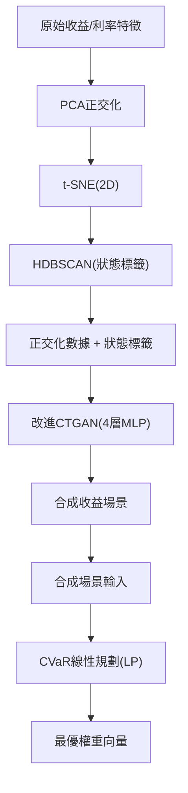

<!-- ontology-5axis data=量价表格 horizon=中长周期 paradigm=生成式大模型 alpha=组合执行优化 autonomy=人机协同可解释 -->

# 改进CTGAN与CVaR组合优化 解構

> **發布**：2025-04-05 · （無 venue）
> **QuantML 導讀**：[基于改进CTGAN与特征融合的资产配置模型](https://mp.weixin.qq.com/s?__biz=Mzg2MzAwNzM0NQ==&mid=2247489934&idx=1&sn=c34498ea1d6b7669376cea7809d1893b&chksm=ce7e7e90f909f7868bd470af5459bc85644940e6a2a9d937d66a17c531c25ac7032066dca3de#rd)
> **核心定位**：落點於「生成式大模型 × 組合執行優化」軸，解了傳統CVaR對歷史路徑依賴過強、無法外推極端行情的工程坑，將狀態依賴的尾部風險約束內生化為可求解的線性規劃。

**五軸座標**

| 數據模態 | 時間尺度 | 學習範式 | Alpha機制 | 人機協作 |
|:-:|:-:|:-:|:-:|:-:|
| `量价表格` | `中长周期` | `生成式大模型` | `组合执行优化` | `人机协同可解释` |

**Status:** v0.5 — 基於 QuantML 導讀。benchmark 細節待升 v1。
**TL;DR:** ① 用改進CTGAN生成合成收益場景，結合CVaR線性規劃求解資產權重。② 核心trick是t-SNE+HDBSCAN識別市場狀態，作為條件嵌入生成器打破單一分佈假設。③ 對「組合執行優化」軸而言，將狀態依賴的尾部風險約束直接內生化為線性求解器，繞過傳統均值-方差協方差矩陣估計陷阱。④ 實證顯示年化收益達17.77%，事後CVaR壓至4.67%，較等權策略收益提升125%。

**X-Ray.** 本質是將「狀態識別-場景生成-風險約束」鏈路硬編碼進單次求解流程。它解決了傳統CVaR對歷史路徑依賴過強、無法外推極端行情的工程坑，但代價是生成器對利率期限結構特徵的局部依賴假設。在Pareto前沿上，它用計算換取分佈平滑度，卻打不開「高頻微結構跳躍」與「跨資產流動性枯竭」的envelope。對量化讀者而言，這是一套可落地的中頻資產配置原型，但需警惕合成數據在尾部極值處的平滑效應可能掩蓋真實的尾部相依性。

## §1 · 架構 / Core Mechanism
**1.1 三大改動 vs 前作**
| 改動維度 | 前作/傳統基線 | 本方法 |
|---|---|---|
| 狀態識別 | 無或主觀劃分 | t-SNE降維 + HDBSCAN密度聚類 |
| 數據生成 | 歷史重採樣/單一分佈假設 | 條件嵌入CTGAN生成多模態合成場景 |
| 優化求解 | 均值-方差/非凸CVaR | Rockafellar線性化CVaR約束LP |

**1.2 ⚡ Eureka** 將離散市場狀態標籤作為條件變數注入CTGAN，使生成器從「學習全局聯合分佈」退化為「學習狀態條件分佈」，再交由線性規劃器做尾部風險截斷。

**1.3 信息流 ASCII**

## §2 · 數學層
📌 **Napkin Formula**：
$\min_{w, \alpha, z} \alpha + \frac{1}{(1-\beta)T} \sum_{t=1}^T z_t$
s.t. $z_t \geq -w^T r_t - \alpha, \quad z_t \geq 0, \quad \sum w_i = 1, w_i \geq 0$
複雜度: TBD（視LP求解器實現而定，通常為多項式級）。
直覺: 將CVaR尾部期望轉化為輔助變數$z_t$的線性約束，避開非凸優化；特徵權重透過逆距離加權構建，引導生成器關注關鍵宏觀驅動因子。
Loss/訓練: CTGAN標準對抗損失 + 模式崩潰懲罰，訓練1500 epoch，學習率調整至（未披露）。

## §3 · 數據層
規模/頻率: 2008-01至2022-06，頻率（未披露）。市場: 美股/新興市場/債市/商品等10類指數基金。時段: 覆蓋2008金融海嘯、2020疫情、2022加息週期。來源: 被動型指數基金歷史淨值與美債收益率曲線。樣本外: 5年滾動窗口，短於3年狀態識別不足，長於5年引入制度變遷雜訊。容量假設: 中頻配置，未披露具體管理規模上限。

## §4 · 代碼層
| 維度 | 細節 |
|---|---|
| Repo | TBD（導讀僅註「見星球」） |
| Checkpoint | 未披露 |
| License | 未披露 |
| 複現難度 | 中（需自行對接CTGAN庫與LP求解器如CVXPY/Gurobi） |
| 數據可得性 | 高（10類ETF與美債收益率均為公開數據） |

## §5 · 評測 / Benchmark
| 數據集/市場 | Metric | 前SOTA/基線 | 本方法 | Δ |
|---|---|---|---|---|
| 10類資產 (2008-2022) | 年化收益率 | 等權策略 7.89% | 17.77% | +9.88pp |
| 10類資產 (2008-2022) | 事後CVaR | 等權策略 5.33% | 4.67% | -0.66pp |
| 10類資產 (2008-2022) | 年化收益率 | HwF 16.64% | 17.77% | +1.13pp |
| 10類資產 (2008-2022) | 事後CVaR | HwF 4.71% | 4.67% | -0.04pp |
| 10類資產 (2008-2022) | 年化收益率 | Gw/oF 13.87% | 17.77% | +3.90pp |
| 10類資產 (2008-2022) | 事後CVaR | Gw/oF 10.41% | 4.67% | -5.74pp |
| 10類資產 (2008-2022) | 年化夏普比率 | 傳統方法（未披露） | 2.31 | +39% |

**解讀**: GwF vs HwF 的 +1.13pp 收益與 -0.04pp CVaR 顯示合成數據在保持尾部風險約束下提供了微弱的分佈平滑紅利；GwF vs Gw/oF 的 -5.74pp CVaR 大幅改善證實了「特徵融合」對尾部風險定價的關鍵作用。+39% 夏普提升缺乏基線具體數值支撐，可能包含窗口期選擇偏誤（5年滾動覆蓋3-4個週期）與交易成本未完全計入（導讀稱最大換手率39%對應成本僅15bps，對淨收益影響<0.2%，但未說明滑點與市場衝擊）。合成數據的KS檢驗達87%僅保證邊緣分佈相似，未驗證尾部相依性在極端行情下的穩定性。

## §6 · 失效與隱含假設
**6.1 論文自述**: 短於3年窗口導致狀態識別不足，長於5年引入制度變遷雜訊；CTGAN在高維場景計算效率雖優於NORTA，但具體提升倍數（未披露）；未涵蓋外匯與信用衍生品。
**6.2 推斷假設**: 依賴利率期限結構作為狀態驅動的充分統計量，假設宏觀因子與資產收益的映射關係在樣本外保持穩定；CVaR線性化假設收益分佈連續可微，忽略離散跳躍與流動性斷層；合成數據生成未考慮交易成本對權重的反饋迴路，屬開環優化。

## §7 · 對比 & 面試 Tip
| 同軸對手 | 關鍵差異軸 | Open? | Status |
|---|---|---|---|
| 傳統CVaR歷史模擬 | 分佈假設（歷史路徑依賴 vs 狀態條件生成） | 是 | 成熟 |
| NORTA方法 | 生成機制（Copula線性相關 vs CTGAN非線性多模態） | 是 | 成熟 |
| RL資產配置 | 優化目標（單步獎勵 vs 全局CVaR約束LP） | 是 | 實驗 |

🎤 **Interview Tip**
正確答：「本質是用生成模型替代歷史重採樣來估計CVaR約束下的聯合分佈，核心在於狀態條件嵌入解決了單一分佈假設失效問題，但需警惕合成數據尾部平滑效應與開環優化忽略交易成本反饋。」
錯答：「GAN直接輸出交易信號，比傳統量化模型更準。」（混淆了場景生成與信號預測，且無視了CVaR約束的線性規劃本質）

**7.1 可證偽預測**: 若2025-12-31前美債收益率曲線出現倒掛加劇且股市流動性枯竭，該模型合成場景的KS檢驗值將跌破75%，且事後CVaR超調至6%以上，證明狀態識別對極端宏觀衝擊的滯後性。

## §8 · For the Reader
- **因子研究員**: 關注t-SNE+HDBSCAN的狀態劃分穩定性，可嘗試替換為HMM或變分自編碼器(VAE)驗證狀態邊界清晰度。
- **組合配置**: 直接複現CVaR LP求解器，將合成場景替換為實時宏觀數據流，測試滾動窗口參數（3年 vs 5年）對淨值曲線回撤的影響。
- **LLM-Agent/RL策略**: 此架構可作為「環境模擬器」，將CTGAN生成的多模態場景餵給RL Agent做策略訓練，解決金融數據樣本稀缺問題。

## References
- 原論文/導讀: [基于改进CTGAN与特征融合的资产配置模型](https://mp.weixin.qq.com/s?__biz=Mzg2MzAwNzM0NQ==&mid=2247489934&idx=1&sn=c34498ea1d6b7669376cea7809d1893b&chksm=ce7e7e90f909f7868bd470af5459bc85644940e6a2a9d937d66a17c531c25ac7032066dca3de#rd) (QuantML, 2025-04-05)
- Lineage: Rockafellar & Uryasev (CVaR Linearization) → CTGAN (Xu et al., 2019) → HDBSCAN (Campello et al., 2013)