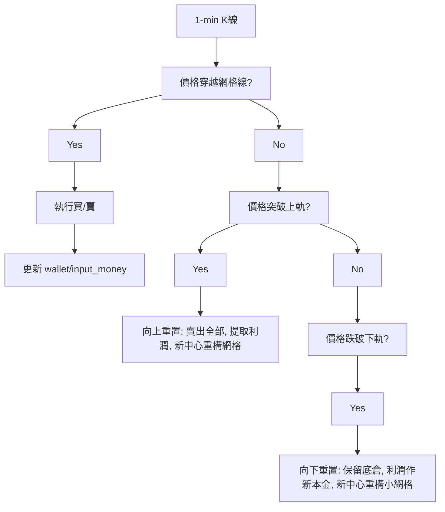

<!-- ontology-5axis data=量价表格 horizon=高频日内 paradigm=监督回归 alpha=组合执行优化 autonomy=全自动黑盒 -->

# DGT 解構

> **發布**：2025-06-16 · （無 venue）
> **QuantML 導讀**：[动态网格交易策略：从零期望到超越市场](https://mp.weixin.qq.com/s?__biz=Mzg2MzAwNzM0NQ==&mid=2247490740&idx=1&sn=d1cb157222a1a277b4e2e7c54db2e747&chksm=ce7e7baaf909f2bc09c8fe0ef088ec49125626e8e109e63fbce41cc7ce0d490a5d734c8cfa3d#rd)
> **核心定位**：落點於「組合執行優化」軸的規則型動態倉管框架。解了傳統幾何網格在有限資本下「觸界即終止」導致的零期望/負期望工程坑，將離散邊界觸發轉為連續狀態重置。

**五軸座標**

| 數據模態 | 時間尺度 | 學習範式 | Alpha機制 | 人機協作 |
|:-:|:-:|:-:|:-:|:-:|
| `量价表格` | `高频日内` | `监督回归` | `组合执行优化` | `全自动黑盒` |

**Status:** v0.5 — 基於 QuantML 導讀 + 原論文（如有）。benchmark 細節待升 v1。
**TL;DR:** ① 以「向上/向下重置」替代傳統網格的「觸界終止」，實現策略永續運行與利潤再投資。② 核心 trick 是動態資本管理：向上突破時提取利潤並用原始本金重構網格，向下突破時保留底倉並用累積利潤作為新本金抄底。③ 這對「組合執行優化」軸★ 的意義在於將離散網格轉為連續狀態機，規避了有限資源下的隨機游走零期望陷阱。④ 導讀給出 BTC/ETH 回測中 DGT 平均最大回撤控制在約50%，顯著優於買入持有策略的接近80%。

**X-Ray.** DGT 實質是將傳統網格的「有限狀態自動機」升級為「帶狀態轉移的連續過程」。它解了兩個舊工程坑：一是觸界清倉/滿倉導致的風險敞口瞬間極端化；二是利潤鎖定無法複利的資金效率瓶頸。但該框架打不開的 envelope 很明確：它仍高度依賴高頻波動率與低滑點環境，且「重置」本質是離散跳躍，在趨勢單邊加速或流動性枯竭時會產生巨大的滑價與踏空風險。對量化讀者而言，DGT 不是預測模型，而是倉位與資金曲線的動態對沖器，適合作為底層執行層與趨勢/均值回歸信號組合，而非獨立 Alpha 源。

## §1 · 架構 / Core Mechanism
1.1 三大改動 vs 前作
| 維度 | 傳統網格 (Prior) | DGT (本法) |
|---|---|---|
| 邊界處理 | 觸界即終止（清倉或滿倉） | 觸界即重置（向上提取利潤/向下利潤抄底） |
| 資本管理 | 靜態資金分配，利潤鎖定 | 動態 `wallet` 追蹤累計利潤，本金可變 |
| 運行週期 | 離散區間內有限次套利 | 連續狀態機，理論上永續運行 |

1.2 ⚡ Eureka 一句話 trick + 直覺
「不終止，只重置」：將邊界觸發從策略終點轉為狀態跳躍點，利用利潤緩衝墊實現資本規模的動態縮放，本質是將隨機游走的零期望博弈轉為帶漂移的馬爾可夫鏈。

1.3 信息流 ASCII 圖

## §2 · 數學層
📌 Napkin Formula：
傳統網格期望套利次數期望值 = $n^2 / 2$ （$n$ 為網格數）
邊界觸發固有期望損失 = 負值（需至少 $n^2 / 2$ 次套利抵消）
總期望 = 0（無手續費） / <0（含手續費）
直覺：有限資源下的對稱隨機游走必然在邊界吸收，DGT 通過重置打破吸收壁，將狀態空間拓撲為環面或半直線，引入利潤再投資的乘法效應。
Loss/訓練細節：無監督學習或梯度優化，屬參數搜索（網格大小、半邊網格數）啟發式框架。

## §3 · 數據層
市場/幣種：BTC/USDT, ETH/USDT
頻率/時段：1分鐘K線，2021年1月至2024年7月
來源/假設：Binance 官方 API 現貨數據；假設每分鐘最多執行一次交易；未披露樣本外劃分與實盤滑價模型。

## §4 · 代碼層
| 欄位 | 內容 |
|---|---|
| Repo | TBD |
| Checkpoint | 未披露 |
| License | 未披露 |
| 複現難度 | 低（規則明確，參數空間小） |
| 數據可得性 | 高（Binance 公開 API） |

## §5 · 評測 / Benchmark
| 數據集/市場 | Metric | 前SOTA (Buy&Hold) | 前SOTA (傳統網格) | 本方法 (DGT) | Δ |
|---|---|---|---|---|---|
| BTC (2021-2024) | MDD | 接近80% | 未披露 | 約50% | 未披露 |
| ETH (2021-2024) | MDD | 接近80% | 未披露 | 約50% | 未披露 |
| BTC/ETH | IRR | 未披露 | 約在2.8%-3.1%之間 | 30%-60% | 未披露 |
*解讀*：Δ 的顯著性主要來自於「重置機制」對資金利用率的提升與回撤控制，而非預測能力。傳統網格在含費條件下 IRR 約在2.8%-3.1%之間，DGT 達 30%-60%，此差距反映的是資本複利與邊界跳躍的結構優勢。但回測假設每分鐘最多執行一次，且未計入滑價與流動性衝擊，實盤 Δ 可能因執行成本急劇收斂。ETH 表現優於 BTC 主因波動率更高，符合網格利潤來源特徵。

## §6 · 失效與隱含假設
6.1 論文自述 limitations：理論基礎待深化，計劃未來用隨機過程建立盈利概率與最優參數解析解；目前僅為經驗性回測。
6.2 推斷的隱含假設：
- Regime 依賴：高度依賴震盪與中高波動環境；在極端單邊趨勢或流動性枯竭時，重置頻率會異常升高或觸發滑價。
- 成本假設：單邊交易費率設定為0.08%，未計入 Maker/Taker 差異、資金費率與滑價。
- 數據泄漏/幸存者：僅選取 BTC/ETH 流動性最佳標的，未覆蓋小市值幣種的插針與歸零風險。
- 容量：策略為規則型，理論容量大，但重置瞬間的市價單可能對深盤產生衝擊。

## §7 · 對比 & 面試 Tip
| 同軸對手 | 關鍵差異軸 | Open? | Status |
|---|---|---|---|
| 傳統幾何網格 | 邊界處理（終止 vs 重置） | 開源常見 | 成熟/負期望 |
| 動態再平衡 (Rebalancing) | 觸發條件（時間 vs 價格網格） | 開源常見 | 成熟/低頻 |
| RL 倉管 Agent | 決策邏輯（規則重置 vs 策略網絡） | 閉源/研究 | 實驗性 |
🎤 Interview Tip:
正確答：「DGT 不是預測模型，而是資金曲線管理框架。它通過重置打破有限狀態機的零期望陷阱，實戰中應作為執行層與趨勢/波動率信號組合，需嚴格校準手續費與滑價閾值。」
錯答：「DGT 能預測價格方向，網格越小收益越高。」（導讀明確指出過小網格會被費用侵蝕，且策略無方向預測能力）
7.1 可證偽預測帶日期：若 2025-12-31 前實盤部署於 BTC 現貨，在含滑價與 0.08% 費率下，年化回報率若低於傳統網格，則證明重置機制的交易頻率成本已超過利潤再投資的複利效應。

## §8 · For the Reader
- **因子研究員**：將 DGT 視為「波動率萃取器」而非 Alpha。可將其重置觸發頻率作為高頻波動率因子的代理變量，輸入至組合優化層。
- **高頻執行**：關注「每分鐘最多執行一次」的假設。實盤需將重置邏輯拆分為 TWAP/VWAP 或冰山單，避免觸界瞬間的流動性真空導致滑價吞噬利潤。
- **組合配置**：DGT 的 MDD 約50% 仍偏高，不適合作為純防禦底倉。建議與低相關性資產（如穩定幣質押/跨期套利）構建正交組合，利用其非線性收益特徵提升組合 Sharpe。

## References
- 原論文/框架：Dynamic Grid-based Trading (DGT)
- QuantML 導讀：[动态网格交易策略：从零期望到超越市场](https://mp.weixin.qq.com/s?__biz=Mzg2MzAwNzM0NQ==&mid=2247490740&idx=1&sn=d1cb157222a1a277b4e2e7c54db2e747&chksm=ce7e7baaf909f2bc09c8fe0ef088ec49125626e8e109e63fbce41cc7ce0d490a5d734c8cfa3d#rd)
- Lineage：傳統幾何網格 -> 有限狀態隨機游走模型 -> 動態重置機制