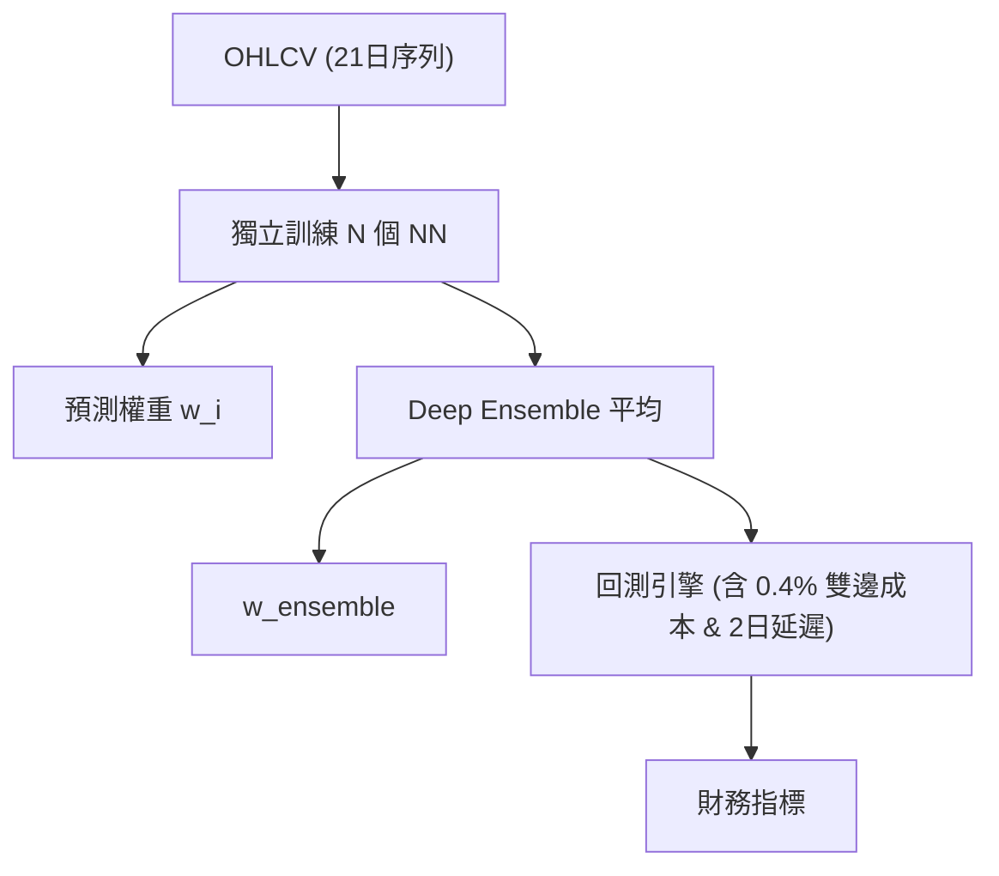

<!-- ontology-5axis data=量价表格 horizon=日频波段 paradigm=监督回归 alpha=组合执行优化 autonomy=全自动黑盒 -->

# DSL 解構

> **發布**：2025-07-29 · （無 venue）
> **QuantML 導讀**：[从“预测市场”到“学习决策”：基于监督学习决策与集成学习的投资组合优化框架](https://mp.weixin.qq.com/s?__biz=Mzg2MzAwNzM0NQ==&mid=2247491174&idx=1&sn=e053618eed09e779f2f8ee899845f1a0&chksm=ce7e7978f909f06e78cc6a6a3514babd3873aa69cf98b5f6a75077e7185cc752093eb0ad138b#rd)
> **核心定位**：將非凸的組合優化目標（Sharpe/Sortino）轉化為凸代理損失（Cross-Entropy）監督學習任務，並透過 Deep Ensemble 收斂配置方差，填補 E2E 訓練不穩定與 PFL 預測-決策脫節的工程鴻溝。

**五軸座標**

| 數據模態 | 時間尺度 | 學習範式 | Alpha機制 | 人機協作 |
|:-:|:-:|:-:|:-:|:-:|
| `量价表格` | `日频波段` | `监督回归` | `组合执行优化` | `全自动黑盒` |

**Status:** v0.5 — 基於 QuantML 導讀 + 原論文（如有）。benchmark 細節待升 v1。
**TL;DR:** ① 將組合權重預測重構為監督學習任務，繞開直接優化 Sharpe/Sortino 的非凸陷阱。② 核心 trick 是用 Cross-Entropy 擬合預計算的理論最優權重，並用 Deep Ensemble 聚合 100 個獨立模型輸出。③ 對「組合執行優化」軸★，解決了 E2E 梯度場崎嶇導致崩盤與 PFL 誤差經優化器放大的工程痛點。④ 導讀未給量化結果，僅定性指出集成規模擴大可提升中位數回報並收窄四分位距。

**X-Ray.** 放回五軸 Pareto，DSL 實質是「預測-優化」兩階段的隱式融合。傳統 PFL 的致命傷在於 MSE 最小化不等於財務效用最大化，微小預測誤差會經優化器放大為權重劇烈跳動；E2E 雖直接輸出權重，但 Sharpe/Sortino 的非凸性導致梯度場極度崎嶇，超參數敏感且極易陷入局部最優。DSL 的破局點在於「標籤工程」：用過去 21 日數據預先計算理論最優權重作為 Ground Truth，將訓練目標降維至標準的 Cross-Entropy。這不僅保證了凸優化空間的訓練穩定性，更透過 Deep Ensemble 的方差收縮特性（獨立初始化模型間相關性 $\rho < 1$）抹平單次訓練的隨機性。對量化讀者而言，DSL 提供了一條高魯棒性的中低頻組合構建路徑，但其長倉限制與 100 模型並行訓練的算力開銷，註定它無法直接遷移至高頻或多空對沖場景。其失效邊界在於動能衰竭或震盪市，此時理論最優權重本身會劇烈漂移，監督標籤的滯後性將轉化為系統性跟隨風險。

## §1 · 架構 / Core Mechanism
**1.1 三大改動 vs 前作**
| 維度 | PFL (預測驅動) | E2E (端到端) | DSL (本方法) |
|---|---|---|---|
| 優化目標 | 中間參數 (MSE/MAE) | 非凸財務指標 (Sharpe/Sortino) | 凸代理損失 (Cross-Entropy) |
| 決策生成 | 兩階段 (預測→優化器) | 單階段 (直接輸出權重) | 監督學習 (擬合預計算最優權重) |
| 穩定性機制 | 無 | 依賴可微優化層/正則化 | Deep Ensemble (100 模型平均) |

**1.2 ⚡ Eureka**
用「預計算的理論最優權重」做監督標籤，把非凸組合優化降維成標準分類/回歸問題，再用集成平均壓平隨機性。

**1.3 信息流 ASCII**

## §2 · 數學層
**📌 Napkin Formula:**
$\mathcal{L} = \text{CrossEntropy}(w_{pred}, w_{target})$
$w_{target} = \arg\max_{w} \text{Sharpe}(w) \text{ or } \text{Sortino}(w) \quad \text{s.t. } \sum w = 1, w \ge 0$
$w_{final} = \frac{1}{N} \sum_{i=1}^{N} w_{pred}^{(i)}$
複雜度：訓練 $O(N \cdot T \cdot \text{params})$，推論 $O(N)$，方差縮減比例依賴模型間相關性 $\rho < 1$。

**直覺:** 標籤 $w_{target}$ 由過去 21 日數據凸化求解得出，模型只需學習「特徵→權重」的映射。集成平均直接壓低預測方差，繞開財務指標的非凸梯度。
**Loss/訓練:** 交叉熵損失，每月滾動訓練 100 epochs，取驗證損失最低者。

## §3 · 數據層
- **資料規模/頻率/市場/時段:** OHLCV 日頻數據，對數回報轉換。輸入窗口 21 個交易日。訓練期 2010 起，回測期 2019年11月 起。
- **怎麼來:** 導讀未披露具體數據供應商與完整樣本量。標準日頻 OHLCV 公開數據源可覆蓋。
- **樣本外與容量假設:** 樣本外嚴格使用決策時刻數據，無前視偏差。容量假設未披露，但日頻波段+長倉限制暗示適合中低頻機構資金，不適合高頻或極端流動性環境。

## §4 · 代碼層
| 欄位 | 內容 |
|---|---|
| Repo | QuantML 知識星球（導讀註明） |
| Checkpoint | 未披露 |
| License | 未披露 |
| 複現難度 | 中（需實現 21 日滾動最優權重計算器 + 100 模型並行訓練管線） |
| 數據可得性 | 標準日頻 OHLCV，公開數據源可覆蓋 |

## §5 · 評測 / Benchmark
| 數據集/市場 | Metric (CR/SH/SO) | 前SOTA (PFL/E2E/EW/VW/mSSRM) | 本方法 (DSL) | Δ |
|---|---|---|---|---|
| 靜態/滾動股票池 (8組) | CR / SH / SO | 未披露 | 未披露 | 未披露 |
| 集成規模 1→64 (NASDAQ100/S&P500) | 中位數 CR/SH/SO | 未披露 | 未披露 | 未披露 |

**解讀:** 導讀僅定性描述「DSL 在多數場景優於所有基準」、「MSO 目標通常優於 MSH」、「集成擴大可提升中位數回報並收窄四分位距」。因缺乏逐字數值，Δ 欄全數標為未披露。實證優勢主要來自 Deep Ensemble 的方差收縮與 Cross-Entropy 的訓練穩定性，而非單模型預測精度。需注意 0.4% 雙邊成本與 2 日延遲已計入，但回測未覆蓋極端流動性枯竭情境，部分優勢可能源於標籤平滑效應而非真實 Alpha。

## §6 · 失效與隱含假設
**6.1 論文自述 limitations:** 僅支援長倉 (long-only)；交叉熵損失限制多空擴展；深度集成算力開銷大；震盪/下跌市表現類似高 Beta 策略，下行風險敞口大。
**6.2 推斷的隱含假設:** Regime 依賴強（標籤基於過去 21 日凸化，動能反轉時標籤滯後）；容量假設未披露但日頻+長倉暗示適合億級以上資金；成本模型僅含固定比例手續費，未計滑價與市場衝擊；數據泄漏風險低（嚴格滾動與 2 日延遲），但理論最優權重計算若未嚴格對齊決策時點可能引入輕微前視。

## §7 · 對比 & 面試 Tip
| 同軸對手 | 關鍵差異軸 | Open? | Status |
|---|---|---|---|
| PFL (預測驅動) | 兩階段 vs 單階段監督 | 開源多 | 成熟但誤差傳導大 |
| E2E (端到端) | 非凸直接優化 vs 凸代理損失 | 開源多 | 訓練極不穩定 |
| RL 組合管理 | 序列決策/獎勵函數 vs 靜態監督標籤 | 開源多 | 樣本效率低/調參難 |

**🎤 Interview Tip**
正確答：「DSL 的核心不是預測收益率，而是用 Cross-Entropy 擬合預計算的理論最優權重，並用 Deep Ensemble 收縮配置方差。它解決了 E2E 非凸優化崩盤與 PFL 預測-決策脫節的問題，但長倉限制與算力開銷是硬約束。」
錯答：「DSL 就是個端到端模型，直接輸出權重所以比 PFL 準。」（忽略監督標籤來源與集成方差收縮機制）

**7.1 可證偽預測帶日期:** 若 2025-12-31 前無開源實現在同等 0.4% 成本與 2 日延遲設定下復現導讀所述的「集成規模擴大顯著收窄四分位距」現象，則該框架的方差收縮優勢可能僅限於特定數據分佈或標籤計算方式。

## §8 · For the Reader
- **因子研究員:** 關注 $w_{target}$ 的計算邏輯（21日凸化），可嘗試將 DSL 標籤替換為自研 Alpha 組合權重，測試監督學習的泛化邊界。
- **組合配置/中頻策略:** DSL 適合構建底層權重生成器，但需自行擴充多空約束與動態成本模型；建議將集成規模控制在 10-20 以平衡算力與方差收縮邊際效益。
- **RL 策略/高頻執行:** 不適用。DSL 為靜態監督標籤，無法處理序列執行滑價與盤口微結構；高頻場景應轉向 PPO/SAC 結合可微執行層。
- **研究學生:** 重點複現「理論最優權重計算器」與「Deep Ensemble 方差收縮曲線」，這是理解 Decision-Focused Learning 落地工程的最佳切入點。

## References
- 原論文: Decision by Supervised Learning (DSL) Framework (無 venue)
- Lineage: Prediction-Focused Learning (PFL) → Decision-Focused Learning (DFL) → End-to-End Learning (E2E) → Deep Ensemble
- QuantML 導讀鏈接: [从“预测市场”到“学习决策”：基于监督学习决策与集成学习的投资组合优化框架](https://mp.weixin.qq.com/s?__biz=Mzg2MzAwNzM0NQ==&mid=2247491174&idx=1&sn=e053618eed09e779f2f8ee899845f1a0&chksm=ce7e7978f909f06e78cc6a6a3514babd3873aa69cf98b5f6a75077e7185cc752093eb0ad138b#rd)