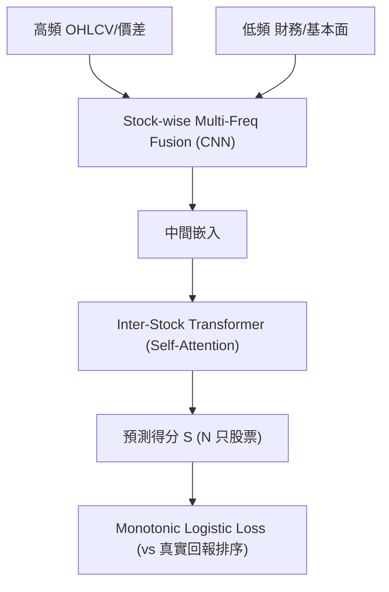

<!-- ontology-5axis data=量价表格 horizon=高频日内 paradigm=监督回归 alpha=端到端表征 autonomy=全自动黑盒 -->

# DSPO 解構

> **發布**：2024-06-03 · （無 venue）
> **QuantML 導讀**：[基于高频和日频因子的端到端直接排序组合构建模型](https://mp.weixin.qq.com/s?__biz=Mzg2MzAwNzM0NQ==&mid=2247484549&idx=1&sn=347c69bb297aef162bb364a1e68e9e72&chksm=ce7e639bf909ea8d632046f8f9acac70209067aa1f4c142f3a26733262d298b097041744f92d#rd)
> **核心定位**：五軸落點於「高頻日頻融合 × 端到端排序優化」，解了傳統量化中「特徵預測目標」與「組合構建目標」錯配的 prior gap，將優化信號直接錨定於橫截面排序一致性。

**五軸座標**

| 數據模態 | 時間尺度 | 學習範式 | Alpha機制 | 人機協作 |
|:-:|:-:|:-:|:-:|:-:|
| `量价表格` | `高频日内` | `监督回归` | `端到端表征` | `全自动黑盒` |

**Status:** v0.5 — 基於 QuantML 導讀 + 原論文（如有）。benchmark 細節待升 v1。
**TL;DR:** ① 提出端到端直接排序組合構建框架，跳過手動因子工程。② 核心 trick 為單調邏輯回歸損失與橫截面子採樣策略，直接最大化排序收益可能性。③ 對「端到端表征」軸★，將優化目標從代理預測強行對齊至組合排序。④ 導讀未給量化結果。

**X-Ray.** DSPO 將量化選股的優化目標從「代理預測（回歸/分類）」強制對齊至「直接排序」，切斷了傳統因子工程與組合構建之間的目標錯配鏈。其核心價值在於用可微的單調損失繞過手動特徵衰減，但代價是放棄了顯式風險約束與可解釋性。該架構打不開的 envelope 是流動性衝擊與波動率 regime 切換：純排序目標在尾部風險集中時會放大換手，且橫截面子採樣策略雖穩定了梯度，卻可能破壞時間序列的自相關結構。對實盤研究員而言，它提供了一條繞過因子庫維護的捷徑，但必須外接風險預算模塊才能脫離回測陷阱。

## §1 · 架構 / Core Mechanism
| 改動維度 | 前作/傳統基線 | DSPO 改動 | 工程意圖 |
|:---|:---|:---|:---|
| 輸入表徵 | 預計算因子矩陣（日頻為主） | 原始多頻張量（分鐘級高頻 + 日級低頻） | 消除特徵工程滯後與人工偏見 |
| 優化目標 | MSE/分類交叉熵/成對排名損失 | 單調邏輯回歸損失（Monotonic Logistic Regression） | 直接對齊排序組合構建目標，避開成對損失的內存爆炸 |
| 訓練策略 | 全量時間序列滑窗 | 橫截面子採樣（隨機選 m 日 × k 股） | 緩解橫截面樣本有限導致的訓練不穩定與過擬合 |

⚡ **Eureka:** 用 `tanh` 平滑替代 `sign` 函數，使不可導的排序關係轉為可微的單調邏輯回歸損失，實現端到端梯度下降。

**信息流 ASCII:**

## §2 · 數學層
📌 **Napkin Formula:**
`L = -E[ log( σ( tanh(S_i - S_j) * sign(R_i - R_j) ) ) ]`
複雜度：橫截面注意力 O(N²)，高頻卷積 O(T·N)，損失計算 O(k²)（子採樣 batch 內）。
直覺：不預測絕對收益率，只預測相對順序。`tanh` 將差值壓縮至 (-1,1)，`sign` 錨定真實回報方向，兩者相乘後經 sigmoid 計算排序一致性概率。
Loss/訓練：採用滾動重訓練，梯度由橫截面子採樣穩定；未披露正則化項與學習率調度細節。

## §3 · 數據層
- **規模/頻率**：>4000 只股票，分鐘級高頻（開高低收、買賣價差） + 日級低頻（PE、PB、PEG、周轉率）。
- **市場/時段**：NYSE（訓練 2020-2022，評估 2023）；A-Share（訓練 2018-2020，部署 2021）。
- **來源/預處理**：polygon.io 與專業渠道；高頻標準化，低頻 MinMax 至 [0,1]，排除 10 天內無交易量股票。
- **樣本外與容量假設**：嚴格時間切分 OOS；容量假設依賴子採樣策略緩解橫截面稀疏，但未披露實盤資金容量上限與滑點模型。

## §4 · 代碼層
| 欄位 | 狀態 |
|:---|:---|
| Repo | TBD |
| Checkpoint | TBD |
| License | TBD |
| 複現難度 | 高（需自定義單調損失、橫截面採樣器、多頻對齊） |
| 數據可得性 | 低（依賴專業高頻與財務數據，導讀未開源） |

## §5 · 評測 / Benchmark
| 數據集/市場 | Metric | 前SOTA | 本方法 | Δ |
|:---|:---|:---|:---|:---|
| NYSE | RankIC / RankICIR / IR / 累積回報 | 未披露 | 未披露 | 未披露 |
| A-Share | RankIC / RankICIR / IR / 累積回報 | 未披露 | 未披露 | 未披露 |

**解讀論斷：** 導讀僅聲明「DSPO 在所有指標上均優於其他模型」，未提供具體數值。若 Δ 為正，其真 capability 來源於優化目標對齊（直接最大化排序可能性，而非代理預測的 MSE 偏差）。潛在過擬合/偏差風險集中在：① 橫截面子採樣可能切斷時間序列依賴，導致實盤滾動時 RankIC 衰減；② 未計入交易成本、流動性衝擊與漲跌停限制，回測累積回報可能虛高；③ 高頻數據標準化在實盤中的滾動穩定性未驗證。

## §6 · 失效與隱含假設
**6.1 論文自述 limitations:** 處理不同投資規模與市場動態（流動性、風險敞口）能力有限；建議未來整合風險管理策略以提高適應性。
**6.2 推斷的隱含假設:** 
- Regime 依賴：假設微結構分佈與因子有效性在訓練/測試期穩定，未覆蓋流動性枯竭或極端波動 regime。
- 容量/成本：隱含假設子採樣 k 值對資金容量不敏感，且忽略融券限制與衝擊成本。
- 數據泄漏：高頻與低頻對齊若未嚴格使用 `t-1` 閉盤數據，易引入前瞻偏差；財務數據發布滯後未說明處理方式。

## §7 · 對比 & 面試 Tip
| 同軸對手 | 關鍵差異軸 | Open? | Status |
|:---|:---|:---|:---|
| 傳統多因子/深度回歸模型 | 優化目標（代理預測 vs 直接排序） | 開源生態成熟 | 工業界主流 |
| 成對排名損失模型 (Pairwise Rank) | 訓練穩定性/內存佔用（O(k²) vs O(N²)） | 部分開源 | 學術基線 |

🎤 **Interview Tip:** 
- ✅ 正確答：「DSPO 用單調邏輯回歸損失將組合構建目標直接嵌入訓練循環，解決了預測與優化錯配；但純排序目標缺乏風險約束，實盤需外接風險預算或波動率調節模塊。」
- ❌ 錯答：「它比回歸模型準確率更高，因為用了 Transformer 提取特徵。」（混淆了表徵能力與優化目標對齊的本質差異）

**7.1 可證偽預測:** 2025-12-31 前，若未引入顯式風險約束，該架構在波動率 regime 切換時 RankIC 衰減將快於傳統風險模型，且實盤 IR 將因未計入衝擊成本而顯著低於回測。

## §8 · For the Reader
- **因子研究員**：可將 DSPO 的損失函數作為因子組合階段的替代目標，繞過手動權重優化，但需警惕排序極端化。
- **高頻執行**：分鐘級高頻輸入需嚴格處理對齊與延遲；實盤部署前必須接入滑點與流動性過濾器。
- **組合配置**：純排序輸出需外接風險預算（如風險平價或 CVaR 約束），否則尾部風險敞口不可控。
- **研究學生**：重點複現橫截面子採樣策略與 `tanh` 平滑簽函數的梯度流，理解端到端優化與代理預測的 Pareto 權衡。

## References
- 原論文：Direct Sorted Portfolio Optimization (DSPO)
- QuantML 導讀：[基于高频和日频因子的端到端直接排序组合构建模型](https://mp.weixin.qq.com/s?__biz=Mzg2MzAwNzM0NQ==&mid=2247484549&idx=1&sn=347c69bb297aef162bb364a1e68e9e72&chksm=ce7e639bf909ea8d632046f8f9acac70209067aa1f4c142f3a26733262d298b097041744f92d#rd)
- Lineage: 端到端量化投資 / 直接排序優化 / 多頻融合表徵