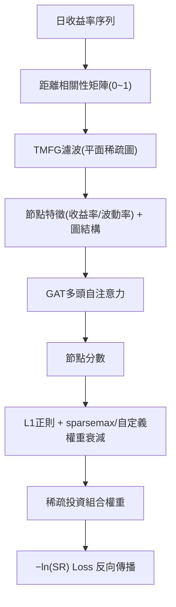

<!-- ontology-5axis data=图关系 horizon=日频波段 paradigm=监督回归 alpha=组合执行优化 autonomy=全自动黑盒 -->

# GAT 解構

> **發布**：2024-07-23 · （無 venue）
> **QuantML 導讀**：[基于图注意力网络GAT的大规模时变投资组合优化](https://mp.weixin.qq.com/s?__biz=Mzg2MzAwNzM0NQ==&mid=2247485526&idx=1&sn=3211acd2ac980511f57652e28edb81e1&chksm=ce7e6f48f909e65e4cd20198214ddd908ebec35be6ce8d459f5a3e7bed613cde680e48eb2487#rd)
> **核心定位**：落點於「圖關係 × 監督回歸 × 組合執行優化」軸，直擊傳統均值-方差優化在高維非線性相關結構下的計算瓶頸與樣本外不穩定問題。以可微負對數夏普比率為錨，將圖注意力網絡的動態鄰域加權與 TMFG 稀疏濾波結合，實現端到端的時變權重分配。

**五軸座標**

| 數據模態 | 時間尺度 | 學習範式 | Alpha機制 | 人機協作 |
|:-:|:-:|:-:|:-:|:-:|
| `图关系` | `日频波段` | `监督回归` | `组合执行优化` | `全自动黑盒` |

**Status:** v0.5 — 基於 QuantML 導讀 + 原論文（如有）。benchmark 細節待升 v1。
**TL;DR:** ① 以距離相關性構建資產圖並經 TMFG 降維，輸入 GAT 捕捉非線性依賴；② 核心 trick 是將負對數夏普比率（− ln SR）直接設為可微損失函數，配合 L1 正則與 sparsemax 輸出稀疏權重；③ 對「組合執行優化」軸★，跳過傳統兩階段（先預測後優化）的誤差累積，實現風險調整收益的端到端梯度下降；④ 導讀未給量化結果。

**X-Ray.** 放回五軸 Pareto，本法捨棄了「預測收益率」的傳統 Alpha 生成路徑，轉而將組合優化本身建模為圖上的監督回歸問題。這解決了兩個舊工程坑：一是高維協方差矩陣估計的樣本外崩潰（TMFG 強制平面稀疏結構，規避了病態矩陣求逆）；二是損失函數與實盤目標錯配（− ln SR 直接對齊 Sharpe，繞過 MSE/MAE 對尾部風險的鈍感）。然而，其打不開的 Envelope 同樣明確：距離相關性雖能捕捉非線性，但計算複雜度隨資產數呈二次方增長，導讀提及的「滾動窗口限制至約 5,000 家」暗示了算力與數據吞吐的硬約束；此外，TMFG 的平面性假設可能過度過濾了危機狀態下的跨市場聯動邊。對量化讀者而言，此架構的價值不在於提供即插即用的因子，而在於示範了「可微金融指標 + 圖稀疏先驗」的端到端訓練範式。實盤落地需補齊交易成本內生化與動態閾值機制，否則稀疏權重在 rebalance 時易產生滑點吞噬。

## §1 · 架構 / Core Mechanism
**1.1 三大改動 vs 前作**
| 維度 | 傳統均值-方差 / 等權 | 本方法 (GAT+TMFG) | 工程意義 |
|---|---|---|---|
| 相關結構建模 | 線性皮爾遜矩陣，高維病態 | 距離相關性 + TMFG 平面濾波 | 規避協方差求逆，強制稀疏先驗 |
| 優化目標對齊 | 兩階段（預測收益→二次規劃） | 負對數夏普比率（− ln SR）端到端 | 消除預測誤差累積，直對風險調整收益 |
| 權重生成機制 | 解析解 / 等權 | GAT 自注意力 + L1/sparsemax | 動態鄰域加權，輸出可調稀疏度 |

**1.2 ⚡ Eureka 一句話 trick + 直覺**
將 Sharpe Ratio 取負對數作為可微 Loss，讓網絡在圖結構上直接「爬」向風險調整收益的峰值，而非先猜收益率再二次規劃。

**1.3 信息流 ASCII 圖**

## §2 · 數學層
📌 **Napkin Formula：**
$ \mathcal{L} = -\ln\left(\frac{\mu_p}{\sigma_p}\right) + \lambda \|w\|_1 $
**複雜度：** 距離相關性計算 $O(N^2)$，TMFG 濾波 $O(N \log N)$，GAT 前向 $O(E \cdot d)$（$E$ 為濾波後邊數，受平面圖限制 $E \le 3N-6$）。
**直覺：** 損失函數將組合波動率 $\sigma_p$ 置於分母並取對數，梯度會自動懲罰高相關集群的權重集中；L1 項與 sparsemax 確保輸出權重矩陣天然稀疏，降低 rebalance 摩擦。
**Loss/訓練細節：** 採用早期停止（patience=15），驗證集監控 − ln SR 防止過擬合。

## §3 · 數據層
- **資料規模/頻率/市場/時段：** 美國市場中型公司（mid-cap），過去30年日頻收盤價。總涵蓋約20,000家公司部分或全部時段；透過滾動窗口，任一時點活躍資產約5,000家。
- **怎麼來：** 價格轉日收益率，距離相關性計算前進行規範化。
- **樣本外與容量假設：** 導讀提及分割比例前後表述不一（分別提及50%/25%/25%與60%/40%且驗證占剩餘25%）；未披露具體樣本外區間與容量上限假設，僅暗示5,000家為算力/窗口限制下的操作規模。

## §4 · 代碼層
| 欄位 | 內容 |
|---|---|
| Repo / Checkpoint | TBD |
| License | TBD |
| 複現難度 | 高（需自實作距離相關性、TMFG濾波演算法與 − ln SR 可微層） |
| 數據可得性 | 中（需完整30年日頻收盤價與公司市值分類，mid-cap 定義未披露） |

## §5 · 評測 / Benchmark
| 數據集/市場 | Metric | 前SOTA (均值-方差) | 前SOTA (等權) | 本方法 | Δ |
|---|---|---|---|---|---|
| 美國mid-cap (30年滾動) | Sharpe Ratio | 未披露 | 未披露 | 顯著優於基準 | 未披露 |

**解讀：** 導讀僅定性描述「顯著優於傳統等權和均值-方差模型」且「在過去30年多數時間表現一致」，未提供任何具體 Sharpe 數值。此結構性優勢源於目標函數對齊與圖稀疏先驗，但缺乏成本調整（滑點、手續費）與交易頻率說明，實盤 Δ 可能因 rebalance 摩擦大幅衰減。

## §6 · 失效與隱含假設
**6.1 論文自述 limitations：** 聚焦中小型公司優化；未探討極端市場下的圖結構斷裂；建議未來加入 ESG 或預測市場機制。
**6.2 推斷的隱含假設：**
- **Regime 依賴：** 距離相關性與 TMFG 平面假設在危機模式（相關性趨於1）下可能失效，濾波邊數驟減導致 GAT 訊息傳遞中斷。
- **容量/成本：** 5,000 家資產池暗示高流動性假設；未計入交易成本，稀疏權重若頻繁切換將產生滑點。
- **數據泄漏：** 滾動窗口若未嚴格對齊特徵計算與權重生成時間戳，距離相關性矩陣易含前瞻偏差。
- **指標標籤：** 導讀同時使用「中心性度量」與「外圍性得分」，後者為前者綜合後的倒數映射，非獨立指標，實證需嚴格區分。

## §7 · 對比 & 面試 Tip
| 同軸對手 | 關鍵差異軸 | Open? | Status |
|---|---|---|---|
| 傳統二次規劃 (Markowitz) | 線性協方差 vs 非線性圖距離+可微Loss | 是 | 成熟/工業標準 |
| RL 組合優化 (PPO/SAC) | 離散動作空間/回報導向 vs 連續權重/Sharpe導向 | 部分 | 研究熱點/實盤門檻高 |
| 稀疏逆協方差 (Graphical Lasso) | 靜態稀疏先驗 vs 動態 GAT 注意力+TMFG | 是 | 統計學經典 |

🎤 **Interview Tip**
- **正確答：**「本法核心是將 Sharpe Ratio 轉為可微 Loss 並結合圖稀疏先驗，跳過收益率預測階段，直接優化風險調整收益。實盤需補齊交易成本內生化與動態閾值。」
- **錯答：**「它用 GAT 預測未來收益率，然後用 TMFG 過濾噪音，最後算夏普比率。」（混淆了端到端優化與兩階段預測）

**7.1 可證偽預測帶日期：** 若 2025-12-31 前無開源實作將 − ln SR 與 TMFG 結合並公開回測代碼，則此架構可能僅限於學術模擬，缺乏實盤摩擦建模。

## §8 · For the Reader
- **因子研究員：** 距離相關性可作為傳統皮爾遜/ Spearman 的互補特徵，但需警惕其在高頻下的計算瓶頸與樣本外不穩定。
- **高頻執行：** 本法輸出稀疏權重，若 rebalance 頻率未與滑點模型耦合，實盤 Alpha 將被交易成本吞噬。建議加入交易成本正則項。
- **組合配置：** TMFG 的平面稀疏結構天然適合風險平價或風險預算框架，可嘗試將外圍性得分映射為風險貢獻權重。
- **LLM-agent / RL 策略：** 可將 − ln SR 作為 RL 的 Reward Shaping 項，替代純收益最大化，提升策略的風險調整穩定性。
- **研究學生：** 重點復現 TMFG 濾波演算法與 sparsemax 的梯度流，這是圖神經網絡在金融優化中落地的關鍵工程節點。

## References
- 原論文：基於圖注意力網絡GAT的大規模時變投資組合優化（無 venue，2024-07-23）
- Lineage：Markowitz Mean-Variance → Graphical Lasso → GNN/GAT in Finance → Differentiable Portfolio Optimization
- QuantML 導讀鏈接：[基于图注意力网络GAT的大规模时变投资组合优化](https://mp.weixin.qq.com/s?__biz=Mzg2MzAwNzM0NQ==&mid=2247485526&idx=1&sn=3211acd2ac980511f57652e28edb81e1&chksm=ce7e6f48f909e65e4cd20198214ddd908ebec35be6ce8d459f5a3e7bed613cde680e48eb2487#rd)