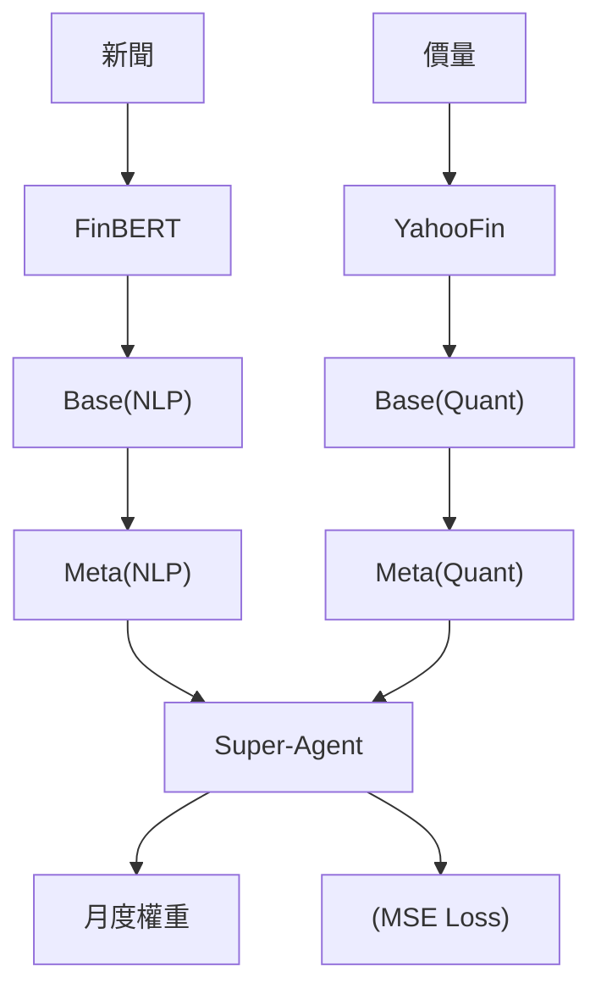

<!-- ontology-5axis data=多模态 horizon=中长周期 paradigm=强化学习 alpha=组合执行优化 autonomy=全自动黑盒 -->

# HARLF 解構

> **發布**：2025-07-31 · （無 venue）
> **QuantML 導讀**：[HARLF：分层强化学习如何融合数据与情感](https://mp.weixin.qq.com/s?__biz=Mzg2MzAwNzM0NQ==&mid=2247491189&idx=1&sn=19fdc880b5694771c2204e3efcd50162&chksm=ce7e796bf909f07d2dc781152e61af8e8eafc8a17f85514fa131ab416daf1ed103bc4cdaf61c#rd)
> **核心定位**：多模態（量價+FinBERT情感）融合的中長週期（月度）HRL組合優化框架，解決扁平化DRL在跨資產配置時的可擴展性差與策略不穩定問題。

**五軸座標**

| 數據模態 | 時間尺度 | 學習範式 | Alpha機制 | 人機協作 |
|:-:|:-:|:-:|:-:|:-:|
| `多模态` | `中长周期` | `强化学习` | `组合执行优化` | `全自动黑盒` |

**Status:** v0.5 — 基於 QuantML 導讀 + 原論文（如有）。benchmark 細節待升 v1。
**TL;DR:** ① 提出HARLF三層HRL架構，將FinBERT情感信號與傳統量價指標解耦處理後再動態聚合。② 核心trick是底層分離模態、中層元智能體動態加權、頂層超級智能體以前瞻性獎勵監督學習融合雙視角。③ 對「alpha=组合执行优化」軸★，將非結構化文本轉化為可追溯的月度權重調整信號。④ 導讀給出2018-2024測試期年化回報26.0%、夏普1.2。

**X-Ray.** 本框架將HRL的「分而治之」思想引入月度組合優化，刻意避開單模態DRL在觀測空間膨脹時的梯度消失與過擬合陷阱。底層按模態隔離（量價 vs 情感）實質是特徵工程的自動化，中層Meta-Agent解決了傳統線性加權無法適應Regime切換的工程痛點。然而，其Envelope受限於「月度再平衡」與「僅做多/無槓桿」的硬約束，無法捕捉日內或週頻的Alpha衰減。對量化讀者而言，價值不在於直接實盤，而在於提供了一套「非結構化信號如何安全注入RL狀態空間」的範式：將LLM輸出降維為月度標量分數，並用前瞻性獎勵做頂層監督，有效規避了DRL常見的獎勵稀疏與非平穩性問題。

## §1 · 架構 / Core Mechanism
| 改動維度 | 前作（扁平/單模態DRL） | HARLF 改動 | 工程收益 |
|---|---|---|---|
| 觀測空間 | 量價與情感直接拼接 | 底層Base Agents按模態物理隔離 | 避免高維稀疏狀態下的梯度掩碼 |
| 策略融合 | 靜態線性加權或投票 | 中層Meta-Agents動態學習權重 | 適應市場Regime切換，平滑異常決策 |
| 頂層決策 | 無（單層輸出） | Super-Agent以前瞻獎勵監督學習 | 將多智能體博弈降維為回歸任務，提升可解釋性 |

**⚡ Eureka:** 用「未來H期累積回報」反推當前最佳模態權重，將RL的探索問題轉化為頂層的監督學習問題。

**信息流 ASCII:**

## §2 · 數學層
**📌 Napkin Formula:**
`Reward = w1*ROI - w2*Vol - w3*MDD` （係數 w ∈ [0.5, 2]）
`Loss_Super = MSE(W_pred, W_best_lookahead)` | 複雜度: O(T × N_assets × N_algos)

**直覺:** 底層獎勵函數硬編碼風險懲罰，頂層用MSE擬合「上帝視角」的權重分配。本質是將多智能體策略融合轉化為條件回歸，規避了多目標RL的Pareto前沿搜索困難。
**Loss/訓練:** 底層用SB3 (PPO/SAC/DDPG/TD3) 在線學習；頂層收集Meta建議與Lookahead最佳行動，用Adam+MSE監督訓練。

## §3 · 數據層
* **規模/頻率/市場:** 14種跨國股票指數與商品，月度頻率。
* **來源:** Yahoo Finance (價量), Google News (每月10篇/資產), FinBERT (情感分數)。
* **時段:** 訓練 2000-2017 / 2003-2017（原文表述不一，標TBD）；回測 2018-2024。
* **樣本外與容量假設:** 純高流動性全球指數+商品；月度調倉容量假設大，但受限於新聞抓取延遲與LLM推理成本。

## §4 · 代碼層
| 欄位 | 狀態 |
|---|---|
| Repo | TBD（導讀註明見QuantML知識星球） |
| Checkpoint | 未披露 |
| License | 未披露 |
| 複現難度 | 高（需自構建三層RL環境與新聞抓取管道） |
| 數據可得性 | 中（Yahoo/Google News可爬，但需處理反爬與日期對齊） |

## §5 · 評測 / Benchmark
| 數據集/市場 | Metric | 前SOTA | 本方法 | Δ |
|---|---|---|---|---|
| 14 Assets (2018-2024) | ROI | 等權重 7.5% | 超級智能體 26.0% | +18.5% |
| 14 Assets (2018-2024) | ROI | S&P 500 13.2% | 超級智能體 26.0% | +12.8% |
| 14 Assets (2018-2024) | ROI | CNN-RL 22.0% | 超級智能體 26.0% | +4.0% |
| 14 Assets (2018-2024) | Sharpe | 等權重 0.57 | 超級智能體 1.2 | +0.63 |
| 14 Assets (2018-2024) | Sharpe | S&P 500 0.63 | 超級智能體 1.2 | +0.57 |
| 14 Assets (2018-2024) | Sharpe | CNN-RL 1.3 | 超級智能體 1.2 | -0.1 |

**解讀:** ROI領先主要來自情感信號對趨勢的提前反應與HRL的風險平滑；但Sharpe略低於CNN-RL的1.3，且波動率達20.0%，顯示高回報部分由承擔更高尾部風險換取。前瞻性獎勵（Lookahead Reward）雖提升頂層決策質量，但本質引入了未來信息偏差，若未嚴格切割訓練/測試集或考慮交易成本，實盤Δ可能大幅收斂。

## §6 · 失效與隱含假設
**6.1 論文自述 limitations:** 導讀未明確列出自身Limitations，僅指出扁平架構易過擬合/不穩定。
**6.2 推斷的隱含假設:** 
* **Regime依賴:** 假設「新聞情緒能預測月度收益」，在低情緒波動或政策干預主導的市場中，Meta-Agent聚合權重將趨於均勻。
* **容量/成本:** 僅做多/無槓桿/月度調倉假設極高容量，但未計入新聞抓取API/LLM推理/月度再平衡滑點。
* **數據泄漏:** Lookahead Reward使用未來H期回報選出當前最佳行動，若H期跨越測試集邊界或訓練集未嚴格滾動，易產生前瞻偏差。

## §7 · 對比 & 面試 Tip
| 同軸對手 | 關鍵差異軸 | Open? | Status |
|---|---|---|---|
| Flat DRL / Single-Modal RL | 模態融合方式（靜態拼接 vs 三層動態聚合） | TBD | 學術驗證 |

**🎤 Interview Tip:** 
* **正確答:** HARLF的核心不是堆疊LLM，而是用「前瞻性獎勵監督學習」解決多智能體策略融合的動態權重分配問題，將RL探索轉為頂層回歸。
* **錯答:** 認為FinBERT直接輸出交易信號，或忽略Lookahead Reward帶來的數據泄漏風險。

**7.1 可證偽預測:** 若2025年Q1全球宏觀Regime切換至「低情緒波動+高頻政策干預」，且新聞情感分數與資產月度收益相關性顯著下降，則Meta-Agent聚合權重將趨於均勻，Super-Agent表現將退化至等權重基準（7.5% ROI）。

## §8 · For the Reader
* **因子研究員:** 關注FinBERT月度情感分數的構建邏輯，可嘗試將其替換為自研NLP因子，驗證HRL聚合層是否比線性IC加權更穩健。
* **組合配置/中頻執行:** 月度調倉+僅做多約束極適合機構資金，但需實測新聞抓取延遲與LLM推理成本對淨值的侵蝕，建議先做成本敏感性分析。
* **RL策略開發者:** 頂層用MSE擬合Lookahead最佳權重是亮點，可借鑒至多因子擇時或動態風險預算場景，但務必嚴格隔離訓練/測試集的時間窗口。

## References
* 原論文: HARLF (2025) · Venue: 未披露
* Lineage: Markowitz MVO · Jiang et al. (2017) CNN-RL · FinBERT
* QuantML 導讀: [HARLF：分层强化学习如何融合数据与情感](https://mp.weixin.qq.com/s?__biz=Mzg2MzAwNzM0NQ==&mid=2247491189&idx=1&sn=19fdc880b5694771c2204e3efcd50162&chksm=ce7e796bf909f07d2dc781152e61af8e8eafc8a17f85514fa131ab416daf1ed103bc4cdaf61c#rd)