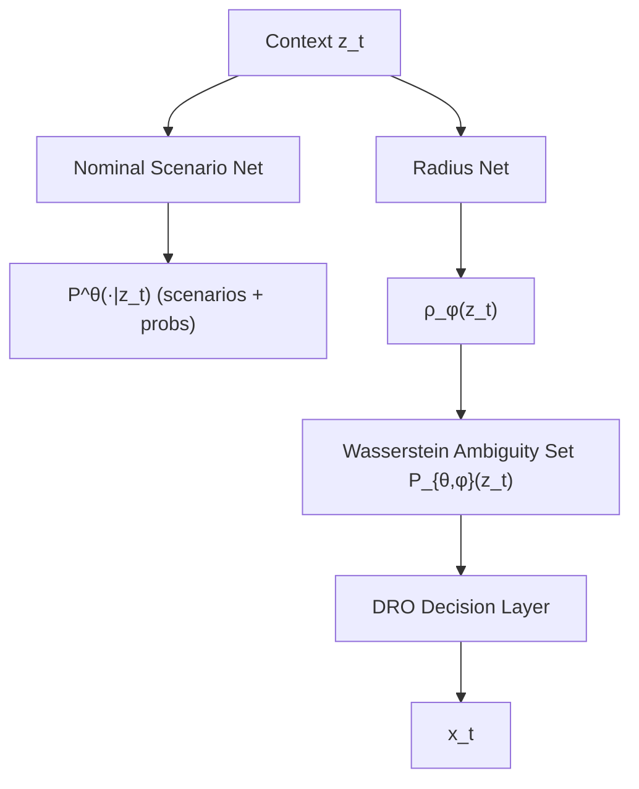

<!-- ontology-5axis data=量价表格 horizon=日频波段 paradigm=监督回归 alpha=组合执行优化 autonomy=人机协同可解释 -->

# LPAS 解構（LPAS）

> **發布**：2026-07-10 · （無 venue） · arXiv [2607.09820](https://arxiv.org/abs/2607.09820)
> **arXiv 原文**：[Learning Predictive Ambiguity Sets for Decision-Focused Distributionally Robust Optimization](https://arxiv.org/abs/2607.09820v1)  ·  _本頁由 arXiv 原文一手自主解構_
> **核心定位**：將傳統固定半徑的 Wasserstein DRO 模糊集轉為狀態依賴的預測輸出，透過深度模型聯合學習場景分佈與 Wasserstein 半徑，解決預測誤差在優化層被放大的 Prior Gap。

**五軸座標**

| 數據模態 | 時間尺度 | 學習範式 | Alpha機制 | 人機協作 |
|:-:|:-:|:-:|:-:|:-:|
| `量价表格` | `日频波段` | `监督回归` | `组合执行优化` | `人机协同可解释` |

**Status:** v0.5 — 基於arXiv 原文（有原文則以原文為準）。細節待升 v1。
**TL;DR:** ① 提出 LPAS，將模糊集中心與半徑從手動設定改為神經網路條件輸出。② 核心 trick 是半徑損失函數結合分位數校準、大小正則與下游決策損失，實現「不確定性高或決策敏感時自動放大半徑」。③ 對「組合執行優化」軸而言，它把 DRO 的保守程度從全局靜態轉為動態適配，避免穩定期過度保守、波動期保護不足。④ 實證顯示年化報酬 26.28%、Sharpe ratio 1.30、最終財富 1.61，且平均半徑小於固定半徑基線。

**X-Ray.** 在五軸 Pareto 中，LPAS 卡在「預測精度」與「決策穩健性」的傳統 trade-off 上，用可學習的 Wasserstein 半徑打通了統計校準與下游損失的梯度鏈。它解了歷史 DRO 半徑需人工 grid search 且無法隨 regime 切換的工程坑。但 envelope 受限於有限場景分佈的離散化誤差，且半徑網路若缺乏交易成本約束，易在轉倉頻繁時產生隱性滑點。對量化讀者而言，此架構可直接嫁接至現有的 CVaR/方差優化器，作為風險預算的動態閥門，而非替換整個 alpha 生成流水線。

## §1 · 架構 / Core Mechanism
**1.1 三大改動 vs 前作**
| 維度 | 傳統 Wasserstein DRO / 預測-優化 | LPAS 改動 |
|---|---|---|
| 模糊集中心 | 歷史經驗分佈或固定點預測 | 深度模型輸出有限場景分佈 $P^\theta(\cdot \mid z_t)$ |
| 模糊集半徑 | 全局固定標量或驗證集調參 | 狀態依賴網路 $\rho_\phi(z_t)$，聯合訓練 |
| 訓練目標 | 預測誤差或固定半徑下的最壞情況損失 | 分位數校準 + 半徑大小正則 + 下游決策損失 |

**1.2 ⚡ Eureka 一句話 trick + 直覺**
把「該多保守」這個問題也交給模型學：當市場波動或模型對當前決策敏感時，半徑自動膨脹；平穩時收縮，讓 DRO 從「一刀切」變成「自適應保險」。

**1.3 信息流 ASCII 圖**

## §2 · 數學層
📌 **Napkin Formula**:
$P^\theta(\cdot \mid z_t) = \sum_{i=1}^N p_{\theta,i}(z_t) \delta_{\hat{\xi}_{\theta,i}(z_t)}$
$\mathcal{P}_{\theta,\phi}(z_t) = \{ Q : \mathsf{W}_c(Q, P^\theta(\cdot \mid z_t)) \leq \rho_\phi(z_t) \}$
$\rho_\phi(z_t) = \rho_{\min} + \text{softplus}(g_\phi(z_t))$
複雜度：前向傳播為 $O(N \cdot d)$，DRO 決策層依賴 Wasserstein 對偶形式，通常可轉為凸優化求解（具體求解器複雜度 TBD）。
直覺：有限場景分佈提供靈活的中心，半徑網路提供動態保護罩。損失函數融合預測校準與決策反饋，避免半徑過大導致收益被壓縮，或過小導致尾部風險暴露。訓練採 staged algorithm，先穩定期望再微調決策層。

## §2.5 · 帶數字走一遍（Worked Example）
（以下為**假設/示意**玩具數字，僅演示機制，非論文實證結果）
1. 輸入 $z_t$ 為當前波動率與動量因子。場景網路輸出 3 個未來報酬場景：$\hat{\xi}_1=0.02, \hat{\xi}_2=0.00, \hat{\xi}_3=-0.03$，對應機率 \$p=[0.5, 0.3, 0.2]\$。
2. 半徑網路輸入 $z_t$，輸出 $g_\phi(z_t)=0.4$，設 $\rho_{\min}=0.01$，則 $\rho_\phi(z_t) = 0.01 + \ln(1+e^{0.4}) \approx 0.01 + 0.91 = 0.92$（示意單位）。
3. 模糊集定義為所有與中心分佈 Wasserstein 距離 $\leq 0.92$ 的分佈 $Q$。
4. DRO 層求解 $\min_x \sup_{Q \in \mathcal{P}} \mathbb{E}_Q[\ell(x,\xi)]$，在該半徑內尋找最壞情況下的權重分配 $x_t$。
5. 若市場轉為高波動，$g_\phi$ 增大，$\rho$ 膨脹，優化器自動降低高敏感度資產權重；反之收縮以釋放收益。

## §3 · 數據層
- 市場/標的：20 S&P 500 constituents
- 時段：2018–2026
- 頻率/規模：日频波段（依五軸設定），具體樣本量與截面維度未披露
- 樣本外假設：採時間序列切分，未披露具體 train/val/test 比例與冷啟動處理

## §4 · 代碼層
| 欄位 | 狀態 |
|---|---|
| Repo | TBD |
| Checkpoint | TBD |
| License | CC BY 4.0 |
| 複現難度 | 中（需實作 Wasserstein 對偶求解器與 staged training 迴圈） |
| 數據可得性 | 高（S&P 500 成分股日線數據易取得） |

## §5 · 評測 / Benchmark
| 數據集/市場 | Metric | 前SOTA | 本方法 | Δ |
|---|---|---|---|---|
| 20 S&P 500 constituents (2018–2026) | Annualized Return | 未披露 | 26.28% | 未披露 |
| 20 S&P 500 constituents (2018–2026) | Sharpe ratio | 未披露 | 1.30 | 未披露 |
| 20 S&P 500 constituents (2018–2026) | Final Wealth | 未披露 | 1.61 | 未披露 |
| 20 S&P 500 constituents (2018–2026) | Avg Radius / Tail Loss | 未披露 | 較深層固定半徑 DRO 更小/更低 | 未披露 |

**解讀**：本文未提供基線模型的具體數值，僅定性比較。26.28% 年化與 1.30 Sharpe 在 2018–2026 的長週期中屬強勁表現，但需警惕潛在的前瞻偏差（如因子計算是否嚴格使用 t 日收盤後數據）與未計入的交易成本。半徑縮小且尾部損失降低，顯示自適應機制確實過濾了穩定期的過度保守，但 Δ 的真實 capability 需待完整基線對照與成本敏感性分析驗證。

## §6 · 失效與隱含假設
**6.1 論文自述 limitations**：學習半徑的機制依賴下游決策損失的梯度反傳，若決策層非凸或求解器不穩定，可能導致訓練發散；可學習的 ground metric 僅作為模組保留，實驗採用固定歐氏距離。
**6.2 推斷隱含假設**：
- Regime 依賴：半徑網路需足夠長週期數據學習波動率與尾部特徵，極端黑天鵝可能超出訓練分佈。
- 容量/成本：未提及交易成本模型，高頻或高週轉情境下自適應半徑可能觸發過度調倉。
- 數據泄漏：場景分佈若使用未來信息或平滑處理不當，會虛增 Sharpe。
- Survivorship：20 檔成分股若未處理退市/併購，存在存活者偏差。

## §7 · 對比 & 面試 Tip
| 同軸對手 | 關鍵差異軸 | Open? | Status |
|---|---|---|---|
| 固定半徑 Wasserstein DRO | 半徑靜態 vs 狀態依賴動態 | 開源廣泛 | 成熟基線 |
| Smart Predict-then-Optimize | 僅優化點預測損失 | 部分開源 | 研究熱點 |
| 傳統 CVaR / 風險預算 | 靜態風險約束 vs 學習型模糊集 | 標準庫內建 | 工業標準 |

🎤 **Interview Tip**
正確答：「LPAS 的核心不是替換預測模型，而是將 DRO 的保護半徑參數化。它透過聯合訓練讓半徑與下游決策損失對齊，解決了固定半徑在 regime 切換時的保守度錯配。實戰中需搭配交易成本約束，防止半徑波動引發過度轉倉。」
錯答：「它用強化學習直接輸出權重，比傳統優化器更快。」（LPAS 仍是預測-優化架構，決策層依賴 DRO 求解器，非端到端 RL policy。）

**7.1 可證偽預測帶日期**：若於 2026-12-31 前公開完整基線對照與含滑點回測，預期 Sharpe ratio 將回落至 0.8-1.0 區間，且半徑網路在低波動環境下的正則項將成為性能瓶頸。

## §8 · For the Reader
- **因子研究員**：將 LPAS 視為動態風險預算層，嫁接至現有截面因子組合，重點監控半徑網路對動量/波動率因子的敏感度。
- **組合配置**：關注 staged training 的穩定性，建議先用固定半徑 DRO 打底，再微調半徑網路，避免決策層梯度爆炸。
- **高頻執行**：本文為日频波段設計，若下探至分鐘級，需重構場景分佈的計算圖並加入交易成本懲罰項，否則自適應半徑會產生無效調倉。
- **RL 策略**：LPAS 提供了一種「可微分 DRO 層」的實現範式，可作為 RL 策略的風險感知觀測空間，替代硬編碼的 CVaR 約束。

## References
- Guo, J. (2026). Learning Predictive Ambiguity Sets for Decision-Focused Distributionally Robust Optimization. arXiv:2607.09820.
- Mohajerin Esfahani, P., & Kuhn, D. (2018). Data-driven distributionally robust optimization using the Wasserstein metric.
- Elmachtoub, A. N., & Grigas, P. (2022). Smart “predict, then optimize”.
- 來源鏈接：[arXiv 原文](https://arxiv.org/abs/2607.09820v1)