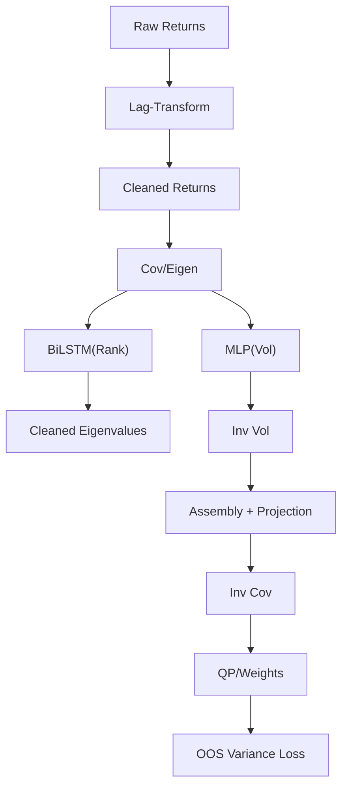

<!-- ontology-5axis data=量价表格 horizon=日频波段 paradigm=监督回归 alpha=组合执行优化 autonomy=人机协同可解释 -->

# RIEnet 解構（RIEnet）

> **發布**：2026-06-24 · （無 venue）
> **QuantML 導讀**：[经济物理学泰斗Mantegna新作： 端到端协方差网络](https://mp.weixin.qq.com/s?__biz=Mzg2MzAwNzM0NQ==&mid=2247494131&idx=1&sn=f6ca8472c1db8785f68b7b867e934304&chksm=ce7d8eedf90a07fb9177b2d1810b8fe57bbed3a2da92e540c424dd1d1996af14175196cd2fed#rd)
> **原始論文**：[End-to-End Large Portfolio Optimization for Variance Minimization with Neural Networks Through Covariance Cleaning](https://doi.org/10.2139/ssrn.5377303)（2025 · 被引 1 · Crossref）
> **核心定位**：落點於「監督回歸 × 組合執行優化」軸，解決傳統 RMT 收縮估計器以 Frobenius 范數為目標與實際組合樣本外風險脫節的 prior gap，並透過特徵值排序映射打破深度學習參數隨資產維度膨脹的剛性限制。

**五軸座標**

| 數據模態 | 時間尺度 | 學習範式 | Alpha機制 | 人機協作 |
|:-:|:-:|:-:|:-:|:-:|
| `量价表格` | `日频波段` | `监督回归` | `组合执行优化` | `人机协同可解释` |

**Status:** v0.5 — 基於 QuantML 導讀 + 原論文（如有）。benchmark 細節待升 v1。
**TL;DR:** ① 提出 RIEnet，將協方差矩陣分解為時滯變換、BiLSTM 特徵值清洗與 MLP 波動率估計三模組，端到端最小化樣本外實現方差。② 核心 trick 是將特徵值排序位置（Rank Index）映射為偽時間軸輸入 BiLSTM，借用庫侖氣體局域排斥直覺實現參數量與資產維度解耦。③ 此設計對「組合執行優化」軸★至關重要，使模型能在小規模組合訓練後直接外推至千只股票大宇宙，無需重訓。④ 導讀給出樣本外年化波動率 11.9% 與 Sharpe 1.058，顯著超越傳統 QIS 基準的 Sharpe 0.848。

**X-Ray.** 在「維度泛化 vs 參數膨脹」與「損失函數對齊 vs 計算可導」的 Pareto 邊界上，RIEnet 選擇了特徵值譜的幾何不變性（排序等變）作為錨點。傳統 RNN/Transformer 綁定輸入維度，Ledoit-Wolf/NLS 優化 MSE 而非組合風險。RIEnet 用 BiLSTM 處理一維序列，參數量恆定（34,433），閉式權重反傳避開矩陣求逆的數值不穩。這解了高維協方差估計的「病態求逆」與「目標錯配」雙坑。但 envelope 打不開之處在於：庫侖氣體假設依賴特徵值譜的連續性與大維度極限行為，在極端流動性枯竭或斷層市（regime shift）下，特徵值排序可能劇烈跳變，BiLSTM 的序列平滑性會失效；且長短記憶的雙曲衰減（Hyperbolic Decay）雖比 EWMA 貼近實證，但對結構性斷點的適應仍依賴滾動視窗的滯後。對量化讀者而言，此架構非預測 Alpha，而是純粹的風險矩陣正則化工具，適合嵌入現有多因子框架的協方差估計層，而非替代選股模型。

## §1 · 架構 / Core Mechanism
**1.1 三大改動 vs 前作**
| 模組 | 傳統/前作做法 | RIEnet 改動 | 解耦效果 |
|---|---|---|---|
| 時滯變換 | 固定 EWMA / 原始收益率 | 可微雙曲正切差分變換 | 動態擬合衰減曲線與軟截斷 |
| 特徵值清洗 | RMT 收縮 / 全連接網絡 | Rank Index 作偽時間軸輸入 BiLSTM | 參數量恆定，維度自适应 |
| 波動率估計 | 歷史樣本 / 截面聯合輸入 | 資產通用 MLP 逐個估計逆波動率 | 參數量 2,753，不隨 N 膨脹 |

**1.2 ⚡ Eureka**
將特徵值排序位置視為一維庫侖氣體的粒子位置，用 BiLSTM 捕捉鄰域排斥力，實現「維度無關」的譜收縮。

**1.3 信息流 ASCII**

## §2 · 數學層
📌 **Napkin Formula**: $\mathcal{L} = \frac{1}{T_{rebal}} \sum_{t} w_{t}^{\top} \Sigma_{t}^{realized} w_{t}$, where $w \propto \hat{\Sigma}^{-1} \mathbf{1}$。複雜度：BiLSTM $O(N \cdot d_{hid})$，但 $N$ 為特徵值數量（動態抽樣），參數量固定；閉式反傳避開 $O(N^3)$ 矩陣求逆。

**直覺**: 損失直接錨定組合實現金額風險，梯度透過權重閉式解流回特徵值修正函數與波動率 MLP，跳過黑箱權重輸出，確保優化目標與實盤風險一致。

**Loss/訓練細節**: 聯合優化時滯參數、BiLSTM 權重、MLP 權重；batch 內隨機均勻抽取資產數量 $N$ 強制學習通用清洗規律，確保維度外推能力。

## §3 · 數據層
**資料規模/頻率/市場/時段**: 1990 年 1 月至 2024 年 12 月 NYSE/NASDAQ 美股（剔除 ADR/ETF/不合規退市）。日頻。
**怎麼來**: 滾動窗口訓練，1999 年 12 月 31 日為首個驗證截止點，每年滾動，共 24 個獨立網絡。
**樣本外與容量假設**: 調倉日僅用已知信息；流動性過濾（5年參與率≥95%、近期量≥1%/市值1%、流通股>500萬、股價10 美元至 2,000 美元、剔除極低方差與共線性>0.95），最終保留市值前 1000 只。容量假設起始資金 100 萬美元，忽略大單衝擊。

## §4 · 代碼層
| 欄位 | 內容 |
|---|---|
| Repo | PyPI (rienet) |
| Checkpoint | 未披露 |
| License | 未披露 |
| 複現難度 | 中高（需自構 IBKR 級摩擦模擬器與滾動防泄漏管道） |
| 數據可得性 | 需商業級美股全量日線與流動性/市值歷史數據（TBD） |

## §5 · 評測 / Benchmark
| 數據集/市場 | Metric | 前SOTA | 本方法 | Δ |
|---|---|---|---|---|
| 美股 (2000-2024) | OOS Variance | 未披露 | 9.0% | 未披露 |
| 美股 (2000-2024) | Annual Vol | 未披露 | 11.9% | 未披露 |
| 美股 (2000-2024) | Sharpe | 0.848 (QIS) | 1.058 | +0.210 |
| 美股 (2000-2024) | Turnover | 18.0% (AO) | 57.0% | +39.0pp |
| 美股 (2000-2024) | Annual Return | 未披露 | 12.6% | 未披露 |
| 美股 (2000-2024) | VaR | 未披露 | -1.05% | 未披露 |
| 美股 (2000-2024) | CVaR | 未披露 | -1.76% | 未披露 |

**解讀**: Sharpe 的 +0.210 提升來自損失函數對齊（直接最小化樣本外方差而非 MSE），屬真 capability；Turnover 的 +39.0pp 反映模型對近期風險變化的靈敏捕捉，但高換手在 IBKR 摩擦模擬器（含佣金/規費/融資利息）下仍能維持淨值優勢，證明風險控制溢價覆蓋了交易成本。其餘指標僅有本法數值，無法判斷相對基線的絕對改善幅度，可能受樣本外長週期宏觀環境影響。

## §6 · 失效與隱含假設
**6.1 論文自述 limitations**: 依賴特徵值譜的連續性與大維度極限行為；長短記憶的雙曲衰減對結構性斷點適應滯後；無約束 GMV 框架需外部 QP 求解 long-only 約束，增加工程複雜度。
**6.2 推斷的隱含假設**: Regime 依賴於滾動視窗（1200 日）內的非平穩性假設；容量假設起始資金 100 萬美元且忽略衝擊成本，實盤擴容需重估滑點；數據泄漏防範依賴嚴格的時間切分與隨機抽樣 $N$，但流動性過濾規則本身可能引入 Survivorship Bias；協方差估計不產生 Alpha，需與選股模型正交。

## §7 · 對比 & 面試 Tip
| 同軸對手 | 關鍵差異軸 | Open? | Status |
|---|---|---|---|
| Ledoit-Wolf/NLS/QIS | 優化目標（MSE vs OOS Variance）/ 參數維度綁定 | Open (RMT) | 傳統基準 |
| Direct RNN/Transformer Alpha | 輸出權重 vs 輸出協方差矩陣 / 維度剛性 vs 維度自适应 | 多數閉源 | 工業界主流 |
| RIEnet | 特徵值譜 BiLSTM 清洗 / 閉式反傳 / 參數量恆定 | Open (PyPI) | v0.5 |

🎤 **Interview Tip**: 
正確答：RIEnet 不預測收益率，而是將協方差矩陣估計轉為可微的譜收縮問題，用 Rank Index 解決排列等變性，使參數量脫鉤資產維度。
錯答：RIEnet 是一個端到端輸出交易權重的強化學習模型，能直接替代多因子選股。

**7.1 可證偽預測**: 若 2026-12-31 前實盤驗證顯示，在流動性枯竭 regime（如日均成交量跌破歷史 5% 分位）下，特徵值排序跳變導致 BiLSTM 輸出特徵值倒數標準差劇增，且組合實現金額波動率突破 15%，則維度自适应假設失效。

## §8 · For the Reader
* **因子研究員**: 將 RIEnet 嵌入現有多因子框架的協方差估計層，替代 Ledoit-Wolf，觀察風險預算分配是否更穩定。
* **高頻執行**: 注意 57.0% 換手率與 IBKR 摩擦模擬器的成本結構，實盤需評估滑點模型與分倉演算法的匹配度。
* **組合配置**: 模型輸出為逆協方差矩陣，需結合外部 QP 求解器處理 long-only/行業中性等硬約束，不可直接當權重生成器使用。

## References
* End-to-end large portfolio optimization for variance minimization with neural networks through covariance cleaning (原論文)
* QuantML 導讀鏈接 (見上方)
* Lineage: RMT (Random Matrix Theory) → Coulomb Gas Analogy → BiLSTM for Permutation Equivariance → Closed-form GMV Backprop