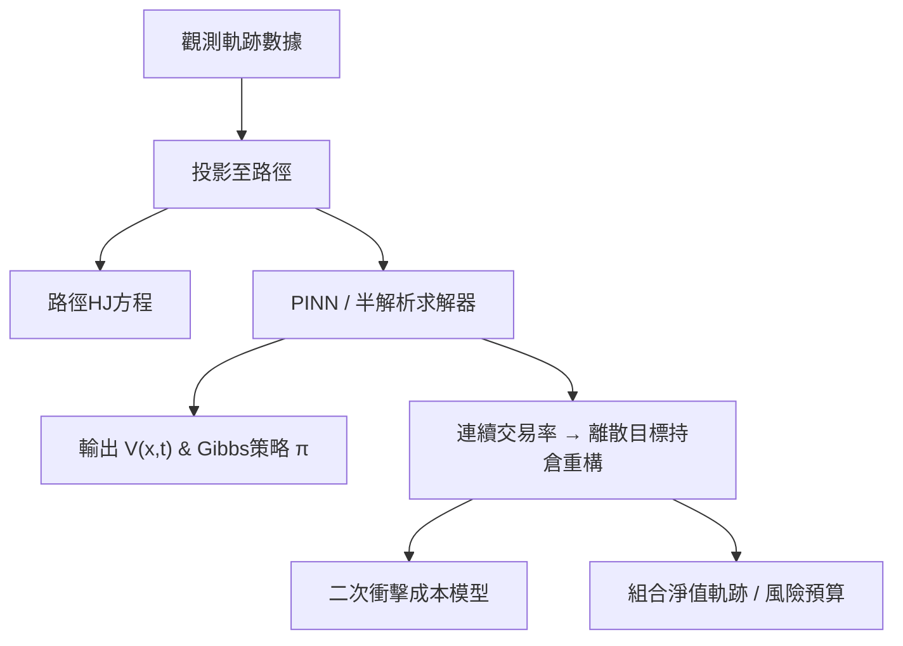

<!-- ontology-5axis data=量价表格 horizon=日频波段 paradigm=强化学习 alpha=组合执行优化 autonomy=全自动黑盒 -->

# SciPhyRL 解構（SciPhyRL）

> **發布**：2026-07-16 · （無 venue） · arXiv [2607.15195](https://arxiv.org/abs/2607.15195)
> **arXiv 原文**：[SciPhy Reinforcement Learning for Portfolio Optimization](https://arxiv.org/abs/2607.15195v1) · _本頁由 arXiv 原文一手自主解構_
> **核心定位**：落點於連續時間組合優化與分佈式離線強化學習的交叉，解決傳統深度RL在金融小樣本下數據需求過高、且難以內嵌連續時間執行成本的工程斷層。

**五軸座標**

| 數據模態 | 時間尺度 | 學習範式 | Alpha機制 | 人機協作 |
|:-:|:-:|:-:|:-:|:-:|
| `量价表格` | `日频波段` | `强化学习` | `组合执行优化` | `全自动黑盒` |

**Status:** v0.5 — 基於arXiv 原文（有原文則以原文為準）。細節待升 v1。
**TL;DR:** ① 提出連續時間組合優化框架，將HJB方程投影至觀測軌跡轉化為路徑HJ方程。② 核心 trick 是用PINN單次離線求解，並將連續交易率重構為離散目標持倉，內嵌二次衝擊成本。③ 對「组合执行优化」軸★：繞過傳統迭代，直接從數據恢復最優Gibbs策略與價值函數。④ 原文未給量化結果。

**X-Ray.** 在五軸 Pareto 中，本法刻意壓低「人機協作度」至全自动黑盒，以換取「Alpha生成機制」的連續時間解析性。它解了離線RL的數據飢渴坑：用PDE殘差作為硬約束（Physics-Informed），替代了傳統RL靠reward回傳的軟梯度，使策略能在固定數據集上單次收斂。但它的 envelope 打不開高維狀態空間的數值穩定性：PINN在擴展狀態 `(持倉, 價格, 累計成本)` 上的收斂性尚未與半解析求解器完成低維對比（留待未來工作）。對量化讀者而言，這是一條「先解PDE得策略，再落地執行」的混合路徑，適合機構級多資產配置；但需警惕 `engineered oracle signal` 的分佈偏移與二次衝擊模型的參數誤設，PDE正則不等於alpha穩定器。

## §1 · 架構 / Core Mechanism
**1.1 三大改動 vs 前作 ([Halperin, 2023])**
| 維度 | 前作 (Deep DOCTR-L) | 本法 (SciPhyRL for PM) |
|---|---|---|
| 求解器 | 純NN迭代求解 | PINN + 半解析算子分裂/固定點迭代 |
| 動力學假設 | 標準擴散過程 | 二次型控制動力學（價格衝擊通道），脫離LQR |
| 狀態空間 | 常規特徵 | 三變量擴展 `(xt, St, Ct)`，價格內生+累計成本追蹤 |

**1.2 ⚡ Eureka**
將HJB方程投影至觀測軌跡轉化為路徑HJ方程，用PINN單次離線求解，同時把連續交易率重構為離散目標持倉以匹配真實執行。

**1.3 信息流 ASCII**

## §2 · 數學層
📌 **Napkin Formula**
路徑HJ方程（投影後）：`∂_t V + H(x, ∇V) + PDE_residual = 0`
PINN Loss：`L = ||PDE_residual||² + ||Boundary/Data_fit||²`
策略恢復：`π(a|x) ∝ exp(V(x,a)/τ)` （Gibbs / MaxEnt 形式）
複雜度：單次離線求解，避免傳統 value/policy iteration 的循環依賴。

直覺：用物理方程的正則性約束神經網絡，讓策略直接從數據軌跡的幾何結構中「浮現」。Loss 內嵌分佈式KL正則化（G-learning），並用高斯混合近似配分函數以處理連續動作空間。訓練細節依賴固定 behavioral policy 數據，不依賴環境模擬器。

## §2.5 · 帶數字走一遍（Worked Example）
*(註：以下為明確標「假設/示意」的玩具數字，僅用於演示機制運算邏輯，非論文實證結果)*
1. **假設輸入**：單資產，當前持倉 `x_t=100`，價格 `S_t=50`，累計成本 `C_t=0`。信號指示目標持倉 `x*=150`。
2. **控制重構**：將連續交易率轉為離散目標持倉 `x*=150`，需買入 `Δx=50`。
3. **成本計算**：代入二次衝擊模型 `Cost = α·Δx + β·(Δx)²`。假設 `α=0.01`, `β=0.0001`，則執行成本 `= 0.01*50 + 0.0001*2500 = 0.75`。
4. **路徑HJ投影**：將狀態 `(150, 50, 0.75)` 代入訓練好的PINN，輸出價值函數 `V ≈ 10.2`。
5. **Gibbs採樣**：策略權重 `∝ exp(V/τ)`，設溫度 `τ=0.5`，權重 `∝ exp(20.4)`。相對其他持倉選項，該目標被選中概率極高。
6. **輸出**：下單買入50股，系統更新 `C_{t+1}=0.75`，進入下一期。

## §3 · 數據層
- **規模/頻率/市場**：14-asset ETF universe · 日频波段（依五軸定位）
- **來源/構建**：依賴 `engineered oracle signal`（具體構建邏輯、因子庫與樣本量未披露）
- **樣本外假設**：強調 out-of-sample 評估，但未給具體劃分比例、回測區間或滾動窗口設定。
- **容量假設**：隱含機構級流動性（二次衝擊模型參數校準需真實盤口數據，具體AUM限制未披露）。

## §4 · 代碼層
| 項目 | 狀態 |
|---|---|
| Repo | TBD |
| Checkpoint | TBD |
| License | TBD |
| 複現難度 | 高（需自實現PINN路徑投影、半解析求解器、二次衝擊參數校準） |
| 數據可得性 | 低（依賴自構建oracle信號與特定ETF數據） |

## §5 · 評測 / Benchmark
| 數據集/市場 | Metric | 前SOTA | 本方法 | Δ |
|---|---|---|---|---|
| 14-asset ETF | Sharpe Ratio (OOS) | Static baseline: 未披露 / Myopic baseline: 未披露 | SciPhyRL: 未披露 | 未披露 |

**解讀**：摘要僅定性描述「substantial out-of-sample Sharpe ratio improvements」，未披露具體數值。此 Δ 無法驗證是真實 capability 還是過擬合/前瞻偏差（因使用 `engineered oracle signal`）。成本未計入Sharpe計算的細節未說明，需警惕淨值回撤與 turnover 控制是否已內生於PDE約束。若實證未扣除交易摩擦，該 Sharpe 提升僅為信號質量轉化效率，非真實可執行收益。

## §6 · 失效與隱含假設
**6.1 論文自述 limitations**
高維狀態下PINN與半解析求解器的數值對比留待未來工作；依賴固定數據集的分佈假設，未處理動態重訓練機制。
**6.2 推斷的隱含假設**
- **Regime 依賴**：連續時間PDE假設平滑動力學，市場斷層/跳躍會破壞軌跡投影的數學一致性。
- **成本模型誤設**：二次衝擊模型將13個參數壓縮至5個，若真實盤口呈非凸或記憶效應超出手冊範圍，執行成本會被低估。
- **數據泄漏**：`oracle signal` 若含未來信息或過度平滑，PDE正則會將噪声擬合為「最優策略」。
- **Survivorship**：ETF池未說明是否動態調整或剔除清盤產品，實盤需補齊生存偏差校準。

## §7 · 對比 & 面試 Tip
| 同軸對手 | 關鍵差異軸 | Open? | Status |
|---|---|---|---|
| 傳統 Merton 連續時間優化 | 解析解 vs 數據驅動PDE求解 | 是 | 經典基線 |
| 離散時間 Deep RL (PPO/SAC) | 迭代試錯 vs 單次離線PDE求解 | 是 | 主流替代 |
| 標準離線 RL (CQL/IQL) | 分佈式KL正則 vs 價值裁剪/保守Q | 是 | 數據效率競爭 |

🎤 **Interview Tip**
- **正確答**：SciPhyRL的核心是將HJB方程投影至觀測軌跡轉化為路徑HJ方程，利用PINN的PDE正則化實現單次離線求解，並將連續控制重構為離散持倉以內嵌執行成本。
- **錯答**：它只是把PPO換成了連續時間，或者用LSTM預測價格然後做動態規劃。

**7.1 可證偽預測帶日期**
若2026-Q4前無開源代碼或低維數值對比實驗發表，則其高維收斂性主張將缺乏實證支撐。

## §8 · For the Reader
- **因子研究員**：關注 `oracle signal` 的構建與分佈偏移，避免將PDE正則誤認為alpha穩定器；信號衰減會直接反映在路徑HJ的邊界條件上。
- **高頻執行**：二次衝擊模型的參數校準（13→5）可借鑒，但日频框架不適用TCA微觀結構；需將本法輸出作為中長期倉位錨點，交由執行算法拆單。
- **組合配置**：Gibbs策略的溫度參數 `τ` 是風險預算的隱式錨點，調高 `τ` 可平滑 turnover，適合機構級再平衡流程。
- **RL 策略**：離線RL的數據飢渴問題可通過PDE投影緩解，但需警惕狀態空間膨脹導致的梯度消失；可嘗試將本法作為策略初始化器。
- **研究學生**：從半解析求解器的收斂性證明入手，比純調參更適合學術發表；路徑HJ方程的數值穩定性是當前 open problem。

## References
- Halperin, I. & Itkin, A. (2026). *SciPhy Reinforcement Learning for Portfolio Optimization*. arXiv:2607.15195v1.
- Halperin, I. (2023). *SciPhyRL / Deep DOCTR-L*. (Foundational methodology for offline continuous-time RL via PDE projection).
- Merton, R. C. (1971). *Optimum consumption and portfolio rules in a continuous-time model*.
- Fox, R., Pakman, A., & Tishby, N. (2016). *Taming the Noise in Reinforcement Learning via Soft HJB Equations (G-learning)*.
- Sutton, R. S. & Barto, A. G. (2018). *Reinforcement Learning: An Introduction*.