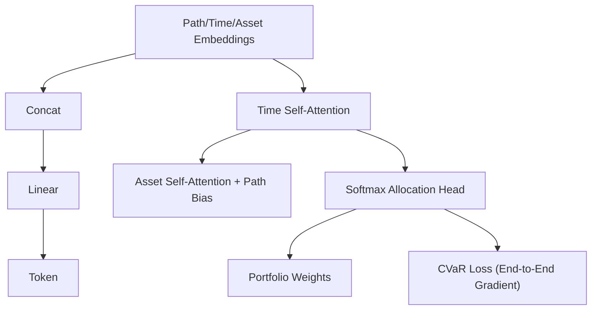

<!-- ontology-5axis data=量价表格 horizon=日频波段 paradigm=监督回归 alpha=组合执行优化 autonomy=全自动黑盒 -->

# Signature-Informed Transformer (SIT) 解構

> **發布**：2025-10-07 · （無 venue）
> **QuantML 導讀**：[Signature-Informed Transformer在端到端资产配置中的应用](https://mp.weixin.qq.com/s?__biz=Mzg2MzAwNzM0NQ==&mid=2247491898&idx=1&sn=d565ad18a491609e89d3cae06b1baa45&chksm=ce7d8624f90a0f3280562268b2b4500447f7d6186026167896bf5dfdad14eed8c7d9dc4146ee#rd)
> **核心定位**：落點於「監督回歸 × 組合執行優化」軸，解構傳統「預測-優化」兩階段範式中的目標錯配與誤差放大痛點，以路徑特徵幾何先驗驅動端到端 CVaR 直接優化。

**五軸座標**

| 數據模態 | 時間尺度 | 學習範式 | Alpha機制 | 人機協作 |
|:-:|:-:|:-:|:-:|:-:|
| `量价表格` | `日频波段` | `监督回归` | `组合执行优化` | `全自动黑盒` |

**Status:** v0.5 — 基於 QuantML 導讀 + 原論文（如有）。benchmark 細節待升 v1。
**TL;DR:** ① 提出 SIT 框架，將資產價格路徑特徵直接注入 Transformer 注意力機制，繞過收益率預測階段。② 核心 trick 是在資產間注意力中引入跨資產路徑特徵偏差項，並結合 CVaR 進行端到端權重生成。③ 這直接對齊了「決策為核心」的組合優化軸，消除預測誤差向配置端的非線性放大。④ 導讀給出40資產組合夏普比率0.6717。

**X-Ray.** SIT 將量化配置從「統計預測+二次規劃」遷移至「幾何特徵+風險感知直接映射」。其核心價值不在於提升預測精度，而在於透過 Path Signatures 將價格序列的時序幾何轉化為注意力偏置，使模型在訓練階段即內化組合層面的尾部風險約束。這解決了 DFL 範式長期缺乏金融歸納偏置的工程坑，但也意味著模型高度依賴路徑特徵的穩定性與 CVaR 梯度的平滑性。對實盤而言，它打開了「免預測直接輸出權重」的 envelope，但代價是損失可解釋性與對極端流動性枯竭的顯式防禦。

## §1 · 架構 / Core Mechanism
**1.1 三大改動 vs 前作**
| 維度 | 傳統 PFL / 基礎 DFL | SIT 改動 |
|---|---|---|
| 特徵表示 | 原始價量或統計因子 | 融合路徑特徵、時間嵌入、資產嵌入的三源拼接 |
| 注意力機制 | 標準 QKV 內積或圖結構 | 注入跨資產路徑特徵動態加性偏差項 |
| 優化目標 | MSE / 風險中性收益 | 直接最小化 K 步週期 CVaR（對偶形式） |

**1.2 ⚡ Eureka**
用跨資產路徑特徵的內積生成注意力加性偏差，讓模型「知道」該關注誰，而非盲目學習。

**1.3 信息流 ASCII**

## §2 · 數學層
📌 **Napkin Formula**
`w_t = softmax(logits_t)`
`Loss = CVaR_K(R_t(w))`
`Attention_Score_{jl} = QK^T + τ * (r_{jl}^T q_j)`
複雜度：O(N² * H) 標準注意力，路徑特徵預計算為 O(N² * H)。

**直覺**：預期收益僅作 logits，梯度全來自 CVaR。偏差項將幾何關係轉為注意力權重修正，使模型動態放大領先-滯後資產對的關聯強度。
**Loss/訓練**：端到端，無輔助預測損失。使用 CVaR 對偶表示的經驗形式，在 batch 多個情景上平均近似求解。

## §3 · 數據層
- **規模/頻率/市場/時段**：標準普爾100指數成分股，30/40/50家，日度，2000-01-01至2024-12-27。
- **來源/樣本外與容量假設**：導讀未明確劃分訓練/驗證/測試集比例與樣本外窗口，僅提及覆蓋多個市場週期。容量假設未披露。

## §4 · 代碼層
| Repo | Checkpoint | License | 複現難度 | 數據可得性 |
|---|---|---|---|---|
| TBD (導讀僅提「QuantML知识星球相关研究」) | TBD | TBD | 中（需實現路徑特徵計算與CVaR對偶梯度） | 高（標普100日線屬常規數據） |

## §5 · 評測 / Benchmark
| 數據集/市場 | Metric | 前SOTA | 本方法 | Δ |
|---|---|---|---|---|
| 40 Assets (S&P 100) | Sharpe | 未披露 | 0.6717 | 未披露 |
| 40 Assets (S&P 100) | Sortino | 未披露 | 0.8232 | 未披露 |
| 40 Assets (S&P 100) | Final Wealth | 未披露 | 1.7903 | 未披露 |
| 40 Assets (S&P 100) | Max Drawdown | 未披露 | 未披露 | 未披露 |

**解讀**：Δ 欄空白是因導讀未給基線具體數值，僅定性描述「顯著優於」。SIT 的優勢來自端到端 CVaR 優化與路徑偏置，但缺乏交易成本淨值與换手率數據，實盤夏普可能因摩擦而衰減。預測-優化基線的標準差大印證了誤差放大假設，SIT 的穩定性屬架構紅利，非預測精度紅利。

## §6 · 失效與隱含假設
**6.1 論文自述 limitations**：導讀未明確列出 limitations 章節，僅在結論強調需結合幾何先驗與風險目標。
**6.2 推斷的隱含假設**：
- **Regime 依賴**：路徑特徵的幾何關係在結構性斷裂或流動性枯竭時可能失效。
- **容量/成本**：已測試 0/5/10 bps，但未給 breakeven 閾值；Softmax 僅做多，無法捕捉空頭對沖。
- **數據泄漏**：跨資產路徑特徵若使用全回溯期計算而未嚴格滾動，會引入前瞻偏差。
- **優化地形**：CVaR 對偶近似在 batch 較小時可能產生梯度方差，需足夠情景數穩定訓練。

## §7 · 對比 & 面試 Tip
| 同軸對手 | 關鍵差異軸 | Open? | Status |
|---|---|---|---|
| Autoformer/PatchTST (PFL) | 目標函數(MSE vs CVaR) / 架構(預測頭 vs 分配頭) | 是 | 成熟 |
| GMV/HRP (傳統優化) | 特徵工程(統計矩 vs 路徑幾何) / 優化方式(二次規劃 vs 端到端梯度) | 是 | 成熟 |

🎤 **Interview Tip**
- **正確答**：SIT 的核心不是提升預測精度，而是透過路徑特徵偏置與 CVaR 直接優化，消除預測誤差向配置端的非線性放大。
- **錯答**：SIT 用 Transformer 預測收益率，再用 CVaR 做組合優化。（這是兩階段，SIT 是端到端）

**7.1 可證偽預測**：若 2026-Q1 市場出現流動性枯竭與跨資產相關性結構性斷裂，SIT 的路徑幾何先驗將失效，其最大回撤將顯著劣於靜態 GMV 策略。

## §8 · For the Reader
- **因子研究員**：將 Path Signature 視為高維時序特徵，可嘗試與傳統量價因子正交化，避免特徵共線性稀釋注意力偏置。
- **組合配置/執行**：關注 Softmax 溫度參數對集中度的影響，實盤需加入交易成本懲罰項或换手率約束，否則 5-10 bps 摩擦可能吞噬 Alpha。
- **研究學生/RL 策略**：此為 Decision-Focused Learning 的經典範例，可對比 RL 中的 PPO/SAC 在組合優化上的梯度穩定性，SIT 的 CVaR 對偶形式提供了更平滑的優化地形。

## References
- 原論文：TBD (QuantML 導讀未提供完整題名/作者/DOI)
- Lineage: Path Signatures (Lyons et al.) · Decision-Focused Learning (Donahue et al.) · CVaR Optimization (Rockafellar & Uryasev)
- QuantML 導讀鏈接：[Signature-Informed Transformer在端到端资产配置中的应用](https://mp.weixin.qq.com/s?__biz=Mzg2MzAwNzM0NQ==&mid=2247491898&idx=1&sn=d565ad18a491609e89d3cae06b1baa45&chksm=ce7d8624f90a0f3280562268b2b4500447f7d6186026167896bf5dfdad14eed8c7d9dc4146ee#rd)