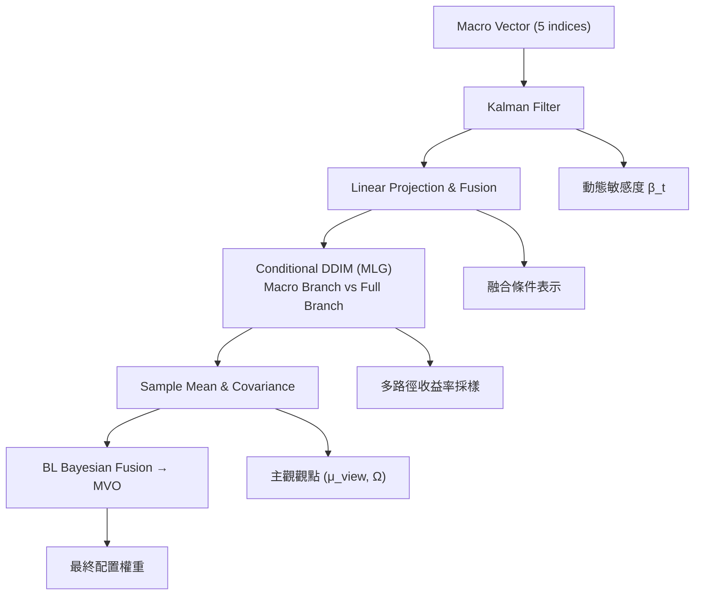

<!-- ontology-5axis data=量价表格 horizon=日频波段 paradigm=生成式大模型 alpha=组合执行优化 autonomy=人机协同可解释 -->

# STABLE 解構

> **發布**：2026-05-28 · ICLR26
> **QuantML 導讀**：[ICLR 26 ｜ 用生成式扩散模型做 Black-Litterman 观点输入？](https://mp.weixin.qq.com/s?__biz=Mzg2MzAwNzM0NQ==&mid=2247493944&idx=1&sn=b166aef6d15c2030108dab66e1816074&chksm=ce7d8e26f90a0730c70fd499bc2a2b48954da748ccd530ef7ccfd0ae3100e25bc62ee0620d50#rd)
> **核心定位**：落點於「生成式大模型預測 + 經典約束優化」的混合架構，解決傳統MVO對輸入誤差極度敏感及端到端RL直接輸出權重的過擬合痛點。將AI能力嚴格限定於「不確定性分佈估計」，交由BL框架執行約束可控的資產配置。

**五軸座標**

| 數據模態 | 時間尺度 | 學習範式 | Alpha機制 | 人機協作 |
|:-:|:-:|:-:|:-:|:-:|
| `量价表格` | `日频波段` | `生成式大模型` | `组合执行优化` | `人机协同可解释` |

**Status:** v0.5 — 基於 QuantML 導讀 + 原論文（如有）。benchmark 細節待升 v1。
**TL;DR:** ①用條件擴散模型生成多路徑收益率分佈作為BL主觀觀點。②核心trick是雙層噪聲引導解耦宏觀系統性與個股特異性噪聲，並透過貝葉斯融合自動平衡預測不確定性與歷史先驗。③對「組合執行優化」軸★，將AI預測與經典風控解耦，實盤可解釋性與約束可控性遠勝端到端RL。④S&P500測試期ASR 1.85，相對傳統MVO顯著提升風險收益比。

**X-Ray.** 在「預測精度-配置穩健性」Pareto邊界上，STABLE放棄了端到端RL的極端貪婪，選擇了「生成分佈估計+BL貝葉斯收斂」的折衷路線。解了舊工程坑：靜態因子嵌入無法捕捉宏觀敏感度漂移（用Kalman Filter動態估計β解決），以及MVO對極端預測值的過度集中（用多路徑協方差作為主觀精度，不確定性高時自動退化至等權/先驗）。打不開的Envelope：日頻波段限制使其無法捕捉盤內流動性衝擊或高頻微結構Alpha；擴散模型訓練成本與推理延遲在實盤中可能成為瓶頸。對量化讀者意義：提供了一條「AI負責概率密度，經典金融負責約束優化」的標準化接口，適合機構級資產配置底層架構升級。

## §1 · 架構 / Core Mechanism
**1.1 三大改動 vs 前作**
| 改動維度 | 前作/傳統做法 | STABLE做法 | 工程意義 |
|---|---|---|---|
| 特徵嵌入 | 靜態分類/固定時間窗 | 卡爾曼濾波動態估計宏觀敏感度β | 捕捉因子敏感度漂移與異质性 |
| 預測生成 | 單點預測/端到端RL輸出權重 | 雙層噪聲引導條件擴散模型(CDG+MLG) | 解耦宏觀共振與個股特異性，輸出概率分佈 |
| 組合優化 | 直接將預測均值塞入MVO | BL貝葉斯融合(主觀觀點精度 vs 歷史先驗精度) | 不確定性高時自動降倉/趨向等權，防尾部風險 |

**1.2 ⚡ Eureka**
用擴散模型的多路徑樣本協方差作為BL的「主觀精度」，讓模型自己告訴優化器「我有多不確定」，不確定時系統自動退守歷史先驗。

**1.3 信息流 ASCII**

## §2 · 數學層
**📌 Napkin Formula**
- Kalman動態嵌入：$\beta_t = \text{KF}(r_{t}, X_{t})$
- MLG噪聲解耦：$\epsilon_{\text{micro}} = \epsilon_{\text{full}} - \epsilon_{\text{macro}}$，$\hat{\epsilon} = \epsilon_{\text{macro}} + g \cdot \epsilon_{\text{micro}}$
- BL貝葉斯融合：$\mu_{\text{post}} = [(\tau \Sigma)^{-1} + \Omega^{-1}]^{-1} [(\tau \Sigma)^{-1}\mu_{\text{prior}} + \Omega^{-1}\mu_{\text{view}}]$

**直覺**：門控$g$學習宏觀/微觀權重切換；BL公式本質是精度加權平均，主觀精度$\Omega^{-1}$低時權重自動滑向先驗，實現內建風控。
**Loss/訓練**：訓練目標直接定義為擴散模型的均方誤差（MSE）加上對模型參數的L2正則化。複雜度：訓練O(T·N·D)，推理O(S·N)，BL閉式解O(N^3)。

## §3 · 數據層
- **市場/頻率**：日頻。S&P500、CSI300、EUROSTOXX、KOSPI200。
- **時段**：訓練集從2013年1月截斷至2024年9月，測試集從2024年9月至2025年3月。極端行情回測涵蓋疫情危機期與零利率寬鬆期。
- **來源/假設**：宏觀因子為5個指數（Market, Dollar, Term Spread, VIX, Gold）。樣本外假設宏觀因子可實時獲取，個股數據處理細節（復權/停牌/退市）導讀未披露，標TBD。

## §4 · 代碼層
| Repo | Checkpoint | License | 複現難度 | 數據可得性 |
|---|---|---|---|---|
| TBD | TBD | TBD | 高（需實現Kalman動態嵌入、UNet擴散模型、BL閉式優化器） | 中（宏觀指數易得，個股日頻數據需付費源） |

## §5 · 評測 / Benchmark
| 數據集/市場 | 策略 | Metric(ASR) | Metric(RMDD) | Metric(AVol) | Δ ASR | Δ RMDD | Δ AVol |
|---|---|---|---|---|---|---|---|
| S&P500 (24.09-25.03) | CRP | 0.82 | 8.89% | 14.44% | +1.03 | -1.07% | -1.01% |
| S&P500 (24.09-25.03) | MVO | 1.18 | 9.00% | 21.18% | +0.67 | -1.18% | -7.75% |
| S&P500 (24.09-25.03) | AlphaMix | 0.35 | 9.59% | 13.92% | +1.50 | -1.77% | -0.49% |
| S&P500 (24.09-25.03) | STABLE | 1.85 | 7.82% | 13.43% | - | - | - |

**解讀**：Δ顯示STABLE在ASR與RMDD上全面領先。ASR提升主要來自BL框架對尾部權重的收斂（不確定性高時自動降倉），而非單純的預測準確率堆疊。RMDD縮窄驗證了多路徑協方差作為主觀精度的風控有效性。需警惕的是，測試集僅涵蓋單一區間，未披露交易成本與滑點；若計入日頻調倉的衝擊成本，ASR的Δ可能顯著縮水。此外，宏觀因子的實時獲取若存在披露延遲，可能引入輕微前瞻偏差。

## §6 · 失效與隱含假設
**6.1 論文自述 limitations**
導讀未披露明確limitations章節，僅提及對極端行情的檢驗與框架設計優勢。未討論高頻微結構、流動性枯竭或宏觀因子斷層風險。

**6.2 推斷的隱含假設**
- **Regime依賴**：卡爾曼濾波假設宏觀-個股關係呈線性高斯演變，在結構性斷裂時可能滯後。
- **容量/成本**：日頻調倉假設市場具備足夠流動性承接全市場個股權重重分配，未計入實盤衝擊成本。
- **數據泄漏**：宏觀指數數據若依賴終端實時推送，實盤可能存在分鐘級延遲；個股數據未說明是否處理停牌/退市樣本。
- **模型複雜度**：擴散模型推理需多步採樣，實盤延遲可能影響信號有效性。

## §7 · 對比 & 面試 Tip
| 同軸對手 | 關鍵差異軸 | Open? | Status |
|---|---|---|---|
| 端到端RL配置 | 黑盒直接輸出權重 vs STABLE解耦預測與優化 | Open | 實盤易過擬合/難約束 |
| 傳統BL+點預測 | 單點均值輸入 vs STABLE多路徑分佈輸入 | Open | 忽略不確定性/尾部風險高 |
| 靜態因子MVO | 固定敏感度 vs STABLE動態Kalman嵌入 | Open | 無法捕捉宏觀漂移 |

**🎤 Interview Tip**
- **正確答**：「STABLE的核心不在於預測多準，而在於用擴散模型的多路徑樣本協方差量化『主觀不確定性』，透過BL精度加權實現『預測可信時進攻，不確定時退守先驗』的動態風控。這解決了端到端RL在Regime Shift時權重劇烈抖動的工程痛點。」
- **錯答**：「STABLE用Transformer預測收益率然後直接做MVO，比傳統量化更準。」（混淆了生成分佈估計與點預測，且忽略了BL貝葉斯融合與Kalman動態嵌入的核心設計）

**7.1 可證偽預測帶日期**
若2026年Q2出現宏觀因子與個股收益的相關性結構性斷裂（如流動性危機），Kalman濾波估計的β將出現顯著滯後，導致STABLE在CSI300或EUROSTOXX的RMDD劣於靜態等權策略。

## §8 · For the Reader
- **因子研究員**：關注Kalman動態敏感度嵌入如何替代靜態行業分類，可嘗試將宏觀因子替換為自研高頻宏觀信號。
- **組合配置/風控**：直接複現BL融合模塊，將多路徑協方差作為主觀精度Ω，替代傳統經驗設定，提升組合在尾部風險下的穩健性。
- **LLM-agent/生成式模型**：學習MLG雙層噪聲引導機制，將「系統性風險」與「特異性Alpha」解耦，避免生成模型在金融數據上陷入宏觀共振陷阱。
- **高頻執行**：日頻波段信號需配合盤中流動性模型執行；擴散模型多步推理延遲需透過模型蒸餾或離線採樣+在線匹配優化。

## References
- 原論文: STABLE: Shift-Tolerant Allocation via Black-Litterman using Conditional Diffusion Estimates (ICLR 2026)
- Lineage: Black-Litterman (1992) / Denoising Diffusion Implicit Models (DDIM, 2020) / Kalman Filter for Finance
- QuantML 導讀鏈接: [ICLR 26 ｜ 用生成式扩散模型做 Black-Litterman 观点输入？](https://mp.weixin.qq.com/s?__biz=Mzg2MzAwNzM0NQ==&mid=2247493944&idx=1&sn=b166aef6d15c2030108dab66e1816074&chksm=ce7d8e26f90a0730c70fd499bc2a2b48954da748ccd530ef7ccfd0ae3100e25bc62ee0620d50#rd)