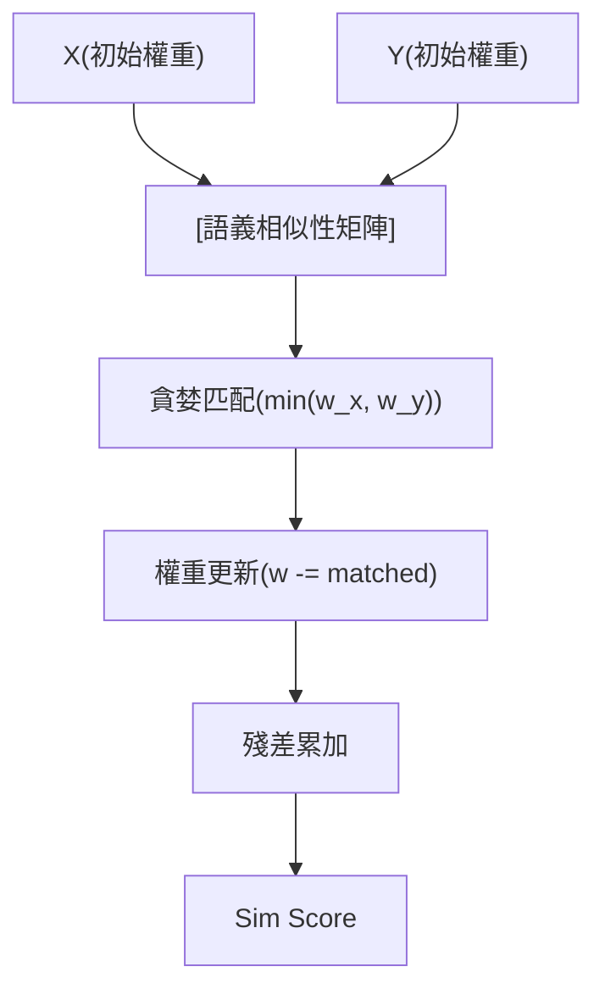

<!-- ontology-5axis data=量价表格 horizon=中长周期 paradigm=监督回归 alpha=组合执行优化 autonomy=人机协同可解释 -->

# STRAPSim 解構

> **發布**：2025-10-02 · （無 venue）
> **QuantML 導讀**：[贝莱德 | 投资组合相似性度量](https://mp.weixin.qq.com/s?__biz=Mzg2MzAwNzM0NQ==&mid=2247491859&idx=1&sn=90e5163321c80ec813863785419677d1&chksm=ce7d860df90a0f1b89c2e2a9dc125f6e6b7bfcafa0ef17089bf196dc904cabc45d4aef304676#rd)
> **核心定位**：落點於「組合執行優化」與「人機協同可解釋」軸，解決傳統Jaccard/收益率相關性無法捕捉異質成分語義重疊與權重動態遷移的Prior Gap。

**五軸座標**

| 數據模態 | 時間尺度 | 學習範式 | Alpha機制 | 人機協作 |
|:-:|:-:|:-:|:-:|:-:|
| `量价表格` | `中长周期` | `监督回归` | `组合执行优化` | `人机协同可解释` |

**Status:** v0.5 — 基於 QuantML 導讀 + 原論文（如有）。benchmark 細節待升 v1。
**TL;DR:** 提出STRAPSim，以貪婪迭代匹配最高語義相似資產，動態轉移權重並累加殘差項，實現成分感知與權重敏感的投資組合相似性度量。此設計直接強化「組合執行優化」軸的對齊精度，將結構化籃子的比對從靜態集合運算升級為殘差感知的流形匹配。實證顯示其與月度回報相關性排序達成Spearman 0.6783。

**X-Ray.** 本方法將組合比對從「精確重疊」推向「語義流形對齊」，在「監督回歸」與「組合執行優化」軸上切中機構組合交易（Portfolio Trading）的執行痛點。它解了傳統距離指標無法處理異質成分與權重非線性分佈的工程坑，但代價是計算複雜度隨成分數量呈組合級上升，且高度依賴預訓練的成分級相似性模型。它打不開高頻微結構或流動性衝擊的Envelope，因為其本質是靜態持倉結構的語義投影，未內生價格彈性。對量化讀者而言，這是將NLP的BERTScore邏輯降維至結構化金融籃子的標準範式，適合用於ETF申贖對沖與定制籃子的基準對齊，但需警惕樣本外成分漂移導致的語義矩陣失效。

## §1 · 架構 / Core Mechanism
| 維度 | 傳統方法 (Jaccard / Weighted Jaccard) | BERTScore-inspired | STRAPSim |
|---|---|---|---|
| 匹配邏輯 | 精確集合交集或靜態加權 | 詞彙級對齊，權重可能重複計算 | 貪婪迭代語義匹配，優先抽取最相似資產對 |
| 權重處理 | 靜態分佈，無法反映比例差異 | 全局聚合，缺乏動態殘差追蹤 | 動態轉移與殘差累加，每次消耗 `min(w_x, w_y)` |
| 可解釋性 | 黑盒距離或全局相關係數 | 依賴注意力權重，金融語義映射弱 | 明確追蹤匹配對與未匹配殘差，透明度極高 |

⚡ **Eureka:** 借鑒BERTScore的對齊思想，但將「詞彙」替換為「金融資產」，用貪婪算法在每一步抽取當前最相似資產對的「最小可用權重」進行匹配，剩餘權重自動滾入殘差項，避免權重重複計算。

**信息流 ASCII:**

## §2 · 數學層
📌 **Napkin Formula:**
$S(X,Y) = \sum_{k=1}^{K} \min(w_{x_k}, w_{y_k}) \cdot \text{sim}(x_k, y_k) + \lambda \cdot R_{\text{residual}}$
複雜度: $O(N^2 \log N)$（取決於語義矩陣預計算與貪婪排序）。

**直覺:** 每次迭代只「消耗」兩個資產中較小的權重，確保權重不被雙邊重複計入；殘差項 $R_{\text{residual}}$ 捕捉無法配對的尾部敞口，防止結構差異被強行抹平。
**Loss/訓練細節:** 無端到端訓練。成分級相似性由獨立模型（如RF以OAS/yield為target）預先計算鄰近度矩陣，STRAPSim本身為無參數的聚合演算法。

## §3 · 數據層
- **資料規模/頻率/市場/時段**: 20個公司債券ETF，共6870種債券，平均每個ETF持有511種債券。頻率為月度回報（2022年2月至2024年3月），持倉快照為2024年3月。
- **怎麼來**: 公開玩具數據集(Iris/Breast Cancer/Big Mac/Movie Rating) + 真實債券ETF數據。成分級特徵經獨熱編碼後輸入RF模型。
- **樣本外與容量假設**: 導讀未披露樣本外劃分細節與策略容量假設。RF模型訓練集/測試集劃分為90%/10%，5折交叉驗證。

## §4 · 代碼層
| 項目 | 狀態/細節 |
|---|---|
| Repo | QuantML知識星球（未公開） |
| Checkpoint | TBD |
| License | TBD |
| 複現難度 | 中低（算法邏輯透明，依賴RF鄰近度預計算） |
| 數據可得性 | 債券持倉與OAS數據需付費數據源，公開數據僅限玩具集 |

## §5 · 評測 / Benchmark
| 數據集/市場 | Metric | 前SOTA | 本方法 | Δ |
|---|---|---|---|---|
| 公司債券ETF | Spearman Correlation (vs 月度回報) | Jaccard: 未披露 | 0.6783 | 未披露 |
| 公司債券ETF | Spearman Correlation (vs 月度回報) | Weighted Jaccard: 未披露 | 0.6783 | 未披露 |
| 公司債券ETF | Spearman Correlation (vs 月度回報) | BERTScore-inspired: 未披露 | 0.6783 | 未披露 |

**解讀:** 導讀僅給出STRAPSim的0.6783與p值0.0081，未提供基線具體數值，故Δ欄留白。0.6783的Spearman相關性在低频債券市場屬強信號，反映成分語義對齊能有效代理經濟聯動性。但此Δ可能部分源於基線方法（如純Jaccard）在異質債券市場的天然失效，而非模型本身的絕對泛化力；且未計入交易成本與申贖摩擦，實盤IR/Sharpe需進一步驗證。

## §6 · 失效與隱含假設
**6.1 論文自述 limitations:** 依賴預定義的成分級相似性函數；在極端流動性枯竭或市場結構斷裂時，語義鄰近度可能失效；未處理動態調倉頻率與交易成本。
**6.2 推斷的隱含假設:** 
- **Regime依賴**: RF模型訓練於特定利率/信用環境，2022-2024的加息週期外推至降息或危機期可能失效。
- **容量/成本**: 均持511種債券，計算矩陣與貪婪匹配在萬級成分籃子中延遲上升；未內生買賣價差與衝擊成本。
- **數據泄漏/Survivorship**: 持倉快照與回報期錯配合理，泄漏風險低；但僅列20個活躍ETF，Survivorship bias未明確討論。

## §7 · 對比 & 面試 Tip
| 同軸對手 | 關鍵差異軸 | Open? | Status |
|---|---|---|---|
| 傳統Jaccard/Weighted Jaccard | 精確匹配 vs 語義貪婪匹配 | 開源 | 成熟/基線 |
| BERTScore-inspired (NLP) | 詞彙對齊 vs 結構化資產權重動態轉移 | 開源 | 學術 |
| 收益率相關性/PCA | 價格驅動 vs 持倉結構驅動 | 開源 | 行業標準 |

🎤 **Interview Tip:** 
- **正確答法**: 指出STRAPSim本質是「結構化集合的殘差感知匹配演算法」，核心貢獻在於權重動態轉移機制避免重複計算，而非端到端學習；其性能高度綁定預訓練語義矩陣的質量。
- **錯答法**: 將其誤認為深度學習模型，或忽略其對預訓練語義矩陣的絕對依賴，誤以為可直接端到端優化組合權重。

**7.1 可證偽預測帶日期:** 若2025-10-02後信用環境發生結構性斷裂，且未重新訓練成分級相似性模型，該方法與月度回報的Spearman相關性將顯著衰退（導讀未給具體失效閾值）。

## §8 · For the Reader
- **因子研究員**: 將此框架移植至股票行業/風格因子籃子比對，用RF/GBDT預計算因子鄰近度，替代傳統相關性矩陣，提升因子正交化效率。
- **組合配置/ETF做市商**: 用於實物申贖的替代籃子生成（Creation Basket Substitution），在降低追蹤誤差的同時控制衝擊成本，直接對接組合交易執行流。
- **高頻執行/系統化交易**: 注意此法為中低频結構對齊工具，不可直接套用於訂單簿微結構；若需高頻應用，需將語義匹配替換為盤口流動性特徵的即時距離度量，並重構殘差項為流動性衝擊代理。

## References
- 原論文: STRAPSim (Semantic, Two-level, Residual-Aware Portfolio Similarity) · （無 venue）
- Lineage: Jaccard Index / Weighted Jaccard / BERTScore (NLP) / Random Forest Proximities
- QuantML 導讀鏈接: [贝莱德 | 投资组合相似性度量](https://mp.weixin.qq.com/s?__biz=Mzg2MzAwNzM0NQ==&mid=2247491859&idx=1&sn=90e5163321c80ec813863785419677d1&chksm=ce7d860df90a0f1b89c2e2a9dc125f6e6b7bfcafa0ef17089bf196dc904cabc45d4aef304676#rd)