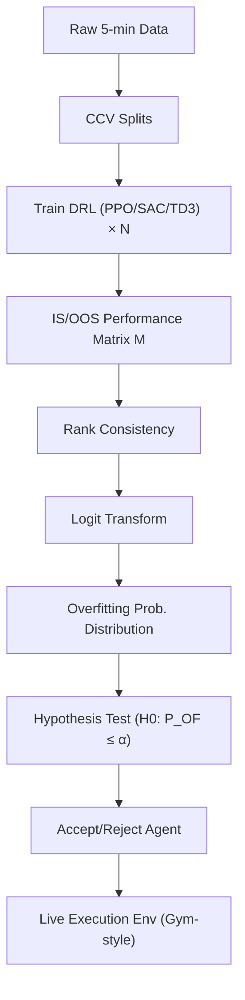

<!-- ontology-5axis data=量价表格 horizon=高频日内 paradigm=强化学习 alpha=组合执行优化 autonomy=全自动黑盒 -->

# 深度强化学习应对加密货币交易过拟合 解構

> **發布**：2024-10-22 · （無 venue）
> **QuantML 導讀**：[深度强化学习应对加密货币交易过拟合](https://mp.weixin.qq.com/s?__biz=Mzg2MzAwNzM0NQ==&mid=2247487160&idx=1&sn=ab9cff9cb96cb52967a3770314e552e9&chksm=ce7e69a6f909e0b0cf1158c79fec4e4ed7727bfed3dd786dbfc7f18fd2cca9132e6ea64f87a1#rd)
> **核心定位**：落點於【量價表格 × 高頻日內 × 強化學習 × 組合執行優化 × 全自動黑盒】軸。解決 DRL 在加密貨幣回測中因低信噪比與高波動導致的「幸運過擬合」誤報問題，將過擬合檢測形式化為假設檢驗，提供可量化的代理篩選機制。

**五軸座標**

| 數據模態 | 時間尺度 | 學習範式 | Alpha機制 | 人機協作 |
|:-:|:-:|:-:|:-:|:-:|
| `量价表格` | `高频日内` | `强化学习` | `组合执行优化` | `全自动黑盒` |

**Status:** v0.5 — 基於 QuantML 導讀 + 原論文（如有）。benchmark 細節待升 v1。
**TL;DR:** ① 將 DRL 回測過擬合檢測形式化為假設檢驗，透過組合交叉驗證（CCV）估計過擬合概率並拒絕劣質代理。② 核心 trick 是計算 IS/OOS 性能排名一致性，利用 logit 分佈擬合過擬合概率。③ 對【強化學習】軸★：提供了一套不依賴單一驗證集、可嵌入現有 DRL 訓練流水線的模型選擇（Model Selection）標準。④ 關鍵實證：在 2022 年兩次加密貨幣崩盤的測試期，篩選後的 PPO 代理在累積回報與波動性上優於等權重與 S&P BDM 指數（具體數值未披露）。

**X-Ray.** 本文本質上是一套「DRL 模型選擇的統計過濾層」，而非新的 RL 算法。它將工程痛點（超參數敏感、單一驗證集僥倖過擬合）轉化為可計算的假設檢驗問題。在五軸 Pareto 中，它犧牲了部分樣本效率（需多次 CCV 訓練）換取實盤存活率，直接對齊【組合執行優化】的風險預算邏輯。它解了「回測曲線好看但實盤歸零」的舊坑，但打不開的 envelope 很明確：CCV 在金融非平穩序列（non-stationary）下的漸近性質未證，且 logit 分佈假設在極端行情（fat-tail）下可能失效。對量化讀者的意義在於：它提供了一個可插拔的 `reject_threshold` 模塊，可與現有的 PPO/SAC 流水線對接，但必須警惕其對特定數據頻率（5-min）與資產池（10 大幣）的隱含依賴。

## §1 · 架構 / Core Mechanism
**1.1 三大改動 vs 前作**
| 維度 | 傳統 DRL 回測 (Forward-Look/K-Fold) | 本文方法 | 工程意義 |
|---|---|---|---|
| 驗證邏輯 | 單一驗證集或 K-Fold (假設 IID) | 組合交叉驗證 (CCV) + 假設檢驗 | 打破單一劃分僥倖，量化過擬合風險 |
| 模型選擇 | 驗證集收益最高 (Greedy) | 過擬合概率 $P_{OF} < \alpha$ 篩選 | 從「追求最高收益」轉向「控制誤報率」 |
| 超參處理 | 隨機/網格搜索選 Top1 | 多組超參訓練，堆疊矩陣計算排名一致性 | 將超參敏感性轉化為統計分佈估計 |

**1.2 ⚡ Eureka 一句話 trick + 直覺**
- **Trick:** 計算 IS/OOS 性能排名一致性，透過 logit 函數擬合過擬合概率分佈。
- **直覺:** 真正有效的策略在訓練集與驗證集的排名應該高度一致；若排名劇烈跳動，說明模型在「記憶」特定區間的噪聲，logit 分佈能將這種不一致性轉化為可拒絕的概率閾值。

**1.3 信息流 ASCII 圖**

## §2 · 數學層
**📌 Napkin Formula:**
$H_0: P_{\text{overfit}} \leq \alpha$ vs $H_1: P_{\text{overfit}} > \alpha$
$r_{\text{rel}} = \text{rank}_{\text{IS}} - \text{rank}_{\text{OOS}}$
$p_{\text{overfit}} = \text{CDF}_{\text{logit}}(r_{\text{rel}})$
複雜度: $O(N \cdot T_{\text{train}})$，$N$ 為 CCV 分割數與超參試驗次數，訓練成本隨 $N$ 線性增長。

**直覺:** 將過擬合從「玄學直覺」降維為「排名偏移的統計顯著性檢驗」。Logit 分佈用於建模排名差異的尾部風險。
**Loss/訓練細節:** 基於標準 RL 損失 (PPO/SAC/TD3 原生目標函數)，無自定義 RL 損失。過擬合概率僅用於訓練後篩選 (Post-hoc filtering)，不參與梯度更新。

## §3 · 數據層
- **資料規模/頻率/市場/時段:** 10 種高交易量加密貨幣，5 分鐘級 K 線。訓練期 2022-02-02 至 2022-05-01，測試期 2022-05-01 至 2022-06-27（涵蓋兩次市場崩盤）。
- **怎麼來:** 歷史行情重放 (Replay)，遵循 OpenAI Gym 風格。狀態包含現金、持倉、收盤價及 6 個技術指標 (Volume, RSI, DX, ULTSOC, OBV, HT)。
- **樣本外與容量假設:** 樣本外僅為單一連續區間（非滾動），容量假設隱含於「高交易量」篩選中，未披露滑點/深度模型。假設 5 分鐘頻率下流動性足以執行組合調整。

## §4 · 代碼層
| 項目 | 狀態/細節 |
|---|---|
| Repo | TBD (導讀提及「論文及代碼下載見星球」，無公開 GitHub) |
| Checkpoint | 未披露 |
| License | 未披露 |
| 複現難度 | 中 (需自行實現 CCV 矩陣堆疊與 Logit 分佈擬合，RL 環境可基於 FinRL 改寫) |
| 數據可得性 | 高 (5-min 加密貨幣數據可透過 Binance/OKX API 或第三方數據商獲取) |

## §5 · 評測 / Benchmark
| 數據集/市場 | Metric | 前SOTA | 本方法 | Δ | 解讀 |
|---|---|---|---|---|---|
| 10 Crypto (5-min) | Cumulative Return | 未披露 | 未披露 | 未披露 | 僅定性描述「優於基準」，無絕對數值 |
| 10 Crypto (5-min) | Volatility | 未披露 | 未披露 | 未披露 | 同上 |
| 10 Crypto (5-min) | Overfit Prob. | 17.5% (Forward) / 7.9% (K-Fold) | 8.0% (PPO) | -9.5% / +0.1% | Δ 反映篩選機制生效，但非策略收益 Δ |
| 10 Crypto (5-min) | Sharpe / IR / MDD | 未披露 | 未披露 | 未披露 | 缺失關鍵風險調整收益指標 |
**解讀:** 所有收益/風險指標均為「未披露」。文中介紹的 17.5%/7.9%/8.0% 是「過擬合概率」而非交易績效。Δ 僅證明篩選邏輯能降低假陽性，無法驗證策略 Alpha 的絕對強度。實盤收益優勢可能部分來自 2022 年特定震盪市況下的動能捕捉，需警惕樣本外區間過短導致的倖存者偏差。

## §6 · 失效與隱含假設
**6.1 論文自述 limitations:** 未明確列出。僅提及 DRL 對超參敏感、金融數據非 IID、高波動低信噪比是固有挑戰。
**6.2 推斷的隱含假設:**
- **Regime 依賴:** CCV 假設歷史分割能覆蓋未來分佈，但 2022 年 5-6 月的崩盤行情具有極端非平穩性，Logit 分佈在尾部可能低估風險。
- **容量/成本:** 環境考慮了交易成本與非負餘額，但未披露具體滑點模型與市場衝擊成本。5 分鐘頻率的組合再平衡在實盤中可能面臨流動性約束。
- **數據泄漏:** 技術指標計算若未嚴格使用滾動視窗，可能引入前瞻偏差 (Look-ahead bias)。
- **Survivorship:** 僅選取「10 種高交易量」幣種，排除已歸零或流動性枯竭的代幣，存在隱性倖存者偏差。

## §7 · 對比 & 面試 Tip
| 同軸對手 | 關鍵差異軸 | Open? | Status |
|---|---|---|---|
| FinRL-Podracer (Evolutionary) | 模型選擇邏輯 (進化排名 vs 統計假設檢驗) | 是 | 成熟框架 |
| 傳統 Walk-Forward Analysis | 驗證邏輯 (時間滾動 vs 組合交叉驗證) | 是 | 行業標準 |
| 本方法 | 過擬合量化與拒絕機制 (Hypothesis Testing) | 未披露 | v0.5 |

🎤 **Interview Tip**
- **正確答:** 「該方法本質是模型選擇的統計過濾層，用 CCV 的排名一致性構建過擬合概率分佈，透過假設檢驗控制第一類錯誤。它不改變 RL 的梯度更新，而是解決『選哪個超參/代理上線』的工程決策問題。」
- **錯答:** 「它改進了 PPO 的 Loss 函數來防止過擬合」或「它用 K-Fold 直接替代了訓練集劃分」（兩者皆誤解了 CCV 的用途與方法的本質）。

**7.1 可證偽預測帶日期:** 若將該 CCV 篩選機制應用於 2023-2024 年加密貨幣牛市（高趨勢、低波動），其篩選出的代理在 OOS 的 Cumulative Return 將顯著低於未篩選的貪婪代理（預測驗證期：2024-Q4 至 2025-Q2）。

## §8 · For the Reader
- **因子研究員:** 可將 `rank_consistency` 指標作為模型穩定性因子，納入多模型集成 (Ensemble) 的權重分配，替代單純的 Sharpe 加權。
- **高頻執行:** 注意 5 分鐘頻率下的滑點假設。實盤部署前必須用 Limit Order Book 數據重跑環境，驗證 `step()` 中的成交假設是否成立。
- **組合配置:** 該方法輸出的是「單一代理」，實盤應將通過檢驗的 PPO/SAC/TD3 代理作為子策略，進行風險平價 (Risk Parity) 或 CVaR 優化組合，而非全倉單一模型。
- **RL 策略研究員:** 不要試圖將過擬合概率直接寫入 Reward 函數（會破壞 MDP 的馬爾可夫性）。應保持訓練與篩選解耦，將此模塊作為 `ModelSelector` 插件接入現有流水線。

## References
- 原論文: 《深度强化学习应对加密货币交易过拟合》（2024-10-22，無公開 Venue/arXiv）
- Lineage: FinRL (DRL for Finance) → Combinatorial Cross-Validation (Statistical Learning) → Neyman-Pearson Hypothesis Testing
- QuantML 導讀鏈接: [深度强化学习应对加密货币交易过拟合](https://mp.weixin.qq.com/s?__biz=Mzg2MzAwNzM0NQ==&mid=2247487160&idx=1&sn=ab9cff9cb96cb52967a3770314e552e9&chksm=ce7e69a6f909e0b0cf1158c79fec4e4ed7727bfed3dd786dbfc7f18fd2cca9132e6ea64f87a1#rd)