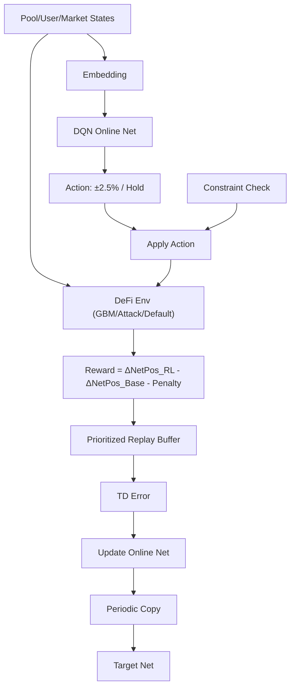

<!-- ontology-5axis data=量价表格 horizon=跨周期 paradigm=强化学习 alpha=风险择时 autonomy=Agent自主演进 -->

# Auto.gov 解構

> **發布**：2025-02-17 · （無 venue）
> **QuantML 導讀**：[Auto.gov：基于强化学习的去中心化金融（DeFi）治理框架](https://mp.weixin.qq.com/s?__biz=Mzg2MzAwNzM0NQ==&mid=2247489317&idx=1&sn=452e505de9cc3b12be1b561992ba7182&chksm=ce7e703bf909f92d917894b333cf4154dc63ff0ba6680990f6d69d01b614201eead0571fedfd#rd)
> **核心定位**：將 DeFi 借貸協議的風險參數（抵押因子）調整建模為 MDP，以 DQN 替代人工治理投票。解決了傳統鏈上治理滯後、靜態閾值無法抵禦閃電貸預言機攻擊的 Prior Gap，將被動防禦轉為動態參數閉環。

**五軸座標**

| 數據模態 | 時間尺度 | 學習範式 | Alpha機制 | 人機協作 |
|:-:|:-:|:-:|:-:|:-:|
| `量价表格` | `跨周期` | `强化学习` | `风险择时` | `Agent自主演进` |

**Status:** v0.5 — 基於 QuantML 導讀 + 原論文（如有）。benchmark 細節待升 v1。
**TL;DR:** ① 用 DQN 動態調整 DeFi 借貸協議抵押因子，實現半自動化風險參數優化。② 核心 trick 是將動作幅度限制在 2.5% 防黑天鵝，並結合 Target Network + Prioritized Replay 穩定訓練。③ 對「Agent自主演进」軸而言，它展示了 RL 在參數閉環中如何替代靜態規則與人工投票。④ 導讀未給量化結果。

**X-Ray.** 放回五軸 Pareto，Auto.gov 落在「跨周期參數閉環」與「Agent自主演進」的交界。它解了 DeFi 治理的舊工程坑：鏈上投票延遲導致參數滯後於市場波動，靜態抵押率無法應對閃電貸預言機攻擊。但該框架打不開的 Envelope 在於：模擬環境高度抽象（GBM 價格、聚合用戶行為、零和清算忽略），且未計入鏈上 Gas 與 MEV 成本。對量化讀者而言，其價值不在於直接上鏈，而在於提供了一套「將治理參數視為可學習狀態變量」的 MDP 建模范式，可遷移至傳統金融的動態保證金或風險限額管理。

## §1 · 架構 / Core Mechanism
**1.1 三大改動 vs 前作**
| 維度 | 傳統治理 / 靜態風控 | Q-Table RL 基線 | Auto.gov (DQN) |
|---|---|---|---|
| 決策頻率 | 鏈上投票（週級延遲） | 離散狀態查表 | 連續/高維狀態函數逼近 |
| 參數調整 | 靜態閾值（如固定 0.8） | 離散動作空間 | 增量約束（±2.5%）防過衝 |
| 抗攻擊機制 | 人工響應 / 暫停協議 | 無針對性設計 | Target Network + Prioritized Replay 加速稀有攻擊樣本學習 |

**1.2 ⚡ Eureka 一句話 trick + 直覺**
`Action Clipping + Incremental Constraint`：不讓 Agent 一步到位，而是以 2.5% 為步長微調抵押因子，將「策略失誤」的破壞力鎖定在漸進範圍內，本質是將 RL 的探索風險轉化為可控的參數滑動。

**1.3 信息流 ASCII 圖**

## §2 · 數學層
**📌 Napkin Formula**
$$Q(s,a) \leftarrow Q(s,a) + \alpha \left[ r_t + \gamma \max_{a'} Q_{\text{target}}(s_{t+1},a') - Q(s,a) \right]$$
$$r_t = \Delta \text{NetPosition}_{\text{RL}} - \Delta \text{NetPosition}_{\text{Baseline}} - \mathbb{I}_{\text{invalid}}$$
**直覺**：獎勵函數以「相對基線的淨頭寸差」為錨，強制 Agent 學習風險緩衝而非單純追求收益最大化；Target Net 解耦 Q 目標，Prioritized Replay 提升閃電貸攻擊等稀疏樣本的更新權重。
**Loss/訓練細節**：MSE Loss on TD Error；PyTorch 實現；單劇集訓練時間 < 3000 毫秒；約 5000 劇集後破產頻率大幅下降並收斂。

## §3 · 數據層
- **資料規模/頻率**：訓練依賴模擬環境（幾何布朗運動生成價格軌跡）；測試使用 CryptoCompare.com 真實數據。未披露具體樣本量與數據頻率。
- **市場/時段**：涵蓋 ETH、USDC、TKN 三個借貸池。未披露真實數據測試的具體時段。
- **來源與假設**：用戶行為建模為聚合級別（代表性代理）；清算閾值等同於抵押因子；外部競爭利率設定為供應 0.05 / 借款 0.15。樣本外假設依賴 GBM 波動率結構，未考慮鏈上並發與 MEV 搶跑。

## §4 · 代碼層
| 項目 | 狀態 |
|---|---|
| Repo | TBD |
| Checkpoint | TBD |
| License | TBD |
| 複現難度 | Medium（需自建 OpenAI Gym 環境 + 實現聚合用戶行為模擬） |
| 數據可得性 | CryptoCompare.com（公開）+ GBM 腳本（需自寫） |

## §5 · 評測 / Benchmark
| 數據集/市場 | Metric(IR/Sharpe/AR/MDD) | 前SOTA | 本方法 | Δ |
|---|---|---|---|---|
| 模擬環境 | 淨頭寸 / 破產頻率 | 靜態基線(0.8) / Q-Table / 統計方法 | 未披露 | 未披露 |
| CryptoCompare | 淨頭寸 / 破產頻率 | 靜態基線(0.8) / Q-Table / 統計方法 | 未披露 | 未披露 |

**解讀**：導讀僅定性描述「優勢更加明顯」與「破產頻率大幅下降」，未給 Sharpe/IR/MDD 等具體數值。Δ 解讀：淨頭寸優勢可能來自抵押因子動態下調釋放流動性，但破產頻率下降在攻擊場景下屬合理預期；未計 Gas 與滑點，實盤 Δ 需打折。Q-Table 因狀態空間爆炸失效，凸顯 DQN 函數逼近的必要性，此為架構勝而非超參勝。

## §6 · 失效與隱含假設
**6.1 論文自述 limitations**
- 環境抽象過度（風格化 DeFi 環境），實際協議複雜性可能導致訓練時間增加與代理效率變化。
- 操作員風險：訓練者可能植入偏置策略以謀取私利。
- 對抗性 ML 攻擊：框架可能暴露於針對 RL 策略的對抗樣本威脅。

**6.2 推斷的隱含假設**
- **Regime 依賴**：GBM 價格假設無法捕捉極端流動性枯竭或鏈上擁塞導致的價格脫鉤。
- **容量/成本**：忽略鏈上 Gas 波動與 MEV 成本，頻繁的 ±2.5% 調整在實盤中可能因交易成本而失效。
- **數據泄漏**：模擬環境中攻擊時間點與價格軌跡「平等應用於 RL 與基準」，但真實攻擊具有選擇性與非對稱信息優勢。
- **用戶行為**：聚合代理假設抹平了異質性用戶的恐慌性贖回或清算連鎖反應。

## §7 · 對比 & 面試 Tip
| 同軸對手 | 關鍵差異軸 | Open? | Status |
|---|---|---|---|
| Aave 鏈上治理 | 人工投票延遲 vs Agent 閉環 | 開源協議 | 生產環境 |
| 靜態風險模型 | 固定閾值 vs 動態 MDP 參數 | 開源/閉源 | 生產環境 |
| Q-Table RL | 離散狀態查表 vs DQN 函數逼近 | 學術基線 | 實驗階段 |

**🎤 Interview Tip**
- **正確答**：聚焦 MDP 狀態設計（池/用戶/市場三維）與動作增量約束的工程意義，強調 RL 在參數閉環中替代靜態規則的邊界條件（Gas/MEV/合規）。
- **錯答**：將 RL 視為黑盒價格預測器，或忽略動作截斷對風險控制的實質貢獻，誤以為 DQN 可直接輸出無約束的抵押率。

**7.1 可證偽預測帶日期**
若 2025-Q3 前無主流 DeFi 協議將抵押因子調整權限移交至 DQN 閉環，則證明鏈上治理合規成本與操作員風險仍高於技術收益，該框架僅限於學術或私有鏈沙盒。

## §8 · For the Reader
- **因子研究員**：借鑒「參數即狀態」思路，將傳統靜態風控閾值轉為 RL 可學習變量，構建動態保證金因子。
- **高頻執行/做市**：注意動作 2.5% 的增量約束設計，可遷移至訂單簿厚度或報價寬度的動態調整，避免策略失誤引發流動性枯竭。
- **RL 策略/Agent**：學習 Target Network 與 Prioritized Replay 在稀疏獎勵（攻擊事件）下的穩定性技巧，並嚴格評估動作空間約束對探索效率的 trade-off。

## References
- Auto.gov 原論文（標題/作者/venue 未披露）
- QuantML 導讀：[Auto.gov：基于强化学习的去中心化金融（DeFi）治理框架](https://mp.weixin.qq.com/s?__biz=Mzg2MzAwNzM0NQ==&mid=2247489317&idx=1&sn=452e505de9cc3b12be1b561992ba7182&chksm=ce7e703bf909f92d917894b333cf4154dc63ff0ba6680990f6d69d01b614201eead0571fedfd#rd)
- Lineage: DQN (Mnih et al., 2015) / DeFi Governance 機制 (Aave 文檔) / Prioritized Experience Replay (Schaul et al., 2015)