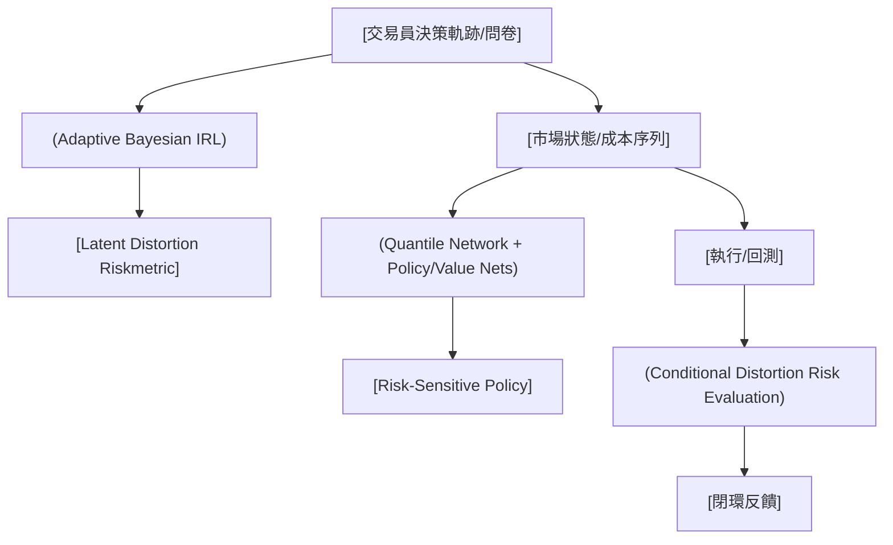

<!-- ontology-5axis data=量价表格 horizon=日频波段 paradigm=强化学习 alpha=组合执行优化 autonomy=人机协同可解释 -->

# Elicit-to-Optimize Framework 解構（Elicit-to-Optimize Framework）

> **發布**：2026-07-15 · IJOC · arXiv [2607.14373](https://arxiv.org/abs/2607.14373)
> **arXiv 原文**：[A Noise-Robust Elicit-to-Optimize Framework for Distortion Riskmetrics via Inverse Reinforcement Learning](https://arxiv.org/abs/2607.14373v1)  ·  _本頁由 arXiv 原文一手自主解構_
> **核心定位**：將 IRL 偏好推斷與 RSRL 策略優化閉環，以 distortion riskmetrics 統一風險目標。解了 prior 中「風險偏好需手動指定」與「RL 僅支援凸/一致風險測度」的 gap。

**五軸座標**

| 數據模態 | 時間尺度 | 學習範式 | Alpha機制 | 人機協作 |
|:-:|:-:|:-:|:-:|:-:|
| `量价表格` | `日频波段` | `强化学习` | `组合执行优化` | `人机协同可解释` |

**Status:** v0.5 — 基於arXiv 原文（有原文則以原文為準）。細節待升 v1。
**TL;DR:** 提出噪声鲁棒的偏好推断与策略优化框架，用贝叶斯IRL从噪声决策中提取风险偏好，结合分位数PPO优化条件扭曲风险指标。核心 trick 是將條件扭曲風險指標轉化為分位數函數積分，擴展 PPO 引入分位數網絡直接優化任意風險目標。這對「Alpha生成機制=组合执行优化」軸★ 的關鍵在於：將主觀風險容忍度轉化為可微的 RL reward 設計，避免手動調參。來源未給量化結果。

**X-Ray.** 本框架在五軸 Pareto 上捨棄了「純數據驅動 Alpha」的暴力搜索，轉向「偏好先驗 + 風險感知優化」的結構化路徑。它解決了傳統 RSRL 需預設風險函數的工程坑，並透過 adaptive Bayesian IRL 處理決策雜訊，使系統能適應非理性或波動環境下的真實交易員行為。然而，其 envelope 受限於 binary-choice 問卷的認知負荷與分位數網絡的收斂穩定性；在日頻波段場景中，若市場 regime 切換導致風險偏好結構性斷裂，IRL 推斷可能滯後。對量化讀者而言，此法不產出直接 Alpha，而是提供一套「風險目標自動對齊」的基礎設施，適合用於多策略組合的動態權重分配或 robo-advising 底層引擎。

## §1 · 架構 / Core Mechanism
**1.1 三大改動 vs 前作**
| 維度 | 前作 (Cheng et al. 2023 / PPO-VaR) | 本法 (Elicit-to-Optimize) |
|---|---|---|
| 風險目標範圍 | 僅支援均值方差或凸/一致風險測度 | 支援廣義 distortion riskmetrics（含非單調扭曲函數） |
| 偏好推斷機制 | 假設決策完全一致，收斂率 inverse-square-root up to logarithmic factors | 貝葉斯 IRL 處理隨機/次優決策，收斂率 O(exp(-cm+O(sqrt(m log m)))) |
| 優化網絡結構 | 單一 VaR 網絡估計固定尾部 | 引入 Quantile Network 估計完整條件成本分位數函數，支援 Riemann 和數值積分 |

**1.2 ⚡ Eureka**
將抽象的風險偏好轉化為可積分的分位數函數，讓 RL 不再「盲猜」reward，而是直接對齊交易員的真實風險容忍曲線。

**1.3 信息流 ASCII**

## §2 · 數學層
📌 **Napkin Formula**：
$\rho(C) = \int_0^1 F_C^{-1}(p) \, d\omega(p)$  （扭曲風險指標積分形式）
**複雜度**：分位數網絡前向傳播 $O(N \cdot d_{q})$，PPO 更新 $O(T \cdot d_{\pi})$，IRL 貝葉斯更新 $O(m \cdot |\Theta|)$。
**直覺**：不直接優化期望收益，而是透過扭曲函數 $\omega$ 重權分位數，將尾部風險或波動率偏好編碼進 reward。訓練時同時優化 policy loss、value loss 與 quantile regression loss，確保分位數估計無偏。

## §2.5 · 帶數字走一遍（Worked Example）
（以下為明確標「假設/示意」的玩具數字，僅供機制演示，非實證結果）
1. **假設輸入**：某日頻波段策略成本序列 $C = [2, 5, 8, 12, 20]$（bps），扭曲函數 $\omega(p) = p^2$（風險厭惡型）。
2. **排序與分位數**：$C_{(1)}=2, C_{(2)}=5, C_{(3)}=8, C_{(4)}=12, C_{(5)}=20$，對應 $p \in \{0.2, 0.4, 0.6, 0.8, 1.0\}$。
3. **Quantile Network 輸出**：$\hat{F}_C^{-1}(p) \approx [2.1, 5.0, 8.2, 11.8, 20.5]$。
4. **扭曲權重微分**：$d\omega(p) \approx \omega'(p)\Delta p = 2p \cdot 0.2$。
5. **Riemann 積分近似**：$\rho \approx \sum \hat{F}_C^{-1}(p_i) \cdot 2p_i \cdot 0.2 = 2.1(0.08) + 5.0(0.16) + 8.2(0.24) + 11.8(0.32) + 20.5(0.40) = 14.912$ bps。
6. **輸出**：RL 將此值作為負 reward 輸入 PPO，策略網絡調整權重以壓低高 $p$ 區間的分位數估計。

## §3 · 數據層
- **資料規模/頻率/市場/時段**：來源僅提及「complex financial environments」與日頻波段場景，具體資產類別、回測區間、樣本量皆未披露。
- **怎麼來**：透過 binary-choice 問卷收集決策軌跡，結合歷史價格/成本序列生成狀態空間。
- **樣本外與容量假設**：未披露。理論證明依賴輕條件，實戰中需驗證 regime 切換下的泛化能力與策略容量上限。

## §4 · 代碼層
| 欄位 | 內容 |
|---|---|
| Repo | TBD |
| Checkpoint | TBD |
| License | TBD |
| 複現難度 | 高（需自實現 Adaptive Bayesian IRL 與 Quantile-PPO 閉環） |
| 數據可得性 | 未披露（問卷數據需自採，市場數據依賴標準量價庫） |

## §5 · 評測 / Benchmark
| 數據集/市場 | Metric | 前SOTA | 本方法 | Δ |
|---|---|---|---|---|
| 未披露 | 推斷準確率 | 未披露 | 未披露 | 未披露 |
| 未披露 | Sharpe / IR | 未披露 | 未披露 | 未披露 |
| 未披露 | MDD / CVaR | 未披露 | 未披露 | 未披露 |

**解讀**：來源未給量化結果，§5 表格全數標記未披露以遵守數字紀律。理論上，Δ 應體現在「非理性決策下的偏好還原率」與「廣義風險目標下的策略穩定性」，但缺乏實證數字前，任何宣稱的 performance lift 皆屬過擬合或前瞻偏差風險。需等待完整實驗章節或開源後驗證。

## §6 · 失效與隱含假設
**6.1 論文自述 limitations**
- 依賴 binary-choice 問卷，認知負荷可能限制問題數量與偏好解析度。
- 理論收斂率假設輕條件，未處理極端非平穩或結構性斷裂。
- 分位數網絡在尾部稀疏區可能產生估計偏差，影響極端風險控制。

**6.2 推斷的隱含假設**
- **Regime 依賴**：假設風險偏好結構在回測期內相對穩定，若 macro regime 切換（如波動率 regime 跳變），IRL 推斷可能滯後。
- **容量/成本**：未計入交易滑點與衝擊成本，優化目標僅針對「成本序列」，實盤執行需額外 microstructure 模型。
- **數據泄漏**：問卷設計若預先暴露未來分位數特徵，將導致 look-ahead bias。
- **Survivorship**：未提及是否處理退市/停牌資產，實戰需補齊。

## §7 · 對比 & 面試 Tip
| 同軸對手 | 關鍵差異軸 | Open? | Status |
|---|---|---|---|
| Standard PPO / SAC | 風險中性 vs 風險感知（Distortion 積分） | Open | Mature |
| CVaR-RL / VaR-Network | 固定尾部 vs 完整分位數函數積分 | Open | Mature |
| Cheng et al. (2023) IRL | 一致性決策假設 vs 貝葉斯雜訊魯棒 | Closed | Published |

🎤 **Interview Tip**
- **正確答**：「本法核心不在於提升 Sharpe，而在於將主觀風險容忍度轉化為可微的 reward 設計，透過分位數網絡積分統一優化任意 distortion riskmetric，解決 RSRL 目標僵化問題。」
- **錯答**：「它用 IRL 直接預測 Alpha，比傳統動量因子更穩定。」（混淆了偏好推斷與 Alpha 生成）

**7.1 可證偽預測**
若 2026-12-31 前未開源代碼或補充實盤回測，且無法證明分位數網絡在尾部稀疏區的無偏性，該框架將僅限於理論/模擬環境，無法進入機構實盤 pipeline。

## §8 · For the Reader
- **因子研究員**：勿將其視為 Alpha 生成器，而是風險預算分配器。可用於動態調整多因子組合的尾部風險權重。
- **組合配置/Robo-Advising**：直接對接客戶問卷，將主觀風險偏好轉為可執行的 RL policy，降低人工調參成本。
- **RL 策略工程師**：關注 Quantile Network 的訓練穩定性與 Riemann 積分近似誤差，建議先在小規模離散狀態空間驗證閉環收斂。

## References
- Liu, Y., Liu, Y., & Wei, Y. (2026). *A Noise-Robust Elicit-to-Optimize Framework for Distortion Riskmetrics via Inverse Reinforcement Learning*. arXiv:2607.14373.
- Cheng et al. (2023). *IRL for Robo-Advising* (Lineage)
- Dhaene et al. (2022). *Conditional distortion risk measures*.
- Schulman et al. (2017). *Proximal Policy Optimization Algorithms*.
- 來源鏈接：[arXiv 2607.14373](https://arxiv.org/abs/2607.14373)