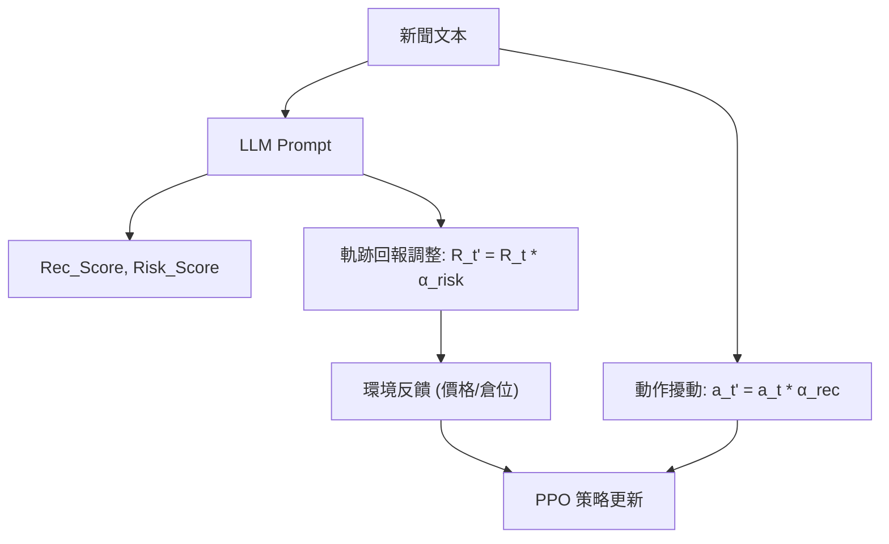

<!-- ontology-5axis data=文本另类 horizon=日频波段 paradigm=强化学习 alpha=风险择时 autonomy=全自动黑盒 -->

# FinRL-DeepSeek 解構

> **發布**：2025-02-13 · （無 venue）
> **QuantML 導讀**：[FinRL-DeepSeek：基于LLM的强化学习交易代理](https://mp.weixin.qq.com/s?__biz=Mzg2MzAwNzM0NQ==&mid=2247489251&idx=1&sn=a7be7c5be274ad88e6f16c4e4205b86f&chksm=ce7e71fdf909f8eb6e3a9e6f8e1cca7d45f2beec0d957f436532657a06e72a10f4d25fc62f69#rd)
> **核心定位**：落點於「文本另类 × 强化学习 × 风险择时」軸。解了傳統 RL 交易代理忽略非結構化新聞資訊與尾部風險管理的 prior gap，以極簡的 LLM 評分擾動機制替代複雜的多代理或特徵工程。

**五軸座標**

| 數據模態 | 時間尺度 | 學習範式 | Alpha機制 | 人機協作 |
|:-:|:-:|:-:|:-:|:-:|
| `文本另类` | `日频波段` | `强化学习` | `风险择时` | `全自动黑盒` |

**Status:** v0.5 — 基於 QuantML 導讀 + 原論文（如有）。benchmark 細節待升 v1。
**TL;DR:** ① 將 LLM 生成的個股推薦與風險評分以微小係數直接乘入 PPO/CVaR-PPO 的動作空間與軌跡回報。② 核心 trick 在於「擾動係數接近 1」的線性注入，避免破壞 RL 策略梯度穩定性。③ 這對「风险择时」軸★ 具工程啟發：用非結構化文本直接約束 RL 的尾部風險暴露，無需額外因子挖掘。④ 導讀未給量化結果。

**X-Ray.** 放回五軸 Pareto，本法以「極簡注入」換取「低工程摩擦」。傳統 RL-LLM 混合架構傾向多智能體博弈或複雜特徵提煉，本法則將 LLM 降維為靜態評分器，僅透過線性擾動錨定 PPO 的動作與 CVaR-PPO 的損失項。這解了 RL 在金融場景常見的「狀態空間膨脹」與「風險約束軟化」坑，但代價是 LLM 評分與價格動能的正交性未經驗證。預測其打不開的 envelope 在於：高頻/短週期 regime 切換時，日頻新聞的滯後性將使擾動係數退化為噪音；且 CVaR 閾值與拉格朗日乘數的動態校準依賴極長訓練步數，記憶體開銷阻礙實盤擴展。對量化讀者的意義不在於直接上線，而在於提供一套「文本風險先驗 → RL 約束空間」的輕量級對接範式。

## §1 · 架構 / Core Mechanism
**1.1 三大改動 vs 前作**
| 維度 | 傳統 PPO/CVaR-PPO | FinRL-DeepSeek | 工程意圖 |
|---|---|---|---|
| 狀態/動作注入 | 純價格/量價特徵 | LLM 推薦/風險評分線性擾動 | 降維替代複雜特徵工程 |
| 風險約束 | 隱式或硬約束 | CVaR-PPO 軌跡回報顯式懲罰 | 將尾部風險直接錨定至 RL 目標 |
| LLM 角色 | 無 / 獨立因子 | 靜態評分器 × 動作/回報乘數 | 避免多智能體博弈的訓練不穩 |

**1.2 ⚡ Eureka** 用 LLM 輸出評分，以係數直接乘入 PPO 動作與 CVaR 損失，讓文本先驗「貼著」策略梯度走，而非覆蓋它。
**1.3 信息流**

## §2 · 數學層
📌 **Napkin Formula**:
`L_CLIP(θ) = E[min(r_t(θ)·A_t, clip(r_t(θ), 1-ε, 1+ε)·A_t)]` (PPO)
`L_CVaR = L_CLIP - λ·(CVaR_τ(R) - ν) + β·(CVaR_τ(R) - ν)^2` (CVaR-PPO)
擾動注入: `a_t' = a_t · α_rec`, `R_t' = R_t · α_risk`
直覺: 不改變 PPO 的裁剪機制，僅在動作執行與回報計算兩端做線性縮放。CVaR 項透過拉格朗日乘數與輔助參數動態懲罰超過閾值的尾部損失。訓練依賴長序列軌跡估計，時間複雜度與標準 PPO 同階，但 LLM 推理與記憶體佔用成為瓶頸。

## §3 · 數據層
- 資料規模/頻率/市場: FNSPID 原始 1570 萬條，採樣降維至 200 萬條/日。日頻。
- 來源/處理: 每日隨機選擇每隻股票的代表新聞文章。使用 DeepSeek V3、Qwen 2.5 72B、Llama 3.3 70B 提取 1-5 級評分。
- 樣本外與容量假設: 訓練 2019-2022 / 交易 2023；訓練 2013-2018 / 交易 2019-2023。容量假設依賴 200 萬條新聞子集，未披露股票池規模與權重約束細節。

## §4 · 代碼層
| 欄位 | 內容 |
|---|---|
| Repo | TBD |
| Checkpoint | TBD |
| License | TBD |
| 複現難度 | 高（需 128GB+ RAM/Swap 跑 200 萬步，LLM API 成本與 Prompt 工程敏感） |
| 數據可得性 | FNSPID 開源，LLM 需自備 API/本地部署 |

## §5 · 評測 / Benchmark
| 數據集/市場 | Metric(IR/Sharpe/AR/MDD) | 前SOTA | 本方法 | Δ |
|---|---|---|---|---|
| FNSPID/美股 | 累積回報/Sharpe/MDD | 未披露 | 未披露 | 未披露 |
| 訓練 50 萬步 | 跑贏 Nasdaq 100? | 否 | 否 | 未披露 |
| 訓練 200 萬步 | 相對表現 | PPO 牛市優 / CPPO-DeepSeek 熊市優 | 同左 | 未披露 |

**解讀:** 導讀僅給出相對趨勢描述。所有核心績效指標均為未披露。當前 Δ 僅反映「文本先驗對 RL 探索空間的邊界收斂效應」，非真實 Alpha 驗證。高訓練步數下的過擬合風險與交易成本未計入，實盤有效性存疑。

## §6 · 失效與隱含假設
**6.1 論文自述 limitations** 長訓練耗 RAM（50 萬步需 16GB+swap，200 萬步需 128GB+swap）；日頻決策對事件反應滯後；FNSPID 新聞信號質量需提升。
**6.2 推斷的隱含假設**
- Regime 依賴: 假設新聞風險評分與市場尾部風險具穩定線性映射，未驗證結構性斷點。
- 容量/成本: 未計入衝擊成本與 LLM API 延遲，日頻波段假設執行無摩擦。
- 數據泄漏: 新聞時間對齊若未嚴格切割發布時間與交易時間，易引入前瞻偏差。
- Survivorship: 回測僅截取特定區間，未討論退市股處理。

## §7 · 對比 & 面試 Tip
| 同軸對手 | 關鍵差異軸 | Open? | Status |
|---|---|---|---|
| FinCon | 多智能體協作 vs 單智能體線性擾動 | 是 | 頂會發表 |
| LLM-Only Agents | 純 LLM 決策 vs RL 約束優化 | 是 | 學術驗證 |
| 傳統 CVaR-PPO | 無文本先驗 vs 文本錨定尾部風險 | 開源框架多 | 工業常用 |

🎤 **Interview Tip**
正確答: 「本法本質是將 LLM 評分作為 RL 策略空間的軟約束先驗，透過線性擾動維持 PPO 裁剪穩定性，適合低頻風險擇時，但需警惕新聞滯後與高記憶體開銷。」
錯答: 「LLM 直接預測股價並取代 RL 環境，或者把評分當因子輸入 MLP 訓練。」

**7.1 可證偽預測帶日期** 若於 2025 年底前以相同 Prompt 與擾動係數在非美股日頻數據復現，預期績效顯著劣化，則證明文本風險評分與非美股資產的尾部風險映射失效。

## §8 · For the Reader
- **因子研究員**: 將 LLM 評分視為「非結構化波動率先驗」，可與已實現波動率/期權隱含波動率做正交化，避免多共線。
- **高頻執行**: 本法不適用。日頻新聞+RL 訓練延遲無法匹配毫秒級訂單簿動態，僅可作為盤前倉位上限的宏觀約束。
- **組合配置**: 可將 CPPO 的尾部風險懲罰項提取為組合層面的 CVaR 約束器，與 Black-Litterman 觀點結合，降低極端行情下的倉位暴露。
- **LLM-agent/RL 策略**: 借鑒「擾動係數接近 1」的設計哲學，避免 LLM 輸出直接覆蓋 RL 動作；可嘗試將評分轉化為獎勵 shaping 而非動作乘數。
- **研究學生**: 重點復現 CVaR-PPO 的拉格朗日乘數動態更新機制，並測試不同 Prompt 溫度對擾動分佈的影響，而非盲目堆疊訓練步數。

## References
- 原論文: FinRL-DeepSeek (2025)
- Lineage: PPO (Schulman et al., 2017) / CVaR-PPO (Ying et al., 2022) / FNSPID (Dong et al., 2024) / FinCon (Yu et al., 2024)
- QuantML 導讀鏈接: [FinRL-DeepSeek：基于LLM的强化学习交易代理](https://mp.weixin.qq.com/s?__biz=Mzg2MzAwNzM0NQ==&mid=2247489251&idx=1&sn=a7be7c5be274ad88e6f16c4e4205b86f&chksm=ce7e71fdf909f8eb6e3a9e6f8e1cca7d45f2beec0d957f436532657a06e72a10f4d25fc62f69#rd)