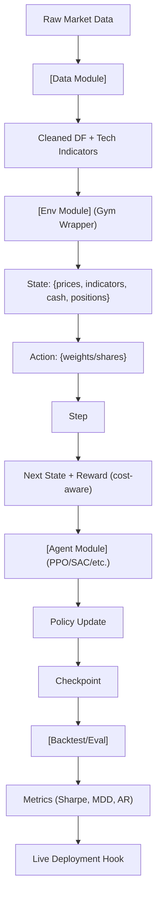

<!-- ontology-5axis data=量价表格 horizon=日频波段 paradigm=强化学习 alpha=端到端表征 autonomy=全自动黑盒 -->

# FinRL 解構

> **發布**：2025-01-12 · （無 venue）
> **QuantML 導讀**：[Github万星，开源强化学习交易框架](https://mp.weixin.qq.com/s?__biz=Mzg2MzAwNzM0NQ==&mid=2247488789&idx=1&sn=f7cb099a7020da844ff72a87c2e3a45f&chksm=ce7e720bf909fb1d289c8932ff455b199e2c349a28bb65a167fbf8923bbed182905abce67fe8#rd)
> **核心定位**：落點於「端到端表征 × 全自动黑盒」軸的基礎設施層。解了通用 DRL 庫（如 Stable-Baselines3/Ray RLlib）與金融實盤之間的環境工程斷層，將交易成本、流動性約束與組合權重限制硬編碼進 Gym step 函數，使研究者能跳過環境擬真調參直接對齊策略邏輯。

**五軸座標**

| 數據模態 | 時間尺度 | 學習範式 | Alpha機制 | 人機協作 |
|:-:|:-:|:-:|:-:|:-:|
| `量价表格` | `日频波段` | `强化学习` | `端到端表征` | `全自动黑盒` |

**Status:** v0.5 — 基於 QuantML 導讀 + 原論文（如有）。benchmark 細節待升 v1。
**TL;DR:** ① 提供專為金融定制的數據-環境-代理三層架構與模塊化設計。② 核心 trick 在於將交易成本、風險偏好與市場流動性內生化為環境狀態轉移的一部分，而非外部後處理。③ 對「端到端表征」軸★的意義在於降低 DRL 策略的 repro 門檻，使特徵工程與策略訓練解耦。④ 導讀未給量化結果。

**X-Ray.** FinRL 並非 alpha 生成器，而是環境與訓練流水線的 scaffolding。它解決了舊工程坑：手寫 Gym env 時常遺漏滑點建模、動作空間未約束導致超倉、以及 reward shaping 與真實 PnL 脫節。放回五軸 Pareto，它犧牲了高頻微結構的解析度與自定義 reward 的極限彈性，換取日頻波段場景下的快速迭代。預測其打不開的 envelope：無法原生處理訂單簿級別的非線性衝擊成本，且在極端 regime（如流動性枯竭或跳空）下，基於歷史回測的 env 會產生嚴重的狀態分佈偏移（distribution shift）。對量化讀者的意義：適合作為策略原型驗證的 baseline 平台，但直接上線需重構環境的 market impact 模組與引入 regime-switching 的訓練機制。

## §1 · 架構 / Core Mechanism
**1.1 三大改動 vs 前作**
| 維度 | 通用 DRL 庫 (SB3/RLlib) | FinRL | 解構意義 |
|---|---|---|---|
| 數據層 | 需自寫 pipeline 對接 CSV/DB | 內建 Yahoo/Alpaca/JoinQuant 接口與特徵工程模組 | 消除數據清洗與特徵對齊的工程摩擦 |
| 環境層 | 標準 Gym 環境，金融約束需手寫 | 高保真模擬，內嵌交易成本、流動性、風險偏好 | 將 financial friction 硬編碼進 state transition |
| 代理層 | 算法庫，需自定義 action/reward | 集成 DQN/DDPG/PPO/SAC/A2C/TD3，針對連續動作與高維狀態優化 | 提供開箱即用的金融特化超參與訓練流水線 |

**1.2 ⚡ Eureka 一句話 trick + 直覺**
`Reward = f(組合價值變動 - 內生交易成本 - 風險懲罰)`。直覺：不把成本當後驗過濾器，而是讓 agent 在 step 時直接「感受」到滑點與手續費，迫使策略在訓練期就學會避開流動性陷阱與過度交易。

**1.3 信息流 ASCII 圖**

## §2 · 數學層
📌 **Napkin Formula:**
$$J(\theta) = \mathbb{E}_{\pi_\theta} \left[ \sum_{t=0}^{T} \gamma^t \cdot R_t \right], \quad R_t = \frac{V_{t+1} - V_t - C_t}{V_t} - \lambda \cdot \text{RiskPenalty}_t$$
**複雜度:** 每步狀態維度 $O(N_{\text{assets}} + N_{\text{indicators}})$，動作空間 $O(N_{\text{assets}})$，訓練複雜度隨算法線性增長（如 PPO 的 clip loss 計算）。
**直覺:** 傳統 RL 的 reward 常僅看價格漲跌，FinRL 將 $C_t$（交易成本）與風險項直接嵌入即時回饋，迫使策略學習「淨值最大化」而非「毛收益最大化」。
**Loss/訓練細節:** 採用標準 DRL 目標函數（如 PPO 的 surrogate loss 或 SAC 的 entropy-regularized Q-loss），但 action space 被嚴格約束為組合權重或股數上限（如導讀 snippet 中的 `hmax`），防止破產或違約。

## §3 · 數據層
- **資料規模/頻率/市場:** 導讀提及支援 NASDAQ-100、DJIA、S&P 500 等市場數據集，頻率落點於日频波段（與 ontology 一致）。
- **怎麼來:** 內建接口對接 Yahoo Finance、Alpaca、JoinQuant，提供清洗與特徵工程（技術指標、VIX、Turbulence 等）。
- **樣本外與容量假設:** 導讀未披露具體樣本量、回測區間或容量上限。框架設計假設日頻數據足以捕捉波段動能，但未處理高頻微結構的容量瓶頸。

## §4 · 代碼層
| 維度 | 狀態/細節 |
|---|---|
| Repo | GitHub 開源（導讀提及 Github万星） |
| Checkpoint | 未披露 |
| License | 未披露 |
| 複現難度 | 低-中（模塊化設計與預設 env 降低門檻，但超參調優仍需 RL 經驗） |
| 數據可得性 | 高（公開 API 與常見數據源） |

## §5 · 評測 / Benchmark
| 數據集/市場 | Metric (IR/Sharpe/AR/MDD) | 前SOTA | 本方法 | Δ |
|---|---|---|---|---|
| 未披露 | 未披露 | 未披露 | 未披露 | 未披露 |

**解構論斷:** 導讀為框架介紹文，未提供任何量化實證數字或基線對比。此類框架的 Δ 無法用單一 Sharpe 或 AR 衡量，其真實價值在於「工程還原度」與「訓練穩定性」。若強行比較，需警惕：① 環境內嵌的固定成本參數（如 snippet 中的 `0.001`）在實盤會隨訂單規模非線性放大，導致回測 Sharpe 虛高；② 未披露的樣本外測試可能僅為時間序列劃分，缺乏 walk-forward 或 regime 壓力測試。真 capability 在於模塊解耦帶來的迭代速度，而非預設策略的絕對收益。

## §6 · 失效與隱含假設
**6.1 論文自述 limitations:** 依賴歷史數據模擬，雖考慮成本與流動性，但實盤的市場衝擊與滑點可能超出模擬範圍；需結合實盤監控與參數微調。
**6.2 推斷的隱含假設:**
- **Regime 依賴:** 訓練數據若集中於單邊市或低波動期，策略在震盪或危機 regime 下會因 reward 分佈偏移而失效。
- **容量/成本:** 日頻波段假設容量無限且成本固定，未建模訂單簿深度與執行延遲，大資金上線必遭滑點侵蝕。
- **數據泄漏:** 特徵工程模組若未嚴格按時間戳滾動計算，技術指標易產生 look-ahead bias。
- **Survivorship:** 使用主流指數成分股作為訓練池，隱含 survivorship bias，未涵蓋退市或暴雷個股的尾部風險。

## §7 · 對比 & 面試 Tip
| 同軸對手 | 關鍵差異軸 | Open? | Status |
|---|---|---|---|
| Stable-Baselines3 / Ray RLlib | 金融約束內生 vs 通用 Gym 環境 | 是 | 成熟基礎設施 |
| Qlib (Microsoft) | 因子研究/評估流水線 vs DRL 端到端訓練 | 是 | 工業級標準 |
| 自研 Gym Env + PPO | 極致定制 vs 開箱即用 | 視團隊 | 高維護成本 |

🎤 **Interview Tip:** 
- **正確答:** 「FinRL 是環境與訓練的 scaffolding，核心價值在降低 DRL 策略的 repro 門檻與內生金融摩擦。實盤需重構 market impact 模組並引入 regime-aware 訓練，不可直接依賴預設 env 的回測指標。」
- **錯答:** 「FinRL 自帶 SOTA 交易策略，Sharpe 能到 X，直接跑代碼就能上線賺錢。」（混淆框架與策略，無視環境擬真與實盤滑點的斷層）

**7.1 可證偽預測帶日期:** 若於 2025-Q3 前，社區未發布基於 FinRL 預設 env 在實盤（非回測）持續 6 個月以上且扣除真實滑點後 Sharpe > 1.0 的公開報告，則證明其內生成本模型對日頻波段仍過於理想化。

## §8 · For the Reader
- **因子研究員:** 將 FinRL 的 Data Module 視為特徵流水線參考，但勿直接套用其 reward 設計。建議提取其狀態空間構造邏輯，與你現有的因子庫對接，用 RL 做動態權重分配而非單因子挖掘。
- **高頻執行:** 此框架不適用。日頻 env 無法建模訂單簿非線性衝擊與執行延遲。若需 RL 執行，應轉向訂單流預測與微結構 Gym 環境（如市場深度狀態機）。
- **組合配置/RL 策略:** 將 FinRL 作為原型驗證平台。重點改造 Env 的 `step` 函數：加入動態交易成本曲線、流動性閾值與 regime 標記。訓練時務必使用 walk-forward 與多重隨機種子，防止 overfit 到單一歷史路徑。
- **研究學生:** 適合入門 DRL 金融應用。但需警惕「框架陷阱」：跑通代碼不等於策略有效。建議手寫一個簡化版 Gym env，對比內建環境的 reward 分佈與 PnL 相關性，理解金融約束如何改變策略的 exploration 行為。

## References
- FinRL 官方文檔與 GitHub 倉庫（導讀提及）
- QuantML 導讀：[Github万星，开源强化学习交易框架](https://mp.weixin.qq.com/s?__biz=Mzg2MzAwNzM0NQ==&mid=2247488789&idx=1&sn=f7cb099a7020da844ff72a87c2e3a45f&chksm=ce7e720bf909fb1d289c8932ff455b199e2c349a28bb65a167fbf8923bbed182905abce67fe8#rd)
- Lineage: OpenAI Gym 生態 → 金融特化 RL 環境 → 端到端組合管理框架